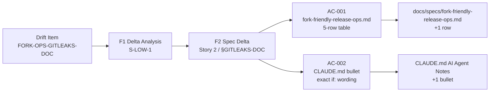
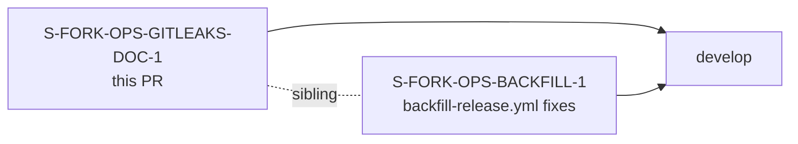

## What

Document the `GITLEAKS_DISABLED` GitHub Actions repository variable in two places it was previously missing:

1. **`docs/specs/fork-friendly-release-ops.md`** — appends it as the fifth row of the `## Repository variables` table, alongside `SIGNING_ENABLED`, `HOMEBREW_TAP_REPO`, `RELEASE_GAP_FILL_ENABLED`, and `SYNC_UPSTREAM_REPO`.
2. **`CLAUDE.md` AI Agent Notes** — adds a bullet immediately after the existing `JR_E2E_ENABLED` bullet, following the same repo-variable-gate doc pattern established by S-E2E-FORK-1.

No workflow logic is changed. `ci.yml` already has the correct `jobs.security.if:` guard; this PR closes the documentation gap only.

## Why

Fork maintainers configuring release-ops from `docs/specs/fork-friendly-release-ops.md` had no way to discover the gitleaks opt-out mechanism without reading `ci.yml` directly. AI agents using `CLAUDE.md` as their codebase reference were similarly unaware of the variable, creating a risk of incorrect attribution or confusion when reasoning about CI behavior.

This closes drift item `FORK-OPS-GITLEAKS-DOC` (identified in F1 delta analysis for the S-FORK-OPS-BACKFILL bundle).

## Files Changed

| File | Change |
|------|--------|
| `docs/specs/fork-friendly-release-ops.md` | +1 row to Repository variables table |
| `CLAUDE.md` | +1 bullet to AI Agent Notes section |

## The `if:` Gate (quoted exactly)

The bullet in `CLAUDE.md` quotes the condition as:

```
github.event_name == 'pull_request' && vars.GITLEAKS_DISABLED != 'true'
```

This is the full condition from `ci.yml` `jobs.security.if:` — the PR-event scope is load-bearing (the guard activates only on PR events, not push or schedule triggers).

## Spec Traceability



## Story Dependencies



This PR is part of the **S-FORK-OPS-BACKFILL bundle** (two independent, non-overlapping stories with no file overlap). Sibling story S-FORK-OPS-BACKFILL-1 touches `.github/workflows/backfill-release.yml` and `tests/backfill_matrix_parity.rs` only. Merge timing is coordinated by the orchestrator after both PRs have converged.

## Architecture Changes

Docs-only. No architecture changes. No `src/` changes. No test changes. No workflow logic changes.

## Test Evidence

No Rust tests are introduced or modified (docs-only change). Integration checks (formality):

- `cargo test` — unaffected (no Rust files changed)
- `scripts/check-spec-counts.sh` — unaffected (no BC files touched)
- `scripts/check-bc-cumulative-counts.sh` — unaffected (no BC count changes)

AC verification (grep-based, per story spec):

```bash
# AC-001: GITLEAKS_DISABLED present in fork-friendly-release-ops.md
grep 'GITLEAKS_DISABLED' docs/specs/fork-friendly-release-ops.md
# → line 45: | `GITLEAKS_DISABLED` | 'true' disables the gitleaks secret-scan job...

# AC-002: bullet in AI Agent Notes, adjacent to JR_E2E_ENABLED, with "NOT a Rust env var"
grep -n 'GITLEAKS_DISABLED\|AI Agent Notes\|JR_E2E_ENABLED' CLAUDE.md
# → line 271: ## AI Agent Notes
# → line 276: - `JR_E2E_ENABLED` ...
# → line 277: - **`GITLEAKS_DISABLED`** ...
```

## Demo Evidence

N/A — documentation-only story. Per S-WIN precedent, demo recording is ADAPTED/N/A for docs stories with no UI or observable binary behavior change.

## Security Review

Not required. Docs-only PR, no code, no new CRIT/HIGH module surface.

## Holdout Evaluation

N/A — evaluated at wave gate.

## Adversarial Review

N/A — evaluated at Phase 5 (F2 spec delta passed two adversarial review passes before story decomposition).

## Risk Assessment

- **Blast radius:** Zero. Documentation files only. No compiled artifact, no workflow execution path, no observable runtime behavior change.
- **Performance impact:** None.
- **Rollback:** Trivially reverted — two Markdown line additions.

## AI Pipeline Metadata

- Pipeline mode: Feature (F3 incremental stories)
- Story: S-FORK-OPS-GITLEAKS-DOC-1
- Bundle: S-FORK-OPS-BACKFILL
- Effort: xsmall (1 SP)

## Pre-Merge Checklist

- [x] PR description matches actual diff (2 files, docs-only)
- [x] AC-001 verified: `GITLEAKS_DISABLED` row present in fork-friendly-release-ops.md
- [x] AC-002 verified: bullet in AI Agent Notes adjacent to `JR_E2E_ENABLED`, exact `if:` wording, "NOT a Rust env var" present
- [x] No workflow files modified (`ci.yml` untouched)
- [x] No Rust source modified
- [x] No BC catalog count changes
- [x] Demo evidence: N/A (docs-only story, S-WIN precedent)
- [x] Security review: N/A (docs-only)
- [ ] CI checks passing
- [ ] PR review converged (0 blocking findings)
- [ ] Orchestrator merge authorization received (sibling PR S-FORK-OPS-BACKFILL-1 coordination)
