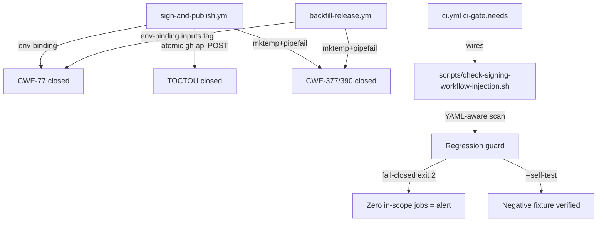
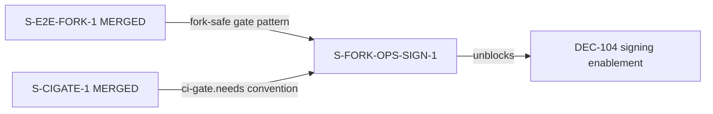
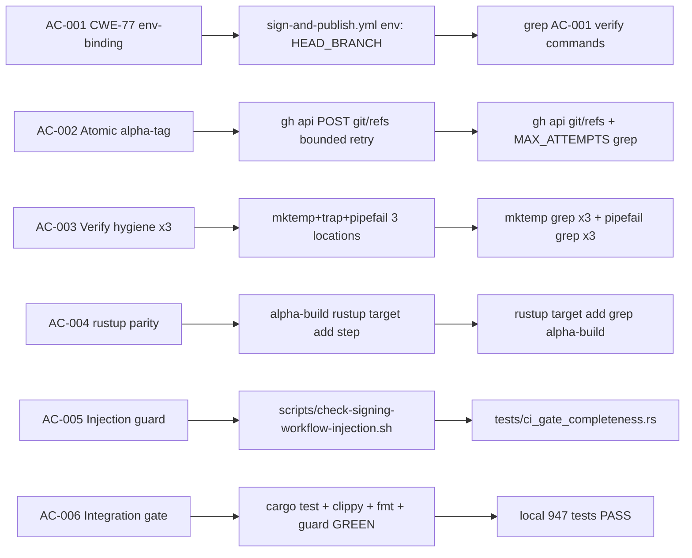

## fix(ci): harden fork-ops signing workflows — CWE-77 env-binding + atomic alpha-tag + injection guard (S-FORK-OPS-SIGN-1)

### Story

**S-FORK-OPS-SIGN-1** — Fork-ops signing-workflow security & correctness hardening
Wave: feature-followup | Severity: HIGH | Points: 5 | Mode: Feature Mode (F1–F7)

### Summary

Closes two HIGH security/correctness drift items and three LOW nits in the fork-ops
signing workflows (`sign-and-publish.yml`, `backfill-release.yml`), and adds a new
YAML-structure-aware CI regression guard wired into `ci-gate.needs`.

**INERT in canonical repo:** `vars.SIGNING_ENABLED` is NOT set in the canonical repo.
Both workflow files remain inert. These fixes unblock downstream forks that enable
`SIGNING_ENABLED=true` without introducing any risk to canonical-repo CI.

---

### What Changed and Why

#### HIGH-1: CWE-77 Shell Injection — env-binding `workflow_run.head_branch` / `inputs.tag`

`github.event.workflow_run.head_branch` is attacker-controlled (any fork push sets it).
The previous `stable-sign` "Extract release metadata" step used it inline in a `run:`
block — a CWE-77 shell injection path that could exfiltrate the Apple signing certificate
password or notarization API key.

**Fix:** Added `env: { HEAD_BRANCH: "${{ github.event.workflow_run.head_branch }}" }`
at the step level; replaced inline `${{ ... }}` with `"$HEAD_BRANCH"` in the shell body.
Same pattern applied to `${{ inputs.tag }}` in `backfill-release.yml`.

#### HIGH-2: TOCTOU Race on Alpha-Tag Creation (FORK-OPS-ALPHA-RACE)

The previous alpha-tag logic: count remote tags → construct name → `git push` tag → delete
and recreate on collision. This is a classic TOCTOU: two concurrent `develop` pushes can
both observe the same count and race to push the same tag name.

**Fix:** Replaced with a 5-step atomic flow using `gh api POST /repos/{owner}/{repo}/git/refs`.
HTTP 201 = reserved; HTTP 422 = collision, increment SEQ and retry (bounded to 10 attempts);
any other exit = `exit 1` with diagnostic. Never re-counts remote tags between retries.
Removed the `gh release delete --cleanup-tag` purge step entirely.

#### LOW-1 + LOW-2: Verify-step shell hygiene (3 locations)

All three signature-verify steps (`alpha-sign` + `stable-sign` in `sign-and-publish.yml`;
`sign` in `backfill-release.yml`) had: predictable `/tmp/cs.out` / `/tmp/spctl.out` paths
(CWE-377/362) and `set -e` without `pipefail` (CWE-390).

**Fix:** `$(mktemp)` + `trap 'rm -f "$CS_OUT" "$SPCTL_OUT"' EXIT` + `set -eo pipefail`.
Existing `grep ... || { exit 1; }` guards retained (they catch empty-output cases that
pipefail alone cannot detect).

#### LOW-3: Missing defensive `rustup target add` in `alpha-build`

The `alpha-build` job lacked the defensive `rustup target add ${{ matrix.target }}` step
that `release.yml` already has. Added for parity.

#### NEW: `scripts/check-signing-workflow-injection.sh` — CI Regression Guard

A YAML-structure-aware (Python `yaml` module) guard that:
- Extracts `run:` block bodies structurally (not via line-oriented grep)
- Scopes to every job with `secrets.*`, `contents: write`, or `environment:` in scope
- Flags any inline `${{ X }}` in a `run:` body where X is not on the allowlist
  (`github.sha`, `github.run_id`, `github.run_number`, `github.repository`,
  `github.repository_owner`, `matrix.*`, `runner.*`)
- Does NOT flag `env:`, `with:`, or `if:` keys — only `run:` bodies
- Default-deny: `steps.*.outputs.*` and `needs.*.outputs.*` are flagged (multi-hop
  laundering cannot be reliably traced)
- Fail-closed: exit 2 if YAML parse error or zero in-scope jobs detected
- Negative fixture: `--self-test` mode proves the detector fires on injected violations
  (prevents TD-VSDD-057 false-green)

Wired into `ci-gate.needs` per the S-CIGATE-1 convention (never directly into branch
protection).

---

### Architecture Changes

### Story Dependencies

No unmerged dependencies. This is a leaf node in the story graph.

### Spec Traceability

---

### Drift Items Closed

| ID | Severity | CWE | Description | AC |
|----|----------|-----|-------------|-----|
| FORK-OPS-SIGN-INJECTION | HIGH | CWE-77 | Inline `${{ github.event.workflow_run.head_branch }}` in `run:` body with secrets in scope | AC-001 |
| FORK-OPS-ALPHA-RACE | HIGH | TOCTOU | Count→delete→create alpha-tag sequence has a race window | AC-002 |
| FORK-OPS-NIT-TMP-PREDICTABLE | LOW | CWE-377/362 | Hardcoded `/tmp/cs.out` / `/tmp/spctl.out` predictable temp paths | AC-003 |
| FORK-OPS-NIT-PIPEFAIL | LOW | CWE-390 | `set -e` without `pipefail` on pipe-to-tee verify steps | AC-003 |
| FORK-OPS-NIT-USECROSS-GUARD | LOW | N/A | Missing defensive `rustup target add` in `alpha-build` | AC-004 |

New guard added: `check-signing-workflow-injection` — CI regression guard wired into `ci-gate.needs` (AC-005, F2 "Required CI regression guard").

---

### Test Evidence

| Check | Result |
|-------|--------|
| `cargo test` (947 tests) | PASS |
| `cargo clippy -- -D warnings` | PASS |
| `cargo fmt --all -- --check` | PASS |
| `bash scripts/check-spec-counts.sh` | PASS (no BC files touched) |
| `bash scripts/check-bc-cumulative-counts.sh` | PASS (counts unchanged) |
| `bash scripts/check-bc-no-numeric-test-counts.sh` | PASS |
| `bash scripts/check-signing-workflow-injection.sh` | EXIT 0 (guard passes on hardened workflows) |
| `bash scripts/check-signing-workflow-injection.sh --self-test` | EXIT non-zero (negative fixture confirmed) |
| `tests/ci_gate_completeness.rs` | PASS (expects `check-signing-workflow-injection` in ci-gate.needs) |

No `src/` changes. No Rust compilation or test behavior changes.

---

### F5 Adversarial Review (3 passes — CONVERGED)

The diff went through 3 adversarial passes before being submitted for PR.

**Pass 1:** Found 2 CRITICAL + 1 HIGH issues in the initial injection guard implementation:
- C-1: Naive line-oriented scope detection (grep-based job name list) — missed 23 injection
  sites that a structural YAML scope would catch
- C-2: Guard did not fail-closed (exit 2) on zero in-scope jobs detected — could silently
  pass on a renamed/deleted job scope
- H-1: `steps.*.outputs.*` and `needs.*.outputs.*` not flagged — multi-hop laundering path

**Pass 2 (after structural rewrite):** Found 1 MEDIUM:
- M-1: Error paths (YAML parse failure, missing PyYAML) did not emit structured diagnostics

**Pass 3 (after error-path hardening):** APPROVE — no new findings.

**Final F5 status:** CONVERGED (3 passes). The structural-scope rewrite (replacing hardcoded
job-name list with criterion-based detection) was the pivotal change.

---

### F6 Security Review — APPROVE

Verdict: APPROVE. No CRITICAL, HIGH, or MEDIUM findings.

One LOW accepted: theoretical `$GITHUB_OUTPUT` newline injection — an attacker controlling
the alpha tag name could attempt to inject newlines into `$GITHUB_OUTPUT` via the
`echo "tag=$TAG >> "$GITHUB_OUTPUT"` write. Accepted: git ref-format rules prohibit
newlines in tag names (`git check-ref-format` rejects them upstream), and the tag is
constructed by the workflow itself from a counter, not from user input after the env-binding
fix.

---

### Demo Evidence

N/A — This is a CI/CD workflow hardening story with no user-facing UI changes. There are no
demo recordings. The evidence is the guard script's own exit-code behavior and CI job output.

### Holdout Evaluation

N/A — evaluated at wave gate.

### AI Pipeline Metadata

| Field | Value |
|-------|-------|
| Pipeline mode | Feature Mode (F1–F7) |
| Story ID | S-FORK-OPS-SIGN-1 |
| Wave | feature-followup |
| Models used | claude-sonnet-4-6 (implementer, adversarial), claude-sonnet-4-6 (security-reviewer) |
| F5 passes | 3 (CONVERGED) |
| F6 verdict | APPROVE |
| Total local test count | 947 |

---

### Risk Assessment

| Factor | Assessment |
|--------|-----------|
| Blast radius | Zero — both workflow files are INERT in canonical repo (`SIGNING_ENABLED` unset). No src/ changes. No test behavior changes. |
| Performance impact | None — CI-only changes |
| Rollback risk | Low — reverts cleanly; no database migrations, no API changes |
| Breaking change | No |
| Security posture | Improves: closes CWE-77 injection vector, eliminates TOCTOU race, adds permanent regression guard |

---

### Out-of-Scope Follow-ups (noted for future stories)

1. **Empty/missing head_branch guard** — no guard against `HEAD_BRANCH=""` leading to empty
   `TAG`/`VERSION`. Pre-existing latent defect; out of this story's CWE-77/TOCTOU scope.
   Future story: add `if [ -z "$HEAD_BRANCH" ]; then echo "::error::..."; exit 1; fi`.

2. **Alpha orphan-tag cleanup** — sequence gaps from the retry loop leave orphaned alpha tags.
   Future story: scheduled housekeeping job to delete alpha tags older than N days with no
   associated binary assets.

3. **Composite-action scan coverage** — the injection guard currently scans only
   `sign-and-publish.yml` and `backfill-release.yml`. A future pass should extend to any
   composite actions that have secrets in scope. Latent, not blocking.

---

### Pre-Merge Checklist

- [x] AC-001: CWE-77 env-binding — HEAD_BRANCH bound via `env:`, no inline `${{ }}` in run-blocks
- [x] AC-002: Atomic alpha-tag via `gh api POST git/refs`, MAX_ATTEMPTS=10, no `git push` for tags
- [x] AC-003: mktemp+trap+set -eo pipefail in all 3 verify locations
- [x] AC-004: rustup target add step in alpha-build
- [x] AC-005: YAML-aware injection guard + negative fixture + ci-gate.needs wiring
- [x] AC-006: cargo test / clippy / fmt / spec-guards all PASS; SIGNING_ENABLED unchanged
- [x] No src/ changes
- [x] No new BCs, VPs, NFRs, ADRs
- [x] F5 adversarial review: CONVERGED (3 passes)
- [x] F6 security review: APPROVE
- [ ] CI green on PR (pending)
- [ ] pr-reviewer: APPROVE (pending)
