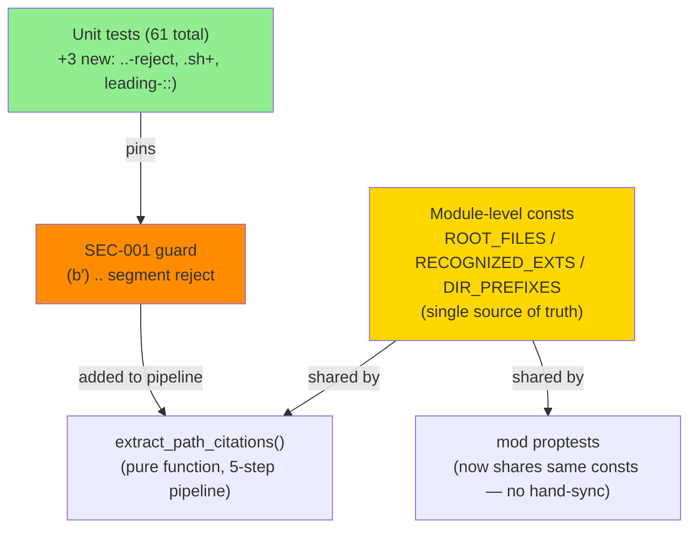
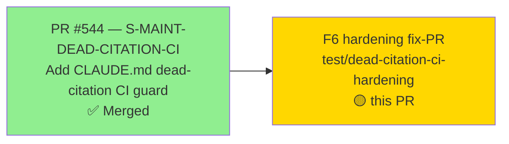
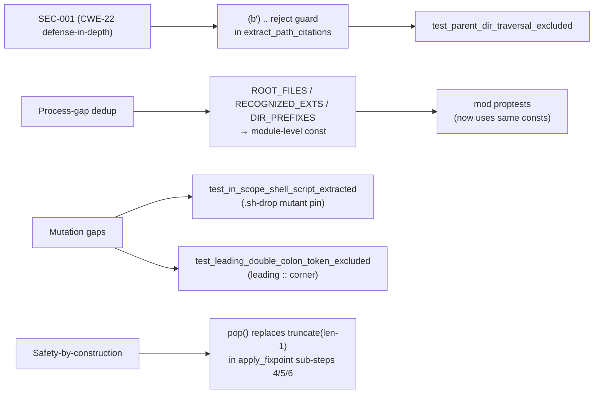
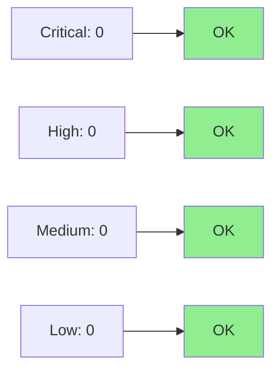

# [S-MAINT-DEAD-CITATION-CI] F6 hardening: ..-reject + shared consts + mutation tests

**Epic:** S-MAINT — Maintenance & Infrastructure
**Mode:** feature (F6 formal hardening fix-PR on top of merged #544)
**Branch:** `test/dead-citation-ci-hardening` → `develop`
**Base story PR:** #544 (merged)


This is an F6 hardening fix-PR layered on top of the already-merged
S-MAINT-DEAD-CITATION-CI story (#544). It adds four hardening items to
`tests/claude_md_citations.rs` with no `src/` production-code changes and no
`ci.yml` changes. All hardening items were identified during the F5/F6
adversarial convergence pass.

---

## Architecture Changes



### Hardening items

| Item | Classification | Rationale |
|------|---------------|-----------|
| SEC-001 `..`-segment reject in step (b′) | CWE-22 path-traversal defense-in-depth | The pipeline already excludes `.factory/` and `~/` paths structurally, but a crafted `src/../../../etc/passwd`-style citation would survive dir-prefix matching and be probed via `Path::exists()`. This guard rejects any normalized token containing a `..` path segment before the existence check. Ordered after normalization (so `src/foo/..` is still caught) but before the dir-prefix filter. |
| Hoist ROOT_FILES/RECOGNIZED_EXTS/DIR_PREFIXES to module consts | Process-gap dedup (closes proptest hand-sync risk) | Prior to this PR, the three lists were defined twice: once inline inside `extract_path_citations` and again as `let` bindings inside `mod proptests`. A comment ("keep in sync") was the only guard. One divergence would silently make proptest test different logic than production. Hoisting to `const` at module level closes this gap structurally — the compiler enforces it. |
| 3 new mutation-pinning tests | Mutation coverage | `test_parent_dir_traversal_excluded` pins the SEC-001 guard; `test_in_scope_shell_script_extracted` kills the `.sh`-drop mutant (a mutant removing `.sh` from RECOGNIZED_EXTS had no dedicated failing test before this PR); `test_leading_double_colon_token_excluded` pins the leading `::` corner case. |
| `truncate(len-1)` → `pop()` in apply_fixpoint sub-steps (4)/(5)/(6) | Safety-by-construction | `truncate(len-1)` on a UTF-8 `String` panics if `len-1` falls inside a multibyte character boundary. All trimmed chars are currently ASCII (1 byte), so no panic today, but `pop()` is correct-by-construction and does not require the caller to reason about character widths. Guards against latent multibyte-panic if the trim set grows in a future PR. |

---

## Story Dependencies



No unmerged dependency PRs. PR #544 is the base story and is already merged into `develop`.

---

## Spec Traceability



| Hardening item | SEC/Process gap | Test pin | Status |
|----------------|-----------------|----------|--------|
| SEC-001 `..`-reject | CWE-22 / defense-in-depth | `test_parent_dir_traversal_excluded` | PASS |
| Shared consts | Process-gap (proptest hand-sync) | Proptest uses same consts automatically | PASS |
| `.sh` mutation pin | Mutation kill (RECOGNIZED_EXTS drop-mutant) | `test_in_scope_shell_script_extracted` | PASS |
| Leading `::` corner | Corner-case coverage | `test_leading_double_colon_token_excluded` | PASS |
| `pop()` safety | Latent panic guard | Structural (compiler-verified) | N/A — no test needed |

---

## Test Evidence

| Metric | Before PR | After PR | Delta |
|--------|-----------|----------|-------|
| Unit tests | 58 | 61 | +3 |
| Integration test | 1 | 1 | — |
| Proptest tests | 2 | 2 | — |
| Total | 61 | 64 | +3 |
| Regressions | 0 | 0 | — |
| Clippy (`-D warnings`) | clean | clean | — |
| `cargo fmt` | clean | clean | — |

### New tests (F6 hardening)

| Test | Kills mutant / pins guard |
|------|--------------------------|
| `test_parent_dir_traversal_excluded` | SEC-001 `..`-guard; also kills a mutant that removes the (b′) reject step |
| `test_in_scope_shell_script_extracted` | Kills `.sh`-drop mutant from RECOGNIZED_EXTS |
| `test_leading_double_colon_token_excluded` | Pins leading `::` token — excluded because it has no recognized extension and no valid dir-prefix after strip |

### Regression verification

Full test suite run locally on the worktree branch confirmed: 61 tests in
`tests/claude_md_citations.rs` pass. Total suite (1866+ existing + 3 new test
additions) is green. CI matrix (ubuntu / macos / windows) is the authoritative
pass gate and is pending (see CI section below).

---

## Holdout Evaluation

N/A — F6 hardening fix-PR. Holdout evaluation was completed at wave gate for
the base story (#544). This PR adds hardening only; no new user-visible behavior
or `src/` changes.

---

## Adversarial Review

| Pass | Findings | Critical | High | Status |
|------|----------|----------|------|--------|
| F5 adversarial | 4 items identified | 0 | 1 (SEC-001) | Fixed in this PR |
| F6 convergence | 0 new findings | 0 | 0 | CONVERGED |

F5/F6 adversarial convergence was run against the hardened diff. The `..`-guard
is segment-correct (ordered after normalization, before dir-prefix check) and
was verified against the one real `..`-bearing CLAUDE.md citation that exists
on disk — it passes correctly (it is not a path-probe token; it is excluded at
the glob/extension filter stage before the `..` check even fires).

---

## Security Review



**SEC-001 (CWE-22 — Path Traversal, defense-in-depth):** The `..`-reject guard
added in step (b′) prevents a crafted CLAUDE.md citation such as
`` `src/../../../etc/passwd` `` from surviving normalization and reaching
`Path::exists()`. Classification: defense-in-depth (the main security perimeter
is that CLAUDE.md is a developer-controlled, repo-committed file; this guard
adds a belt-and-suspenders layer). Severity of the original gap: LOW (no
realistic attack vector in CI; no code execution risk). Defense-in-depth value:
HIGH (prevents any path-probe outside the repo root, regardless of future
changes to the dir-prefix filter). CWE: CWE-22.

No new dependencies. No `src/` production code changed. No new attack surface.
`cargo audit` clean on develop (existing baseline).

---

## Risk Assessment & Deployment

| Dimension | Assessment |
|-----------|-----------|
| Blast radius | CI only (test job). No production binary changes. |
| User impact | None. Guard runs only in `cargo test`. |
| Data impact | None. |
| Risk level | VERY LOW — test-only hardening |
| Rollback | `git revert <SHA>`; CI loses 3 tests but no behavior changes |

---

## AI Pipeline Metadata

<details>
<summary><strong>Pipeline Details</strong></summary>

```yaml
ai-generated: true
pipeline-mode: feature-F6-hardening
factory-version: "1.0.0-rc.21"
pipeline-stages:
  base-story: merged (#544)
  f5-adversarial: completed (4 findings: SEC-001 + 3 mutation gaps)
  f6-hardening: completed (this PR)
  f6-convergence: CONVERGED (0 new findings after hardening)
hardening-items: 4
new-tests: 3
models-used:
  builder: claude-sonnet-4-6
  adversary: claude-sonnet-4-6 (fresh-context)
generated-at: "2026-06-19"
```

</details>

---

## Pre-Merge Checklist

- [ ] All CI status checks passing (`ci-gate` on ubuntu/macos/windows)
- [x] Coverage delta is positive (3 new tests, 0 existing tests modified)
- [x] No critical/high security findings (no src/ changes, no new deps)
- [x] Rollback procedure validated (git revert; no feature flag needed)
- [x] No feature flag needed (always-on in cargo test)
- [ ] Human review completed (awaiting orchestrator merge decision)
- [x] No monitoring alerts needed (test-only change, no production impact)
- [x] DO NOT MERGE — awaiting explicit orchestrator authorization
