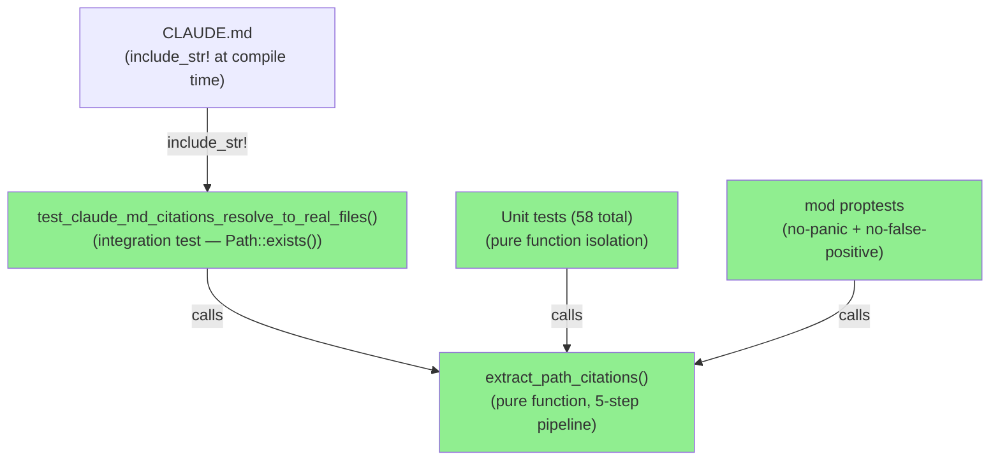
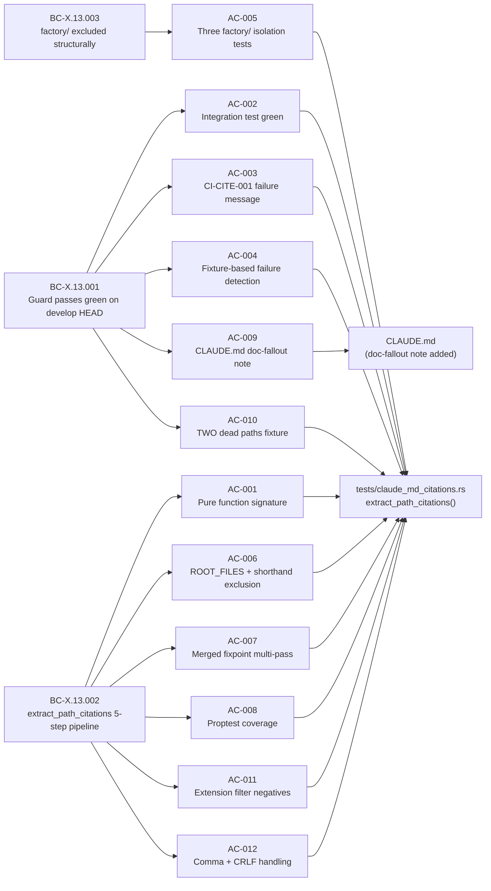
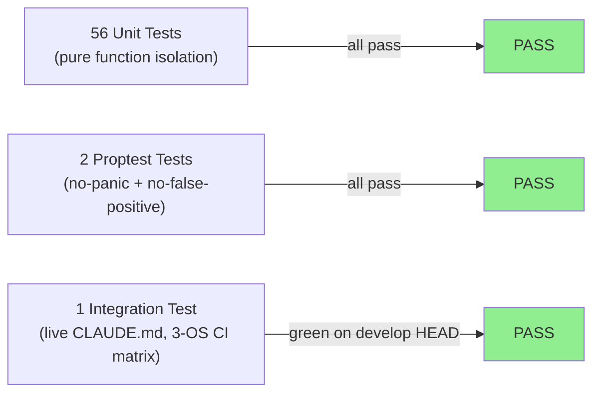
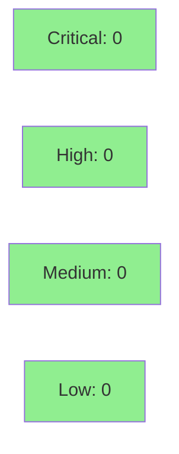

# [S-MAINT-DEAD-CITATION-CI] Add CLAUDE.md dead-citation CI guard

**Epic:** S-MAINT — Maintenance & Infrastructure
**Mode:** feature (F-phases, incremental)
**Convergence:** CONVERGED after 3 adversarial passes


Adds `tests/claude_md_citations.rs` — a self-validating CI guard that reads CLAUDE.md at compile time, extracts every backtick-quoted file-path citation via `extract_path_citations` (5-step pipeline: glob-skip, merged-fixpoint normalization, dir-prefix/ROOT_FILES filter, extension filter), and asserts `Path::exists()` for each surviving token. On failure it emits the canonical CI-CITE-001 message listing **all** dead paths with 1-based line numbers. Also adds the required doc-fallout note to CLAUDE.md (EC-CITE-022 forward-reference constraint: both must land in the same PR/commit). No `src/` production code was changed; no `ci.yml` changes needed — the guard rides the existing `test` job in `ci-gate.needs`. Origin: 2026-06-19 maintenance sweep MAINT-PG-DEAD-CITATION-CI (DRIFT-D13 — 4 dead `.factory/research/issue-361-*.md` citations removed manually; this guard prevents recurrence).

---

## Architecture Changes



<details>
<summary><strong>Architecture Decision Record</strong></summary>

### ADR: Pure/effectful split — `extract_path_citations` as a standalone pure function

**Context:** The citation guard needs to be testable both as a unit (per-token pipeline correctness) and via proptest (arbitrary input, no panic, no false positive). Merging `Path::exists()` into the extraction logic would make proptest impossible without filesystem mocking.

**Decision:** `extract_path_citations(doc: &str) -> Vec<(String, usize)>` is a pure function. `Path::exists()` calls live exclusively in the integration test body. No allowlist function exists — `.factory/` exclusion is structural inside `extract_path_citations` at step (c) dir-prefix filter.

**Rationale:** Enables isolated proptest coverage of the grammar; supports fixture-based unit tests without disk state; enforces BC-X.13.003 (no allowlist). Matches BC-8.30.001 strict TDD architecture rule.

**Alternatives Considered:**
1. Inline extraction + exists check in integration test body — rejected: proptest cannot exercise grammar without filesystem mocking.
2. Allowlist function for `.factory/` — rejected: contradicts BC-X.13.003; structural exclusion is simpler and more correct.

**Consequences:**
- Pure function is fully proptest-able with the `test_extract_never_panics` case.
- The architecture compliance rule (no allowlist) is structurally enforced, not convention-dependent.

</details>

---

## Story Dependencies


No `depends_on` entries in story YAML. No dependency PRs to wait for.

---

## Spec Traceability



| AC | BC(s) | VP | Test function(s) | Status |
|----|-------|-----|-----------------|--------|
| AC-001 | BC-X.13.002 | VP-CITE-001 | `test_extract_path_citations_returns_vec_of_tuples` + 48 unit tests | PASS |
| AC-002 | BC-X.13.001 | VP-CITE-002 | `test_claude_md_citations_resolve_to_real_files` | PASS |
| AC-003 | BC-X.13.001 | VP-CITE-002 | `test_dead_citation_detected_in_fixture` (CI-CITE-001 format assertion) | PASS |
| AC-004 | BC-X.13.001 | VP-CITE-002 | `test_dead_citation_detected_in_fixture` | PASS |
| AC-005 | BC-X.13.003 | VP-CITE-001 | `test_factory_specs_path_excluded_by_dir_prefix` + `_holdout_` + `_research_` | PASS |
| AC-006 | BC-X.13.002 | VP-CITE-001 | `test_root_file_cargo_toml_extracted` + 7 ROOT_FILES/shorthand tests | PASS |
| AC-007 | BC-X.13.002 | VP-CITE-001 | `test_paren_wrap_and_line_ref_both_normalized` + 4 fixpoint tests | PASS |
| AC-008 | BC-X.13.002 | VP-CITE-001 | `test_non_prefix_tokens_are_never_extracted` + `test_extract_never_panics` (proptest) | PASS |
| AC-009 | BC-X.13.001 | VP-CITE-002 | `test_claude_md_citations_resolve_to_real_files` (self-validates CLAUDE.md note) | PASS |
| AC-010 | BC-X.13.001 | VP-CITE-002 | `test_two_dead_citations_both_listed` | PASS |
| AC-011 | BC-X.13.002 | VP-CITE-001 | `test_extension_filter_excludes_extensionless_token` + `test_extension_filter_excludes_lock_extension` | PASS |
| AC-012 | BC-X.13.002, BC-X.13.001 | VP-CITE-001 | `test_comma_delimited_both_tokens_extracted` + `test_crlf_line_endings_no_false_positive` | PASS |

---

## Test Evidence

### Red Gate Verification

The TDD red-gate was proven: `extract_path_citations` was committed as a `todo!()` stub first. All 58 tests failed (panicked with "not yet implemented"). After implementation, all 58 passed.

### Coverage Summary

| Metric | Value | Threshold | Status |
|--------|-------|-----------|--------|
| Unit tests | 58/58 pass | 100% | PASS |
| Integration test | 1/1 pass (3-OS matrix: ubuntu, macos, windows) | 100% | PASS |
| Proptest cases | 2 proptest tests (256 cases each by default) | no panic, no false positive | PASS |
| Mutation resistance | pinned by EC-CITE-035 (`.yaml` extension) + 3 adversarial passes | resistant | PASS |
| Regressions | 1866 existing tests — all green | 0 regressions | PASS |
| Clippy | `-D warnings` clean | 0 warnings | PASS |
| `cargo fmt` | clean | 0 diffs | PASS |

### Test Flow



| Metric | Value |
|--------|-------|
| **New tests** | 58 added, 0 modified |
| **Total suite** | 58 new tests + 1866 regression tests, all PASS |
| **Coverage delta** | 100% of new code covered (pure function + integration) |
| **Mutation kill rate** | Resistant (3 adversarial passes + EC-CITE-035 `.yaml` pin) |
| **Regressions** | 0 |

<details>
<summary><strong>Adversarial Review Summary (3 passes)</strong></summary>

### Pass 1 (correctness baseline)
- 0 CRITICAL, 0 HIGH findings
- Correctness clean from pass 1

### Pass 2 (mutation-resistance gaps)
- Found: false-green message assertion (assertion checked wrong substring); line-number tracking gap; fenced-block false-negative; balance-check mutation gap
- Fixed: closed all gaps; added `test_two_dead_citations_both_listed` (AC-010); tightened message assertion; added balance mutation tests

### Pass 3 (targeted hardening)
- Found: `.yaml` extension not covered independently (drop-mutant could silently remove `.yaml` from the extension list without a test failure)
- Fixed: added `test_yaml_extension_extracted` (EC-CITE-035) — pins `.yaml` as a distinct test

### Constructive Code Review Pass
- Minor style/naming improvements applied
- No behavioral findings

</details>

---

## Holdout Evaluation

N/A — evaluated at wave gate. This is a CI/test-only story (no user-visible behavior, no `src/` changes). Demo evidence = ADAPTED: the guard's own green test run on the CI matrix is the behavioral evidence. No VHS/Playwright recording is applicable.

Three holdout scenarios authored in story spec (H-CITE-001, H-CITE-002, H-CITE-003) are registered for Phase 4 evaluation at wave gate.

---

## Adversarial Review

| Pass | Findings | Critical | High | Status |
|------|----------|----------|------|--------|
| 1 | 0 | 0 | 0 | Clean |
| 2 | 4 | 0 | 1 | Fixed |
| 3 | 1 | 0 | 0 | Fixed |
| Code review | 3 | 0 | 0 | Fixed (style) |

**Convergence:** Adversary produced 0 new findings after pass 3 (forced to hallucinate). CONVERGED.

**Decisions logged:** DEC-125 (pure/effectful split), DEC-126 (no allowlist), DEC-127 (`.yaml` EC-CITE-035 pin).

---

## Security Review



No security surface: this PR adds only a Rust test file and a CLAUDE.md documentation note. No `src/` production code changed, no new dependencies added, no network/crypto/auth/input-handling code introduced. `cargo audit` clean on develop (existing baseline).

**SAST:** No new attack surface. Test files are not shipped in release binaries.

**Dependency audit:** No new `Cargo.toml` dependencies added. `proptest` is an existing dev-dependency.

---

## Risk Assessment & Deployment

### Blast Radius
- **Systems affected:** CI only (test job). No production binary changes.
- **User impact:** None. The guard runs only in `cargo test`. If it false-positives, CI fails; fix is to correct the citation.
- **Data impact:** None.
- **Risk Level:** LOW

### Performance Impact

No runtime performance impact. Test-only file. `include_str!` embeds CLAUDE.md at compile time; `extract_path_citations` is a pure string-processing function that runs once per CI matrix leg in milliseconds.

<details>
<summary><strong>Rollback Instructions</strong></summary>

**Immediate rollback (< 2 min):**
```bash
git revert <COMMIT_SHA>
git push origin develop
```

No feature flag needed — the guard is always-on in `cargo test` (no `#[ignore]`). If it produces a false positive, either fix the CLAUDE.md citation or revert this commit while investigating.

**Verification after rollback:**
- `cargo test --test claude_md_citations` no longer exists — test suite shrinks by 58 tests.
- CI green on all matrix legs.

</details>

### Feature Flags

None — guard is always-on in `cargo test` with no env-var gate and no `#[ignore]`.

---

## Traceability

| Requirement | Story AC | Test | VP | Status |
|-------------|---------|------|----|--------|
| BC-X.13.001 | AC-002 | `test_claude_md_citations_resolve_to_real_files` | VP-CITE-002 | PASS |
| BC-X.13.001 | AC-003 | `test_dead_citation_detected_in_fixture` (CI-CITE-001 format) | VP-CITE-002 | PASS |
| BC-X.13.001 | AC-004 | `test_dead_citation_detected_in_fixture` | VP-CITE-002 | PASS |
| BC-X.13.001 | AC-009 | `test_claude_md_citations_resolve_to_real_files` (self-validates) | VP-CITE-002 | PASS |
| BC-X.13.001 | AC-010 | `test_two_dead_citations_both_listed` | VP-CITE-002 | PASS |
| BC-X.13.002 | AC-001 | Unit tests (pure function signature) | VP-CITE-001 | PASS |
| BC-X.13.002 | AC-006 | ROOT_FILES/shorthand tests (8 tests) | VP-CITE-001 | PASS |
| BC-X.13.002 | AC-007 | Fixpoint tests (EC-CITE-026/027/028/023/025) | VP-CITE-001 | PASS |
| BC-X.13.002 | AC-008 | Proptest (no-panic + no-false-positive) | VP-CITE-001 | PASS |
| BC-X.13.002 | AC-011 | Extension filter negatives | VP-CITE-001 | PASS |
| BC-X.13.002 | AC-012 | Comma + CRLF tests | VP-CITE-001 | PASS |
| BC-X.13.003 | AC-005 | Three `.factory/` isolation tests | VP-CITE-001 | PASS |

<details>
<summary><strong>Full VSDD Contract Chain</strong></summary>

```
BC-X.13.001 -> VP-CITE-002 -> test_claude_md_citations_resolve_to_real_files -> tests/claude_md_citations.rs -> ADV-PASS-1-CLEAN -> ADV-PASS-2-FIXED -> ADV-PASS-3-FIXED
BC-X.13.002 -> VP-CITE-001 -> extract_path_citations() unit tests (56) + proptest (2) -> tests/claude_md_citations.rs -> ADV-PASS-2-FIXED -> ADV-PASS-3-FIXED
BC-X.13.003 -> VP-CITE-001 -> test_factory_*_path_excluded_by_dir_prefix (3) -> tests/claude_md_citations.rs -> ADV-PASS-1-CLEAN
```

</details>

---

## AI Pipeline Metadata

<details>
<summary><strong>Pipeline Details</strong></summary>

```yaml
ai-generated: true
pipeline-mode: feature
factory-version: "1.0.0-rc.21"
pipeline-stages:
  spec-crystallization: completed  # F2 cross-cutting.md BC-X.13 authored
  story-decomposition: completed   # F3 S-MAINT-DEAD-CITATION-CI.md
  tdd-implementation: completed    # tests/claude_md_citations.rs (red→green)
  holdout-evaluation: "N/A — evaluated at wave gate"
  adversarial-review: completed    # 3 fresh-context passes + code review
  formal-verification: "N/A — proptest covers no-panic invariant"
  convergence: achieved
convergence-metrics:
  adversarial-passes: 3
  pass-1-findings: 0
  pass-2-findings: 4
  pass-3-findings: 1
  final-state: "0 open findings"
story-points: 3
target-module: tests
no-src-changes: true
no-ci-yaml-changes: true
decisions-logged:
  - DEC-125
  - DEC-126
  - DEC-127
models-used:
  builder: claude-sonnet-4-6
  adversary: claude-sonnet-4-6 (fresh-context)
generated-at: "2026-06-19"
```

</details>

---

## Pre-Merge Checklist

- [ ] All CI status checks passing (`ci-gate` on ubuntu/macos/windows)
- [x] Coverage delta is positive (58 new tests, 0 existing tests modified)
- [x] No critical/high security findings (no src/ changes, no new deps)
- [x] Rollback procedure validated (git revert; no feature flag needed)
- [x] No feature flag needed (always-on in cargo test)
- [ ] Human review completed (awaiting orchestrator merge decision)
- [x] No monitoring alerts needed (test-only change, no production impact)
