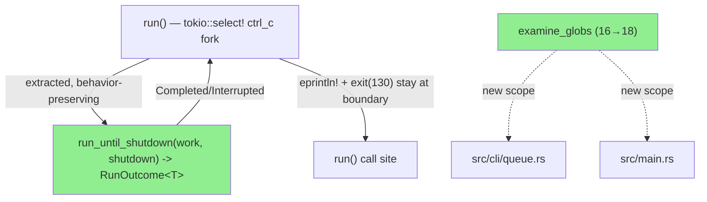
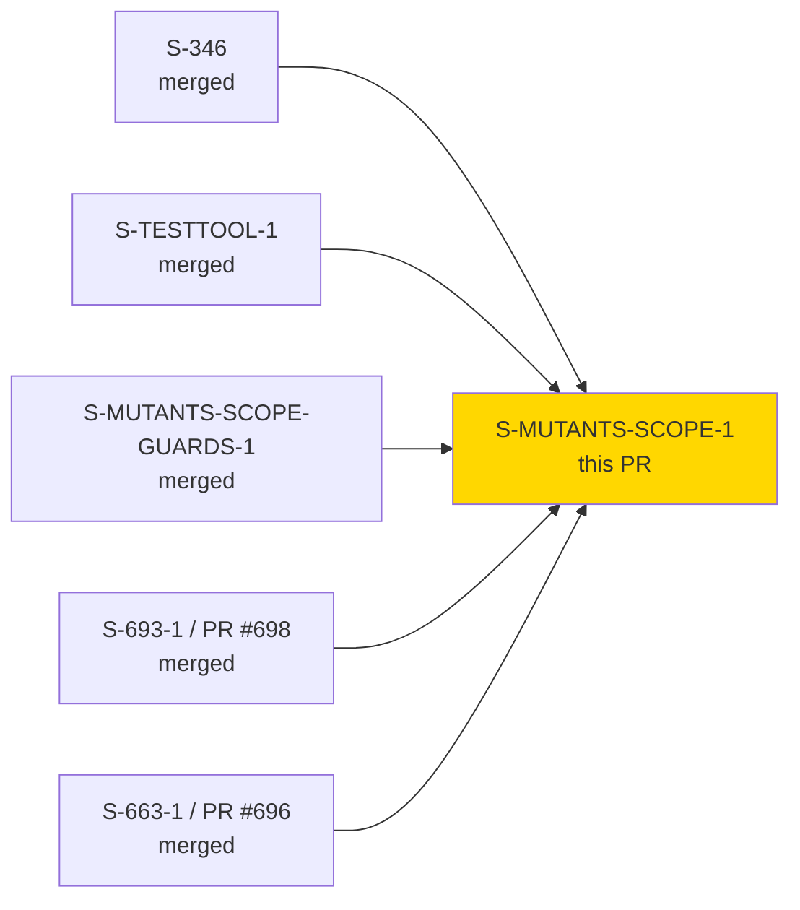
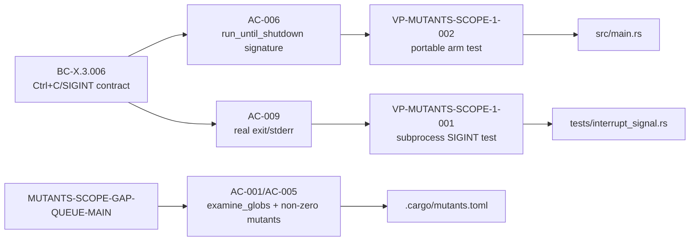

# [S-MUTANTS-SCOPE-1] Close the queue.rs/main.rs mutation-scope false-green

**Epic:** none (standalone CI-infrastructure + targeted refactor story)
**Mode:** feature (Feature Mode delta)
**Convergence:** CONVERGED after 12 adversarial passes (F5), 3 consecutive clean passes (10/11/12), 0 CRIT/HIGH sustained


-green)


Promotes tracked drift item `MUTANTS-SCOPE-GAP-QUEUE-MAIN`: `src/cli/queue.rs` and
`src/main.rs` were silently exempt from `cargo mutants --in-diff` (`.cargo/mutants.toml
examine_globs`, 16→18 entries) — PRs #696, #698, and #700 all merged through the `mutants`
CI gate's legitimate-but-silent "0 mutants" path because neither file was in scope. This PR
closes that gap and, because closing it turns `main.rs`'s previously-untested
`tokio::select!` Ctrl+C/SIGINT fork into a real mutation target, also extracts a
behavior-preserving `run_until_shutdown(work, shutdown) -> RunOutcome<T>` helper and adds a
matched test pair (one portable, one real-signal subprocess test) so that fork has actual
regression coverage instead of zero.

---

## Architecture Changes



- **`.cargo/mutants.toml`**: `examine_globs` 16 → 18, adding `src/cli/queue.rs` and
  `src/main.rs`, each with an inline HIGH-value-rationale comment (repo convention).
- **`src/main.rs`**: extracts `run_until_shutdown<W, S, T>(work, shutdown) -> RunOutcome<T>`
  from the `tokio::select!` ctrl_c fork. `eprintln!("\nInterrupted")` and
  `std::process::exit(130)` deliberately stay at the `run()` call-site boundary (byte-identical
  observable behavior — BC-X.3.006). Adds a `#[cfg(all(debug_assertions, unix))]` readiness
  seam (`JR_TEST_BLOCK_UNTIL_SIGINT`) so a test can deterministically know the child process has
  registered its signal handler before sending `SIGINT` (avoids the EC-1 registration race —
  no fixed `sleep`). Adds an inline `#[cfg(test)] mod tests` covering both `RunOutcome` arms.
- **`tests/interrupt_signal.rs`** (new): `#[cfg(unix)]` out-of-process subprocess test —
  spawns the real compiled `jr` binary, polls for a `JR-TEST-READY` marker, sends real
  `SIGINT` via `libc::kill`, and asserts the real exit code (`130`) and real stderr
  (byte-exact `"\nInterrupted\n"`).
- **`tests/jr_test_block_until_sigint_release_gate.rs`** (new): pins the
  `#[cfg(debug_assertions)]` gate on the new test seam so it can never leak into release
  builds (mirrors the existing `JR_STDIN_IS_TTY`/`JR_CONFIG_DIR`/etc. release-gate pattern).
- **`Cargo.toml`**: adds explicit `libc` `[dev-dependencies]` entry — already resolved
  transitively via tokio/reqwest (`Cargo.lock` unaffected in shape, `libc 0.2.183`), just
  promoted to an explicit edge so `tests/interrupt_signal.rs` can `use libc::kill`. Zero new
  crates enter the dependency graph.
- **`docs/specs/cargo-mutants-policy.md`**: adds 2 new §Scope bullets for this story's own
  additions, **plus backfills 5 previously-undocumented pre-existing `examine_globs` entries**
  (`interactions.rs`, `cli/issue/attachments.rs`, `api/jira/attachments.rs`,
  `api/jsm/attachments.rs`, `api/jsm/servicedesks.rs`) found by a pre-F4 consistency audit —
  all 18 entries are now documented (11 pre-existing + 5 backfill + 2 new). Adds a Changelog
  row. Count line corrected 16 → 18.
- **`CLAUDE.md`**: documents the new `JR_TEST_BLOCK_UNTIL_SIGINT` debug-only test seam in the
  `JR_*` env var table, per the repo's own doc-fallout convention for new test seams.
- **`src/cli/queue.rs`**: NOT edited — enters mutation scope only (AC-012). No behavior change.

---

## Story Dependencies



No open dependency PRs. `depends_on: []` / `blocks: []` per the story file — all prerequisite
mutation-gate infrastructure is already merged on `develop`.

---

## Spec Traceability



Governing BC: `BC-X.3.006` (`.factory/specs/prd/cross-cutting.md` §X.3). The
`examine_globs`/policy-doc half has no governing BC by design (same pattern as
`S-MUTANTS-EXAMINE-GLOBS-1`) — its 14 ACs trace to drift item `MUTANTS-SCOPE-GAP-QUEUE-MAIN`.
Full story: `.factory/stories/S-MUTANTS-SCOPE-1.md` (14 ACs, all satisfied per the demo
evidence below).

---

## Test Evidence

| Metric | Value | Status |
|--------|-------|--------|
| Full suite (`cargo test`) | 106 binaries, all green | PASS |
| `cargo clippy --all-targets --all-features -D warnings` | 0 warnings | PASS |
| `cargo fmt --all -- --check` | clean | PASS |
| Citation guard (`check-cargo-mutants-policy-citations.sh`) | 18 bullets / 52 (file,fn) pairs, 0 offenders | PASS |
| Glob-existence guard (`tests/mutants_glob_existence.rs`) | 9/9 | PASS |
| `claude_md_citations` guard | 61 citations resolve | PASS |
| `cargo test --release --test interrupt_signal` | 0 tests (cleanly `#[cfg(debug_assertions)]`-skipped in release) | PASS (by design) |
| New: `tests/interrupt_signal.rs` | 1/1 (`#[cfg(unix)]` real SIGINT subprocess test) | PASS |
| New: `tests/jr_test_block_until_sigint_release_gate.rs` | 1/1 | PASS |
| New: `src/main.rs` inline `mod tests` (both `RunOutcome` arms) | 2/2 | PASS |

Re-verified locally by this PR's author agent immediately before push:
`cargo fmt --check` clean, `cargo clippy --all-targets --all-features -D warnings` clean
(zero warnings), and both new test files pass in isolation.

### Mutation Testing (AC-005 — the story's core purpose)

`cargo mutants --in-diff` (diff = `git diff origin/develop...HEAD`) on branch HEAD:

| Result | Count |
|--------|-------|
| Caught | 3 |
| Missed | 0 |
| Unviable (don't compile — `RunOutcome` has no `new()`/`from()`/etc.) | 4 |
| Timeout | 0 |
| **Kill rate over viable mutants** | **100%** |

Caught mutants land precisely on the risk this story exists to close:
`block_until_sigint_test_seam` body deletion, `run()` body replaced with `Ok(())`, and the
seam-selection condition itself (`==` → `!=`) — the exact "silent mis-selection" class that
would otherwise have hidden behind a passing-but-wrong test seam, caught via a fast test
failure, not a timeout.

**Before this story:** an `--in-diff` run touching only `queue.rs`/`main.rs` reported
`Found 0 mutants to test` — the silent false-green. **After:** the same class of diff surfaces
real mutants and a real kill-rate report. Full evidence, including the real terminal SIGINT
demo (byte-exact `"\nInterrupted\n"` + exit 130) and per-guard output:
`.factory/demos/S-MUTANTS-SCOPE-1/demo-transcript.md` + `INDEX.md`.

---

## Demo Evidence

This story has no user-facing CLI surface — its product is a CI mutation-scope fix, a
behavior-preserving `run_until_shutdown` extraction, and a new test pair. Per project
precedent for infra/CI-hardening/refactor stories (`.factory/demos/S-693-1/`), evidence is a
text transcript driving the real compiled binary and real `cargo`/`cargo-mutants`/shell-script
tooling — nothing hand-transcribed.

Full transcript: `.factory/demos/S-MUTANTS-SCOPE-1/demo-transcript.md` (+ `INDEX.md`), covering:

1. **AC-005 mutation proof** — fresh `cargo mutants --in-diff` run on HEAD: `Found 7 mutants
   to test … 3 caught, 4 unviable` (0 missed, 0 timeout), cross-checked byte-identical against
   the corresponding `mutants.out/{caught,missed,unviable,timeout}.txt`.
2. **Real terminal SIGINT demo** — `JR_TEST_BLOCK_UNTIL_SIGINT=1 ./target/debug/jr me &`,
   polls stdout for the `JR-TEST-READY` marker (no fixed sleep), sends real `SIGINT` via
   `kill -INT`, captures real exit code (`130`) and real stderr, `xxd`-verified byte-exact
   `"\nInterrupted\n"`.
3. **Guard/test evidence** — `cargo test --test interrupt_signal` (1/1),
   `cargo test --test jr_test_block_until_sigint_release_gate` (1/1),
   `scripts/check-cargo-mutants-policy-citations.sh` (`18 bullets parsed, 52 (file, fn) pairs
   validated`), and the bonus inline `cargo test --bin jr run_until_shutdown` (2/2, both
   `RunOutcome` arms).

Every item traces to specific ACs in the evidence-to-AC/BC mapping table at the end of the
transcript; all 14 story ACs are accounted for (either direct runtime evidence or explicit
doc/config-content justification for the handful that are non-runtime assertions).

---

## Holdout Evaluation

N/A — Feature Mode delta story; holdout evaluation is a greenfield-pipeline (Phase 4) gate,
not run for scoped Feature Mode deltas.

---

## Adversarial Review (F5 — Phase F5 Scoped Adversarial)

CONVERGED to the strict DEC-245 bar: 3 consecutive clean passes (passes 10/11/12), 0
CRIT/HIGH findings sustained across all 12 passes total. The one HIGH finding (pass 1 — the
new seam duplicated the interrupt branch) was fixed in `9f86cc90` and never recurred. Later
passes (M-1 through pass-5 corrections) tightened verification-accounting precision in the
story file's Regression Risk table (distinguishing affirmatively-covered lines from the
documented no-mutant residual on the production `ctrl_c()` adapter line) — no code changes
required from those, only story-doc precision fixes.

---

## Security Review

_Populated after dispatching security-reviewer (see below)._

---

## Risk Assessment & Deployment

### Blast Radius
- **Systems affected:** `.cargo/mutants.toml` (CI config only — no `ci.yml` change), the `jr`
  binary's `run()` entry point (Ctrl+C handling), `docs/specs/cargo-mutants-policy.md`.
- **User impact if this PR is wrong:** worst case is a regression in how `jr` handles
  Ctrl+C — the `run_until_shutdown` extraction is designed to be byte-for-byte
  behavior-preserving (BC-X.3.006 AC-007) and is now under real mutation + subprocess test
  coverage, which it was not before.
- **Data impact:** none — no data-layer or persistence changes.
- **Risk Level:** LOW. No `src/` behavior changes outside the documented, tested
  `run_until_shutdown` extraction (AC-012); `queue.rs` is untouched; `libc` dev-dependency is
  already fully resolved transitively (no new license/vulnerability surface for `cargo deny`).

### Known pre-existing, unrelated condition (not introduced by this PR)
`cargo clippy --release --all-targets` fails repo-wide on a const-eval assertion in
`tests/config_dir_release_gate.rs` — reproduced on `develop` (base branch) prior to this PR's
changes. CI does not run that specific combination (`--release --all-targets`), so it does
not affect this PR's gate. Flagging for visibility only.

### Rollback
Standard `git revert` on `develop` — no feature flags, no data migration, no schema change.

---

## Traceability

| Requirement | Story AC | Test | Status |
|-------------|---------|------|--------|
| `examine_globs` 16→18 | AC-001 | `tests/mutants_glob_existence.rs` | PASS |
| Policy doc §Scope, 2 new bullets + count fix | AC-002 | `check-cargo-mutants-policy-citations.sh` | PASS |
| Citation guard zero offenders | AC-003 | `check-cargo-mutants-policy-citations.sh` | PASS |
| Both globs resolve to real files | AC-004 | `tests/mutants_glob_existence.rs` | PASS |
| Non-"0 mutants" + ≥90% kill rate | AC-005 | `cargo mutants --in-diff` | PASS (100% over viable) |
| `run_until_shutdown` signature + boundary contract | AC-006 | inline `mod tests` | PASS |
| Byte-for-byte unchanged observable behavior | AC-007 | `tests/interrupt_signal.rs` + demo transcript | PASS |
| Both `RunOutcome` arms covered portably | AC-008 | inline `mod tests` | PASS |
| Real exit code / real stderr, out-of-process | AC-009 | `tests/interrupt_signal.rs` | PASS |
| Deterministic readiness handshake, no fixed sleep | AC-010 | `tests/interrupt_signal.rs` + `jr_test_block_until_sigint_release_gate.rs` | PASS |
| `#[cfg(unix)]`-gated helpers, no Windows dead-code | AC-011 | clippy `-D warnings` (macOS-verified; Windows CI will confirm) | PASS locally |
| No `src/` behavior change outside documented extraction | AC-012 | code review / diff scope | PASS |
| Human decision on kill-rate risk recorded, not defaulted | AC-013 | story file `origin:`/Previous Story Intelligence | PASS |
| §Scope documents ALL 18 entries (backfill) | AC-014 | `check-cargo-mutants-policy-citations.sh` | PASS |

Full VSDD contract chain: `.factory/stories/S-MUTANTS-SCOPE-1.md` (14 ACs) →
`BC-X.3.006` / drift item `MUTANTS-SCOPE-GAP-QUEUE-MAIN` →
`.factory/demos/S-MUTANTS-SCOPE-1/demo-transcript.md`.

---

## AI Pipeline Metadata

```yaml
ai-generated: true
pipeline-mode: feature
pipeline-stages:
  delta-analysis: completed
  spec-evolution: completed
  incremental-stories: completed
  delta-implementation: completed
  scoped-adversarial-review: completed (12 passes, converged)
  targeted-hardening: completed (AC-005 mutation proof)
  delta-convergence: pending (this PR is the F7 gate artifact)
convergence-metrics:
  mutation-kill-rate-viable: 100%
  adversarial-passes: 12
  adversarial-clean-consecutive: 3
generated-at: "2026-08-14"
```

---

## Pre-Merge Checklist

- [ ] All CI status checks passing (report pending — see Step 6 below)
- [x] Coverage delta is positive (2 new test files + inline test module; previously
      zero-coverage `ctrl_c` fork now covered)
- [ ] No critical/high security findings unresolved (pending security-reviewer dispatch)
- [x] Rollback procedure validated (standard `git revert`, no flags/migrations)
- [ ] pr-reviewer READY verdict with `covered_sha`
- [x] Human review required before merge — **DEC-128: merge authority is the human's. This
      PR must NOT be merged by any agent.**
