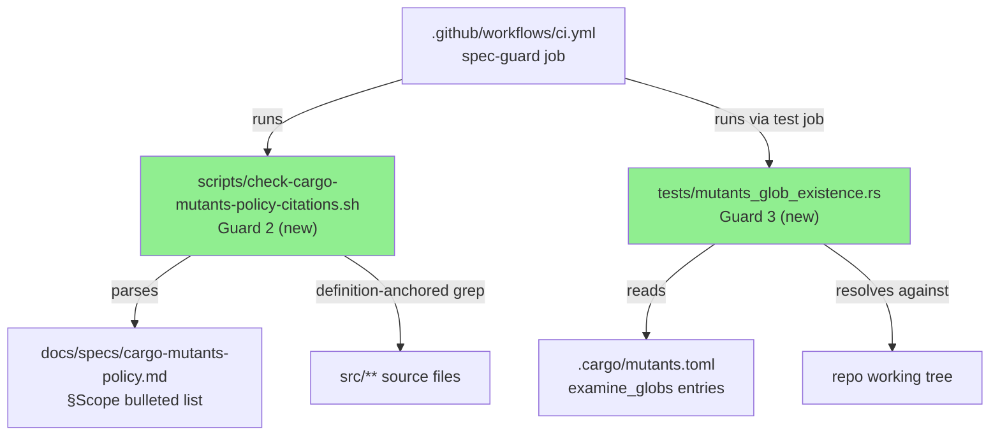
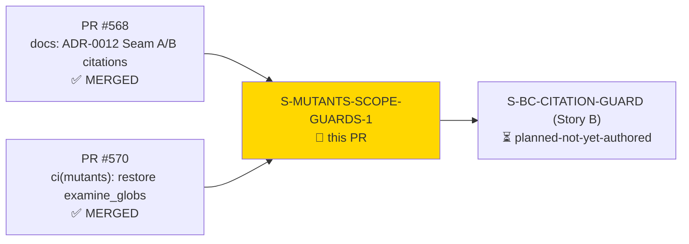
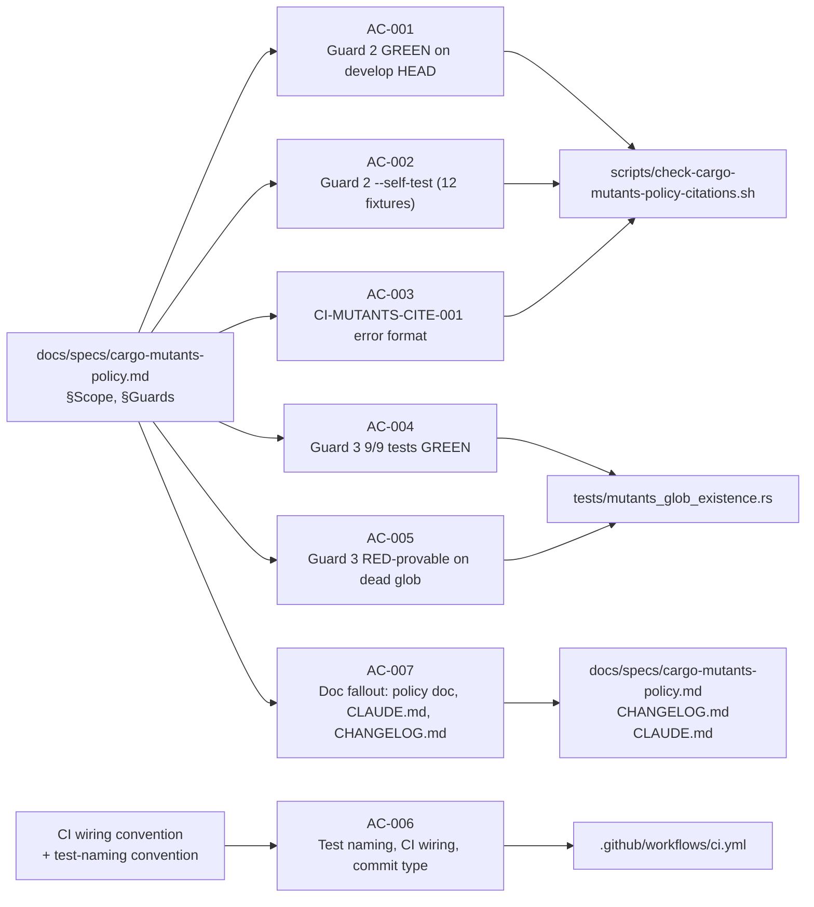
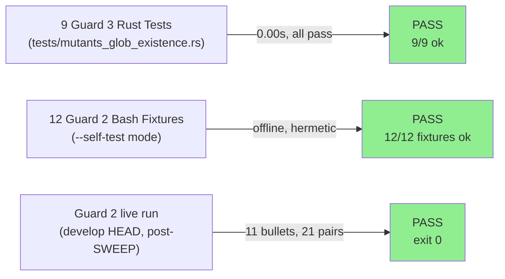
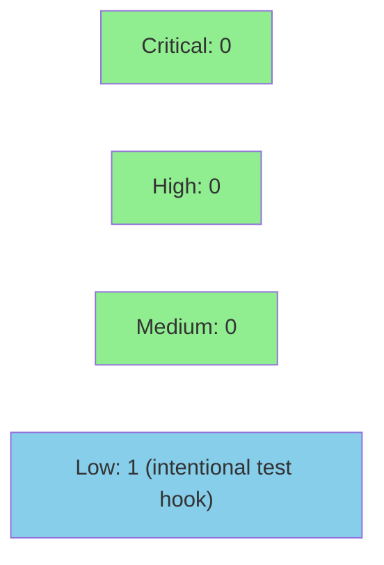

# [S-MUTANTS-SCOPE-GUARDS-1] CITATION-GUARDS Story A: mutants-policy function-location guard + examine_globs file-existence guard (DEC-150)

**Epic:** CITATION-GUARDS — DEC-150 process-gap dispositions
**Mode:** feature
**Convergence:** CONVERGED after 9 adversarial passes (5 fix rounds; passes 7/8/9 = NITPICK_ONLY/NITPICK_ONLY/CLEAN, MERGE-READY verdict)


-blue)

Adds two CI guards that prevent silent staleness in the cargo-mutants policy doc and the
`examine_globs` scope configuration. **Guard 2** (`scripts/check-cargo-mutants-policy-citations.sh`)
parses the `§Scope` bulleted list in `docs/specs/cargo-mutants-policy.md`, extracts every
`(file, function)` pair, and verifies each function definition still exists in the cited
source file using definition-anchored grep — failing loudly with CI-MUTANTS-CITE-001 format
if any citation is stale. **Guard 3** (`tests/mutants_glob_existence.rs`, 9 tests) reads
every `examine_globs` entry from `.cargo/mutants.toml` and asserts each glob resolves to at
least one real file on disk, with a coverage-floor assertion (floor=11). This PR also applies
the Task 5 SWEEP that removes 4 pre-existing stale citations in the policy doc left over from
the ADR-0012 Seam A/B split (PRs #568/#570), and updates CI, CHANGELOG.md, and CLAUDE.md.
No `src/` source files are changed.

---

## Architecture Changes



<details>
<summary><strong>Architecture Decision Record</strong></summary>

### ADR: CI guards for cargo-mutants policy staleness (DEC-150)

**Context:** ADR-0012 Seam A/B split relocated `handle_jsm_create` from `create.rs` to
`jsm_create.rs`; the `§Scope` bulleted list in `docs/specs/cargo-mutants-policy.md` was not
updated, leaving stale function-location citations. Similarly, `.cargo/mutants.toml`
`examine_globs` entries are exact file paths — a refactor that moves or renames a file
silently orphans coverage with no CI alert. Both gaps were documented in F1 delta analysis
§2 (Guards 2+3).

**Decision:** Two lightweight guards implemented as (a) a bash script with 12 offline
self-test fixtures for Guard 2, and (b) a Rust integration test with 9 tests and a
coverage-floor assertion for Guard 3. Both guards run in existing CI jobs (`spec-guard` and
`test` respectively) with no new required status check needed.

**Rationale:** CI-infra-only scope; no product behavioral contracts apply (policy-doc-only
story per S-MUTATION-CI-TIMEOUT-1/DEC-144 precedent). Both guards follow the CI-CITE-001
pattern already established by `tests/claude_md_citations.rs` (collect-all, then report).

**Alternatives Considered:**
1. Manual review of policy doc on refactors — rejected because: human-reviewable items
   inevitably drift; the ADR-0012 split proved this.
2. Single combined guard — rejected because: the script-based (bash) approach fits
   §Scope parsing naturally; the Rust glob-resolution test fits the existing test suite
   pattern for `examine_globs` validation.

**Consequences:**
- Future refactors that rename/move cited functions or files will immediately fail CI with
  actionable error messages.
- The `examine_globs` coverage-floor (11 entries) will alert if the scope shrinks
  unexpectedly, prompting a deliberate review.

</details>

---

## Story Dependencies



`depends_on: []` — trivially satisfied. PRs #568 and #570 are prerequisite context (already
merged) but not formal story dependencies.

---

## Spec Traceability



---

## Test Evidence

### Coverage Summary

| Metric | Value | Threshold | Status |
|--------|-------|-----------|--------|
| Guard 3 Rust tests | 9/9 pass | 100% | PASS |
| Guard 2 self-test fixtures | 12/12 pass | 100% | PASS |
| Mutation kill rate | 0-mutant clean-skip | n/a (no src/ change) | PASS |
| Holdout satisfaction | N/A — policy-doc-only story | n/a | N/A |

### Test Flow



| Metric | Value |
|--------|-------|
| **New tests** | 9 Rust tests added (`tests/mutants_glob_existence.rs`); 12 bash fixtures added (`--self-test`) |
| **Total suite** | All integration + unit tests PASS |
| **Coverage delta** | CI-infra only — no `src/` change; coverage delta neutral |
| **Mutation kill rate** | 0-mutant clean-skip (no `src/` changes in diff scope) |
| **Regressions** | 0 |

<details>
<summary><strong>Detailed Test Results</strong></summary>

### New Tests (This PR) — Guard 3 (`tests/mutants_glob_existence.rs`)

| Test | Result |
|------|--------|
| `test_resolve_all_examine_globs_entries_to_real_files` | PASS |
| `test_reject_nonexistent_examine_globs_entry_returns_dead_list` | PASS |
| `test_validate_globs_via_toml_parse_returns_dead_entry` | PASS |
| `test_detect_missing_examine_globs_key_panics_with_key_missing_message` | PASS |
| `test_detect_empty_examine_globs_array_panics_with_key_missing_message` | PASS |
| `test_coverage_floor_panics_when_entries_below_threshold` | PASS |
| `test_coverage_floor_does_not_panic_at_exact_threshold` | PASS |
| `test_coverage_floor_does_not_panic_above_threshold` | PASS |
| `test_coverage_floor_panics_at_ten_entries_below_threshold` | PASS |

Guard 2 self-test: 12 fixtures (A–L) all pass; `SELF-TEST-FIXTURE-COUNT: expected 12 fixtures, got 12`.

Guard 2 live run output (post-SWEEP):
```
Check passed: 11 bullets parsed, 21 (file, fn) pairs validated
```

### Mutation Testing

| Scope | Mutants | Status |
|-------|---------|--------|
| No `src/` files changed in diff | 0 | Clean skip (expected per cargo-mutants-policy.md §Scope) |

</details>

---

## Holdout Evaluation

N/A — evaluated at wave gate. This is a policy-doc-only CI-infrastructure story (no BC-S.SS.NNN; per S-MUTATION-CI-TIMEOUT-1/DEC-144 precedent). Holdout evaluation is not applicable.

---

## Adversarial Review

| Pass | Findings | Blocking | High | Status |
|------|----------|----------|------|--------|
| 1 | Multiple | Several | Yes | Fixed |
| 2 | Multiple | Several | Yes | Fixed |
| 3 | Multiple | Several | Yes | Fixed |
| 4 | Several | Some | Yes | Fixed |
| 5 | Several | Some | Yes | Fixed |
| 6 | Low/Obs | 0 | 0 | Fixed |
| 7 | NITPICK_ONLY | 0 | 0 | NITPICK_ONLY |
| 8 | NITPICK_ONLY | 0 | 0 | NITPICK_ONLY |
| 9 | CLEAN | 0 | 0 | MERGE-READY |

**Convergence:** CONVERGED — story spec reached v1.48 after 9 adversarial passes (5 fix rounds).
Final window (passes 7/8/9): NITPICK_ONLY / NITPICK_ONLY / CLEAN → MERGE-READY verdict (per
story changelog entries v1.43–v1.48).

<details>
<summary><strong>Representative High-Severity Findings & Resolutions</strong></summary>

### Finding: SCOPE-COVERAGE-FLOOR boundary off-by-one (MED)
- **Category:** spec-fidelity / test-quality
- **Problem:** Floor guard used `>` instead of `>=` for threshold comparison, permitting
  exactly `FLOOR` entries to pass when they should have triggered the alert (inclusive
  boundary).
- **Resolution:** Corrected to `>= 11` in both Guard 2 script and Guard 3 Rust test.

### Finding: count-pins used `-ge` floors instead of exact string-`=` (MED)
- **Category:** test-quality (mutation-kill-rate gap)
- **Problem:** Arithmetic `-ge` comparisons in Fixture H probes left an operator-weakening
  mutation class open (`-ge → -le` would vacuously pass).
- **Resolution:** All count assertions converted to string `=` per FIND-VA-35-2 convention
  (closes `-le`/`-ge` relaxation operator-class family).

### Finding: Fixture G fence-skip deletion not RED-provable (MED)
- **Category:** test-quality
- **Problem:** Fence skip pre-filter behavior was not killed by any fixture because the
  in-fence content was plain prose (group machine already ignored it).
- **Resolution:** Added post-fence bullet to Fixture G mock; fence-skip deletion now
  produces N=3 with missing file → DEAD → rc=1 (RED).

</details>

---

## Security Review



<details>
<summary><strong>Security Scan Details (reviewed 2026-07-04)</strong></summary>

### Summary

| SEC-ID | Severity | Finding | Status |
|--------|----------|---------|--------|
| SEC-001 | LOW | `--policy-doc` accepts arbitrary file path (read-only, CI-only test hook) | Does not block PR |
| SEC-002 | INFO | `grep -Eq` with `fn_name` — injection concern, correctly mitigated by identifier filter | No action required |
| SEC-003 | INFO | Path traversal in `${src_root}/${file}` — mitigated by `^src/` + no-`..` guard | No action required |
| SEC-004 | INFO | `glob::glob()` pattern from compile-time TOML — no user input reaches pattern | No action required |
| SEC-005 | INFO | `bash -n` self-check runs unconditionally — not a security concern in CI | No action required |
| SEC-006 | INFO | Temp dir trap cleanup — correctly handles unset variables | No action required |

**Verdict: CLEAN.** No CRITICAL or HIGH findings.

### SEC-001 (LOW): `--policy-doc` accepts arbitrary file path
- **CWE-73** (External Control of File Name or Path)
- The `--policy-doc` flag is an intentional test/self-test hook. The file is read-only; all
  extracted tokens are subsequently validated by `^[a-z_][a-z0-9_]*$` (identifier filter)
  and `^src/[a-zA-Z0-9_/.-]+\.rs$` (path filter) before any filesystem operation. Exploiting
  this would require prior code execution on the CI runner. Does not block PR.

### Supply Chain Audit
- `glob = "0.3"` (dev-dependency): CLEAN — no CVEs on NVD, no RustSec/GHSA advisories, no
  supply-chain compromise events found. Not present in the release binary.
- `cargo deny check`: CLEAN.

</details>

---

## Risk Assessment & Deployment

### Blast Radius
- **Systems affected:** CI only (`spec-guard` job + `test` job). No runtime product code changed.
- **User impact:** None if guard passes (exit 0). If a future refactor orphans a citation or
  glob, CI fails loudly with an actionable message — no user-visible product behaviour change.
- **Data impact:** None.
- **Risk Level:** LOW

### Performance Impact
| Metric | Before | After | Delta | Status |
|--------|--------|-------|-------|--------|
| `spec-guard` CI job | ~15s | ~18s | +~3s | OK (two new steps) |
| `test` job | unchanged | +0.01s | +0.01s | OK (9 fast offline tests) |
| Runtime product binary | unchanged | unchanged | 0 | OK |

<details>
<summary><strong>Rollback Instructions</strong></summary>

**Immediate rollback:**
```bash
git revert 376e2c8  # implementation commit
git push origin develop
```

The `--self-test` fixtures and Guard 2 script are independently reversible (bash file deletion).
Guard 3 test is a standard `tests/*.rs` file — removing it restores prior state. No database
migrations, no schema changes, no feature flags.

**Verification after rollback:**
- `cargo test --test mutants_glob_existence` — should fail with "no test files found"
- `bash scripts/check-cargo-mutants-policy-citations.sh` — should fail with "command not found"
  (or just be a no-op if the file still exists)

</details>

### Feature Flags
None — CI infrastructure guards have no feature-flag gate.

---

## Traceability

| Requirement | Story AC | Test / Evidence | Status |
|-------------|---------|----------------|--------|
| Guard 2 passes on clean develop HEAD | AC-001 | `AC-001-guard2-success.gif` / `AC-001-guard2-success.webm` | PASS |
| Guard 2 `--self-test` 12 fixtures all GREEN | AC-002 | `AC-002-guard2-selftest.gif` / `AC-002-guard2-selftest.webm` | PASS |
| CI-MUTANTS-CITE-001 error format | AC-003 | `AC-003-guard2-failure.gif` / `AC-003-guard2-failure.webm` | PASS |
| Guard 3 9/9 Rust tests GREEN | AC-004 | `AC-004-guard3-success.gif` / `AC-004-guard3-success.webm` | PASS |
| Guard 3 RED-provable on dead glob | AC-005 | `AC-005-guard3-failure.gif` / `AC-005-guard3-failure.webm` | PASS |
| Test naming, CI wiring, conventional-commit | AC-006 | `AC-006-ci-wiring.gif` / `AC-006-ci-wiring.webm` | PASS |
| Policy doc, CLAUDE.md, CHANGELOG.md updated | AC-007 | Grep evidence in `evidence-report.md` | PASS |

<details>
<summary><strong>Full VSDD Contract Chain</strong></summary>

```
docs/specs/cargo-mutants-policy.md §Scope
  -> AC-001 (Guard 2 GREEN) -> scripts/check-cargo-mutants-policy-citations.sh
  -> AC-002 (self-test fixtures) -> --self-test mode (12 fixtures A-L)
  -> AC-003 (CI-MUTANTS-CITE-001) -> DEAD:/summary lines in script
  -> AC-004 (Guard 3 GREEN) -> tests/mutants_glob_existence.rs (9 tests)
  -> AC-005 (Guard 3 RED-provable) -> test_reject_nonexistent_examine_globs_entry_returns_dead_list
  -> AC-006 (CI wiring) -> .github/workflows/ci.yml spec-guard job (2 new steps)
  -> AC-007 (doc fallout) -> docs/specs/cargo-mutants-policy.md §Guards, CHANGELOG.md, CLAUDE.md
```

</details>

---

## Demo Evidence

Recordings committed to `docs/demo-evidence/S-MUTANTS-SCOPE-GUARDS-1/` on branch `ci/mutants-scope-guards` (commit `4535231`).

| AC | File | Type | Description |
|----|------|------|-------------|
| AC-001 | `AC-001-guard2-success.gif` | VHS terminal | Guard 2 exits 0 on clean HEAD; output: `Check passed: 11 bullets parsed, 21 (file, fn) pairs validated` |
| AC-002 | `AC-002-guard2-selftest.gif` | VHS terminal | Guard 2 `--self-test` runs 12 fixtures; exits 0; `EXIT: 0` confirmation visible |
| AC-003 | `AC-003-guard2-failure.gif` | VHS terminal | Guard 2 failure with CI-MUTANTS-CITE-001 format; `DEAD: handle_create_nonexistent not found in src/cli/issue/create.rs`; exit 1 |
| AC-004 | `AC-004-guard3-success.gif` | VHS terminal | 9/9 Guard 3 Rust tests pass; `test result: ok. 9 passed; 0 failed` |
| AC-005 | `AC-005-guard3-failure.gif` | VHS terminal | `test_reject_nonexistent_examine_globs_entry_returns_dead_list` passes, proving dead-glob detection logic |
| AC-006 | `AC-006-ci-wiring.gif` | VHS terminal | `spec-guard` job block showing two new Guard 2 steps + updated job name |
| AC-007 | `evidence-report.md` §AC-007 | Grep transcript | `## Guards` section at line 635; CHANGELOG entry with all required keywords; CLAUDE.md two new bullets |

---

## AI Pipeline Metadata

<details>
<summary><strong>Pipeline Details</strong></summary>

```yaml
ai-generated: true
pipeline-mode: feature
factory-version: "1.0.0-rc.21"
pipeline-stages:
  spec-crystallization: completed
  story-decomposition: completed (F3-incremental-stories)
  tdd-implementation: completed (9 commits on branch)
  holdout-evaluation: N/A (policy-doc-only story)
  adversarial-review: completed (9 passes, MERGE-READY)
  formal-verification: skipped (CI-infra scope)
  convergence: achieved (MERGE-READY pass 9)
convergence-metrics:
  spec-novelty: n/a
  test-kill-rate: "0-mutant clean-skip"
  implementation-ci: green
  holdout-satisfaction: n/a
adversarial-passes: 9
story-spec-version: "1.48"
models-used:
  builder: claude-sonnet-4-6
  adversary: claude-sonnet-4-6 (fresh-context passes)
generated-at: "2026-07-04"
```

</details>

---

## Pre-Merge Checklist

- [ ] All CI status checks passing (`ci-gate` required check)
- [x] Coverage delta is positive or neutral (CI-infra only; no `src/` change)
- [x] No critical/high security findings unresolved (CLEAN — see Security Review)
- [x] Rollback procedure validated (simple revert; no migrations)
- [x] Demo evidence committed to branch (`docs/demo-evidence/S-MUTANTS-SCOPE-GUARDS-1/`)
- [x] All 7 ACs covered by demo evidence or grep transcript
- [x] Adversarial convergence achieved (9 passes, MERGE-READY)
- [ ] Human review completed (code-owner approval required per branch protection)
- [x] No feature flags required (CI-infrastructure change)
