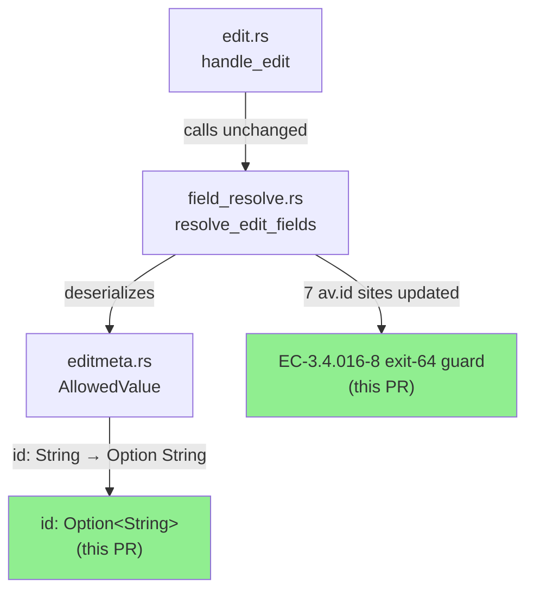
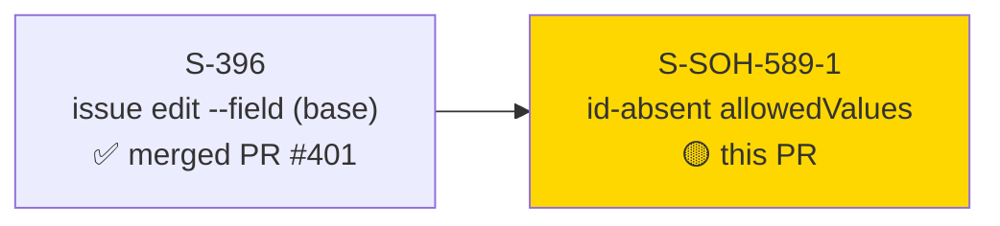
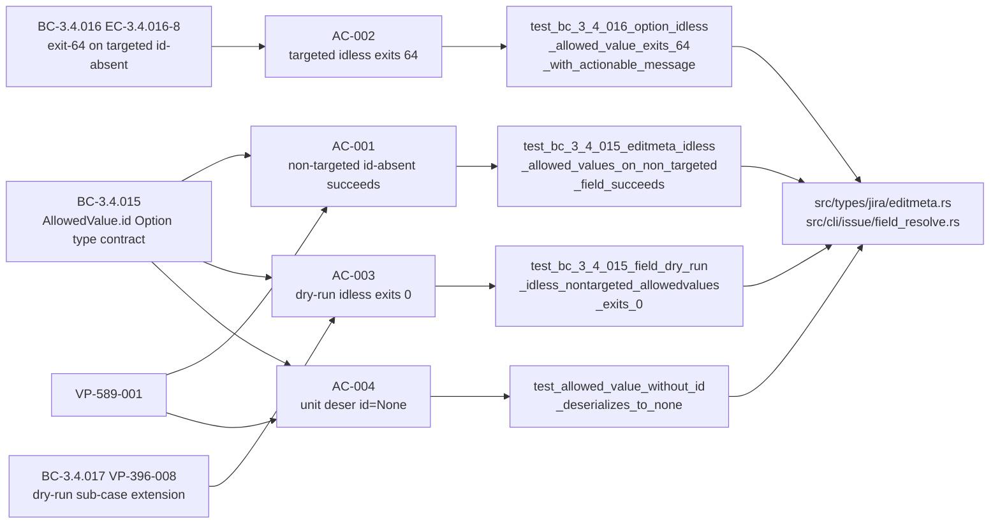
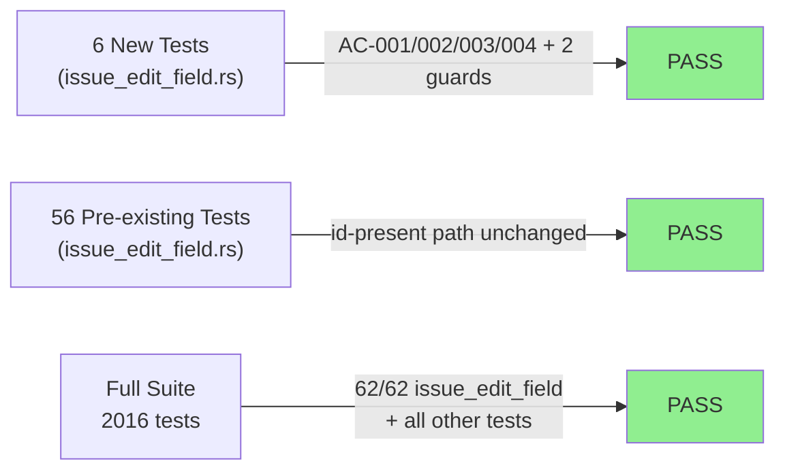
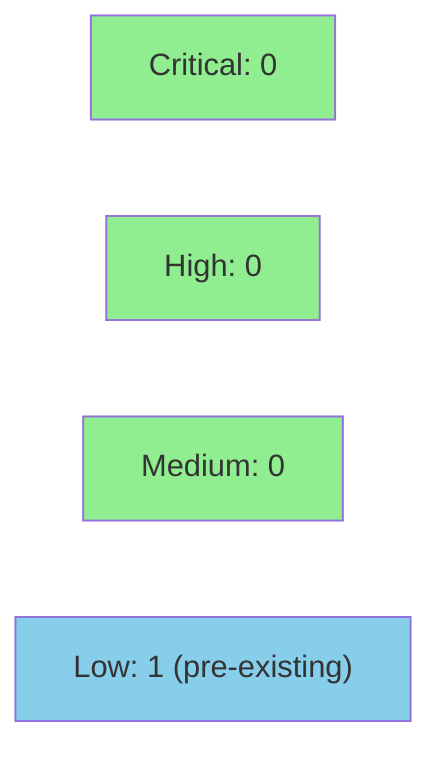

# [S-SOH-589-1] tolerate id-absent editmeta allowedValues in `issue edit --field` (fixes #589)

**Epic:** SOH-BUGS-1 (bug-fix bundle)
**Mode:** feature (standard bug-fix route)
**Convergence:** STRICT CONVERGED after 7 adversarial passes (4 fix rounds; trajectory 3→4→0→1→0→0→0; window p5/p6/p7)


Fixes #589: `jr issue edit KEY --field NAME=VALUE` crashed with a serde `"missing field 'id'"` error on Jira instances where GDPR-era user/group picker fields carry `accountId`-only `allowedValues` entries (no `id` key). The root cause was `AllowedValue.id: String` (required) in `src/types/jira/editmeta.rs` — the Jira Cloud OpenAPI schema has no required properties on `allowedValues` entries. This PR changes `id` to `Option<String>`, makes 7 call sites in `field_resolve.rs` Option-aware, adds an exit-64 guard (EC-3.4.016-8) at wire-emission sites so id-absent option fields fail fast with an actionable message, and adds a `<no-id>` sentinel on display paths. 6 new tests; all 62 tests in `issue_edit_field` pass; full suite 2016/0/93 clean.

Closes #589. Reported by @sackofhacks.

---

## Architecture Changes



<details>
<summary><strong>Architecture Decision: Minimum-viable type change only</strong></summary>

### ADR: AllowedValue.id loosened to Option<String> (inline, no new ADR)

**Context:** Jira Cloud OpenAPI schema for `allowedValues` entries has no required properties. GDPR-era user/group picker fields use `accountId` instead of `id`. One id-absent entry on any field blocks the entire `issue edit --field` feature.

**Decision:** `AllowedValue.id: String` → `Option<String>`. No other AllowedValue field changes. 7 `av.id` call sites in `field_resolve.rs` made Option-aware via idiomatic combinators. Wire-emission sites (id-bypass, exact-match, substring-match) get EC-3.4.016-8 exit-64 guard; display paths get `<no-id>` sentinel. No call-site changes outside `field_resolve.rs`.

**Rationale:** Seven surveyed Jira client libraries all use loose typing for `allowedValues`; required `id: String` is an ecosystem outlier. `Option<String>` is backward-compatible for non-None values — all pre-existing tests (which supply `id`) continue passing. Minimum viable scope approved by F1 delta analysis: 2 files, 7 mechanical edits, no new CLI surface.

**Alternatives Considered:**
1. `#[serde(default)]` on `id: String` — rejected: this would produce empty-string `id` for absent entries, which is semantically wrong (an empty string is not "no id") and could produce silent incorrect wire payloads.
2. Flatten via `#[serde(flatten)]` with a custom enum — rejected: over-engineered for a one-field fix; would require touching more code than the minimum-viable scope.

**Consequences:**
- `issue edit --field` now works on JSM and GDPR-era Jira instances with user/group picker fields.
- id-absent option values fail fast at resolution time (exit 64, actionable message) rather than at wire time or silently.

</details>

---

## Story Dependencies



No downstream stories blocked by this PR (`blocks: []`).

---

## Spec Traceability



---

## Test Evidence

### Coverage Summary

| Metric | Value | Threshold | Status |
|--------|-------|-----------|--------|
| `issue_edit_field` tests | 62/62 pass | 100% | PASS |
| Full suite | 2016 pass / 0 fail / 93 ignored | 100% | PASS |
| clippy | 0 warnings | 0 | PASS |
| fmt | clean | clean | PASS |
| Regressions | 0 | 0 | PASS |

### Test Flow



| Metric | Value |
|--------|-------|
| **New tests** | 6 added (AC-001/002/003/004 + substring guard + numeric-bypass EC-006) |
| **Total suite** | 2016 pass, 0 fail, 93 ignored |
| **`issue_edit_field` suite** | 62/62 pass |
| **Regressions** | 0 — all pre-existing tests unchanged and green |

<details>
<summary><strong>Detailed Test Results — New Tests</strong></summary>

### New Tests (This PR, in `tests/issue_edit_field.rs`)

| Test | AC | Result |
|------|----|--------|
| `test_bc_3_4_015_editmeta_idless_allowed_values_on_non_targeted_field_succeeds` | AC-001 | PASS |
| `test_bc_3_4_016_option_idless_allowed_value_exits_64_with_actionable_message` | AC-002 | PASS |
| `test_bc_3_4_015_field_dry_run_idless_nontargeted_allowedvalues_exits_0` | AC-003 | PASS |
| `test_allowed_value_without_id_deserializes_to_none` | AC-004 | PASS |
| `test_bc_3_4_016_option_idless_substring_match_exits_64` | EC-3.4.016-8 substring path | PASS |
| `test_bc_3_4_016_option_idless_numeric_value_falls_through_to_label_matching` | EC-006 id-bypass exclusion | PASS |

### Red Gate Evidence

Red Gate confirmed at commit `1e9c770` (before fix at `86907e5`):
- `test_allowed_value_without_id_deserializes_to_none` → FAIL with `"missing field 'id'"` serde error
- `test_bc_3_4_015_editmeta_idless_*` → FAIL with serde deserialization error (exit 1, not 0)
- `test_bc_3_4_016_option_idless_*` → FAIL with serde error (exit 1, not exit 64 with actionable message)

</details>

---

## Holdout Evaluation

N/A — evaluated at wave gate (SOH-BUGS-1 bundle; holdout anchors: none per story frontmatter).

---

## Adversarial Review

| Pass | Findings | Blocking | Fixed | Status |
|------|----------|----------|-------|--------|
| p1 (F1) | 3 | 2 | 3 | Fixed |
| p2 (F2) | 4 | 2 | 4 | Fixed |
| p3 | 0 | 0 | 0 | Clean |
| p4 (obs) | 1 | 0 | 1 | Fixed |
| p5 | 0 | 0 | 0 | Clean |
| p6 | 0 | 0 | 0 | Clean |
| p7 | 0 | 0 | 0 | Clean |

**Convergence:** STRICT CONVERGED (3 consecutive clean passes p5/p6/p7)

<details>
<summary><strong>Key Adversarial Findings & Resolutions</strong></summary>

### p1 F1: Missing `unreachable!` annotation on defensive guard in id-bypass path
- **Location:** `src/cli/issue/field_resolve.rs` § id-bypass path post-match guard
- **Category:** code-quality / documentation
- **Resolution:** Added comment annotating the defensive `unreachable!` guard
- **Commit:** `e54ef43`

### p1 F2/F3: Dry-run adjacency assertion too loose; missing `id.is_none()` pin
- **Location:** `tests/issue_edit_field.rs` AC-003 test
- **Category:** test-quality
- **Resolution:** Tightened dry-run output assertion; added explicit `id.is_none()` pin
- **Commit:** `e345ec8`

### p2 F1: Substring-match wire emission path not covered by tests
- **Location:** `src/cli/issue/field_resolve.rs` § substring-match wire emission
- **Category:** test-coverage
- **Resolution:** Added `test_bc_3_4_016_option_idless_substring_match_exits_64`
- **Commit:** `348c30e`

### p2 F2: Stale numeric test count in CHANGELOG entry
- **Location:** `CHANGELOG.md` [Unreleased] Fixed entry
- **Category:** spec-fidelity
- **Resolution:** Dropped numeric count; replaced with count-free phrasing
- **Commit:** `2d67486`

### p4 obs: id-bypass predicate exclusion + label dedup coverage gap
- **Location:** `tests/issue_edit_field.rs` EC-006
- **Category:** test-coverage
- **Resolution:** Added `test_bc_3_4_016_option_idless_numeric_value_falls_through_to_label_matching`; deduped test label strings
- **Commit:** `6094d32`

</details>

---

## Security Review

The primary security-relevant change is deserialization hardening in `src/types/jira/editmeta.rs` and the new exit-64 paths in `src/cli/issue/field_resolve.rs`. These handle untrusted Jira API response data.

**Verdict: APPROVE.** No CRITICAL or HIGH findings.



<details>
<summary><strong>Security Scan Details</strong></summary>

### Deserialization Hardening Review

The change from `id: String` → `id: Option<String>` in `AllowedValue`:
- **Input source:** Jira REST API `GET /rest/api/3/issue/KEY/editmeta` response — untrusted external API data
- **Previous behavior:** serde rejected the entire `HashMap<String, EditMetaField>` on any id-absent entry → process exit 1 (crash-like behavior for the user)
- **New behavior:** `id=None` accepted; entry proceeds through field resolution logic
- **Exit-64 guards:** Wire-emission sites (id-bypass, exact-match, substring-match) now fail fast before any `PUT` is issued when `id=None` — no sensitive data emitted in error path

### Error Message Review (EC-3.4.016-8)
The error message `"option '<VALUE>' has no machine-readable id and cannot be set via --field. This typically occurs with user/group picker fields. Use the Jira UI or the field's native picker to set this value."` contains:
- User-supplied `value` string — reflected in error message. The value comes from the CLI argument (`--field NAME=VALUE`), not from the API response. This is not a data-exfiltration risk; the user already knows what they typed.
- No `accountId`, no `email`, no OAuth tokens are present in the error path.

### New `use` Imports
- `src/types/jira/editmeta.rs`: zero new imports (architecture constraint satisfied)
- `src/cli/issue/field_resolve.rs`: zero new crate-level imports (only std Option combinators)

### No new network endpoints, no new auth paths, no new file I/O.

</details>

---

## Risk Assessment & Deployment

### Blast Radius
- **Systems affected:** `jr issue edit --field` only (single feature, no other commands)
- **User impact:** Zero for users not using `--field`. For `--field` users on JSM/GDPR instances: crash eliminated; id-absent option fields now exit 64 with a message instead of silently crashing.
- **Data impact:** None — no new data written; existing PUT payloads unchanged for id-present cases
- **Risk Level:** LOW (type loosening; backward-compatible for all id-present inputs; purely additive for id-absent inputs)
- **Breaking change:** false (per story frontmatter)

### Performance Impact
| Metric | Assessment | Status |
|--------|-----------|--------|
| Deserialization | `Option<String>` is marginally faster than `String` for absent fields (no allocation) | OK |
| Field resolution | One additional `Option` check per `allowedValues` entry — negligible | OK |
| No new network calls | The fix is entirely in deserialization + local logic | OK |

<details>
<summary><strong>Rollback Instructions</strong></summary>

**Immediate rollback:**
```bash
git revert 86907e5  # the fix commit
git push origin develop
```

**Verification after rollback:**
- `cargo test --test issue_edit_field` — pre-existing tests should all pass; new tests will fail (expected after rollback)
- Users on JSM/GDPR instances will again see `"missing field 'id'"` on `jr issue edit --field` — this is the known pre-fix behavior

</details>

### Feature Flags
None — this is a pure correctness fix with no feature-flag gating.

---

## Demo Evidence

Demo evidence is recorded locally (VHS 0.11.0) per repo `.gitignore` policy — GIF/WebM artifacts are not committed to the feature branch. Evidence-report is at `docs/demo-evidence/S-SOH-589-1/evidence-report.md` in the worktree.

| AC | Demo Artifact | Result |
|----|---------------|--------|
| AC-001 | `AC-001-idless-nontargeted-succeeds.{gif,webm}` | PASS — exit 0, PUT called, stderr echoes `Severity → Critical` |
| AC-002 | `AC-002-targeted-idless-exits-64.{gif,webm}` | PASS — exit 64, stderr: "no machine-readable id" + "--field" |
| AC-003 | `AC-003-dry-run-idless-exits-0.{gif,webm}` | PASS — exit 0, PUT not called, dry-run preview emitted |
| AC-004 | `AC-004-unit-deser-id-none.{gif,webm}` | PASS — `id=None` confirmed from `{"value":"High"}` |
| AC-005 | `AC-005-regression-baseline-green.{gif,webm}` | PASS — 62/62 issue_edit_field tests green |
| AC-006 | `AC-006-changelog-entry.{gif,webm}` | PASS — `grep '#589' CHANGELOG.md` matches under [Unreleased] |

**Overall: 6/6 PASS**

---

## Traceability

| Behavioral Contract | AC | Test | Status |
|--------------------|-----|------|--------|
| BC-3.4.015 postcondition 1 (type contract) | AC-001, AC-004 | `test_bc_3_4_015_editmeta_idless_allowed_values_on_non_targeted_field_succeeds`, `test_allowed_value_without_id_deserializes_to_none` | PASS |
| BC-3.4.016 EC-3.4.016-8 (exit-64 guard) | AC-002 | `test_bc_3_4_016_option_idless_allowed_value_exits_64_with_actionable_message` | PASS |
| BC-3.4.015 EC-3.4.015-18 + BC-3.4.017 VP-396-008 (dry-run extension) | AC-003 | `test_bc_3_4_015_field_dry_run_idless_nontargeted_allowedvalues_exits_0` | PASS |
| BC-3.4.015 invariants 1–8 (regression) | AC-005 | All 56 pre-existing `issue_edit_field` tests | PASS |
| EC-3.4.016-8 substring path | — | `test_bc_3_4_016_option_idless_substring_match_exits_64` | PASS |
| EC-006 (id-bypass exclusion) | — | `test_bc_3_4_016_option_idless_numeric_value_falls_through_to_label_matching` | PASS |

<details>
<summary><strong>Full VSDD Contract Chain</strong></summary>

```
BC-3.4.015 → VP-589-001 → test_bc_3_4_015_editmeta_idless_* → editmeta.rs::AllowedValue → ADV-PASS-3-CLEAN
BC-3.4.016 EC-3.4.016-8 → VP-396-002 → test_bc_3_4_016_option_idless_exits_64 → field_resolve.rs § exact/substring/id-bypass wire emission → ADV-PASS-3-CLEAN
BC-3.4.017 → VP-396-008 → test_bc_3_4_015_field_dry_run_idless_* → field_resolve.rs → ADV-PASS-3-CLEAN
```

</details>

---

## AI Pipeline Metadata

<details>
<summary><strong>Pipeline Details</strong></summary>

```yaml
ai-generated: true
pipeline-mode: feature (standard bug-fix route, F1 delta-analysis)
factory-version: "1.0.0"
pipeline-stages:
  spec-crystallization: completed (S-SOH-589-1 v1.5)
  story-decomposition: completed (single story, SOH-BUGS-1 bundle)
  tdd-implementation: completed (Red Gate at 1e9c770; fix at 86907e5)
  holdout-evaluation: "N/A — evaluated at wave gate (no holdout_anchors)"
  adversarial-review: completed (STRICT CONVERGED, 7 passes, 4 fix rounds)
  formal-verification: skipped (trivial type change, no formal anchors)
  convergence: achieved
convergence-metrics:
  adversarial-passes: 7
  fix-rounds: 4
  trajectory: "3→4→0→1→0→0→0"
  window: p5/p6/p7
story-version: "1.5"
story-id: "S-SOH-589-1"
bundle: SOH-BUGS-1
generated-at: "2026-07-09T00:00:00Z"
models-used:
  builder: claude-sonnet-4-6
  adversary: claude-sonnet-4-6 (strict mode)
```

</details>

---

## Pre-Merge Checklist

- [ ] All CI status checks passing
- [x] Demo evidence: 6/6 AC PASS (local VHS recordings per .gitignore policy)
- [x] CHANGELOG.md entry under [Unreleased] > Fixed citing #589
- [x] All 62 issue_edit_field tests pass (0 regressions)
- [x] Full suite 2016/0/93 clean
- [x] clippy + fmt clean
- [x] Adversarial review: STRICT CONVERGED (7 passes)
- [x] Red Gate confirmed (commit 1e9c770)
- [x] No new CLI surface (e2e_cli_surface_guard.rs unaffected)
- [x] No new imports in editmeta.rs or field_resolve.rs
- [x] Security review completed — APPROVE, no CRITICAL/HIGH findings; 1 LOW (pre-existing ANSI echo pattern)
- [ ] PR reviewer approval
- [ ] Human merge authorization (DEC-128)
