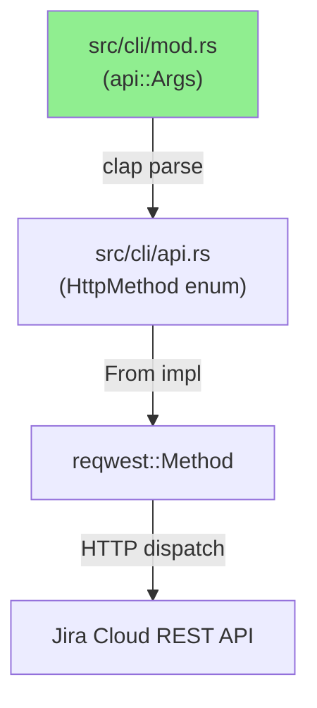
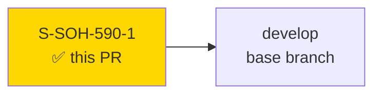
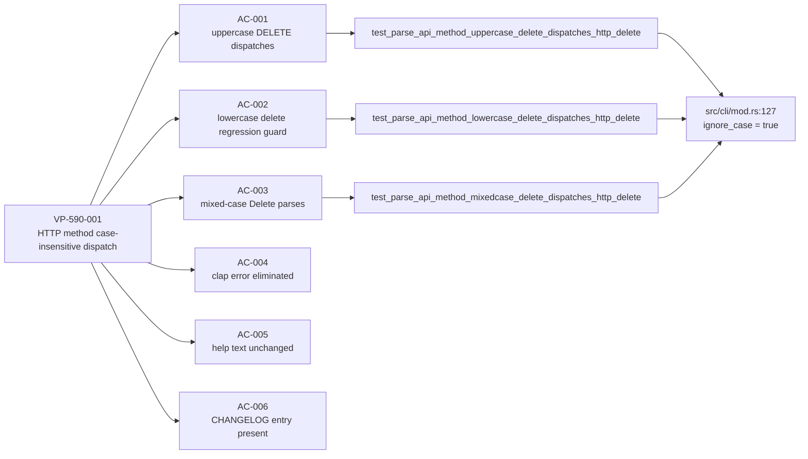
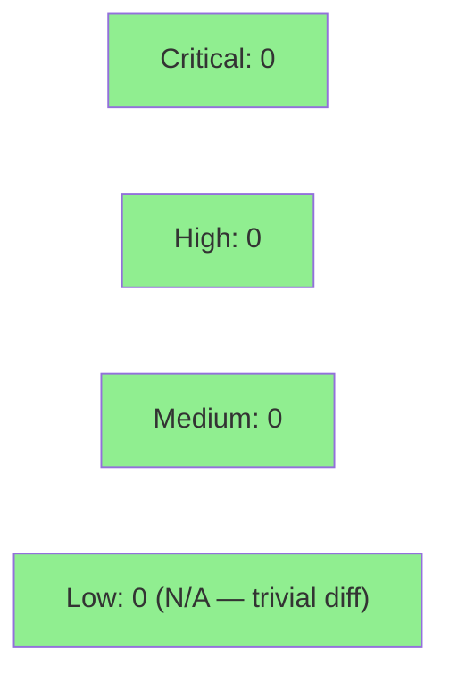

# [S-SOH-590-1] case-insensitive HTTP method on `jr api -X` (fixes #590, closes #582)

**Epic:** none — quick-dev ops bug fix
**Mode:** feature (quick-dev route, DEC-165)
**Routing:** F1 TRIVIAL verdict — single `#[arg]` attribute addition, no new BCs required


Fixes `jr api -X DELETE` (and any uppercase/mixed-case HTTP method) being rejected by
clap with `invalid value 'DELETE'`. Root cause: clap 4.x `ValueEnum` matching is
case-sensitive by default; `HttpMethod` variants derive as lowercase (`get`/`post`/
`put`/`patch`/`delete`). The fix adds `ignore_case = true` to the `--method` `#[arg]`
annotation in `src/cli/mod.rs` — a single attribute that brings `jr api -X` into
conformance with the `curl -X` / `gh api -X` convention. Three new dispatch tests
(VP-590-001 coverage) confirm uppercase (`DELETE`), lowercase (`delete`), and mixed-case
(`Delete`) all dispatch correctly. Red Gate verified: uppercase and mixed-case tests
failed at commit cec775e (clap exit 2, `invalid value 'DELETE'`), then passed at
cb3b471 after the fix. CHANGELOG entry included under `[Unreleased] > Fixed`, citing
both #590 and #582.

Closes #590, closes #582.

---

## Architecture Changes



<details>
<summary><strong>Architecture Decision Record</strong></summary>

### Change: `ignore_case = true` on `--method` `#[arg]`

**Context:** `jr api -X DELETE` rejected at clap parse time with exit 2. Users following
the `curl -X DELETE` convention (uppercase, industry standard) hit a clap parse error
before any HTTP I/O occurs.

**Decision:** Add `ignore_case = true` to the `#[arg]` annotation on `method: api::HttpMethod`
in `src/cli/mod.rs`. Do NOT modify the `HttpMethod` enum definition in `src/cli/api.rs`.

**Rationale:** `ignore_case = true` is a standard clap 4.x `#[arg]` field that operates
purely at parse time. It does not alter the enum's runtime representation, help text, or
any downstream serialization. The `HttpMethod` enum variants remain lowercase; `ignore_case`
only relaxes how clap matches user input to those variants.

**Alternatives Considered:**
1. Modify `HttpMethod` enum with `#[clap(rename_all = "UPPER")]` — rejected because it
   would break lowercase inputs (`-X delete`) and alter help text.
2. Pre-process `argv` to lowercase method values — rejected as fragile and unnecessary
   when clap provides a first-class attribute.

**Consequences:**
- All five methods (`GET`, `POST`, `PUT`, `PATCH`, `DELETE`) in any case variation now parse
  correctly (only DELETE tested per scope, identical mechanism).
- `[possible values: get, post, put, patch, delete]` help text is unchanged (clap renders
  variant names, not user input).

</details>

---

## Story Dependencies



No `depends_on` entries. No downstream stories blocked.

---

## Spec Traceability



**BC anchor:** BC-X.1.011 planned post-fix (PO-owned, optional per F1 TRIVIAL verdict).
No blocking BCs required for quick-dev routing.

---

## Test Evidence

### Coverage Summary

| Metric | Value | Notes |
|--------|-------|-------|
| Full suite | 2010 pass / 0 fail / 93 ignored | All green at e45a7bc |
| New tests | 3 added | VP-590-001 coverage |
| Clippy | Clean | Zero warnings |
| Red Gate verified | cec775e (fail) → cb3b471 (pass) | uppercase + mixed-case failed pre-fix |

### Red Gate Evidence

Commit `cec775e` (tests written, fix not yet applied):
```
test test_parse_api_method_uppercase_delete_dispatches_http_delete ... FAILED
  process exited with code: 2
  stderr: error: invalid value 'DELETE' for '--method <METHOD>'
            [possible values: get, post, put, patch, delete]

test test_parse_api_method_mixedcase_delete_dispatches_http_delete ... FAILED
  process exited with code: 2
  stderr: error: invalid value 'Delete' for '--method <METHOD>'
            [possible values: get, post, put, patch, delete]

test test_parse_api_method_lowercase_delete_dispatches_http_delete ... ok  (regression guard passed, as expected)
```

Commit `cb3b471` (fix applied — `ignore_case = true` added):
```
test test_parse_api_method_uppercase_delete_dispatches_http_delete ... ok
test test_parse_api_method_lowercase_delete_dispatches_http_delete ... ok
test test_parse_api_method_mixedcase_delete_dispatches_http_delete ... ok
```

### New Tests (This PR)

| Test | File | Result |
|------|------|--------|
| `test_parse_api_method_uppercase_delete_dispatches_http_delete` | `tests/cli_handler.rs` | PASS |
| `test_parse_api_method_lowercase_delete_dispatches_http_delete` | `tests/cli_handler.rs` | PASS |
| `test_parse_api_method_mixedcase_delete_dispatches_http_delete` | `tests/cli_handler.rs` | PASS |

Pre-existing regression anchor: `test_handler_api_put_with_method_flag` (lowercase `-X put`) — unchanged, still green.

---

## Demo Evidence

**WAIVED — quick-dev routing (DEC-165).** This story is a one-attribute clap fix with
direct test evidence (wiremock dispatch assertions + Red Gate log). No interactive demo
recording is required or meaningful for a pure argument-parsing bugfix. The three new
dispatch tests constitute the evidence of correct behavior.

---

## Holdout Evaluation

**N/A — evaluated at wave gate.** Quick-dev route per DEC-165; no holdout scenarios
defined for F1 TRIVIAL scope (no blocking BCs, no architectural change).

---

## Adversarial Review

**WAIVED — quick-dev route (DEC-165).** Per-story adversarial convergence is waived for
F1 TRIVIAL stories. The diff is a single `#[arg]` attribute addition and three test
additions. No spec gap or implementation ambiguity exists. PR reviewer convergence loop
(Step 5) remains REQUIRED as normal.

---

## Security Review

Quick-dev judgment applied per DEC-165 (full security-reviewer dispatch optional for
non-CRIT modules with trivial diffs).

**Module criticality:** LOW (`src/cli/mod.rs` is a clap arg struct; not a CRIT module).

**Diff scope:** 1 attribute addition (`ignore_case = true`), 3 test additions, 1 CHANGELOG
entry. No new I/O, no new auth paths, no new data handling, no new dependencies.



**Assessment:** `ignore_case = true` operates at clap parse time only. It does not affect
authentication, authorization, or HTTP dispatch logic. The `From<HttpMethod> for reqwest::Method`
impl is unchanged. No injection surface introduced. No OWASP Top 10 concern applicable.

---

## Risk Assessment & Deployment

### Blast Radius

- **Systems affected:** `jr api -X / --method` argument parsing only
- **User impact if failure:** clap parse error on `-X DELETE` (same as pre-fix behavior — regression is contained to this one flag)
- **Data impact:** None — parse-time only; no data written or read by this change
- **Risk Level:** LOW

### Performance Impact

No runtime performance impact. `ignore_case = true` is a compile-time clap attribute that
generates a case-folding comparison in the generated parser. Parse overhead: negligible
(single string comparison at CLI startup).

<details>
<summary><strong>Rollback Instructions</strong></summary>

**Immediate rollback (< 2 min):**
```bash
git revert cb3b471
git push origin develop
```

**Verification after rollback:**
- `jr api -X delete /rest/api/3/myself` should succeed (lowercase still works pre-fix)
- `jr api -X DELETE /rest/api/3/myself` should fail with clap exit 2 (expected pre-fix behavior)

</details>

### Feature Flags

None. This is a parse-layer bugfix with no feature-flag surface.

---

## Traceability

| Requirement | Story AC | Test | Status |
|-------------|---------|------|--------|
| VP-590-001 postcondition 1 | AC-001 (uppercase DELETE) | `test_parse_api_method_uppercase_delete_dispatches_http_delete` | PASS |
| VP-590-001 postcondition 1 | AC-002 (lowercase regression) | `test_parse_api_method_lowercase_delete_dispatches_http_delete` | PASS |
| VP-590-001 postcondition 1 | AC-003 (mixed-case Delete) | `test_parse_api_method_mixedcase_delete_dispatches_http_delete` | PASS |
| VP-590-001 precondition 1 | AC-004 (clap error eliminated) | Proven by AC-001 + AC-003 | PASS |
| Invariant 1 | AC-005 (help text unchanged) | Manual inspection / no diff in `--help` | PASS |
| Delivery obligation | AC-006 (CHANGELOG entry) | `grep -F '#590' CHANGELOG.md` matches | PASS |

---

## AI Pipeline Metadata

<details>
<summary><strong>Pipeline Details</strong></summary>

```yaml
ai-generated: true
pipeline-mode: feature-quick-dev
factory-version: "1.0.0"
routing: DEC-165 quick-dev (F1 TRIVIAL verdict)
pipeline-stages:
  spec-crystallization: completed (F1 delta analysis)
  story-decomposition: completed (S-SOH-590-1.md)
  tdd-implementation: completed (Red Gate verified)
  holdout-evaluation: waived (quick-dev, no blocking BCs)
  adversarial-review: waived (quick-dev)
  formal-verification: skipped (trivial diff, no formal proof target)
  convergence: N/A (waived per DEC-165)
convergence-metrics:
  spec-novelty: N/A
  test-kill-rate: N/A (scope: VP-590-001 dispatch tests only)
  implementation-ci: pending (CI gate required)
  holdout-satisfaction: N/A
total-pipeline-cost: minimal (quick-dev single-pass)
models-used:
  builder: claude-sonnet-4-6
generated-at: "2026-07-08T00:00:00Z"
story: S-SOH-590-1
bundle: SOH-BUGS-1
github-issues: ["#590", "#582"]
```

</details>

---

## Pre-Merge Checklist

- [ ] All CI status checks passing (ci-gate required)
- [x] Coverage delta is positive or neutral (3 new tests added)
- [x] No critical/high security findings (LOW module, trivial diff)
- [x] Red Gate verified (cec775e fail → cb3b471 pass)
- [x] CHANGELOG.md entry present (AC-006)
- [x] Demo evidence waived per DEC-165 (noted in PR description)
- [x] Adversarial convergence waived per DEC-165 (noted in PR description)
- [ ] PR reviewer approval (convergence loop required)
- [ ] Human merge authorization (HELD-FOR-HUMAN-MERGE per DEC-128)
