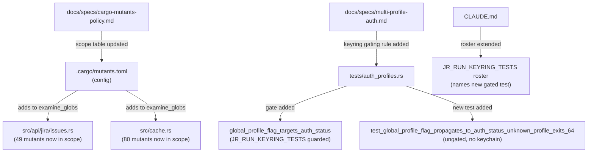
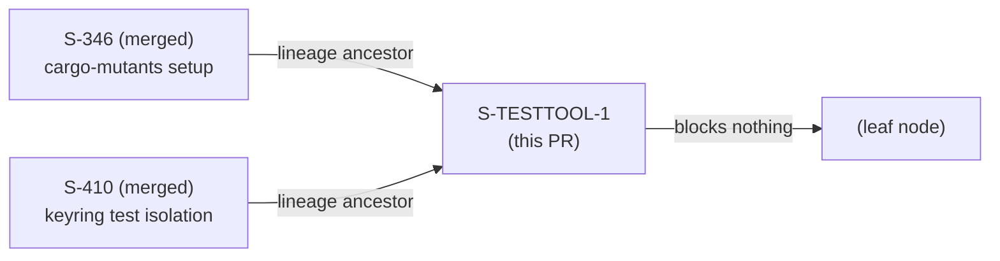
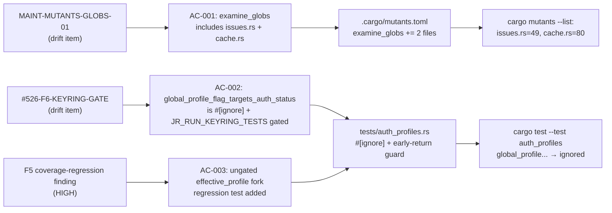

## Summary

Test-tooling hardening cycle for story S-TESTTOOL-1 (VSDD Feature Mode F1–F7). Resolves two tracked drift items. **Test/config/docs only — NO production `src/` code changes.**

- **MAINT-MUTANTS-GLOBS-01:** Add `src/api/jira/issues.rs` + `src/cache.rs` to `.cargo/mutants.toml` `examine_globs`, closing the full-baseline mutation blind spot on the two highest-risk pagination/cache files (issues.rs=49 mutants, cache.rs=80 mutants now in scope).
- **#526-F6-KEYRING-GATE:** Gate `tests/auth_profiles.rs::global_profile_flag_targets_auth_status` behind `JR_RUN_KEYRING_TESTS` + `#[ignore]` to prevent keychain contention hangs in CI. Adds a new ungated substitute test `test_global_profile_flag_propagates_to_auth_status_unknown_profile_exits_64` that preserves default-CI coverage of the global `--profile`→auth-subcommand propagation path without touching the keychain.
- **Doc updates:** CLAUDE.md keyring roster; `docs/specs/cargo-mutants-policy.md` (scope + sibling table); `docs/specs/multi-profile-auth.md` (keyring gating rule + roster).

## Architecture Changes

No production `src/` code was modified. All changes are test harness scheduling, mutation-testing configuration, and documentation.

## Story Dependencies

S-TESTTOOL-1 depends on no other open stories. S-346 and S-410 are merged lineage ancestors.

## Spec Traceability

## Test Evidence

| Metric | Result |
|--------|--------|
| Full regression (`cargo test --all-features`) | 1855 passed, 0 failed, 92 ignored |
| `cargo clippy -D warnings` | PASS (exit 0, zero warnings) |
| `cargo fmt --check` | PASS (exit 0) |
| `cargo deny check` | PASS (advisories/bans/licenses/sources ok) |
| Mutation `--in-diff` | 0 mutants (correct — diff touches no `examine_globs` source) |
| AC-001 baseline scope proof | issues.rs=49 mutants, cache.rs=80 mutants now listed |
| AC-002 gate verification | `global_profile_flag_targets_auth_status` → ignored under plain `cargo test` |
| AC-003 ungated test | `test_global_profile_flag_propagates_to_auth_status_unknown_profile_exits_64` → ok |
| `grep -c '#\[ignore' tests/auth_profiles.rs` | 3 (2 pre-existing + 1 newly gated) |

## Demo Evidence

**N/A — adapted/skipped with justification.**

This story is a CI-configuration / test-only / docs-only change with no user-visible runtime behavior. There is no user-facing feature, CLI command, or output format to record. This falls into the same "Skip Log" class as S-WIN-1..6, S-CIGATE-1, S-346, and S-410 — all infrastructure/tooling stories that produce no observable UI or CLI artifact suitable for demo recording.

The acceptance criteria are verified mechanically by `cargo test`, `cargo mutants --list`, and `grep` count commands documented in the Test Evidence section above.

## Holdout Evaluation

N/A — evaluated at wave gate. No behavioral contracts (bc_anchors: []) — this story has no product-observable postconditions to evaluate against holdout scenarios.

## Adversarial Review

F5 adversarial review: CONVERGED. Material findings decayed to zero over 6 rounds.

Summary of F5 findings addressed prior to this PR:
- **I-1 (HIGH, round 1):** Guard form corrected from `as_deref() != Ok("1")` to `is_err()` to match sibling convention — RESOLVED.
- **C-1 (round 2):** F2 spec deltas (cargo-mutants scope table + keyring gating roster) — RESOLVED.
- **O-3 (round 3):** Added `list_comments` to issues.rs glob rationale in mutants.toml comment — RESOLVED.
- **F5 round 4:** Exhaustive `#[tokio::test]`→`#[test]` sweep in AC-002/Item-2/EC-003 — RESOLVED.
- **F5 round 5:** Propagated `list_comments` rationale to AC-001 + F1; full four-surface rationale-wording reconciliation — RESOLVED.
- **F5 round 6:** Corrected AC-003 guard attribution to `Config::load_with` — RESOLVED.
- **F5 round 7 (final polish):** F1 body status line propagated; bare line citations → symbol-form per #408 — RESOLVED.

F7 consistency audit: CONVERGED. No open findings.

## Security Review

**No security findings.** This is a test/config/docs-only delta.

- No new `unsafe` code. No `src/` files changed at all.
- No new dependencies (`Cargo.toml`/`Cargo.lock` unchanged).
- No credential or secret material. Test uses placeholder URLs only (`https://default.example`, `https://sandbox.example`, profile name `ghost`) — consistent with the no-real-data policy.
- `cargo deny` advisories check: clean.

## Risk Assessment

| Dimension | Assessment |
|-----------|------------|
| Blast radius | Minimal — test harness scheduling only; no production code |
| Performance impact | None — no runtime code path changes |
| Breaking changes | None |
| Rollback | Trivially safe — revert adds back the ungated test and removes the glob entries |
| CI impact | The `mutants` CI job runs `--in-diff` only; new examine_globs entries have zero CI impact on PRs not touching those files |

## AI Pipeline Metadata

| Field | Value |
|-------|-------|
| Pipeline mode | Feature Mode (F1–F7) |
| Story | S-TESTTOOL-1 |
| Wave | feature-followup |
| Scope | xsmall (2 SP) |
| Drift items resolved | MAINT-MUTANTS-GLOBS-01, #526-F6-KEYRING-GATE |
| F5 adversarial rounds | 7 (converged) |
| F6 hardening | PASS (all applicable gates) |
| F7 consistency audit | CONVERGED |

## Pre-Merge Checklist

- [x] PR description matches actual diff (test/config/docs only, 5 files, +111/-4)
- [x] All ACs verified: AC-001 (mutants list), AC-002 (ignore count=3), AC-003 (ungated test passes)
- [x] No production `src/` code changes
- [x] Full regression: 1855 passed, 0 failed
- [x] Clippy clean, fmt clean, deny clean
- [x] Mutation `--in-diff`: 0 mutants (correct no-op)
- [x] Security review: no findings
- [x] Demo evidence: N/A (justified — CI/test/docs story class)
- [x] Dependency PRs: none (leaf node, depends_on: [])
- [x] F5 adversarial: converged (7 rounds)
- [x] F7 consistency: CONVERGED
- [x] Branch: `chore/s-testtool-1-test-tooling-hardening` → base: `develop`
