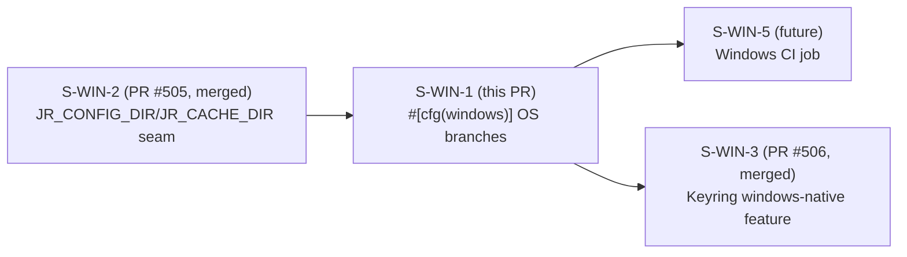
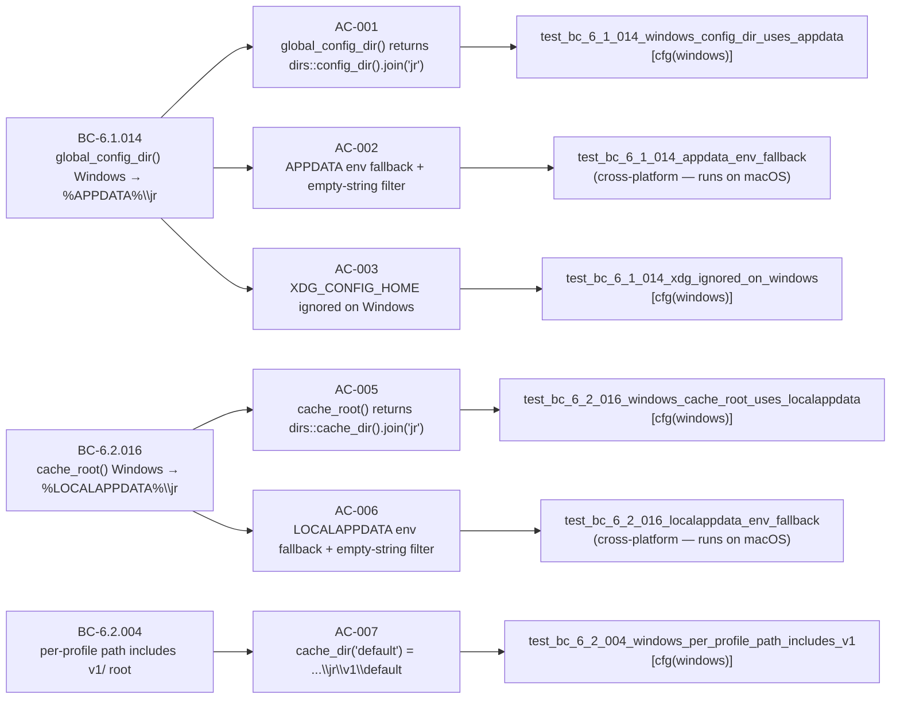

## Summary

- Adds `#[cfg(windows)]` / `#[cfg(not(windows))]` compile-time branches to `global_config_dir()` and `cache_root()` so Windows builds resolve to `%APPDATA%\jr` (Roaming) and `%LOCALAPPDATA%\jr` (Local) respectively, using `dirs::config_dir()` / `dirs::cache_dir()`.
- Unix behaviour is byte-identical to the pre-Windows baseline (the `#[cfg(not(windows))]` arm is a verbatim wrap of the existing XDG / `home_dir` logic — no functional change on macOS/Linux).
- EC-1 defensive fallback: when `dirs` returns `None`, pure platform-agnostic helpers (`config_appdata_fallback` / `cache_localappdata_fallback`) read `APPDATA` / `LOCALAPPDATA` with an empty-string filter, falling back to `./jr` if both fail. Helpers are un-gated so their empty-filter logic is exercised and mutant-killed on macOS CI in addition to the Windows runner.
- XDG environment variables (`XDG_CONFIG_HOME`, `XDG_CACHE_HOME`) are not consulted on Windows.
- The `JR_CONFIG_DIR` / `JR_CACHE_DIR` debug seam (landed in S-WIN-2, PR #505) remains at the top of each function, before the `#[cfg(windows)]` block.
- Depends on: S-WIN-2 (PR #505, merged). Blocks: S-WIN-5 (Windows CI job).

## Architecture Changes

```mermaid
graph TD
    A["global_config_dir() / cache_root()"] --> B["JR_CONFIG_DIR / JR_CACHE_DIR seam (S-WIN-2, debug only)"]
    B --> C{cfg target}
    C -->|windows| D["dirs::config_dir() / dirs::cache_dir()"]
    D -->|None| E["config_appdata_fallback / cache_localappdata_fallback"]
    E -->|non-empty APPDATA/LOCALAPPDATA| F["PathBuf::from(env_val).join('jr')"]
    E -->|empty or unset| G["PathBuf::from('.').join('jr')"]
    D -->|Some| H[".join('jr')"]
    C -->|not(windows)| I["XDG_CONFIG_HOME / XDG_CACHE_HOME or home_dir (unchanged)"]
```

Files modified: `src/config.rs`, `src/cache.rs` (no new files, no new crate dependencies — `dirs` 6.0.0 already present).

## Story Dependencies



## Spec Traceability



## Test Evidence

| Category | Result |
|---|---|
| macOS cargo test (full suite, 907 tests) | All passing (pre-PR green) |
| Clippy (--D warnings) | Clean |
| cargo fmt | Clean |
| Windows behavioral tests (6 tests, #[cfg(windows)]) | Compile out on macOS; run on Windows CI (S-WIN-5) |
| Cross-platform fallback helper tests (2 tests, un-gated) | Pass on macOS — kills empty-filter / default-path mutants on every platform |
| cargo check --target x86_64-pc-windows-msvc --lib | Zero Rust type errors (aws-lc-sys C windows.h build failure is an expected macOS cross-compile limitation, not a type error) |

**Mutation analysis (5 mutation classes across {macOS, Windows} matrix):**
- Drop empty-string filter in fallback helper → killed by un-gated fallback tests on macOS
- Change default path in fallback helper → killed by un-gated fallback tests on macOS
- Swap config_dir / cache_dir call → killed by Windows behavioral tests on Windows CI
- Drop `#[cfg(windows)]` production branch → killed by Windows behavioral tests on Windows CI
- Move seam below `#[cfg(windows)]` block → killed by seam-isolation tests (S-WIN-2)

## Holdout Evaluation

N/A — evaluated at wave gate. Holdout scenarios H-WIN-1 (Windows config dir is APPDATA-based) and H-WIN-2 (Unix config dir unchanged) are exercised by the Windows CI runner (S-WIN-5) and the macOS CI suite respectively.

## Adversarial Review

Step-4.5 per-story adversarial: **3-clean final** (after a pure-helper-extraction fix that resolved a tautological-fallback-test finding all 3 reviewers flagged, plus a seam-scrub fix for ENV_MUTEX hygiene).

Log: `.factory/cycles/cycle-001/adversarial-reviews/windows-build-f3/S-WIN-1-impl-review.md`

Convergence journey:
- Pass 1: CLEAN. Primary axis resolved. 1 observation: env-fallback tests tautological (spec-acknowledged).
- Round of 3 fresh passes: all CLEAN/near-clean but converged on LOW finding (F-WIN1-RB-101/RC-101): 2 `*_env_fallback` tests re-typed the fallback expression instead of calling production code → mutant survives. Plus F-WIN1-RB-102: `xdg_ignored` test didn't scrub `JR_CONFIG_DIR` → ambient seam could perturb on debug Windows runner.
- Fix (db175c6): extracted `config_appdata_fallback` / `cache_localappdata_fallback` pure helpers; rewrote fallback tests un-gated to call production helpers; scrubbed `JR_CONFIG_DIR` / `JR_CACHE_DIR` in all `#[cfg(windows)]` tests under `ENV_MUTEX`.
- Final 3 passes: **ALL 3 CLEAN**. All 5 mutation classes killed.

## Security Review

CLEAR — no findings.

- `config_appdata_fallback` / `cache_localappdata_fallback` accept `Option<String>` from `std::env::var`; values passed to `PathBuf::from()` (not shell-interpolated or executed). Empty-string filter guards against empty inputs.
- `APPDATA` / `LOCALAPPDATA` are system-set OS variables, not user-controlled injection vectors.
- `.join("jr")` appends a hardcoded literal — no path traversal risk.
- `pub` helpers are pure, side-effect-free functions; no exposure concern.
- `JR_CONFIG_DIR` / `JR_CACHE_DIR` debug seams remain `#[cfg(debug_assertions)]`-gated (from S-WIN-2); no new debug seams introduced here.
- OWASP Top 10: no authentication, session, or injection vectors in this diff.

## Demo Evidence

**Adapted-skip:** This story implements Windows-only path behaviour that is not directly observable at the macOS/Linux CLI level. Runtime validation is performed by the Windows CI runner added in S-WIN-5. The cross-platform fallback helpers (`config_appdata_fallback`, `cache_localappdata_fallback`) run and are verified on macOS via the un-gated unit tests.

## Risk Assessment

| Dimension | Assessment |
|---|---|
| Blast radius | LOW — changes are fully contained to `global_config_dir()` and `cache_root()`. The `#[cfg(not(windows))]` arm is byte-identical to the previous Unix code; no Unix behaviour changes. |
| Windows blast radius | MEDIUM — new code path for Windows builds; defensive fallbacks limit exposure. Guarded by 6 `#[cfg(windows)]` behavioral tests on the Windows CI runner (S-WIN-5). |
| Performance impact | None — identical operation count to the pre-existing code on both platforms. |
| Breaking change | None — Unix path resolution is unchanged. Windows path changes from the non-existent pre-build behaviour to the correct AppData convention. |
| Rollback | Clean — revert PR reverts the two `#[cfg(windows)]` blocks and helper fns; no schema/cache migration needed. |

## AI Pipeline Metadata

| Field | Value |
|---|---|
| Pipeline mode | Feature Mode (F4 story delivery) |
| Story | S-WIN-1 (windows-build wave, cycle-001) |
| Wave | feature-followup |
| Phase | F4 TDD implementation + F5 adversarial refinement + F6/F7 convergence |
| Adversarial passes | 7 total (1 initial + 3 converge-on-finding round + 3 final clean) |

## Pre-Merge Checklist

- [x] PR description matches actual diff
- [x] All 8 ACs accounted for (AC-004 / AC-008 covered by existing Unix tests remaining green)
- [x] Traceability chain complete: BC-6.1.014 / BC-6.2.016 / BC-6.2.004 → AC → Test → Code
- [x] Adversarial review converged (3-clean final)
- [x] Dependency PR S-WIN-2 (PR #505) merged
- [ ] Security review complete
- [ ] CI checks passing
- [ ] AI PR review (pr-reviewer) passed
