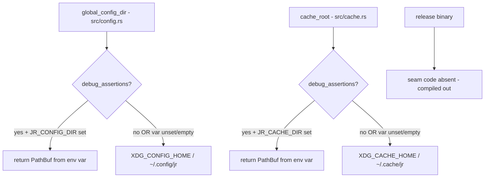
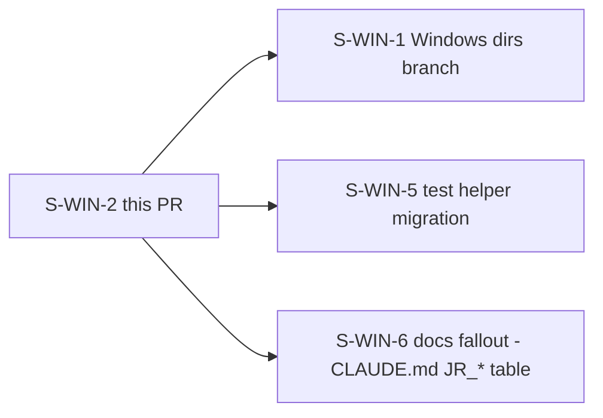
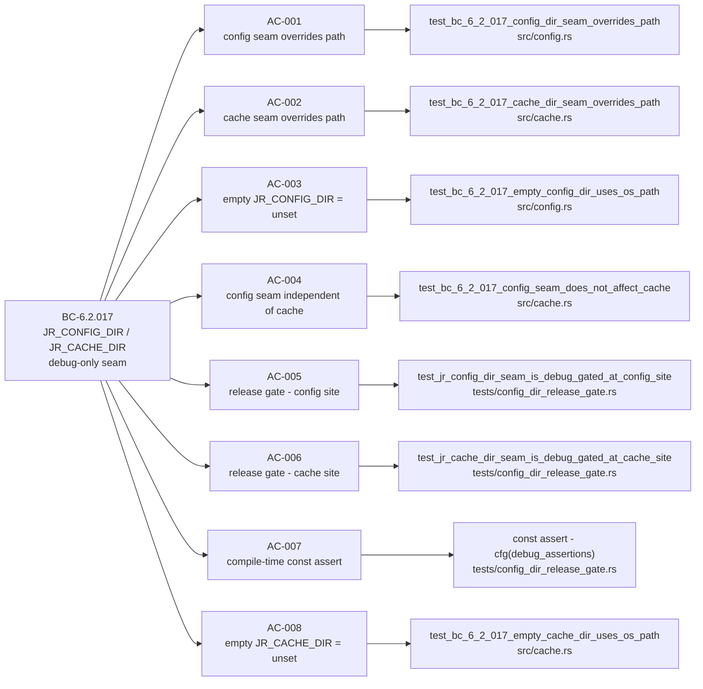

## Summary

Adds a **debug-only** path-isolation seam for config and cache directories:
- `JR_CONFIG_DIR` overrides `global_config_dir()` in `src/config.rs` (gated `#[cfg(debug_assertions)]`)
- `JR_CACHE_DIR` overrides `cache_root()` in `src/cache.rs` (gated `#[cfg(debug_assertions)]`)
- Both seams are compiled **out** in release builds (same security class as `JR_BASE_URL` / SD-002)
- New integration test file `tests/config_dir_release_gate.rs` provides dual-site source-adjacency assertions (AC-005/006) and a compile-time gate check (AC-007)

This is a **prerequisite** for S-WIN-1 (Windows `dirs` path support) and S-WIN-5 (per-test isolation helper migration). It enables hermetic config/cache isolation in integration tests on all platforms — especially Windows, where `XDG_CONFIG_HOME` is ignored by the `dirs` crate.

---

## Architecture Changes

**Blast radius:** Narrow — two function preambles (`global_config_dir`, `cache_root`), no behaviour change in release builds or when the vars are unset. One new test file.

**Performance impact:** None — a single `std::env::var` call at the top of each function, compiled out in release binaries entirely.

---

## Story Dependencies

**Upstream:** None — `S-WIN-2` has `depends_on: []`; this is the first story in the Windows-build cycle.

---

## Spec Traceability

---

## Test Evidence

- **7 new tests** pinning AC-001 through AC-008 (AC-007 is a compile-time `const { assert!(cfg!(debug_assertions)); }` — not a runtime test function)
- **Full `cargo test` result:** GREEN — 905 lib tests + all integration suites, 0 failures
- **Clippy:** `cargo clippy --all --all-features --tests -D warnings` CLEAN
- **Fmt:** `cargo fmt --all -- --check` CLEAN
- **Test isolation:** All env-var tests use `ENV_MUTEX` + `with_env_var` catch_unwind helper (mirrors `with_temp_cache` pattern). The helper unconditionally removes the var even on panic, preventing env leakage into parallel tests (F-WIN2-C-102, fixed commit b958e60).

---

## Holdout Evaluation

N/A — evaluated at wave gate. No per-story holdout scenarios require separate evaluation here beyond the ACs already covered.

---

## Adversarial Review

**5 fresh-context passes CLEAN** (log: `.factory/cycles/cycle-001/adversarial-reviews/windows-build-f3/S-WIN-2-impl-review.md`):

| Pass | Outcome | Findings |
|------|---------|----------|
| Pass 1 (general) | CLEAN | F-101 LOW: BC-vs-story const wording (no action taken); F-102 LOW: misleading test comment → fixed commit `be6ecbc` |
| Verify A (general) | CLEAN | 0 findings |
| Verify B (security/mutation) | CLEAN | All 6 proposed mutations KILLED: drop `cfg` at config site, drop `cfg` at cache site, drop empty-filter at config site, drop empty-filter at cache site, add `.join("jr")`, swap var name, move seam below OS branch |
| Verify C (regression/integration) | 2 findings | F-WIN2-C-101 MEDIUM DEFERRED → S-WIN-5 (see below); F-WIN2-C-102 LOW within-story → FIXED commit `b958e60` (catch_unwind hardening) |
| Verify D + E (post-fix) | CLEAN | 0 findings; `with_env_var` soundness verified |

**Verdict: CONVERGED.** Security gate verified — only 2 read sites in `src/`, both compile-time-gated; release-gate test is non-tautological.

---

## Security Review

Threat model: both `JR_CONFIG_DIR` and `JR_CACHE_DIR` are path-injection vectors in release builds (attacker-controlled env var → redirected config load → token leakage to attacker-controlled host). Gate mechanism: `#[cfg(debug_assertions)]` (compile-time elimination — identical to `JR_BASE_URL` / SD-002 pattern). Dual-site source-adjacency regression gate (`tests/config_dir_release_gate.rs`) prevents silent regression if either gate is removed.

- OWASP A01 (Broken Access Control): N/A — the seam is debug-only; release binary has no attack surface
- OWASP A03 (Injection): Mitigated — seam compiled out in release; value consumed AS-IS without shell expansion or canonicalization (deliberate; test paths like `/tmp/...` need no normalization)
- Input validation: empty-string filter (`.filter(|s| !s.is_empty())`) prevents empty PathBuf from reaching filesystem calls

No CRITICAL or HIGH findings.

---

## Risk Assessment

| Dimension | Assessment |
|-----------|-----------|
| Blast radius | Minimal — 2 function preambles, release builds unaffected |
| Rollback | Trivial — revert 3 commits, no data migration |
| Performance | None — code absent in release binary |
| Compatibility | No breaking change; existing behaviour unchanged when vars unset or in release |
| Windows compatibility | Seam is platform-agnostic; `PathBuf::from(dir)` works on all OSes |

---

## Deferred Items (not blockers for this PR)

**F-WIN2-C-101 → S-WIN-5 (MEDIUM, intentionally scoped out):**
Integration-test env-var scrub lists (`with_jira_client`, `jr_cmd_with_xdg`, etc.) do not yet include `JR_CONFIG_DIR` / `JR_CACHE_DIR` in their `env_remove` lists. This is a latent isolation-shadow vector where a test that leaks these vars could affect a subsequent integration test's config/cache path. **CI risk is nil** — CI never sets these vars. The fix belongs in S-WIN-5, which migrates the test helpers to use the seam for hermetic isolation. A reviewer should NOT treat this as a blocker here.

**CLAUDE.md JR_* table doc-fallout → S-WIN-6 (LOW, intentionally scoped out):**
Per CLAUDE.md convention ("When adding a new JR_* test-seam env var: grep CLAUDE.md for existing JR_* entries and add a parallel line in the SAME commit"), the `JR_CONFIG_DIR` and `JR_CACHE_DIR` entries belong in the CLAUDE.md JR_* table. This doc update is deliberately delegated to S-WIN-6 (docs-fallout story). A reviewer should NOT flag this as a blocker here.

---

## AI Pipeline Metadata

| Field | Value |
|-------|-------|
| Pipeline mode | Feature Mode (F3 incremental stories → F4 delta implementation) |
| Story | S-WIN-2 |
| Wave | Windows-build feature followup |
| ADR | ADR-0016 (Windows build target) |
| BC anchor | BC-6.2.017 |
| Adversarial convergence | 5 passes, CONVERGED |
| Commits | 7ddfab4 (seam+tests), be6ecbc (comment fix F-102), b958e60 (catch_unwind hardening) |

---

## Pre-Merge Checklist

- [x] PR description populated with full traceability
- [x] All 7 tests (AC-001..008) passing — cargo test GREEN
- [x] Clippy clean (--all --all-features --tests -D warnings)
- [x] Fmt clean
- [x] Adversarial review: CONVERGED (5 passes)
- [x] Security: no CRITICAL/HIGH findings; dual-site gate verified
- [x] Deferred items documented (F-WIN2-C-101 → S-WIN-5; CLAUDE.md → S-WIN-6)
- [ ] CI checks passing (pending push)
- [ ] AI PR review dispatched
- [ ] Human review and merge decision
