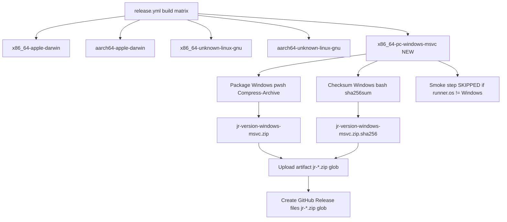
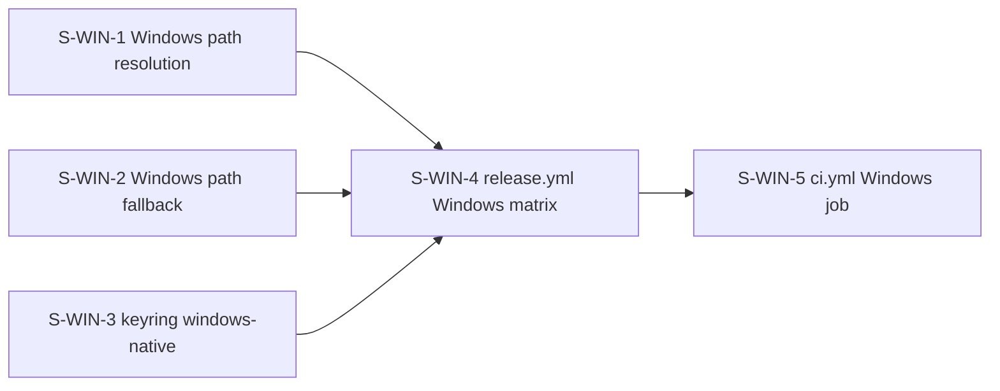
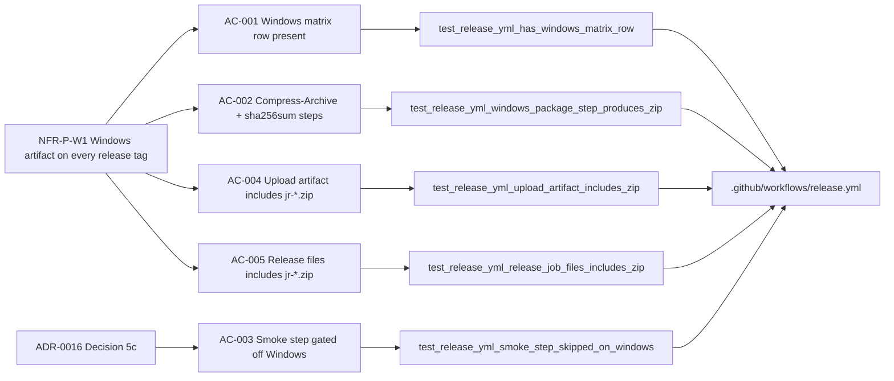

## Summary

Adds `x86_64-pc-windows-msvc` to the `release.yml` build matrix so every tagged release produces a pre-built `jr-<version>-x86_64-pc-windows-msvc.zip` with a `.sha256` checksum on the GitHub Releases page (NFR-P-W1). YAML-only change — no `src/` modifications.

**Key design decisions (ADR-0016 / C-V3 research):**
- `Package (Windows)` step uses `shell: pwsh` + `Compress-Archive` — Unix `zip` is NOT on `windows-latest` PATH (C-V3 BLOCKER)
- `Checksum (Windows)` is a separate `shell: bash` step using `sha256sum` (confirmed available via Git for Windows coreutils)
- Smoke step (`Verify embedded OAuth app present`) gated `if: runner.os != 'Windows'` per ADR-0016 §Decision 5c
- `shell: bash` added to all existing `run:` steps (no-op on Unix; required for Git Bash on Windows)
- `jr-*.zip` added to upload-artifact `path:` block and release-job `files:` block

## Architecture Changes

**Files modified:** `.github/workflows/release.yml` only. No `src/` changes.

**Change sites in `release.yml`:**
1. `strategy.matrix.include` — new Windows row added
2. All `run:` steps in `build` job — `shell: bash` added (no-op on Unix)
3. Existing `Package` step renamed to `Package (Unix)` + `if: runner.os != 'Windows'`
4. New `Package (Windows)` step (`shell: pwsh`, `Compress-Archive`)
5. New `Checksum (Windows)` step (`shell: bash`, `sha256sum`)
6. `Verify embedded OAuth app present` — `if: runner.os != 'Windows'` added
7. `Upload artifact` `path:` block — `jr-*.zip` added
8. `Create GitHub Release` `files:` block — `jr-*.zip` added

## Story Dependencies

**Dependency note:** S-WIN-3 (merged in PR #506) is a prerequisite for a fully functional Windows binary. This PR can merge independently; H-WIN-6 (live release-tag verification) is the correctness gate.

## Spec Traceability

## Test Evidence

**Test file:** `tests/release_yml_windows_matrix.rs` (new, 5 source-text assertion tests)

| Test | AC | Anchoring | Result |
|------|----|-----------|--------|
| `test_release_yml_has_windows_matrix_row` | AC-001 | whole-file unique token (`x86_64-pc-windows-msvc`) | PASS |
| `test_release_yml_windows_package_step_produces_zip` | AC-002 | `step_block("Package (Windows)")` → next `- name:` boundary | PASS |
| `test_release_yml_smoke_step_skipped_on_windows` | AC-003 | `step_block("Verify embedded OAuth app present")` | PASS |
| `test_release_yml_upload_artifact_includes_zip` | AC-004 | `step_block("Upload artifact")` | PASS |
| `test_release_yml_release_job_files_includes_zip` | AC-005 | `step_block("Create GitHub Release")` → EOF | PASS |

**`cargo test`:** green (full suite — unit + integration + snapshot + proptest)
**`cargo clippy -- -D warnings`:** zero warnings
**`cargo fmt --all -- --check`:** clean
**`actionlint`:** clean on `.github/workflows/release.yml`

**Test anchoring design:** Each test uses `step_block()` (a helper that slices from the step-name offset to the next `      - name:` boundary or EOF) rather than bare `yml.contains()`. This prevents a non-unique token in an adjacent step from satisfying the assertion — a false-green vector caught in Step 4.5 adversarial review (LESSON-PRESENCE-ANCHOR). AC-001 uses a whole-file search because `x86_64-pc-windows-msvc` is provably file-unique; this uniqueness is documented in the test rustdoc.

**Presence-only caveat (by design):** These tests verify YAML source text, not live execution. The sole correctness gate for the actual Windows artifact is **H-WIN-6** (human inspection of the GitHub Release page after a live version tag). This mirrors the limitation codified in S-WIN-5 AC-004 and is explicitly documented in both the story spec and test file module-level rustdoc.

## Holdout Evaluation

N/A — evaluated at wave gate.

**Named holdout scenarios:**
- **H-WIN-6:** After merging S-WIN-1/2/3/4, tag a release → GitHub Release page shows `jr-<version>-x86_64-pc-windows-msvc.zip` + `.sha256` alongside the four existing `.tar.gz` artifacts. (Human gate — cannot be automated without a live tag.)
- **H-WIN-7:** macOS/Linux `.tar.gz` + `.sha256` artifacts are unchanged in name and presence.

## Adversarial Review

Step 4.5 per-story adversarial review: **CONVERGED (3-clean final round)** after 3 rounds.

| Round | Findings | Severity | Resolution |
|-------|----------|----------|------------|
| 1 | F-WIN4-IMPL-101: AC-003 smoke-gate test used non-unique `runner.os != 'Windows'` — also on `Package (Unix)`, so smoke gate removal undetectable | LOW | Fixed (ebc5475): anchored to step name + window |
| 2A/B/C | F-001 (AC-004/005 both bare whole-file `contains("jr-*.zip")` — indistinguishable); F-002 (AC-002 claimed C-V3 negative but didn't assert it) | MEDIUM / LOW | Fixed (2150355): each anchored to its block; C-V3 negative assertion added |
| 3 | F-1 (rustdoc said "10 lines" but take(5)); F-2 (fixed 5-line window fragile to future `env:` insertion) | LOW cosmetic / LOW fragility | Fixed (3a4cdf0): `step_block` helper slicing to `- name:` boundary; wording corrected |
| Final (3 passes) | 0 findings | — | CLEAN |

**Lesson codified:** LESSON-PRESENCE-ANCHOR — source-text presence tests MUST anchor each assertion to its owning step block unless the token is provably file-unique.

Log: `.factory/cycles/cycle-001/adversarial-reviews/windows-build-f3/S-WIN-4-impl-review.md`

## Security Review

See review results below (populated after step 4 security scan).

YAML-only CI configuration change. Attack surface limited to:
- No new code paths in `src/`
- No new secrets introduced (existing `OAUTH_CLIENT_ID` / `OAUTH_CLIENT_SECRET` secrets, unchanged)
- No new third-party actions (existing pinned-SHA actions only)
- PowerShell `Compress-Archive` is a built-in cmdlet, no external download

## Risk Assessment

**Blast radius:** CI configuration only. No `src/` changes, no library changes, no user-facing behavior at runtime.

**Regression risk:** LOW. `shell: bash` on existing Unix `run:` steps is a no-op (bash is already effective on `ubuntu-latest` and `macos-latest`). The Unix `Package (Unix)` step gate (`if: runner.os != 'Windows'`) is a no-op for the four existing rows. Artifact glob additions are additive.

**Performance impact:** None at runtime. CI build time increases by ~5–10 minutes per tag push (one additional `windows-latest` build matrix row).

**Correctness gate dependency:** The live correctness gate (H-WIN-6) requires a real tag push. This is deferred to human verification after merge.

## AI Pipeline Metadata

| Field | Value |
|-------|-------|
| Story ID | S-WIN-4 |
| Wave | feature-followup (cycle-001 windows-build) |
| Mode | feature (F4 delta implementation) |
| Implementation branch | `feat/win-4-release-yml-windows` |
| Adversarial passes | 3 rounds, 3-clean final |
| Demo evidence | adapted-skip (CI-config infra; H-WIN-6 live gate) |
| Models | claude-sonnet-4-6 (implementer + adversarial reviewer) |
| Depends on | S-WIN-3 (PR #506, merged) |

## Pre-Merge Checklist

- [x] Story spec read and implementation matches (`S-WIN-4-release-yml-windows-target.md`)
- [x] ADR-0016 compliance verified (Decision 1, 2, 5c)
- [x] C-V3 research compliance verified (`Compress-Archive` not `zip`)
- [x] All 5 ACs addressed in tests
- [x] `cargo test` green (full suite)
- [x] `cargo clippy -- -D warnings` clean
- [x] `cargo fmt --all -- --check` clean
- [x] `actionlint` clean on release.yml
- [x] Step 4.5 adversarial review: 3-clean final
- [x] S-WIN-3 dependency merged (PR #506)
- [ ] CI checks passing on this PR
- [ ] PR reviewer approval
- [ ] H-WIN-6 human gate (post-merge, on next release tag)
