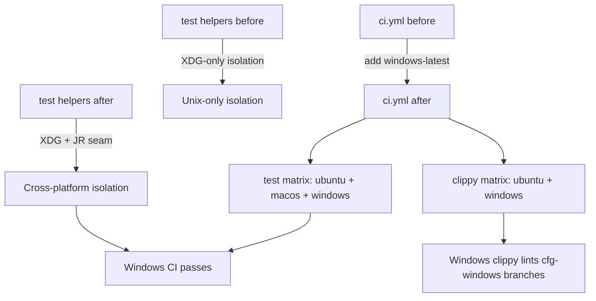
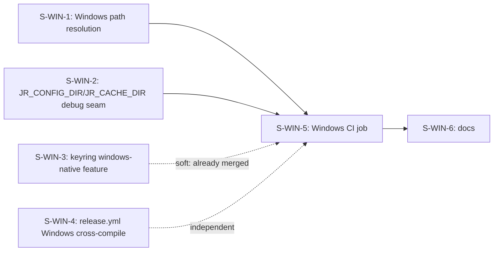
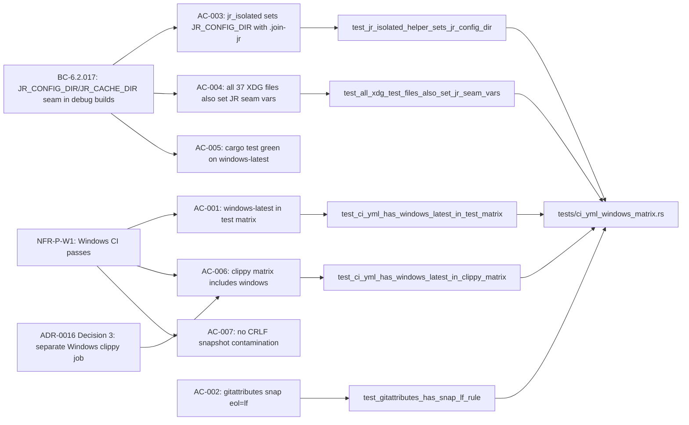

## Summary

This is the final story in the Windows-build cycle. It activates `windows-latest` in CI — the first time the entire test suite (including the `#[cfg(windows)]` code paths from S-WIN-1/2) runs on a real Windows runner.

**Three changes:**
1. `ci.yml` — adds `windows-latest` to the `test` matrix (`[ubuntu-latest, macos-latest, windows-latest]`) and converts the `clippy` job to a matrix over `[ubuntu-latest, windows-latest]` (ADR-0016 Decision 3 — Windows clippy is required to lint `#[cfg(windows)]` branches)
2. `.gitattributes` — adds `*.snap text eol=lf`, `*.yml text eol=lf`, `*.yaml text eol=lf` (R-W3 mitigation — prevents CRLF contamination of snapshot/YAML files from Windows committers)
3. Test helper seam migration — migrates 37 test helper files from `XDG_CONFIG_HOME`/`XDG_CACHE_HOME` isolation to the cross-platform `JR_CONFIG_DIR`/`JR_CACHE_DIR` debug seam (value = XDG.join("jr") per BC-6.2.017); closes F-WIN2-C-101 scrub-list; adds an AC-004 per-call-site guard test

## Architecture Changes

## Story Dependencies

S-WIN-1 and S-WIN-2 are hard dependencies (merged). S-WIN-5 is the integration gate that fires off the first real Windows CI run of the entire cycle.

## Spec Traceability

## Test Evidence

- **Unix suite**: 1793 tests, 0 failures (full `cargo test --all-features` on Ubuntu)
- **Cross-compile**: `cargo test --tests` against `x86_64-pc-windows-msvc` target, zero Rust errors
- **Clippy**: `cargo clippy --all --all-features --tests -- -D warnings` clean on Ubuntu
- **Format**: `cargo fmt --all -- --check` clean
- **New test file**: `tests/ci_yml_windows_matrix.rs` — 6 source-text grep assertions (AC-001 through AC-006 pinning)
- **Adversarial convergence**: 3-clean final after 4 fix rounds (see adversarial log)

AC-005 (Windows CI green) and AC-007 (snapshot eol) are integration gates satisfied by this PR's own Windows CI run.

## Holdout Evaluation

N/A — evaluated at wave gate (H-WIN-8 and H-WIN-9 are integration outcomes gated by this PR's Windows CI run).

## Adversarial Review

**Step-4.5 adversarial: CONVERGED (3-clean final after 4 fix rounds).**

Log: `.factory/cycles/cycle-001/adversarial-reviews/windows-build-f3/S-WIN-5-impl-review.md`

Each round caught a distinct Windows-failure class:
- **Round 1**: `multi_cloudid` config-seam half-migration (MEDIUM) — per-file `||` guard masked it; fixed + guard strengthened to per-var
- **Round A/B/C**: `worklog_duration_holdouts` in-process cache-seam half-migration (MEDIUM) — per-file guard still blind to in-process sites; fixed + guard strengthened to per-call-site count
- **Round 1/2/3**: `issue_create_jsm.rs` separator assertion `contains("/jr/v1/")` fails on Windows backslash (HIGH); fixed + separator sweep across all tests
- **Round final**: `ci_yml_windows_matrix.rs` CRLF issue — `.gitattributes` only covered `.snap` not `.yml`; YAML reads not CRLF-normalized; fixed (`f40c310`) + extended eol=lf to `*.yml`/`*.yaml` + grep→in-process fs walk

**LESSON-WIN-CI-CHECKLIST** codified as a durable artifact in the adversarial log.

## Security Review

No security-relevant changes. This PR modifies:
- CI workflow configuration (adds a runner target)
- `.gitattributes` (git line-ending policy)
- Test helper files (test isolation env vars — debug builds only, gated by `#[cfg(debug_assertions)]`)

The `JR_CONFIG_DIR`/`JR_CACHE_DIR` seam is already gated via `#[cfg(debug_assertions)]` (release builds ignore these vars). No new surface area for secrets, injection, or auth bypass. No production code changed.

## Risk Assessment

| Dimension | Assessment |
|-----------|-----------|
| Blast radius | LOW — no production code changes; CI config + test helpers only |
| Regression risk | LOW on Unix (1793/0 test run); UNKNOWN on Windows (this PR activates the first Windows run) |
| Windows CI risk | MEDIUM — first Windows run may surface genuine platform bugs; adversarial review caught 4 classes pre-CI, residual unknowable until the runner executes |
| Snapshot CRLF risk | MITIGATED by `.gitattributes` `*.snap`/`*.yml`/`*.yaml eol=lf` |
| Performance impact | NONE — test-only changes |

## AI Pipeline Metadata

| Field | Value |
|-------|-------|
| Pipeline mode | Feature mode (S-WIN-5, windows-build cycle) |
| Story | S-WIN-5 |
| Wave | feature-followup |
| TDD mode | strict |
| Adversarial rounds | 4 fix rounds + 3-clean final |
| Source branch | feat/win-5-ci-yml-windows-job |
| Base branch | develop |
| Base commit | bc69c625 |
| Story commits | 8e6c5a2, 7457de0, 26c17d6, db4d98f, cc1d9e3, f40c310 |

## Pre-Merge Checklist

- [x] AC-001: `windows-latest` in ci.yml test matrix (pinned by `test_ci_yml_has_windows_latest_in_test_matrix`)
- [x] AC-002: `.gitattributes` has `*.snap text eol=lf` (pinned by `test_gitattributes_has_snap_lf_rule`)
- [x] AC-003: `jr_isolated()` sets `JR_CONFIG_DIR`/`JR_CACHE_DIR` with `.join("jr")` (pinned by `test_jr_isolated_helper_sets_jr_config_dir`)
- [x] AC-004: all 37 XDG test files also set JR seam vars — per-call-site count guard (pinned by `test_all_xdg_test_files_also_set_jr_seam_vars`)
- [ ] AC-005: `cargo test` green on `windows-latest` (integration gate — this PR's Windows CI run)
- [x] AC-006 (source text): clippy matrix includes `windows-latest` (pinned by `test_ci_yml_has_windows_latest_in_clippy_matrix`)
- [ ] AC-006 (integration): Windows clippy job exits 0 (integration gate — this PR's Windows CI run)
- [ ] AC-007: Snapshot tests pass on Windows — no CRLF contamination (integration gate)
- [x] AC-008: `fmt` and `deny` jobs remain ubuntu-only (pinned by `test_ci_yml_fmt_deny_jobs_remain_ubuntu_only`)
- [x] Unix suite: 1793/0 (no regression)
- [x] Adversarial: 3-clean final
- [ ] Windows CI: green (pending — this PR's first run IS the gate)
- [ ] All CI checks passing at merge time
- [ ] S-WIN-1 merged (dependency)
- [ ] S-WIN-2 merged (dependency)
