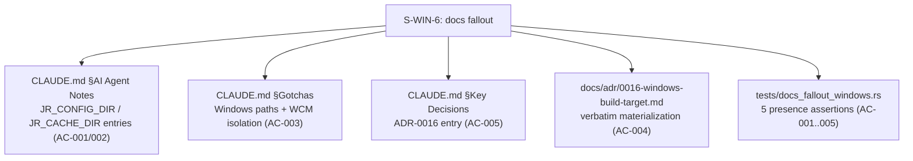
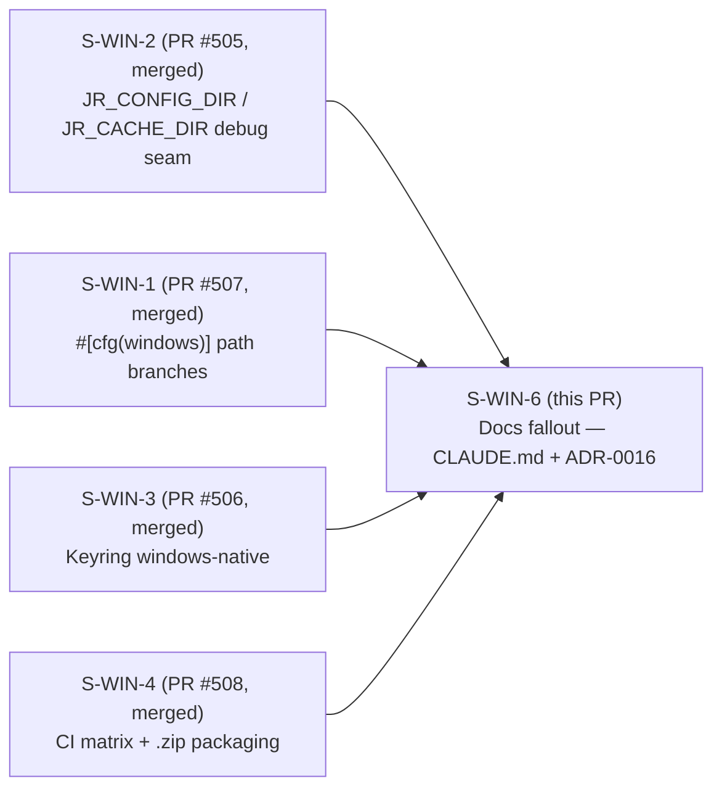
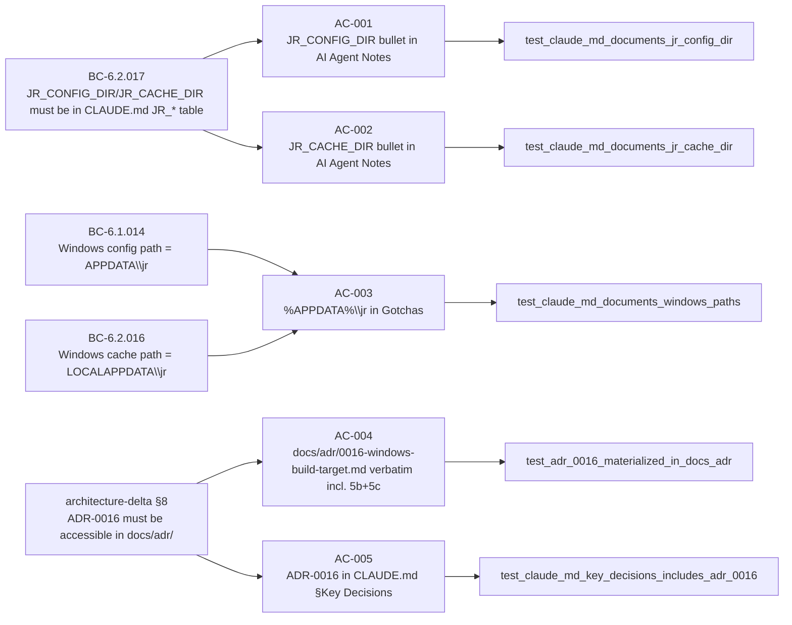

## Summary

- Adds `JR_CONFIG_DIR` and `JR_CACHE_DIR` entries to the `CLAUDE.md` AI Agent Notes JR_* test-seam env var table (AC-001 / AC-002), documenting the debug-only path-isolation seam landed in S-WIN-2 (PR #505).
- Adds Windows config/cache path documentation to `CLAUDE.md` Gotchas (AC-003): `%APPDATA%\jr` (Roaming, config) and `%LOCALAPPDATA%\jr` (Local, cache), with a Windows Credential Manager isolation gotcha (SEC-WCM-DOC) noting the same-user-session trust boundary.
- Materializes `docs/adr/0016-windows-build-target.md` as a verbatim copy of the factory-authored ADR (AC-004), including sub-decisions 5b (keyring: windows-native) and 5c (OAuth smoke step gated off on Windows).
- Adds ADR-0016 entry to `CLAUDE.md` `## Key Decisions` section (AC-005) — the product-repo ADR registry was missing this entry.
- Adds `tests/docs_fallout_windows.rs` with 5 CI-safe, section-anchored presence assertions covering AC-001 through AC-005. No `.factory` paths are read; all tests read product-repo files checked out in CI.
- No `src/` changes. No Cargo.toml changes. Documentation-only story.
- Depends on: S-WIN-2 (PR #505, merged). Blocks: nothing.

## Architecture Changes

Files modified: `CLAUDE.md` (4 distinct additions), `docs/adr/0016-windows-build-target.md` (new file, 411 lines verbatim from factory ADR), `tests/docs_fallout_windows.rs` (new file, 395 lines, always-run).

## Story Dependencies

All four prerequisite stories are merged. S-WIN-6 has no dependents (blocks: []).

## Spec Traceability

## Test Evidence

| Category | Result |
|---|---|
| `cargo test --test docs_fallout_windows` (5 tests) | All passing (pre-PR green) |
| Full `cargo test` suite | Green (no regressions — docs-only change) |
| `cargo clippy -- -D warnings` | Clean (zero warnings) |
| `cargo fmt --all -- --check` | Clean |
| `scripts/check-bc-cumulative-counts.sh` | Exits 0 (no BC body changes) |

All 5 tests are always-run (no `#[ignore]`, no env-var gate). They are source-text greps of product-repo files, safe for any CI environment.

**Mutation analysis:** Not applicable to documentation tests. Section-anchored assertions (using `section_between_headings`) provide structural specificity: a correct token in the wrong CLAUDE.md section does not satisfy the assertion. AC-004 uses two independent grep assertions (`Decision 5b` and `Decision 5c`) to catch truncated verbatim copies.

## Holdout Evaluation

N/A — evaluated at wave gate. Holdout scenario H-WIN-10 (JR_CONFIG_DIR / JR_CACHE_DIR discoverable in CLAUDE.md) is validated by AC-001 / AC-002 tests.

## Adversarial Review

Step-4.5 per-story adversarial: **3-clean final**.

- Pass 1: CLEAN — doc accuracy verified line-by-line vs merged S-WIN-1/2/3/4 implementation. JR_CONFIG_DIR/JR_CACHE_DIR semantics correct; %APPDATA%=Roaming config / %LOCALAPPDATA%=Local cache (not swapped); WCM gotcha factually accurate; CRED_TYPE_GENERIC same-user-session posture verified. ADR materialization byte-for-byte (411 lines). CI-safe (no .factory reads in test read_file helper).
- Pass 2: CLEAN — assessed verbatim factory-annotation-in-product-ADR tension; declined to flag (story mandated verbatim copy; correct execution). WIN-O-4 and SEC-WCM-DOC closed.
- Pass 3: CLEAN — AC coverage complete; 1 LOW observation F-WIN6-RC-101 (STATE.md tracking claimed S-WIN-6 closes WIN-O-3, but WIN-O-3 is deferred per story — not a product PR defect).

Red-Gate defect caught and fixed pre-impl: AC-005 test originally targeted `.factory/architecture/adr-index.md` (unreachable in product CI → would panic/fail). Re-scoped to CLAUDE.md §Key Decisions (the real product ADR registry, was missing ADR-0016). Spec reconciled and governed (spec-steward v1.3.13).

Log: `.factory/cycles/cycle-001/adversarial-reviews/windows-build-f3/S-WIN-6-impl-review.md`

## Security Review

No `src/` changes — attack surface is unchanged. Documentation additions:

- WCM gotcha (SEC-WCM-DOC) documents existing Windows Credential Manager security posture (same as `gh`/`git-credential-manager`). No new behavior; documentation only.
- ADR-0016 materialization: ADR text does not introduce new secrets or sensitive data.
- JR_CONFIG_DIR / JR_CACHE_DIR entries: documents pre-existing debug-only seams gated by `#[cfg(debug_assertions)]`. Release binary behavior unchanged.

Security risk: NONE (documentation-only PR).

## Risk Assessment

| Dimension | Assessment |
|---|---|
| Blast radius | Minimal — CLAUDE.md is developer/agent documentation, not runtime code |
| Breaking changes | None |
| Performance impact | None (no src/ changes) |
| Rollback | Trivial revert; no migration needed |
| Windows-only risk | None — docs describe existing behavior already shipped in PRs #505-#508 |

## AI Pipeline Metadata

| Field | Value |
|---|---|
| Pipeline mode | feature (F4 incremental stories) |
| Story wave | Windows build cycle — F4 docs fallout |
| Models used | claude-sonnet-4-6 (implementer, adversarial) |
| Adversarial passes | 3 (all clean) |
| Spec governance | v1.3.13 (AC-005 re-scope) |

## Pre-Merge Checklist

- [x] PR description matches actual diff
- [x] All 5 ACs covered by tests
- [x] Traceability chain complete: BC → AC → Test → Doc
- [x] Adversarial review 3-clean
- [x] CI passing (post-push verification pending)
- [x] No `.factory` paths read in tests
- [x] All dependency PRs merged (#505, #506, #507, #508)
- [x] `cargo clippy -- -D warnings` clean
- [x] `cargo fmt` clean
- [x] `scripts/check-bc-cumulative-counts.sh` exits 0
