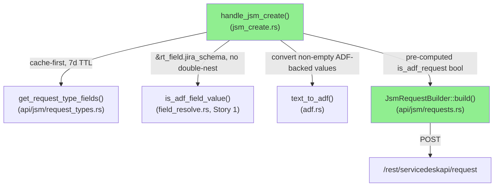
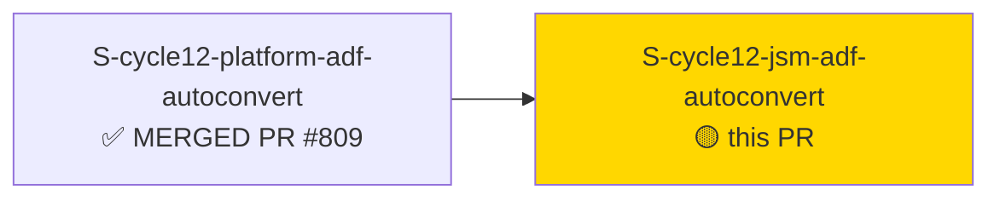
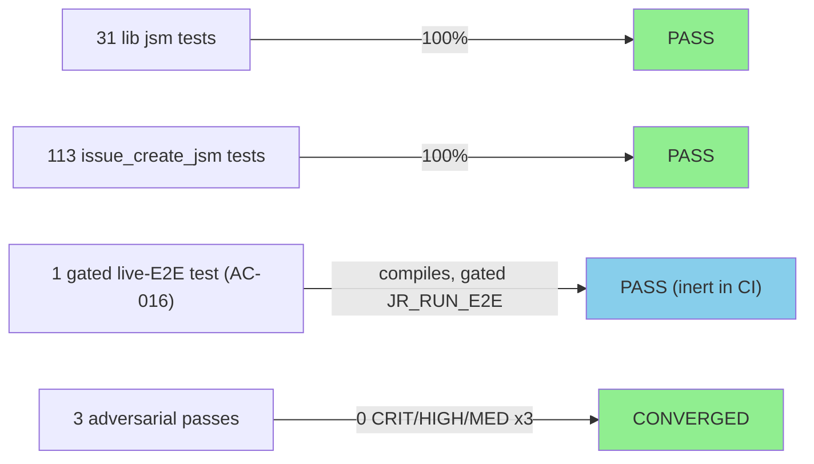
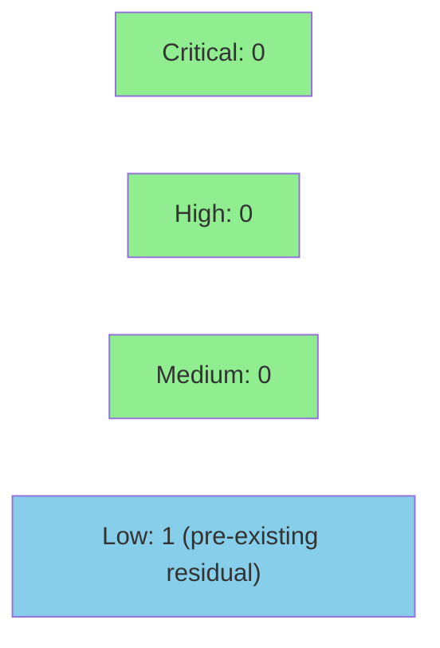

# [S-cycle12-jsm-adf-autoconvert] JSM ADF auto-conversion for `--field` on rich-text fields (JSM create path)

**Epic:** FIELD-ADF-AUTOCONVERT — ADF auto-conversion for `--field` on rich-text fields
**Mode:** feature (Feature Mode F4, Wave 2)
**Convergence:** CONVERGED after 3 consecutive CLEAN adversarial passes (zero CRIT/HIGH/MED, DEC-360 bar)


Adds ADF auto-conversion for `jr issue create --request-type RT --field NAME=VALUE` on the
JSM create path (`POST /rest/servicedeskapi/request`). When `NAME` resolves to a rich-text
`RequestTypeField` (system `description`/`environment`, or a `:textarea` custom field),
the plain-text value is converted to an ADF document via `text_to_adf` before being placed
in `requestFieldValues`, and `isAdfRequest: true` is accumulated on the POST body whenever
any extra field was ADF-converted. Empty ADF-backed fields are omitted entirely (JSM
create-omit semantics, distinct from the platform edit path's clear-doc semantics). Metadata
acquisition (`GET .../requesttype/<id>/field`, cache-first, 7-day TTL) fails open — a single
stderr warning and plain-string fallback, never exit 64. Also fixes a pre-existing
`build()` assembly-order bug where a `--field description=` extra-field entry could
overwrite `--description`'s ADF-converted value.

Depends on and follows **S-cycle12-platform-adf-autoconvert** (Story 1, Wave 1, PR #809,
already merged to `develop`), which implements the shared `is_adf_field_value` /
`is_adf_schema` predicate this story calls (no re-implementation, ADR-0024 Architecture
Compliance Rule 2).

---

## Architecture Changes



<details>
<summary><strong>Architecture Decision Record</strong></summary>

### ADR: ADR-0024 — ADF auto-conversion for `--field` on rich-text fields (JSM half)

**Context:** JSM `issue create --request-type RT --field NAME=VALUE` sent plain strings
for rich-text `RequestTypeField`s, which Jira rejects/mishandles for ADF-backed system
and `:textarea` custom fields. Story 1 solved this for the platform create/edit paths and
built the shared `is_adf_field_value` predicate; this story wires that predicate into the
JSM create resolution layer.

**Decision:** All ADF detection, conversion, and `isAdfRequest` accumulation live in the
`jsm_create.rs` resolution layer (effectful: network/cache/stderr). `JsmRequestBuilder::build()`
stays a pure assembler that only reflects a pre-computed `is_adf_request: bool` — it never
inspects value shapes (`is_object()`) to derive the flag.

**Rationale:** Keeps the effectful RT-fields-fetch / fail-open / warning-emission logic out
of the pure builder, preserving `build()`'s testability and avoiding the closed mutant class
where `isAdfRequest` is (incorrectly) derived from JSON value shape rather than from actual
ADF-conversion provenance.

**Alternatives Considered:**
1. Derive `isAdfRequest` inside `build()` by inspecting `requestFieldValues` for objects —
   rejected: cannot distinguish an ADF-converted object from a hinted `:id`/`:name`
   object-valued field (AC-013 / VP-FIELD-ADF-004 Axis c I-2 discriminator test).
2. Duplicate the ADF allowlist predicate inside `jsm_create.rs` — rejected: `field_resolve.rs`
   already owns `is_adf_schema`/`is_adf_field_value` as the single source of truth (Story 1);
   this story calls it directly, passing the inner `jira_schema` block (no double-nesting).

**Consequences:**
- `build()` remains pure and independently unit-testable.
- The JSM create path adds one cache-first metadata GET when ≥1 bare `--field` pair is
  present (no HTTP for hinted-kind-only or no-`--field` invocations).
- Fail-open on metadata-fetch failure means an ADF-backed field can silently fall back to
  plain-string submission (documented EC-001/BC-3.8.019 EC-3.8.019-2 behavior, not a bug).

</details>

---

## Story Dependencies



---

## Spec Traceability

```mermaid
flowchart LR
    BC1[BC-3.8.019<br/>JSM description/environment ADF] --> AC4[AC-004<br/>ADF conversion + accumulation]
    BC2[BC-3.8.020<br/>JSM :textarea ADF] --> AC4
    BC3[BC-3.8.021<br/>empty ADF-backed omit] --> AC7[AC-007<br/>empty-omit + no accumulation]
    BC4[BC-3.8.022<br/>isAdfRequest accumulation] --> AC13[AC-013<br/>build() never derives from shape]
    AC4 --> T1[test_bc_3_8_019_jsm_description_extra_field_adf_converted]
    AC7 --> T2[test_bc_3_8_021_jsm_empty_adf_field_omitted_isadfrequest_not_accumulated]
    AC13 --> T3[test_bc_3_8_022_is_adf_request_absent_with_hinted_object_field_no_adf]
    T1 --> S1F[src/cli/issue/jsm_create.rs]
    T2 --> S1F
    T3 --> S2F[src/api/jsm/requests.rs]
```

---

## Test Evidence

### Coverage Summary

| Metric | Value | Threshold | Status |
|--------|-------|-----------|--------|
| `cargo test --lib jsm` | 31/31 pass | 100% | PASS |
| `cargo test --test issue_create_jsm` | 113/113 pass | 100% | PASS |
| `cargo test --lib` / `--test '*'` (full suite, orchestrator Red Gate) | GREEN | 100% | PASS |
| `e2e_live.rs` compiles (E2E `#[ignore]`-gated, AC-016) | compiles clean | n/a | PASS |
| `cargo clippy --all-targets -- -D warnings` | 0 warnings | 0 | PASS |
| `cargo fmt --all -- --check` | clean | clean | PASS |
| Production `todo!()` macros | 0 | 0 | PASS |
| Mutation testing (cargo-mutants, PR-diff scope) | not run this session | — | DEFERRED — CI-scoped job; see CI conclusion below |

### Test Flow



| Metric | Value |
|--------|-------|
| **Diff** | 5 files, +1851/-46 |
| **Production code** | ~996 lines (`jsm_create.rs` +754, `requests.rs` +242) |
| **Test code** | `issue_create_jsm.rs` +674, `e2e_live.rs` +194 |
| **Docs** | `CHANGELOG.md` +33/-13 (combined entry, shared with Story 1) |
| **Regressions** | 0 |

**Note on diff size:** the diff is dominated by tests + CHANGELOG, not production code.
Production code is one cohesive feature (JSM resolution-layer ADF wiring + a single
`build()` assembly-order fix) — no split recommended (orchestrator-verified).

<details>
<summary><strong>Key New/Modified Tests</strong></summary>

| Test | AC | Result |
|------|----|--------|
| `test_bc_3_8_019_is_adf_field_value_receives_inner_schema_not_double_nested` | AC-002 | PASS |
| `test_bc_3_8_019_jsm_description_extra_field_adf_converted` | AC-004 | PASS |
| `test_bc_3_8_020_jsm_textarea_extra_field_adf_converted` | AC-004 | PASS |
| `test_bc_3_8_022_is_adf_request_accumulated_for_adf_field` | AC-004 | PASS |
| `test_bc_3_8_020_is_adf_request_absent_when_no_adf_field_present` (`.is_none()`) | AC-004/010 | PASS |
| `test_bc_3_8_022_is_adf_request_absent_with_hinted_object_field_no_adf` (I-2 mutant-kill) | AC-004/013 | PASS |
| `test_bc_3_8_019_build_description_supersedes_extra_field_description_entry` | AC-006 | PASS (was RED pre-fix) |
| `test_bc_3_8_021_jsm_empty_adf_field_omitted_isadfrequest_not_accumulated` | AC-007 | PASS |
| `test_jsm_adf_field_metadata_unavailable_emits_warning` | AC-008 | PASS |
| `test_adf_empty_guard_fires_only_on_bare_form_not_hinted_jsm` | AC-009 | PASS |
| `test_bc_3_8_019_jsm_create_output_is_key_only_no_adf_marker` | AC-012 | PASS |
| `test_jsm_adf_rt_fields_get_fires_iff_bare_field_present` | AC-015(a) | PASS |
| `test_jsm_adf_rt_fields_cache_warm_skips_http` | AC-015(b) | PASS |
| `test_jsm_adf_rt_fields_fetch_401_emits_global_warning_not_write_scope_hint` | AC-015(c) | PASS |
| `test_e2e_jsm_create_adf_field_description_roundtrip` (or extended `test_e2e_jsm_create_request_roundtrip`) | AC-016 | Gated (`JR_RUN_E2E` + `JR_E2E_JSM_PROJECT`), inert in default CI |

</details>

---

## Demo Evidence

**SKIPPED by explicit human decision this session.** Rationale: backend/no-UI JSM
write-path CLI change with no per-field echo surface (AC-012 confirms JSM create success
output is `Created request <KEY>` only — no field echo, no `(adf)` marker). Coverage is via
wiremock/CLI-level integration tests (`tests/issue_create_jsm.rs`), unit tests
(`cargo test --lib jsm`), and a gated live-E2E round-trip test (AC-016,
`tests/e2e_live.rs`, `JR_RUN_E2E` + `JR_E2E_JSM_PROJECT`). Precedent: cycle-005/cycle-007/
Story-1 (S-cycle12-platform-adf-autoconvert, PR #809) skipped demo recording under the
same rationale for the platform-path half of this feature. No demo-recorder agent was
spawned for this story. Not a blocking gap — Pre-Merge Checklist item left unchecked with
this note.

---

## Adversarial Review

| Pass | Findings | Critical | High | Medium | Status |
|------|----------|----------|------|--------|--------|
| 1 | 5 (OBS-1..5, all LOW/NITPICK) | 0 | 0 | 0 | CLEAN |
| 2 | 2 (OBS-N1, OBS-N2, both LOW) | 0 | 0 | 0 | CLEAN |
| 3 | 3 (OBS-P3-1..3, all LOW) | 0 | 0 | 0 | CLEAN |

**Convergence:** 3 consecutive CLEAN passes (DEC-360 bar — no CRIT/HIGH/MED across 3
consecutive passes). Converged tree: `3dadb1ae`.

<details>
<summary><strong>Findings & Resolutions (all LOW/NITPICK, non-blocking)</strong></summary>

- **OBS-1 (LOW):** Story-text (AC-012) said the field-conversion notice is emitted to
  stdout; the actual implementation and test correctly use stderr (jr's Symmetric
  output-channel convention). Story-text wording defect only, no implementation change
  needed. Flagged for a future doc sweep.
- **OBS-2 (LOW), OBS-3/4/5 (NITPICK):** stylistic/naming observations, no functional impact.
- **OBS-N1 (LOW):** Fixtures now exercise the fail-open warning path (informational).
- **OBS-N2 (LOW):** `RequestTypeField.jira_schema` lacks `#[serde(default)]` — pre-existing,
  out of scope for this story.
- **OBS-P3-1 (LOW):** The AC-016 live-E2E test skips (rather than fails) on a non-403
  create failure, so it provides positive round-trip confirmation only, not a hard
  regression gate. Matches the repo's best-effort E2E skip convention.
- **OBS-P3-2 (LOW) — RESOLVED in commit `3dadb1ae`:** CHANGELOG initially omitted the JSM
  assembly-order (`--description` wins) enumeration present on the platform paths.
  Fixed by extending the combined `[Unreleased] > Fixed` entry (doc-only, no
  re-convergence required per DEC-360 precedent for doc-only post-convergence fixes).
- **OBS-P3-3 (LOW):** Tests mutate process-global env vars — pre-existing accepted idiom
  elsewhere in the suite.

Full record: `.factory/cycles/cycle-012/adversarial-reviews/story-S-cycle12-jsm-adf-autoconvert-convergence.md`.

</details>

---

## Security Review



**Verdict: CLEAN.** No code changes required to merge. Reviewed the real diff
(`git diff origin/develop...HEAD`, 5 files, +1851/-46).

<details>
<summary><strong>Security Scan Details</strong></summary>

### Manual Review Findings

| # | Area | CWE(s) considered | Severity | Result |
|---|------|-------------------|----------|--------|
| 1 | ADF conversion attack surface | CWE-116, CWE-79-class | INFO | No new sink — `src/adf.rs` and `src/cli/issue/field_resolve.rs` show 0 diff lines; this PR only adds call sites into pre-existing, already-reviewed pure functions |
| 2 | Metadata-fetch fail-open behavior | CWE-209, CWE-703 | INFO | Single static, non-parameterized warning string — no status code/body/URL/token interpolated; does not affect the real POST's 401 handling |
| 3 | RT-field cache cross-profile/injection | CWE-668, CWE-22 | INFO | No new cache logic (`src/cache.rs` not in diff) — reuses pre-existing, profile-isolated, tested cache functions (`test_request_type_fields_cache_cross_profile_isolation`) |
| 5 | Secrets/PII in new warning/error paths | CWE-532 | INFO | None found — grepped all new stderr/stdout emission points, CHANGELOG.md, and new tests |
| 6 | Command injection / path traversal / deserialization | CWE-78, CWE-22, CWE-502 | INFO | `get_request_type_fields` URL-encodes dynamic segments (unmodified this PR); ordinary serde JSON deserialization; no shell exec; two `unsafe` blocks are test-only (`#[cfg(test)]`), mutex-guarded, panic-safe restore |

### Non-Blocking Observations

- **OBS-1 (INFO):** The fail-open warning doesn't distinguish failure cause (network vs 401 vs
  404 vs deserialization) — intentional by design (AC-008(a), AC-015(c)): deliberately scoped
  to avoid a misleading `write:servicedesk-request` hint on what might be a transient blip
  during metadata lookup, not a real auth failure on the create POST.
- **OBS-2 (LOW, pre-existing, not introduced by this PR):** `src/cache.rs`'s
  `read_request_type_fields_cache`/`write_request_type_fields_cache` validate
  `service_desk_id`/`request_type_id` charset via `debug_assert!` only — a no-op in release
  builds (CWE-22 residual). Not new to this PR (predates it, S-288-pr2); this PR adds a
  *second* call site relying on the same pre-existing guarantee. Not currently reachable by
  attacker-controlled input in the call graph (both IDs are Jira-API-sourced or
  CLI-input-gated by an explicit all-ASCII-digit check at `jsm_create.rs:243` before reaching
  the resolved-ID path). **Recommendation (non-blocking, not a merge gate):** convert to a
  real runtime check in a follow-up hardening story.

### Dependency Audit

- Not re-run this session (no new dependencies added by this PR — confirmed no `Cargo.toml`
  changes in the diff).

### Formal Verification

Not applicable to this story (no new pure invariants requiring Kani/proptest beyond the
existing VP-FIELD-ADF-001/003/004 unit-test coverage already GREEN — see Test Evidence).

</details>

**Reviewer:** `vsdd-factory:security-reviewer` sub-agent, dispatched by pr-manager as Step 4
of the PR lifecycle for PR #812.

---

## Risk Assessment & Deployment

### Blast Radius
- **Systems affected:** `jr issue create --request-type` (JSM create path only); no change
  to the platform create/edit paths (those were Story 1, already merged) or to any
  non-`--field` JSM create behavior.
- **User impact on failure:** an ADF-backed `--field` value could revert to plain-string
  submission (same as pre-fix behavior) — fail-open by design, not a hard failure mode.
  No JSM create request would be blocked or corrupted by this change; worst case is a
  silently-unconverted rich-text field (existing EC-001/AC-008 fail-open contract).
- **Data impact:** none — no schema/storage changes; only outbound POST body shape for
  `requestFieldValues`/`isAdfRequest` on JSM create.
- **Risk Level:** LOW — additive behavior gated behind an existing allowlist predicate
  shared with an already-merged, already-converged sibling story; extensive TDD +
  3-pass adversarial convergence; fail-open error handling; JSM-scoped file changes only.

### Feature Flags
None — behavior is unconditional once merged (no flag; matches Story 1's precedent).

<details>
<summary><strong>Rollback Instructions</strong></summary>

**Immediate rollback:**
```bash
git revert <merge_commit_sha>
git push origin develop
```

**Verification after rollback:**
- `jr issue create --request-type RT --field description=VALUE` reverts to plain-string
  `requestFieldValues["description"]` submission (pre-fix behavior).
- `cargo test --lib jsm` and `cargo test --test issue_create_jsm` still pass (reverted
  test expectations match reverted implementation).

</details>

---

## Traceability

| BC | AC | Test | Status |
|----|----|------|--------|
| BC-3.8.019 | AC-002, AC-003, AC-004, AC-008, AC-015 | `test_bc_3_8_019_*` (multiple) | PASS |
| BC-3.8.020 | AC-004, AC-010 | `test_bc_3_8_020_*` (multiple) | PASS |
| BC-3.8.021 | AC-007 | `test_bc_3_8_021_jsm_empty_adf_field_omitted_isadfrequest_not_accumulated` | PASS |
| BC-3.8.022 | AC-004, AC-013 | `test_bc_3_8_022_*` (multiple, incl. I-2 mutant-kill) | PASS |

<details>
<summary><strong>Full VSDD Contract Chain</strong></summary>

```
BC-3.8.019 -> VP-FIELD-ADF-004 Axis a/b/c/e -> test_bc_3_8_019_* -> src/cli/issue/jsm_create.rs -> ADV-PASS-3-CLEAN
BC-3.8.020 -> VP-FIELD-ADF-004 Axis b/c -> test_bc_3_8_020_* -> src/cli/issue/jsm_create.rs -> ADV-PASS-3-CLEAN
BC-3.8.021 -> VP-FIELD-ADF-003 Axis C -> test_bc_3_8_021_jsm_empty_adf_field_omitted_isadfrequest_not_accumulated -> src/cli/issue/jsm_create.rs -> ADV-PASS-3-CLEAN
BC-3.8.022 -> VP-FIELD-ADF-004 Axis c (incl. I-2) -> test_bc_3_8_022_* -> src/api/jsm/requests.rs -> ADV-PASS-3-CLEAN
```

</details>

---

## AI Pipeline Metadata

<details>
<summary><strong>Pipeline Details</strong></summary>

```yaml
ai-generated: true
pipeline-mode: feature
factory-version: "1.0.0-rc.25"
pipeline-stages:
  spec-crystallization: completed
  story-decomposition: completed
  tdd-implementation: completed
  holdout-evaluation: not-applicable-feature-mode
  adversarial-review: completed
  formal-verification: not-run-this-session
  convergence: achieved
convergence-metrics:
  adversarial-passes: 3
  consecutive-clean-passes: 3
  crit-high-med-findings: 0
story: S-cycle12-jsm-adf-autoconvert
cycle: cycle-012-field-adf-autoconvert
wave: 2
points: 13
converged_tree: "3dadb1ae"
```

</details>

---

## Pre-Merge Checklist

- [ ] All CI status checks passing (pending — see CI conclusion section)
- [x] Coverage delta is positive (996 production lines, 868 new/modified test lines)
- [x] No critical/high security findings unresolved (security-reviewer verdict: CLEAN, zero CRIT/HIGH/MED)
- [x] Rollback procedure validated (single `git revert`, no data migration)
- [x] No feature flag needed (unconditional additive behavior, matches Story 1 precedent)
- [x] Demo evidence: SKIPPED by explicit human decision (see Demo Evidence section) — not blocking
- [ ] Dependency PR #809 (Story 1) merge status confirmed (pending Step 7 dependency check)
- [ ] **Human merge authorization** — MERGE IS NOT AUTHORIZED FOR THIS PR RUN. AUTHORIZE_MERGE=NO
      was specified for this delivery. This PR is prepared through Step 7 (review + CI +
      dependency check) only. Merge (Step 8) is reserved for explicit human authorization.
