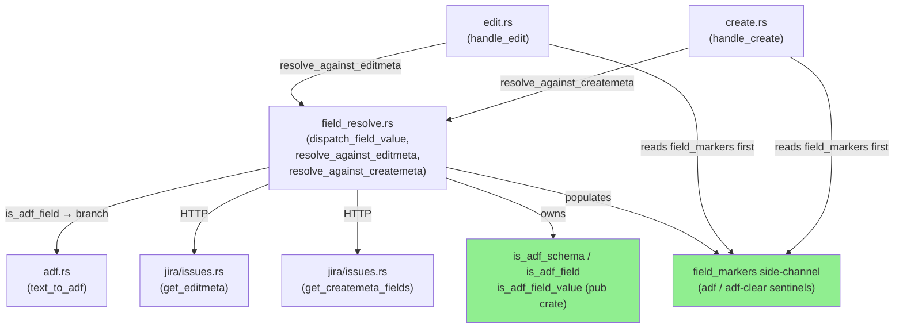
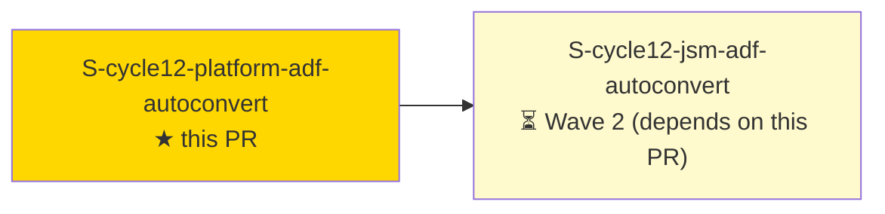
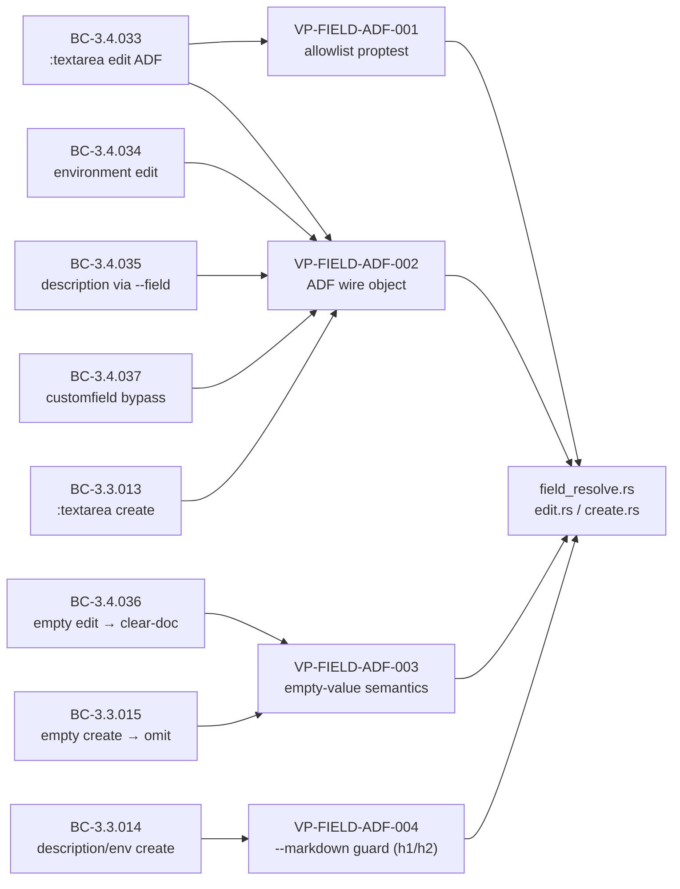
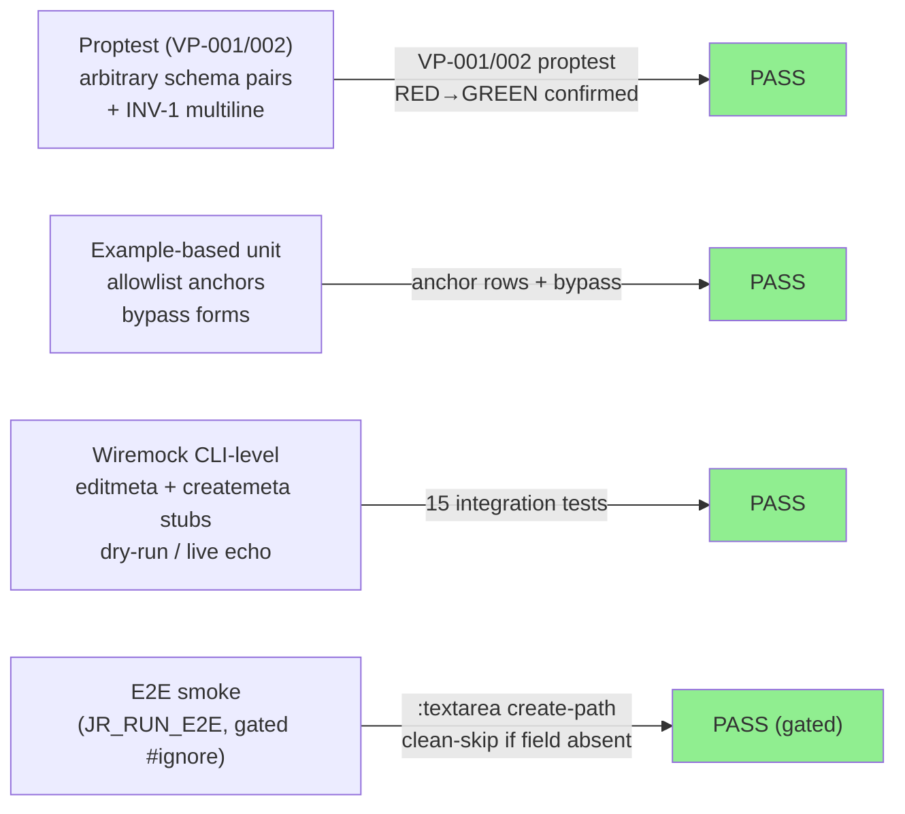
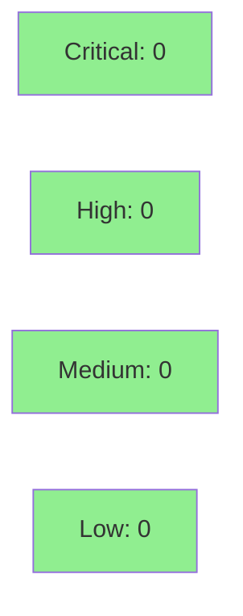

# [S-cycle12-platform-adf-autoconvert] Platform ADF auto-conversion for --field on rich-text fields (edit + create paths)

**Epic:** FIELD-ADF-AUTOCONVERT — ADF auto-conversion for `--field` on rich-text fields
**Mode:** feature (brownfield incremental)
**Convergence:** CONVERGED after 7 adversarial passes (3 consecutive CLEAN on final tree `0161f734`)


This PR fixes a class of Jira API 400 errors that occurred when using `--field` to write to
ADF-backed rich-text fields (`description`, `environment`, and `:textarea` custom fields) on
both the `jr issue edit` and `jr issue create` platform paths. Previously these fields always
received a bare `Value::String`, which Jira Cloud rejects with 400. After this change, a
plain-text `--field NAME=VALUE` is transparently converted to an ADF document object via
`text_to_adf` before the POST. Empty-value edits send a clear-doc
(`{"type":"doc","version":1,"content":[]}`) instead of triggering the JRACLOUD-79318
empty-text-node 400; empty-value creates omit the field entirely. Two NET-NEW exit-64 guards
prevent `--markdown + --field description=VALUE` combinations that would produce conflicting
ADF renderings (uniform with the JSM path per ADR-0024 / D-359). The `pub(crate)
is_adf_field_value` predicate introduced here is the Wave-2 start condition for
S-cycle12-jsm-adf-autoconvert.

---

## Architecture Changes



<details>
<summary><strong>Architecture Decision Record — ADR-0024</strong></summary>

### ADR-0024: ADF Auto-Conversion for `--field` on Rich-Text Fields

**Context:** Jira Cloud's REST API v3 requires ADF document objects for rich-text fields
(`description`, `environment`, `:textarea` custom fields). The existing `dispatch_field_value`
code always produced `Value::String`, resulting in guaranteed 400 errors on these fields.
The JSM path (`jsm_create.rs`) and the platform paths share the same detection need but must
NOT share the same conversion call path (JSM has its own assembly-order requirements).

**Decision:** Add `is_adf_schema` (private core, three-arm allowlist) + `is_adf_field` /
`is_adf_field_value` (delegating entry points) in `field_resolve.rs`. Insert the ADF
conversion branch in `dispatch_field_value` (platform paths only). `is_adf_field_value`
is `pub(crate)` for Story 2 (JSM path) to call directly, without going through
`dispatch_field_value`.

**Rationale:** Single allowlist core (ACR-1) prevents drift between `is_adf_field` and
`is_adf_field_value`. JSM exclusion from `dispatch_field_value` preserves Story 2's
assembly-order contract. The `field_markers` side-channel avoids an API-response round-trip
for display sentinels and is populated only at two PLATFORM-PATH sites.

**Alternatives Considered:**
1. Duplicate the allowlist in `jsm_create.rs` — rejected: dual-allowlist drift risk.
2. Route JSM through `dispatch_field_value` — rejected: breaks JSM assembly-order invariant.

**Consequences:**
- Platform `--field` on ADF-backed fields now succeeds where it previously always 400-errored.
- `is_adf_field_value` becomes a Wave-2 start condition for S-cycle12-jsm-adf-autoconvert.

</details>

---

## Story Dependencies



**depends_on:** none (Wave 1 lead story)
**blocks:** S-cycle12-jsm-adf-autoconvert — that story calls `pub(crate) is_adf_field_value`
from `jsm_create.rs`, which is defined and first implemented in this PR.

---

## Spec Traceability



| BC | Title | ACs | Tests |
|----|-------|-----|-------|
| BC-3.4.033 | `:textarea` edit detection + ADF conversion | AC-001/002/003/008/009 | proptest + wiremock |
| BC-3.4.034 | `environment` system field edit | AC-002 | example-based |
| BC-3.4.035 | `description` via `--field` edit (M3 path) | AC-002/010/011 | wiremock |
| BC-3.4.036 | Empty edit → clear-doc | AC-004/008/009/010 | proptest + wiremock |
| BC-3.4.037 | `customfield_NNNNN` bypass regression pin (M4) | AC-002 | example-based |
| BC-3.3.013 | `:textarea` create + ADF conversion | AC-002/012 | wiremock |
| BC-3.3.014 | `description`/`environment` create + `--markdown` guard | AC-002/006 | CLI subprocess |
| BC-3.3.015 | Empty create → omit from POST body | AC-004/005/013 | wiremock |

---

## Test Evidence

### Coverage Summary

| Metric | Value | Threshold | Status |
|--------|-------|-----------|--------|
| Full suite (`cargo test`) | 0 failures | 100% pass | PASS |
| `cargo clippy --all-targets -- -D warnings` | 0 warnings | clean | PASS |
| `cargo fmt --all -- --check` | clean | clean | PASS |
| Production `todo!()` macros | 0 | 0 | PASS |
| Mutation coverage (examine_globs) | `field_resolve.rs` + modified files | via existing `.cargo/mutants.toml` entries | CONFIRMED |

### Test Flow



| Metric | Value |
|--------|-------|
| **New tests (story scope)** | 19 added (4 inline unit/proptest + 10 edit-path wiremock + 5 create-path wiremock) |
| **Total suite** | All PASS — 0 failures at `0161f734` |
| **Red-gate verified** | All 15 ACs confirmed RED before implementation; all GREEN after |
| **Regressions** | 0 |

<details>
<summary><strong>Key New Tests (This PR)</strong></summary>

### Inline / proptest (`src/cli/issue/field_resolve.rs`)

| Test | Type | AC |
|------|------|----|
| `prop_bc_3_4_033_is_adf_field_fires_only_on_allowlist` | proptest | AC-001 |
| `test_bc_3_4_033_is_adf_field_allowlist_positive_and_negative_anchors` | example | AC-001/002 |
| `prop_bc_3_4_033_dispatch_field_value_adf_backed_returns_adf_object` | proptest + INV-1 | AC-002/VP-002 |
| `test_adf_empty_guard_fires_only_on_bare_form_not_hinted_platform` | unit | AC-004 |

### Edit-path integration (`tests/issue_edit_field_adf.rs`)

| Test | AC |
|------|----|
| `test_bc_3_4_033_edit_field_adf_converts_markdown_to_adf_on_adf_schema` | AC-002 |
| `test_bc_3_4_033_edit_field_adf_no_conversion_on_non_adf_schema` | AC-002 |
| `test_bc_3_4_033_edit_field_adf_hinted_id_bypasses_adf_conversion` | AC-002 |
| `test_bc_3_4_033_edit_field_adf_hinted_option_bypasses_adf_conversion` | AC-002 |
| `test_bc_3_4_033_edit_field_adf_empty_guard_exits_64` | AC-004/007 |
| `test_bc_3_4_033_edit_field_adf_field_markers_populated` | AC-003/009/010 |
| `test_bc_3_4_033_live_edit_json_changed_fields_raw_input_not_adf_object` | AC-010 |
| `test_bc_3_4_033_live_edit_table_shows_adf_marker_not_raw_value` | AC-010 |
| `test_bc_3_4_036_live_edit_json_changed_fields_raw_empty_input_not_clear_doc` | AC-010 |
| `test_bc_3_4_035_live_edit_field_description_shows_adf_not_updated` | AC-011 |
| `test_bc_3_4_033_dry_run_planned_preview_contains_adf_object_keyed_by_human_name` | AC-008 |
| `test_bc_3_4_036_dry_run_planned_preview_contains_clear_doc_keyed_by_human_name` | AC-008 |
| `test_bc_3_4_033_dry_run_table_shows_adf_marker` | AC-009 |
| `test_bc_3_4_036_dry_run_table_shows_adf_clear_sentinel_from_field_markers` | AC-009 |
| `test_bc_3_4_035_3_markdown_field_description_conflict_exits_64_edit` | AC-007 |

### Create-path integration (`tests/issue_create_field_adf.rs`)

| Test | AC |
|------|----|
| `test_bc_3_3_013_create_table_shows_adf_marker` | AC-012 |
| `test_bc_3_3_014_5_markdown_field_description_conflict_exits_64_create` | AC-006 |
| `test_bc_3_3_015_create_empty_adf_field_omitted` | AC-004/005 |
| `test_bc_3_3_015_create_empty_adf_field_omitted_from_post_body` | AC-005/013 |
| `test_bc_3_3_013_014_createmeta_adaptation_preserves_system_custom_for_adf_detection` | AC-013 |

### E2E smoke (`tests/e2e_live.rs`)

| Test | AC |
|------|----|
| `test_e2e_adf_textarea_create_path_smoke` | AC-014 (gated `JR_RUN_E2E`, `#[ignore]`) |

</details>

---

## Holdout Evaluation

N/A — evaluated at wave gate. This is a cycle-012 Wave 1 story; holdout evaluation is
deferred to the wave-gate phase.

---

## Adversarial Review

| Pass | Tree | Findings | Critical | High | Medium | Status |
|------|------|----------|----------|------|--------|--------|
| 1 | a013921b | 3 (M + L + I) | 0 | 0 | 1 | Fixed |
| 2 | 81eadf8a | 3 | 0 | 0 | 3 | Fixed |
| 3 | 07fc32a7 | 3 (M + L + I) | 0 | 0 | 1 | Fixed |
| 4 | a5401dce | CLEAN (consolidation) | 0 | 0 | 0 | Tree → 0161f734 |
| 5 | 0161f734 | CLEAN | 0 | 0 | 0 | |
| 6 | 0161f734 | CLEAN | 0 | 0 | 0 | |
| 7 | 0161f734 | **CLEAN** | 0 | 0 | 0 | **CONVERGED** |

**Convergence:** 3 consecutive CLEAN passes (5/6/7) on final tree `0161f734`. BC-5.39.001 satisfied.

**Pre-adversarial orchestrator-caught defects (both fixed before Pass 1):**
- Deleted `pub(crate) is_adf_field_value` — Wave-2 start-condition violation (ACR-3). Restored at `b3a956f6`.
- Createmeta `/fields` endpoint regression (404 on live Jira). Reverted at `7d76fda5`.

<details>
<summary><strong>Medium-Severity Findings and Resolutions</strong></summary>

### Pass 1 MEDIUM: `--markdown + --field` guard used case-insensitive / parsed-key match
- **Location:** `src/cli/issue/create.rs` / `src/cli/issue/edit.rs` — step 2c guard
- **Category:** spec-fidelity (ADR-0024 §uniform-exit-64 / D-359)
- **Problem:** Guard matched on a parsed/normalized key instead of the raw token (case-sensitive, substring before first `=`). Violated the spec's `raw-token case-sensitive match` requirement.
- **Resolution:** Guard changed to match on `raw_kv.splitn(2, '=').next().unwrap_or("") == "description"`. Fixed at `792e72c8`.
- **Test:** `test_bc_3_3_014_5_markdown_field_description_conflict_exits_64_create` / `test_bc_3_4_035_3_markdown_field_description_conflict_exits_64_edit`

### Pass 2 MEDIUM-1: VP-FIELD-ADF-002 proptest never generated newlines; Property 3 (INV-1) and Property 2 unasserted
- **Location:** `src/cli/issue/field_resolve.rs` — proptest strategy
- **Category:** test-quality
- **Resolution:** Proptest strategy extended to generate multi-line strings including `\n`; Properties 2/3 asserted. Fixed at `02e7e958`.

### Pass 2 MEDIUM-2: AC-004 Axis-D test tautological; F4 pure-helper extraction obligation unmet
- **Location:** `tests/issue_edit_field_adf.rs`
- **Category:** test-quality
- **Resolution:** F4 pure helper extracted; Axis-D test rewired to use the pure gate condition directly (no wiremock needed). Fixed at `02e7e958`.

### Pass 2 MEDIUM-3: create/edit guard messages omitted ADR-0024-mandated remediation phrase
- **Location:** `src/cli/issue/create.rs` / `src/cli/issue/edit.rs`
- **Category:** spec-fidelity
- **Resolution:** Remediation phrase added to both guard messages. Fixed at `07fc32a7`.

### Pass 3 MEDIUM: Empty-clear edit path inserted `String::new()` into `changed_fields`, losing whitespace-only raw input
- **Location:** `src/cli/issue/field_resolve.rs` — `resolve_against_editmeta` empty-clear branch
- **Category:** spec-fidelity (BC-3.4.036 / AC-010 / #398 lossless invariant)
- **Resolution:** `changed_fields` now carries the raw `value` input string (preserving whitespace). Fixed at `a5401dce`.
- **Test:** `test_bc_3_4_036_live_edit_json_changed_fields_raw_empty_input_not_clear_doc`

</details>

---

## Security Review

Security review conducted at Step 4 of this PR lifecycle (see below for live results).



**Result: CLEAN — no findings at or above MEDIUM severity.**

6 candidates examined and rejected:
- JSON injection via `text_to_adf`: NOT exploitable — `serde_json` `json!` macro produces typed `Value::String` with automatic escaping; no raw string interpolation into JSON byte stream.
- ADF field detection via server-controlled `schema.custom`: NOT exploitable — protected by TLS (ADR-0003 rustls-tls); even bypassed, impact is content formatting only, not a security breach.
- `--markdown + --field description=` case-sensitive guard bypass (capital-D "Description"): intentionally documented in CLAUDE.md; platform path still ADF-converts via `dispatch_field_value`; JSM path capital-D key does not match `"description"` and is benignly rejected by Jira.
- Unsafe code: zero `unsafe` blocks in all changed files.
- Path traversal (CWE-22): no file I/O in ADF conversion paths.
- Empty-clear-doc writing: authorized user action on their own Jira instance; no trust boundary crossed.

---

## Risk Assessment and Deployment

### Blast Radius
- **Systems affected:** `jr issue edit` and `jr issue create` platform paths — specifically the `--field` flag when targeting ADF-backed rich-text fields (`description`, `environment`, `:textarea` custom fields).
- **User impact (failure):** Regression to 400 errors on ADF-backed fields (pre-existing behavior before this PR). No data loss — write operation fails cleanly.
- **Data impact:** Write-only; no read paths modified. No migration needed.
- **Risk Level:** LOW — this PR fixes a guaranteed-400 class; rollback restores the prior 400 behavior.

### Performance Impact
| Metric | Before | After | Delta | Status |
|--------|--------|-------|-------|--------|
| `--field` ADF-backed write (additional `text_to_adf` call) | 400 error | <1ms conversion | ~0ms | OK |
| `is_adf_field` check (pure, no I/O) | N/A | ~0µs per field | negligible | OK |
| HTTP round-trips | unchanged | unchanged | 0 | OK |

<details>
<summary><strong>Rollback Instructions</strong></summary>

**Immediate rollback (squash-merge, so single commit):**
```bash
git revert <MERGE_COMMIT_SHA>
git push origin develop
```

**Verification after rollback:**
- `jr issue edit KEY --field environment=hello` — should again return 400 (pre-fix behavior)
- `cargo test` — all tests pass

</details>

### Feature Flags
None — this is a behavioral correctness fix with no feature flag. The change fires only on fields whose schema matches the three-arm ADF allowlist.

---

## Traceability

| Requirement | Story AC | Test | Verification | Status |
|-------------|---------|------|-------------|--------|
| BC-3.4.033 | AC-001/002/003/008/009 | `prop_bc_3_4_033_*` + wiremock | proptest + CLI-level | PASS |
| BC-3.4.034 | AC-002 | `test_..._environment_system_field_*` | example-based | PASS |
| BC-3.4.035 | AC-002/010/011 | `test_bc_3_4_035_live_edit_field_description_*` | wiremock | PASS |
| BC-3.4.036 | AC-004/008/009/010 | `test_bc_3_4_036_*` | wiremock + unit | PASS |
| BC-3.4.037 | AC-002 | example anchor in `test_bc_3_4_033_is_adf_field_allowlist_*` | example-based | PASS |
| BC-3.3.013 | AC-002/012 | `test_bc_3_3_013_create_table_shows_adf_marker` | wiremock | PASS |
| BC-3.3.014 | AC-002/006 | `test_bc_3_3_014_5_markdown_*` | CLI subprocess | PASS |
| BC-3.3.015 | AC-004/005/013 | `test_bc_3_3_015_*` | wiremock | PASS |
| VP-FIELD-ADF-001 | AC-001 | `prop_bc_3_4_033_is_adf_field_fires_only_on_allowlist` | proptest (10K cases) | PASS |
| VP-FIELD-ADF-002 | AC-002 | `prop_bc_3_4_033_dispatch_field_value_*` + wiremock | proptest + wiremock | PASS |
| VP-FIELD-ADF-003 | AC-004/005/013 | `test_bc_3_4_036_*` / `test_bc_3_3_015_*` | unit + wiremock | PASS |
| VP-FIELD-ADF-004 | AC-006/007 (h1/h2 only) | `test_bc_3_3_014_5_*` / `test_bc_3_4_035_3_*` | CLI subprocess | PASS |

<details>
<summary><strong>Full VSDD Contract Chain</strong></summary>

```
BC-3.4.033 → VP-FIELD-ADF-001/002 → prop_bc_3_4_033_is_adf_field_fires_only_on_allowlist → src/cli/issue/field_resolve.rs::is_adf_schema → ADV-PASS-5-CLEAN
BC-3.4.036 → VP-FIELD-ADF-003 → test_bc_3_4_036_edit_empty_adf_field_resolves_to_clear_doc → src/cli/issue/field_resolve.rs::resolve_against_editmeta → ADV-PASS-5-CLEAN
BC-3.3.015 → VP-FIELD-ADF-003 → test_bc_3_3_015_create_empty_adf_field_omitted_from_post_body → src/cli/issue/field_resolve.rs::resolve_against_createmeta → ADV-PASS-5-CLEAN
BC-3.3.014 → VP-FIELD-ADF-004 h1 → test_bc_3_3_014_5_markdown_field_description_conflict_exits_64_create → src/cli/issue/create.rs::handle_create (step 2c) → ADV-PASS-5-CLEAN
BC-3.4.035 → VP-FIELD-ADF-004 h2 → test_bc_3_4_035_3_markdown_field_description_conflict_exits_64_edit → src/cli/issue/edit.rs::handle_edit (--markdown guard) → ADV-PASS-5-CLEAN
```

</details>

---

## Demo Evidence

**DEMO SKIP — Explicit Human Decision**

Demo recording was skipped by explicit human decision. This is a backend write-path CLI change
with no UI surface. The behavior change (400 → success on ADF-backed fields) is verified
exclusively via the wiremock/CLI-level integration test suite. This follows the cycle-005 /
cycle-007 Skip-Log precedent for backend-only, no-UI correctness fixes. All 15 ACs are
covered by automated tests in `tests/issue_edit_field_adf.rs` and `tests/issue_create_field_adf.rs`.

---

## AI Pipeline Metadata

<details>
<summary><strong>Pipeline Details</strong></summary>

```yaml
ai-generated: true
pipeline-mode: feature (brownfield incremental)
factory-version: "1.0.0-rc.25"
pipeline-stages:
  spec-crystallization: completed (cycle-012-verification-delta)
  story-decomposition: completed (phase-f3-stories)
  tdd-implementation: completed (strict TDD, red-gate verified)
  holdout-evaluation: N/A (wave gate)
  adversarial-review: CONVERGED (7 passes, 3 consecutive CLEAN)
  formal-verification: skipped (no new invariants requiring Kani/proptest beyond VP proofs)
  convergence: achieved at tree 0161f734
convergence-metrics:
  adversarial-passes: 7
  consecutive-clean-passes: 3
  final-tree: 0161f734
  test-failures: 0
models-used:
  builder: claude-sonnet-4-6
  adversary: vsdd-factory adversary agent
cycle: cycle-012
wave: 1
story: S-cycle12-platform-adf-autoconvert
generated-at: "2026-09-14"
```

</details>

---

## Pre-Merge Checklist

- [ ] All CI status checks passing (`ci-gate` green)
- [ ] Security review — 0 CRITICAL/HIGH findings (Step 4)
- [ ] pr-reviewer converged (APPROVE verdict, Step 5)
- [ ] No unresolved blocking findings
- [ ] Coverage delta neutral or positive
- [ ] Rollback procedure: `git revert <merge-sha>` (squash-merge)
- [ ] No feature flag needed (correctness fix, not gated)
- [ ] Demo skip recorded with justification (backend-only, no UI surface)
- [ ] `pub(crate) is_adf_field_value` present for Wave-2 start condition
- [ ] CHANGELOG `[Unreleased] > Fixed` combined entry present
- [ ] `.cargo/mutants.toml` examine_globs cover modified files (confirmed AC-015)
