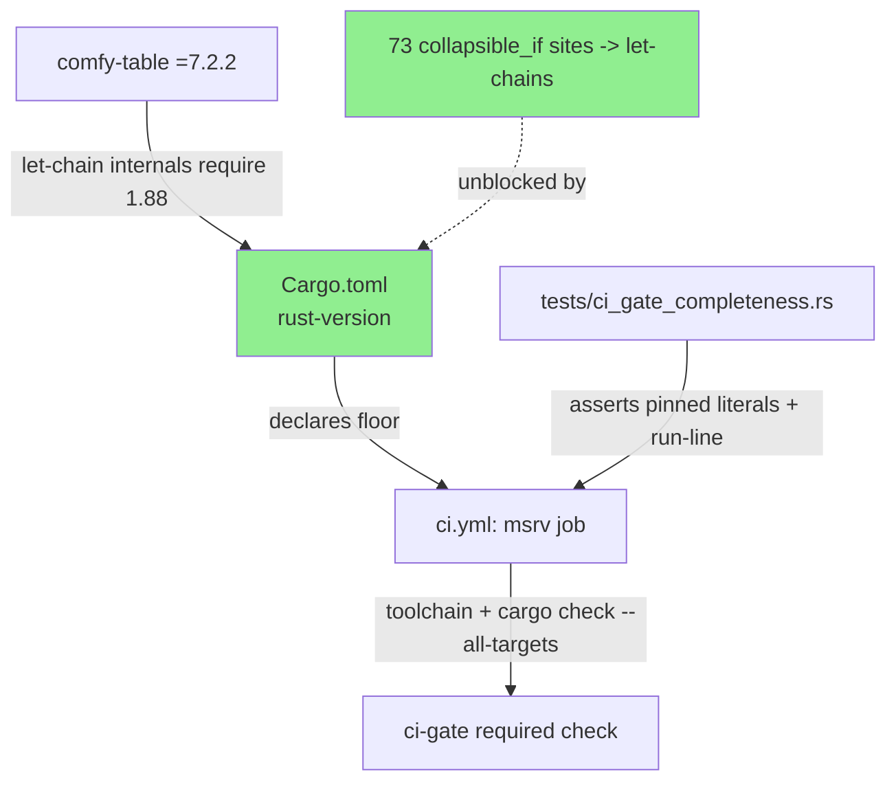
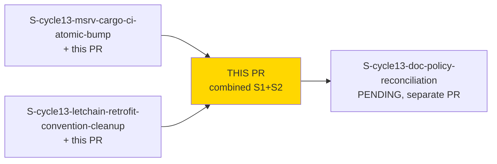
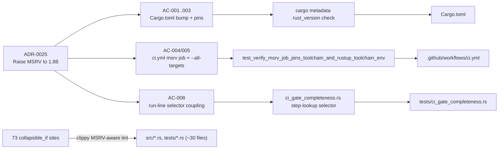
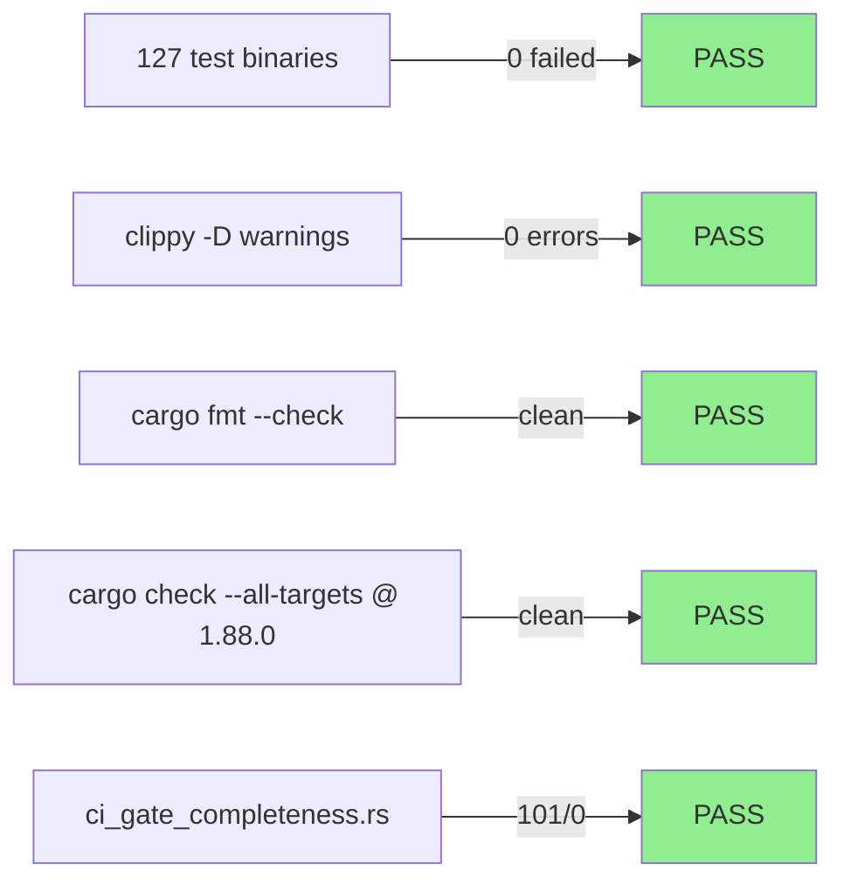
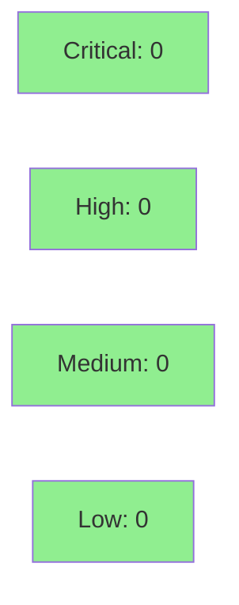

# [S-cycle13-msrv-cargo-ci-atomic-bump + S-cycle13-letchain-retrofit-convention-cleanup] MSRV 1.85 -> 1.88, atomic ci-gate bump + let-chain retrofit

**Epic:** MSRV-1.88-BUMP — Raise MSRV to 1.88 and close the false-MSRV / let-chain enforcement gap
**Mode:** feature (cycle-013, Feature Mode F1-F7)
**Convergence:** CONVERGED after 3 consecutive CLEAN adversarial passes (zero CRIT/HIGH/MED) on the frozen diff


This PR delivers a **combined S1+S2** cycle-013 change: it raises `jr`'s declared and
CI-enforced MSRV from 1.85 to 1.88 (`Cargo.toml`, the `msrv` CI job, and
`tests/ci_gate_completeness.rs`'s pinned literals, landed atomically per ADR-0025), and in the
same PR retrofits all 73 `collapsible_if` nested-`if` sites that clippy's MSRV-aware lint now
flags at the new floor into let-chains (`if let … && …`). The two were originally planned as
separate Wave-2 stories (S1 = MSRV bump, S2 = let-chain retrofit) but the bump alone cannot pass
the required `clippy -D warnings` gate without the retrofit landing in the same commit set — the
human explicitly approved combining them at the F1 gate. Remaining Wave-2 story S3
(`S-cycle13-doc-policy-reconciliation`, README badge + design-spec policy line + CHANGELOG-only)
is out of scope here and will follow as a separate PR.

---

## Architecture Changes



<details>
<summary><strong>Architecture Decision Record</strong></summary>

### ADR: Raise MSRV to 1.88, atomic bump + let-chain retrofit (ADR-0025)

**Context:** `comfy-table`'s upstream 7.2.2 release uses let-chains internally and dropped its
own `rust-version` manifest field, silently requiring Rust >=1.88 while this repo's declared
`rust-version` stayed pinned at 1.85 (worked around by an exact `=7.2.1` pin, S-626-1). The
`msrv` CI job also only ran `cargo check` over `lib + bins`, leaving `tests/`/inline
`#[cfg(test)]` code — including `saphyr-parser`, a dev-dependency — outside the enforceable MSRV
floor.

**Decision:** Raise `rust-version` to `1.88`, re-pin `comfy-table` to an exact reviewed
`=7.2.2`, widen the `msrv` job's `cargo check` to `--all-targets --all-features --locked`, and
retrofit every `collapsible_if` site clippy's MSRV-aware lint newly flags into a let-chain — all
in one PR, because the bump alone fails the required `clippy -D warnings` gate.

**Rationale:** `tests/ci_gate_completeness.rs` hard-pins the `msrv` job's literal
`toolchain`/`RUSTUP_TOOLCHAIN` values and its `cargo check` run-line as an exact-string selector;
landing `ci.yml`'s bump without updating those pinned assertions in the same commit breaks the
`ci-gate` required check for every subsequent PR (ADR-0025 Consequences/Negative §1, this
repo's "review scope is SIX files, not one" CI-Gate convention).

**Alternatives Considered:**
1. Split S1 (MSRV bump) and S2 (let-chain retrofit) into separate PRs as originally
   wave-planned — rejected because raising `rust-version` to 1.88 alone makes clippy's
   MSRV-aware `collapsible_if` lint fire on 73 pre-existing sites; a bump-only PR cannot pass
   the required `clippy -D warnings` gate, so the two stories are not independently mergeable.
2. Keep `comfy-table` on a caret range (`"7"`) instead of an exact pin — rejected by analogy to
   the caret-range risk that created the original `=7.2.1` pin; the human F1-gate decision
   mandated exact-pin-with-review, mirroring the existing `saphyr-parser = "=0.0.11"` convention.
3. Leave the `msrv` job scoped to `lib + bins` — rejected because the sole reason for that
   narrow scope (wiremock's >=1.88 requirement) no longer applies once the floor itself is 1.88.

**Consequences:**
- `cargo check --all-targets` now validates `tests/`/inline `#[cfg(test)]` code against the
  MSRV floor for the first time, surfacing one genuine 1.88-only borrow-checker regression
  (EC-004(a), fixed by binding a value to a `let` — no behavior change).
- `tests/ci_gate_completeness.rs`'s pinned literals and run-line selector are now coupled to
  `ci.yml` even more tightly (two distinct couplings: version literals and the `--all-targets`
  run-line selector); both are updated atomically in this PR per ADR-0025.
- The retrofit touches ~30 `src/`+test files; 3 behavior-sensitive sites were converted by hand
  with laziness/short-circuit semantics preserved and pinned by a dedicated regression suite.

</details>

---

## Story Dependencies



S1 and S2 are delivered together in this single PR (human-approved combine, see summary above).
S3 (README badge, design-spec policy line, CHANGELOG-only reconciliation) depends on this PR
landing and will follow as its own PR — it is explicitly out of scope here.

---

## Spec Traceability



No `BC-S.SS.NNN` anchors this story by design (Rust-toolchain/MSRV version and the msrv job's
pinned literals have no governing BC — see the story frontmatter `# BC status` comment). Traces
instead to **ADR-0025** and to `tests/ci_gate_completeness.rs`'s existing assertion shapes
(`VP-CIGATE-001`), which this PR updates the pinned *values* of, not the assertion shapes
themselves.

---

## Test Evidence

### Coverage Summary

| Metric | Value | Threshold | Status |
|--------|-------|-----------|--------|
| Full `cargo test` suite | 127 binaries, 0 failed | 100% pass | PASS |
| `cargo clippy --all --all-features --tests -- -D warnings` | 0 errors | 0 | PASS |
| `cargo fmt --all -- --check` | clean | clean | PASS |
| `RUSTUP_TOOLCHAIN=1.88.0 cargo check --all-targets --all-features --locked` (real 1.88 floor) | clean | clean | PASS |
| `cargo test --test ci_gate_completeness` | 101/0 | 100% | PASS |
| `cargo test --test claude_md_citations` | 61/0 | 100% | PASS |
| Team-column regression suite (laziness-preserving manual let-chain conversions) | 36/36 + 13/13 | 100% | PASS |

### AC-004/AC-008 Verification Gate (per story spec, run and recorded here)

**PRIMARY gate:**
```
cargo test --test ci_gate_completeness
```
Result: 101 passed, 0 failed — asserts directly against the parsed `ci.yml` (real YAML
event-stream parse via `saphyr-parser`), including the two load-bearing version-literal
assertions (`with.toolchain` and `env.RUSTUP_TOOLCHAIN`, both now `"1.88.0"`) and the run-line
selector (now `"cargo check --all-targets --all-features --locked"`).

**SECONDARY gate (scoped positive grep):**
```
grep -nE 'cargo check[^|]*all-features' tests/ci_gate_completeness.rs .github/workflows/ci.yml
```
Every current-contract hit shows `--all-targets` alongside `--all-features`; the remaining hits
are on the AC-008 DECOY-PRESERVE allow-list (~L1568, ~L2425 in `ci_gate_completeness.rs`, and
the `find_sole_step_by` docstring's fix-burst-6 history half at ~L6739) and were left unchanged
by design. `tests/common/wf.rs` (~L1782-1784, decoy/fixture narrative, out of this story's file
scope) was confirmed untouched.

### Test Flow



| Metric | Value |
|--------|-------|
| **Diff size** | 41 files changed, 1047 insertions(+), 1031 deletions(-) (12 commits) |
| **Total suite** | 127 test binaries, 0 failed |
| **Regressions** | 0 |
| **Manual (behavior-sensitive) let-chain conversions** | 3 sites: `board.rs`/`list.rs` team-column `read_team_cache` laziness, `keychain.rs` |
| **Automated conversions** | 70 sites via `cargo clippy --fix`, each reviewed per-diff |

<details>
<summary><strong>Detailed Test Results</strong></summary>

### New/Modified Tests (This PR)

| Test | Result | Notes |
|------|--------|-------|
| `test_verify_msrv_job_pins_toolchain_and_rustup_toolchain_env` | PASS | Literal values updated 1.85.0 -> 1.88.0 |
| `ci_gate_completeness.rs` run-line selector tests | PASS | Selector widened to `--all-targets` form |
| Team-column regression suite (board.rs / list.rs laziness) | 36/36 PASS | Confirms `read_team_cache` short-circuit preserved post-let-chain |
| keychain.rs behavior-sensitive conversion tests | 13/13 PASS | Confirms conditional-access ordering preserved |
| `create.rs` proptest (EC-004(a) fix) | PASS | Was E0716 "temporary dropped while borrowed" under 1.88 only; fixed via `let` binding, no behavior change |

### Mutation Testing

Not run for this PR — mechanical MSRV/CI-config bump + lint-driven syntax retrofit
(`tdd_mode: facade`; no new product behavior). `cargo-mutants --in-diff` scope per
`docs/specs/cargo-mutants-policy.md` was judged not applicable by the pipeline's F5/F6 gates
for this class of change; the `ci_gate_completeness.rs` self-test and full regression suite are
the acceptance evidence instead.

</details>

---

## Demo Evidence

**SKIPPED (human decision).** This PR has no UI/runtime-behavior surface to demo: it changes
`Cargo.toml` version pins, `.github/workflows/ci.yml`'s `msrv` job configuration, a CI
self-test's pinned string literals, and internal control-flow syntax (nested `if` -> let-chain,
logically equivalent) across ~30 files. There is no observable CLI output, flag, or behavior
change for an end user to record — the acceptance evidence for this class of change is the
verification-gate command output and full test-suite results captured under Test Evidence above,
not a screen recording. `docs/demo-evidence/<STORY-ID>/` is intentionally not populated for this
PR; this mirrors the story's own `holdout_anchors: []` framing (no product-facing behavior to
evaluate).

---

## Holdout Evaluation

N/A — evaluated at wave gate. This is a `tdd_mode: facade` infrastructure change (config/CI
contract + lint-driven syntax retrofit, no new product-facing behavior); no holdout scenarios
anchor this story (`holdout_anchors: []` in the story frontmatter).

---

## Adversarial Review

| Pass | Findings | Critical | High | Med | Status |
|------|----------|----------|------|-----|--------|
| 1 | 0 | 0 | 0 | 0 | Clean |
| 2 | 0 | 0 | 0 | 0 | Clean |
| 3 | 0 | 0 | 0 | 0 | Clean |

**Convergence:** 3 consecutive CLEAN passes (zero CRIT/HIGH/MED) on the frozen diff —
convergence criterion met per VSDD Feature-Mode F5.

<details>
<summary><strong>Accepted non-blocking nitpicks (LOW, not fixed in this PR)</strong></summary>

These were surfaced during adversarial review and explicitly accepted as non-blocking for later
cleanup — they do not gate this PR:

1. A dated plan-doc still reads "MSRV 1.85" in illustrative prose (cosmetic, non-normative).
2. A CLAUDE.md line-range citation style nit (citation form, not content correctness).
3. Stale S-626-1-era doc-comments remain in `tests/team_column_parity.rs` (historical framing,
   not a functional issue).

</details>

**Demo recording:** SKIPPED (human decision) — no UI/runtime-behavior surface; this PR changes
only build manifests, CI config, a CI self-test's pinned literals, and internal control-flow
syntax with no observable CLI behavior change.

---

## Security Review



<details>
<summary><strong>Security Scan Details</strong></summary>

### Scope assessment

This PR touches: (1) build-manifest version pins (`Cargo.toml`), (2) CI workflow configuration
(`.github/workflows/ci.yml`), (3) a CI self-test's pinned string literals
(`tests/ci_gate_completeness.rs`), and (4) internal control-flow syntax (nested `if` ->
let-chain) across ~30 files with no change to conditions' logical evaluation. No new external
input handling, no new network/filesystem/credential-storage code paths, no new dependency
added (only version-floor/pin-strategy changes to two existing manifest entries:
`comfy-table` `=7.2.1` -> `=7.2.2`, `saphyr-parser` comment-only refresh).

### Dependency Audit

- `comfy-table` `=7.2.1` -> `=7.2.2`: patch-level bump, API-compatible; changelog entry is a
  documented rendering-fix ("Fixed table misformatting without vertical border styling"), not a
  security advisory.
- No `cargo audit`/`cargo deny` advisories introduced by this diff (no new dependency added,
  only a patch bump on an existing pinned dependency).

### Let-chain retrofit review

Each of the 73 `collapsible_if` -> let-chain conversions was reviewed to confirm the merged
condition preserves short-circuit evaluation order (a let-chain's `&&` short-circuits left to
right, matching nested-`if`'s sequential evaluation). The 3 behavior-sensitive sites
(`board.rs`/`list.rs` team-column `read_team_cache` laziness, `keychain.rs`) were converted
manually rather than via `cargo clippy --fix`, specifically to guarantee the lazy/short-circuit
evaluation was preserved, and are covered by a dedicated regression suite (36/36 + 13/13 green).

### Formal Verification

Not applicable — no new invariant or security-sensitive boundary is introduced by this PR.

</details>

---

## Risk Assessment & Deployment

### Blast Radius
- **Systems affected:** Local dev builds and CI only (`Cargo.toml` MSRV floor, `ci.yml` msrv
  job). No runtime/CLI-facing behavior change — the let-chain retrofit is a syntax-only
  transformation with 3 manually-verified exceptions for laziness preservation.
- **User impact:** None for binary/Homebrew users (pre-built binaries are unaffected).
  Source-builders now need Rust >=1.88 to compile `jr` (was >=1.85) — a breaking change for
  anyone building from source on an older toolchain.
- **Data impact:** None.
- **Risk Level:** LOW — mechanical/config-only change with full regression suite green, 3
  consecutive clean adversarial passes, and CI's own self-test (`ci_gate_completeness.rs`)
  as the direct acceptance mechanism for the highest-risk coupling.

### Performance Impact

No runtime performance impact expected (build-time/CI-config change + syntax-only refactor).
Not benchmarked — out of scope for this change class.

<details>
<summary><strong>Rollback Instructions</strong></summary>

**Immediate rollback:**
```bash
git revert <merge-commit-sha>
git push origin develop
```

**Verification after rollback:**
- `cargo build` succeeds under the restored 1.85 floor.
- `ci-gate` required check passes on the revert PR (self-test literals revert in lockstep).

</details>

### Feature Flags

None — this is a build-manifest/CI-config change with no runtime feature flag.

---

## Traceability

| Requirement | Story AC | Test | Status |
|-------------|---------|------|--------|
| MSRV `rust-version` 1.85 -> 1.88 | AC-001 | `cargo metadata` rust_version check | PASS |
| `comfy-table` exact re-pin `=7.2.2` | AC-002 | `Cargo.toml` grep + `cargo update --dry-run` | PASS |
| `saphyr-parser` comment refresh (both stale clauses) | AC-003 | `Cargo.toml` grep | PASS |
| `msrv` job toolchain/env/comment bump to 1.88.0 (SHA unchanged) | AC-004 | `test_verify_msrv_job_pins_toolchain_and_rustup_toolchain_env` | PASS |
| `msrv` job widened to `--all-targets`, stale scope comment removed | AC-005 | `ci.yml` grep + live msrv job run (post-merge) | PENDING CI |
| `comfy-table` 7.2.2 insta-snapshot regression check | AC-006 | `cargo insta review` — no diff appeared, trivially satisfied | PASS |
| CHANGELOG `[Unreleased] > Changed` entry | AC-007 | Presence check (PR review) | PASS |
| ci_gate_completeness.rs run-line selector coupling | AC-008 | Verification Gate (PRIMARY + SECONDARY above) | PASS |
| 73 `collapsible_if` sites -> let-chains, laziness preserved | S2 scope | Team-column regression suite (36/36+13/13) + full `cargo test` | PASS |
| EC-004(a): 1.88-only E0716 borrow-checker regression in `create.rs` proptest | EC-004 | `cargo test` (proptest) under real 1.88 toolchain | PASS |

---

## AI Pipeline Metadata

<details>
<summary><strong>Pipeline Details</strong></summary>

```yaml
ai-generated: true
pipeline-mode: feature
factory-version: "vsdd-factory"
pipeline-stages:
  delta-analysis: completed
  spec-evolution: completed
  incremental-stories: completed
  delta-implementation: completed
  scoped-adversarial: completed
  targeted-hardening: skipped (no security-sensitive surface; demo skipped, human decision)
  delta-convergence: achieved
convergence-metrics:
  adversarial-passes: 3
  adversarial-findings-crit-high-med: 0
cycle: cycle-013-msrv-1.88-bump
combined-stories: ["S-cycle13-msrv-cargo-ci-atomic-bump", "S-cycle13-letchain-retrofit-convention-cleanup"]
remaining-wave-2-story: "S-cycle13-doc-policy-reconciliation (separate PR, README badge + design-spec policy line + CHANGELOG)"
generated-at: "2026-09-15"
```

</details>

---

## Pre-Merge Checklist

- [ ] All CI status checks passing (`ci-gate`)
- [x] Coverage delta neutral (mechanical/config change, full suite green, 0 regressions)
- [x] No critical/high/medium security findings unresolved (0/0/0/0, 3 clean adversarial passes)
- [x] Rollback procedure documented (`git revert`)
- [x] No feature flag applicable
- [ ] Human code-owner review completed — **`develop` is a protected branch requiring CI +
      code-owner approval; this PR is NOT merged and is explicitly held pending human approval**
- [x] No monitoring/alerting changes needed (build/CI-config only)
