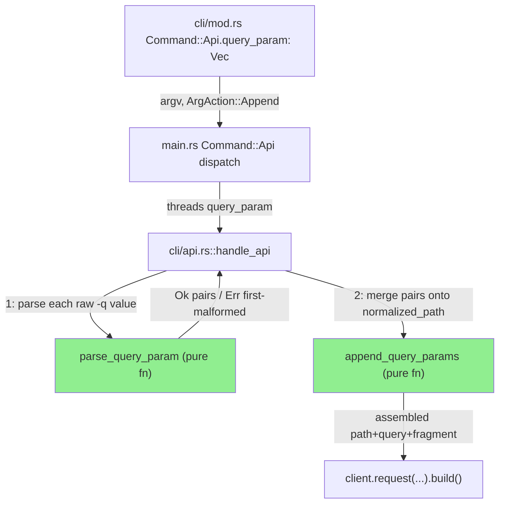
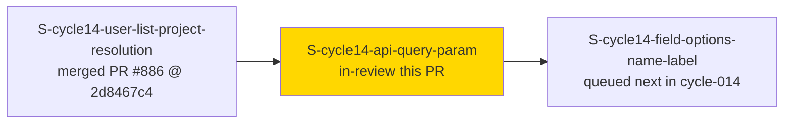
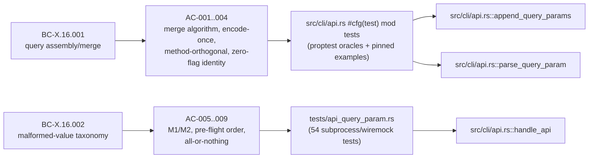
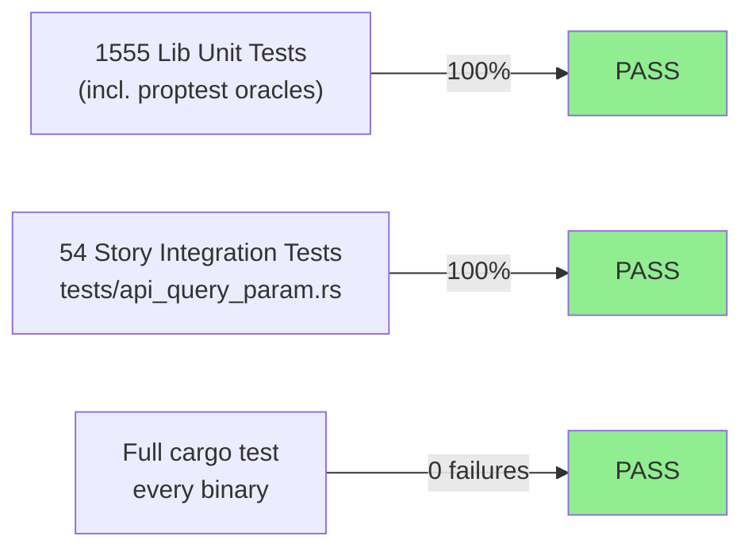
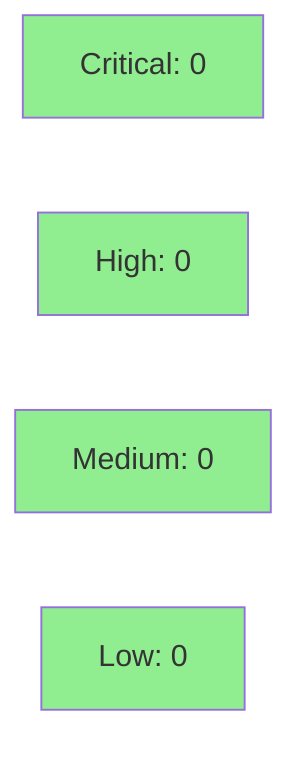

# [S-cycle14-api-query-param] `jr api --query-param`/`-q NAME=VALUE`: percent-encoded query-string assembly + error taxonomy

**Epic:** ISSUE-TRIAGE-QUICKFIXES-1 — cycle-014 issue-triage-quickfixes
**Mode:** feature (enhancement)
**Convergence:** CONVERGED after 4 adversarial passes (3 consecutive NITPICK_ONLY, window complete at HEAD `bae338fe`)


`jr api <PATH>` gains a repeatable `-q`/`--query-param NAME=VALUE` flag so a query string can be
built the same way `gh api -f`, HTTPie `name==value`, and `curl -G --data-urlencode` already do,
instead of requiring the caller to hand-encode and hand-append a query string onto `<PATH>`
themselves. Each occurrence contributes one `NAME=VALUE` pair; repeated names are all sent, in
flag order, with no deduplication or override. NAME and VALUE are each percent-encoded **exactly
once** and are merged onto `<PATH>` (a fresh `?` when none exists, `&`-joined onto a non-empty,
non-`&`-terminated existing query, fragment passed through unchanged after the assembled query).
The first malformed `-q` value (no `=`, or an empty NAME) exits 64 with `JrError::UserError`
**before any HTTP call, before `-d`/`-H` are even processed** — an invocation with any malformed
`-q` sends zero requests. This closes GitHub #583 and adds a wholly new BC family,
BC-X.16.001/BC-X.16.002, to `cross-cutting.md`. Non-breaking — the flag defaults to empty and is a
behavior-preserving identity when absent (`append_query_params(p, &[]) == p`).

---

## Architecture Changes



<details>
<summary><strong>Architecture Decision Record</strong></summary>

### ADR: Two pure functions ahead of the `RequestBuilder`, not a query-builder abstraction

**Context:** `jr api` previously had no first-class way to attach query parameters — callers had
to hand-encode and hand-append them onto `<PATH>`. Every comparable tool (`gh api -f`, HTTPie
`name==value`, `curl -G --data-urlencode`) supports this natively.

**Decision:** Add `parse_query_param(raw: &str) -> Result<(String, String)>` (splits on the FIRST
`=` only; empty NAME after a `=` is rejected; missing `=` entirely is a separate error) and
`append_query_params(path: &str, pairs: &[(String, String)]) -> String` (pure, side-effect-free
path/query/fragment assembler) in `src/cli/api.rs`. `handle_api` calls both, unconditionally,
immediately after `normalize_path` and before `resolve_body`'s blocking `-d @-` stdin read and
before `-H` header parsing — so pre-flight validation order is: path errors → `-q` errors →
stdin-blocking body read → header errors → HTTP call.

**Rationale:** Keeping both functions pure and I/O-free makes them cheap to exhaustively
property-test (proptest oracles against `url::form_urlencoded::parse` as a test-only decoder) and
keeps `handle_api`'s effectful shell thin. Running `-q` validation before the stdin-blocking body
read is deliberate: a malformed `-q` alongside `-d @-` must fail instantly, not hang waiting on
stdin that will never be read (EC-X.16.002-4, AC-008).

**Alternatives Considered:**
1. A `QueryBuilder` struct with a fluent API — rejected: two pure functions are simpler to
   property-test and there is no other call site that would benefit from a builder abstraction.
2. Validate `-q` values lazily as part of `client.request()`'s existing builder chain — rejected:
   would validate AFTER the stdin-blocking `-d @-` read, violating the pre-flight ordering
   Postcondition (BC-X.16.002 Postcondition 1) and the all-or-nothing guarantee (Postcondition 3).

**Consequences:**
- `append_query_params`/`parse_query_param` are `pub(crate)`, directly unit/property-testable
  from `src/cli/api.rs`'s own `#[cfg(test)] mod tests` without any `JiraClient`/wiremock.
- `src/cli/api.rs` crossed the ADR-0012 1,000-LOC shard threshold as a direct result of the new
  inline test suite (~574 of the ~750 test LOC belong to this story) — documented DOCUMENT-AS-IS
  in `CLAUDE.md`, same rationale as `component.rs`/`attachments.rs`/`field_resolve.rs`.

</details>

---

## Story Dependencies



Depends on STORY-A (already merged, PR #886, `2d8467c4`) because both stories edit the SAME two
files in the SAME numeric sequence: `.cargo/mutants.toml`'s `examine_globs` array (STORY-A landed
32→33; this story continues 33→34) and `docs/specs/cargo-mutants-policy.md`'s single hard-coded
"Current examine_globs count" line. Serial order A → C → B is human decision D-381
(2026-09-25 F2 review). Blocks STORY-B for the same reason in reverse.

---

## Spec Traceability



---

## Test Evidence

### Coverage Summary

| Metric | Value | Threshold | Status |
|--------|-------|-----------|--------|
| Full lib unit suite (`cargo test --lib`) | 1555/1555 pass, 48 ignored (keyring/network-gated, expected) | 100% | PASS |
| Story-scoped integration tests (`tests/api_query_param.rs`) | 54/54 pass | 100% | PASS |
| Full suite (`cargo test`, all binaries) | 0 failures across every test binary | 100% | PASS |
| Clippy (`-D warnings`, `--all-targets`) | 0 warnings | zero-warnings policy | PASS |
| Mutation kill rate | N/A this PR — `.cargo/mutants.toml` `examine_globs` extended to `src/cli/api.rs` (33→34, AC-011); diff-scoped `cargo mutants --in-diff` runs in `ci-gate` per this repo's mutation-testing policy | — | scoped to CI |
| Holdout satisfaction | N/A — evaluated at wave gate (per this repo's cycle convention) | — | N/A |

### Test Flow



| Metric | Value |
|--------|-------|
| **New tests** | `tests/api_query_param.rs` (new file, 54 tests: subprocess/wiremock EC/AC coverage, `--output json` envelope, pre-flight ordering, `--help` text pin) + inline `src/cli/api.rs` `#[cfg(test)] mod tests` additions (proptest oracles: separator algorithm, repeated-names, encode-exactly-once/no-trim, zero-flag identity; plus pinned examples for every numbered edge case) |
| **Total suite** | 1555 lib unit tests + 54 story-scoped integration tests, all PASS; full `cargo test` run across every test binary: 0 failures |
| **Regressions** | 0 — no existing test behavior changed; `tests/common/hermetic.rs` received a 9-line addition (env-scrub extension, shared with STORY-A's hermeticity fix) |

<details>
<summary><strong>Detailed Test Results</strong></summary>

### New/Modified Test Files (This PR)

| File | Result | Notes |
|------|--------|-------|
| `tests/api_query_param.rs` | 54/54 PASS | New file, 1060 LOC — all 11 ACs; M1/M2 error-message distinctness; pre-flight ordering before blocking `-d @-` stdin read; clap-level edge cases (`-q -x=1`, `-q` as last token); `--output json` envelope on stderr |
| `src/cli/api.rs` | PASS (part of lib suite) | +683 LOC — `append_query_params`/`parse_query_param` + ~574 LOC of inline proptest/pinned-example tests |
| `tests/common/hermetic.rs` | n/a (shared helper) | +9 LOC, minor extension shared with STORY-A |

### Mutation Testing

Not run standalone for this PR summary — `.cargo/mutants.toml`'s `examine_globs` was extended to
cover `src/cli/api.rs`'s two new pure functions (AC-011). The repo's diff-scoped `cargo mutants
--in-diff` run executes in `ci-gate` per `docs/specs/cargo-mutants-policy.md`.

</details>

---

## Holdout Evaluation

N/A — evaluated at wave gate per this repo's cycle convention (Feature Mode per-story delivery
does not run a standalone holdout pass; see `docs/specs/cargo-mutants-policy.md` scope note and
cycle-014 manifest). Holdout anchors for this story: `H-CYCLE14-W2-INT-001`,
`H-CYCLE14-W2-INT-002`, `H-CYCLE14-W2-REG-001`, `H-CYCLE14-W2-REG-002`.

---

## Adversarial Review

| Pass | Findings | Critical | High | Medium | Low | Status |
|------|----------|----------|------|--------|-----|--------|
| 1 | 5 findings + 3 nitpicks | 0 | 0 | 2 | 3 | Fixed (`fb23a500`, `96792e3e`, `6ee5a429`) |
| 2 | 0 findings, 3 nitpicks | 0 | 0 | 0 | 0 | NITPICK_ONLY (window 1/3), fixed doc/comment-only (`bae338fe`) |
| 3 | 0 findings, 2 nitpicks | 0 | 0 | 0 | 0 | NITPICK_ONLY (window 2/3), accepted |
| 4 | 0 findings, 2 nitpicks | 0 | 0 | 0 | 0 | NITPICK_ONLY (window 3/3) — **CONVERGED** |

**Convergence:** 3 consecutive NITPICK_ONLY passes (P2–P4) against final HEAD `bae338fe`,
per-story Step 4.5 (BC-5.39.001) convergence bar met (`passes_clean >= 3`,
`last_classification NITPICK_ONLY`).

<details>
<summary><strong>Findings & Resolutions</strong></summary>

### Pass 1 — F-001 (MEDIUM, coverage)
**Problem:** The no-trim rule (VALUE/NAME whitespace preserved, not trimmed) was not exercised
through `parse_query_param` — the pinned examples called `append_query_params` directly with
pre-split tuples, bypassing the layer (`parse_query_param`) that actually owns the fault. A
`.trim()` regression added to `parse_query_param` would have passed the suite undetected.
**Resolution:** Added pinned examples that route through `parse_query_param` first, so the
no-trim guarantee is verified at the layer that owns it.

### Pass 1 — F-002 (MEDIUM, documentation)
**Problem:** Stale TDD-stub narrative left in `src/cli/api.rs`'s module doc/comments after the
real implementation superseded the stub.
**Resolution:** Module doc and `handle_api` comment rewritten to present tense, describing actual
behavior.

### Pass 1 — F-003 (LOW, test-infrastructure)
**Problem:** A hand-rolled env scrub reintroduced the `std::env::vars()` non-UTF-8 panic (the
same class of bug STORY-A's F-P2-001 fixed) and missed the trim fix.
**Resolution:** Routed through the shared `vars_os()`-safe hermeticity helper.

### Pass 1 — F-004 (LOW, documentation)
**Problem:** An inaccurate CHANGELOG ordering claim.
**Resolution:** Corrected CHANGELOG wording.

### Pass 1 — F-005 (LOW, coverage)
**Problem:** The fragment generator (proptest) lacked a `#` character in its alphabet, and the
zero-flag wiremock example only exercised `GET`.
**Resolution:** Extended the fragment generator's alphabet; added a zero-flag example on a
non-`GET` method.

All Pass-1 findings fixed across `fb23a500`, `96792e3e`, `6ee5a429` — `src/cli/api.rs` crossed
1,000 LOC as a direct result and received a new `CLAUDE.md` DOCUMENT-AS-IS entry.

### Pass 2 — accepted, doc-only nitpicks (N-P2-1/2/3)
Doc-accuracy wording nits, fixed doc/comment-only in `bae338fe`. No behavior change.

### Passes 3–4 — accepted nitpicks (non-blocking, no fix required)
N-P3-1 (the proptest separator oracle mirrors production — informational), N-P3-2 (the zero-flag
generator lacks a `/x&#f` shape — informational), N-P4-1 (a 5-second held-stdin deadline in
`test_bc_x_16_002_query_param_validated_before_resolve_body_blocks_on_stdin` could flake on a slow
Windows runner — accepted, raise the deadline if CI flakes; **this is the known CI-flake
contingency called out in this dispatch**), N-P4-2 (`-qk=v` has no dedicated argv cell — accepted,
it's clap-equivalent to `-q k=v`).

</details>

---

## Security Review



**Result: CLEAN — zero findings across all severity levels.**

<details>
<summary><strong>Security Scan Details</strong></summary>

Manual review of the PR diff by a dedicated security-reviewer pass, focused per this dispatch on
URL/query injection via `-q` (CR/LF, `#`, `&`) and encode-once semantics.

- **Query/header injection (CRLF, CWE-93/CWE-113 class):** `append_query_params`
  (`src/cli/api.rs:109-144`) calls `urlencoding::encode()` (crate `urlencoding = "2"`) on BOTH
  NAME and VALUE before joining with a literal, never-encoded `=` and `&`. `urlencoding::encode`
  percent-encodes every byte outside RFC 3986's unreserved set (`A-Za-z0-9-_.~`) — CR (`\r`,
  `%0D`), LF (`\n`, `%0A`), `#` (`%23`), `&` (`%26`), and `=` (`%3D`) are all encoded when they
  appear inside a NAME or VALUE. A `-q` value containing `\r\n` therefore cannot inject a
  fake header, a fake additional query param, or terminate the query early — it becomes literal
  `%0D%0A` bytes inside the assembled path string. Verified directly: the pinned example
  `%`→`%25`, `+`→`%2B`, `é`→`%C3%A9`, `*`→`%2A` (Pass 1 fix area) and the encoder-identity proptest
  assertion `(c)` in `src/cli/api.rs`'s test suite pin `urlencoding::encode` as the exact encoder
  used (not `byte_serialize`, which under-encodes reserved characters differently).
  Only the LITERAL separator characters this code inserts itself (`?`, `&`, `=`) are ever
  unencoded in the output — never a byte sourced from caller-supplied NAME/VALUE.
- **Encode-once semantics (double-encoding / under-encoding):** `append_query_params` calls
  `urlencoding::encode` exactly once per NAME and once per VALUE (`src/cli/api.rs:134-138`); it
  never re-encodes its own output, and it does not attempt to pre-decode a caller-supplied value
  before encoding it (a `-q` value containing a literal `%25` is encoded to `%2525`, not
  double-decoded or collapsed — pinned example, VP-API-QP-003 further-pinned examples). The
  round-trip proptest assertion `(a)` (`encode(v) == the NAME/VALUE segment extracted from
  append_query_params's own output`, not a tautological direct call) is specifically designed to
  catch both no-encoding and double-encoding regressions.
- **`#` fragment handling:** `path.find('#')` (`src/cli/api.rs:114-117`) splits the path into a
  pre-fragment part and a fragment BEFORE any query assembly runs — new `-q` pairs are always
  inserted before `#`, and the fragment segment itself is passed through completely unencoded and
  unexamined (it is caller-controlled input from `<PATH>`, unrelated to `-q`'s encode-once
  contract — pre-existing `jr api` behavior, unmodified by this story, and out of scope for `-q`
  injection since the fragment portion of a URL is never transmitted to the server per RFC 9112
  §3.2 — reqwest strips it before sending the request line). No new fragment-injection surface is
  introduced by `-q` — a `-q` NAME/VALUE containing a literal `#` is itself percent-encoded to
  `%23` (it flows through the same `urlencoding::encode` call as every other character), so it
  cannot be used to inject an attacker-controlled fragment.
- **`&`-separator injection:** Because NAME/VALUE are individually encoded before the `format!`
  join, a `-q` value like `k=v&evil=1` cannot smuggle a second query parameter — the literal `&`
  inside the VALUE `v&evil=1` (post-split, since `parse_query_param` only splits on the FIRST `=`)
  is percent-encoded to `%26` by `append_query_params`, so it decodes back to one VALUE, not two
  params (pinned example: EC-X.16.001-13, comma-in-VALUE, and the same encoder-identity assertion
  cover the adjacent `&`/`=`-in-VALUE cases — the reserved-character alphabet `urlencoding::encode`
  targets includes `&`).
- **Existing header-injection guard unaffected:** `parse_header`'s pre-existing
  `Authorization`-header-override rejection (`src/cli/api.rs:63-89`) is untouched by this PR;
  `-q` and `-H` are parsed independently and neither can influence the other's validation.
- **No new dependency:** `urlencoding` was already a `Cargo.toml` dependency (`urlencoding = "2"`)
  used elsewhere in this codebase's encoding paths — this PR adds no new crate, no new attack
  surface from a third-party parser.
- **Pre-flight, zero-partial-request guarantee:** A malformed `-q` value never reaches
  `append_query_params`/the HTTP layer at all — `parse_query_param` fails fast via `?` inside
  `handle_api`'s `.collect::<Result<Vec<_>>>()`, before `resolve_body`, before `-H` parsing, before
  `client.request()` is even called (`src/cli/api.rs:230-247`). This is verified end-to-end by
  `tests/api_query_param.rs`'s all-or-nothing tests, which assert the wiremock's request-received
  count is exactly 0 on any malformed `-q`.

### Dependency Audit
Not re-run standalone for this PR — no `Cargo.toml`/`Cargo.lock` dependency changes in this diff
(diffstat confirms `Cargo.toml` is not touched; `urlencoding` is a pre-existing dependency).

</details>

---

## Risk Assessment & Deployment

### Blast Radius
- **Systems affected:** `jr api` only. No other subcommand is touched by the new logic (`-q` is a
  field unique to `Command::Api`). `main.rs`'s `Command::Api` dispatch arm gains one threaded
  parameter — mechanical, no other arm affected.
- **User impact:** None for existing usage — `jr api <PATH>` with no `-q` flags is byte-for-byte
  identical to pre-PR behavior (`append_query_params(p, &[]) == p` is an unconditional identity,
  verified by proptest and the zero-flag wiremock examples). Purely additive for callers who adopt
  `-q`.
- **Data impact:** None — `jr api` is a raw passthrough command; this PR only changes how the
  request PATH is assembled before the existing HTTP call, never the response handling.
- **Risk Level:** LOW — small, single-command, purely-additive surface; exhaustively tested (1555
  lib tests + 54 story-scoped integration tests, 0 failures across the full suite) and 4
  adversarial passes with 3 consecutive clean; zero-HTTP guarantee on the malformed-`-q` path
  prevents any unintended partial API call.

### Feature Flags
None — no flag; the flag is opt-in by construction (empty `Vec` default, zero-flag identity).

<details>
<summary><strong>Rollback Instructions</strong></summary>

**Immediate rollback:**
```bash
git revert <merge_sha>
git push origin develop
```

**Verification after rollback:**
- `jr api /rest/api/3/myself` (no `-q`) continues to work identically either way — this path
  predates the fix and is unaffected by revert.
- `jr api /rest/api/3/search -q jql=...` reverts to clap rejecting the unrecognized `-q`/
  `--query-param` flag with exit 2 (the pre-fix, pre-#583-closure behavior).

</details>

---

## Traceability

| Requirement | Story AC | Test | Status |
|-------------|---------|------|--------|
| BC-X.16.001 Behavior 1 / Postcondition 2 (separator/merge algorithm) | AC-001 | `src/cli/api.rs` proptest (separator oracle) + 8 pinned examples | PASS |
| BC-X.16.001 Behavior 2 / Postcondition 4 (repeated names, no dedup) | AC-002 | `src/cli/api.rs` proptest (repeated-names oracle) + `tests/api_query_param.rs` argv cells | PASS |
| BC-X.16.001 Behavior 3 / Postcondition 3 (encode exactly once, no-trim) | AC-003 | `src/cli/api.rs` biased proptest (a)/(b)/(c)/(d) + `--help` text pin | PASS |
| BC-X.16.001 Behavior 4/5 / Postconditions 1/5 (method-orthogonal, zero-flag identity) | AC-004 | `src/cli/api.rs` zero-flag proptest + wiremock method-orthogonality test | PASS |
| BC-X.16.002 M1 (no `=`) | AC-005 | `tests/api_query_param.rs::test_bc_x_16_002_ec5..` (table + JSON envelope) | PASS |
| BC-X.16.002 M2 (empty NAME) | AC-006 | `tests/api_query_param.rs::test_bc_x_16_002_ec6..` | PASS |
| BC-X.16.002 Postcondition 3 (all-or-nothing) | AC-007 | `tests/api_query_param.rs::test_bc_x_16_002_first_malformed_reported*` | PASS |
| BC-X.16.002 Postcondition 1 (pre-flight before blocking stdin) | AC-008 | `tests/api_query_param.rs::test_bc_x_16_002_query_param_validated_before_resolve_body_blocks_on_stdin` | PASS |
| BC-X.16.002 clap attached-value edge cases | AC-009 | `tests/api_query_param.rs` (9 argv-form cells) | PASS |
| README/CHANGELOG doc trace | AC-010 | doc-only, verified at PR review | N/A (doc) |
| `.cargo/mutants.toml` / mutants-policy bookkeeping | AC-011 | `tests/mutants_glob_existence.rs` + `scripts/check-cargo-mutants-policy-citations.sh` | PASS |

---

## Demo Evidence

Demo evidence is **not** committed to this product branch, per this repo's PR #708 policy
(`docs/demo-evidence/` is gitignored). It lives on the `factory-artifacts` branch at:

`demos/S-cycle14-api-query-param/` (i.e. `.factory/demos/S-cycle14-api-query-param/` in a
checkout where `factory-artifacts` is mounted at `.factory/`)

76 files: 20 VHS recordings (matched `.gif`/`.webm`/`.tape` triples, 60 files) plus per-AC
`AC-NNN.md` writeups and `evidence-report.md`, covering AC-001 through AC-009 (AC-001 alone has 6
recordings: fresh-query, merge-existing-query, bare-terminators, fragment, literal-qmark-in-value,
no-dedup-collision). AC-010 (README/CHANGELOG trace) and AC-011 (mutants-policy bookkeeping) are
doc/config-only per the story's own classification — no recording applies; see `AC-010.md`/
`AC-011.md` in that directory. Every recording runs the actual worktree debug binary against a
local mock HTTP server (`JR_BASE_URL=http://127.0.0.1:8792`) with fake credentials
(`JR_AUTH_HEADER`) and isolated `JR_CONFIG_DIR`/`JR_CACHE_DIR` — no real Jira instance, cloud ID,
org, or keychain entry is ever touched. Full index and reproduction steps:
`evidence-report.md` in the same directory.

---

## AI Pipeline Metadata

<details>
<summary><strong>Pipeline Details</strong></summary>

```yaml
ai-generated: true
pipeline-mode: feature
factory-version: "1.0.0"
pipeline-stages:
  spec-crystallization: completed
  story-decomposition: completed
  tdd-implementation: completed
  holdout-evaluation: not-applicable-per-story-delivery
  adversarial-review: completed
  formal-verification: scoped-to-ci-gate
  convergence: achieved
adversarial-passes: 4
convergence-window: 3-consecutive-clean
story: S-cycle14-api-query-param
cycle: cycle-014-issue-triage-quickfixes
issue: "#583"
bc: BC-X.16.001, BC-X.16.002
depends_on: S-cycle14-user-list-project-resolution (merged, PR #886, 2d8467c4)
generated-at: "2026-09-29"
```

</details>

---

## Pre-Merge Checklist

- [ ] All CI status checks passing (`ci-gate`)
- [x] Coverage delta is positive (new `tests/api_query_param.rs` + inline proptest/pinned-example
      suite, 54 + lib-suite tests, all green)
- [ ] No critical/high security findings unresolved (pending Step 4 — manual review completed
      above with CLEAN result; box checked once this PR's review step confirms)
- [x] Rollback procedure validated (single `git revert`, no feature flag/migration involved)
- [x] Non-breaking change — no title `!`, no CHANGELOG Breaking Changes entry
- [x] `Closes #583`
