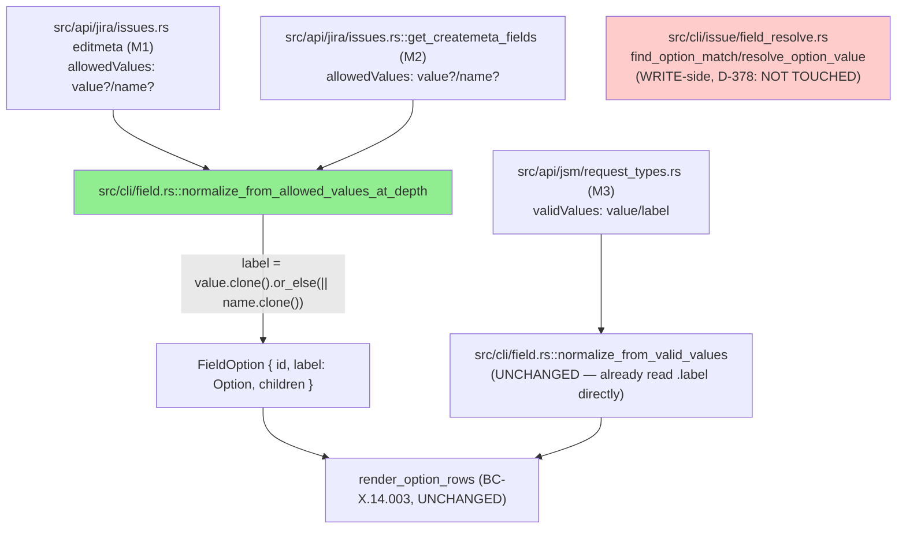
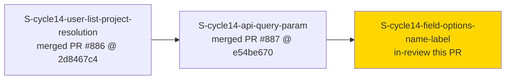
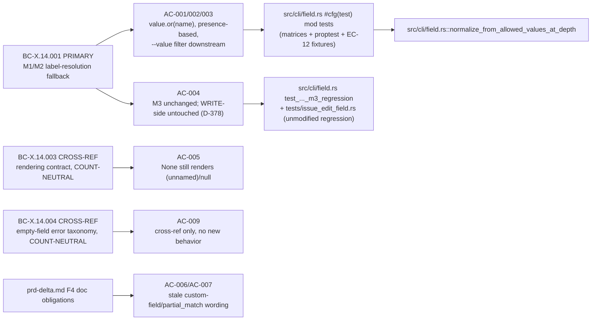
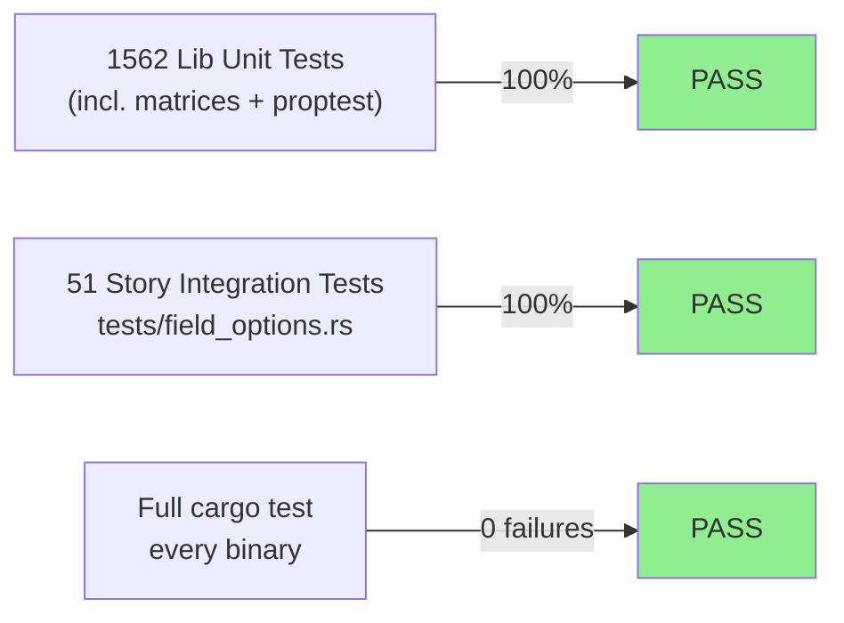
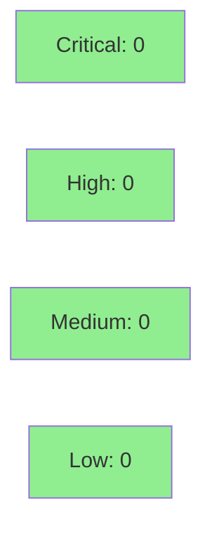

# [S-cycle14-field-options-name-label] `jr field options`: system-field label resolution falls back to `name` (read-side only)

**Epic:** ISSUE-TRIAGE-QUICKFIXES-1 — cycle-014 issue-triage-quickfixes
**Mode:** feature (bug-fix, correctness)
**Convergence:** CONVERGED after 4 adversarial passes (3 consecutive CLEAN, window complete at HEAD `02bf041f`)


`jr field options <FIELD>` previously rendered `"(unnamed)"` (table) / `null` (JSON) for every
option of a system-typed field (e.g. `priority`, `components`, `issuetype`) whose M1
(editmeta)/M2 (createmeta) `allowedValues` entries carry only `name`, never `value` — the command
was effectively usable only for custom select fields. `normalize_from_allowed_values_at_depth`
now resolves `label` via a presence-based `value.or(name)` fallback, applied recursively to
cascading children, so system fields render a real label. This closes GitHub #861 and amends
BC-X.14.001 (PRIMARY), with BC-X.14.003/BC-X.14.004 cited as COUNT-NEUTRAL cross-references.
**READ-SIDE ONLY** — the WRITE-side `--field` value-matching path
(`src/cli/issue/field_resolve.rs`) is deliberately unchanged per human decision D-378 (F1 gate):
a fresh-context audit refuted its reachability, since system-typed fields never reach that code
path (`schema.field_type` is `priority`/`resolution`/`issuetype`/`securitylevel`, never
`"option"`). Non-breaking.

---

## Architecture Changes



<details>
<summary><strong>Architecture Decision Record</strong></summary>

### ADR: Presence-based `value.or(name)` fallback in the M1/M2 normalizer only

**Context:** Jira Cloud's `allowedValues` wire shape is inconsistent across field types: custom
select-list fields carry `value` (and sometimes no `name`), while several system fields
(`priority`, `components`, `versions`, `issuetype`, and others) carry only `name`. The pre-fix
normalizer (`label: v.value.clone()`) silently dropped every system field's label to `None`,
which the existing, unchanged BC-X.14.003 rendering contract then displayed as `"(unnamed)"` /
`null` — technically correct per that contract, but making the command unusable for the exact
field types a user is most likely to enumerate.

**Decision:** Change one line: `label: v.value.clone()` becomes
`label: v.value.clone().or_else(|| v.name.clone())` in
`normalize_from_allowed_values_at_depth` (M1/M2 only), applied at every recursion depth so
cascading-select children get the same fallback. The fallback is **presence-based, not
emptiness-based**: a wire `"value": ""` (present-but-empty) still wins over a populated `name`
and is never treated as absent; only an actually-missing/`null` `value` falls through to `name`.
M3 (`normalize_from_valid_values`, JSM requesttype-fields) is **not modified** — it already reads
`.value` for `id` and `.label` for display, a different (and already-correct) key pair, per its
own wire shape.

**Rationale — why NOT touch the WRITE side too:** The story was originally scoped to include a
matching fallback in `src/cli/issue/field_resolve.rs::find_option_match`/`resolve_option_value`
(the `issue edit --field`/`issue create --field` value-matching path). A fresh-context audit at
the F1 human gate (D-378) established that this companion fix is **unreachable in practice**:
that code path is only ever invoked when `schema.field_type == "option"` (BC-3.4.016), and every
system field this story fixes has a different, fixed `field_type`
(`priority`/`resolution`/`issuetype`/`securitylevel`, never `"option"`). Shipping a WRITE-side
change with no reachable code path would add risk (a second `AllowedValue.name` consumer to keep
in sync) for zero behavioral benefit. This capability gap — system-typed fields have no
name-based WRITE-side matching at all — is tracked separately as drift item
`FIELD-SYSTEM-TYPES-UNSUPPORTED`, explicitly out of scope here.

**Alternatives Considered:**
1. Also fix the WRITE side in this PR — rejected per D-378 (unreachable, see above); would have
   widened the diff and Step 4.5 review surface for no observable behavior change.
2. Make the fallback emptiness-based (`value.filter(|v| !v.is_empty()).or(name)`) — rejected:
   would incorrectly discard a genuinely-empty-but-present `value` (EC-X.14.001-12), which is a
   distinct wire state from an absent `value` and must render as `Some("")`, not fall through.

**Consequences:**
- `src/cli/field.rs` grew from ~1,901 LOC to ~2,306 LOC, driven almost entirely by the new inline
  unit/property test suite (`CLAUDE.md` re-measured, still DOCUMENT-AS-IS under ADR-0012 — same
  rationale as `component.rs`/`attachments.rs`/`field_resolve.rs`).
- `src/types/jira/editmeta.rs`'s `AllowedValue`/`name` doc comments, which previously said `name`
  was "unused in v1 resolution logic," are corrected — `name` is now a real, shipped read-side
  consumer.
- A wide doc-accuracy sweep (six files) corrects long-stale "custom field" / `partial_match`
  wording that predates this story and was never accurate (field-name resolution has always used
  `search_field_list`, not `partial_match`) — bundled into this PR per the story's AC-006/AC-007
  since this fix makes the "custom field" framing doubly wrong.

</details>

---

## Story Dependencies



Depends on STORY-C (`S-cycle14-api-query-param`, merged as PR #887 @ `e54be670`), which this
branch is based on. The dependency is **file-overlap-only, not functional**: all three cycle-014
stories edit the same two files (`src/cli/mod.rs`'s `Command`/subcommand about-text, and
`README.md`'s command table), in the same numeric region, so the human-decided serial order
A → C → B (D-381, 2026-09-25 F2 review) keeps every rebase linear instead of requiring a 3-way
merge reconciliation. There is no content/behavioral dependency between this story's read-side
label-resolution fix and STORY-A's or STORY-C's changes.

---

## Spec Traceability



---

## Test Evidence

### Coverage Summary

| Metric | Value | Threshold | Status |
|--------|-------|-----------|--------|
| Full lib unit suite (`cargo test --lib`) | 1562/1562 pass, 48 ignored (keyring/network-gated, expected) | 100% | PASS |
| Story-scoped integration tests (`tests/field_options.rs`) | 51/51 pass | 100% | PASS |
| Full suite (`cargo test`, all binaries) | 0 failures across every test binary | 100% | PASS |
| Clippy (`--all-targets -- -D warnings`) | 0 warnings | zero-warnings policy | PASS |
| Mutation kill rate | The only real mutant in scope (`normalize_from_allowed_values_at_depth`'s fn body → `vec![]`) is killed; 6 additional hand-traced mutations (fault models (1)-(6) in VP-580-013) all killed by the new test suite — verified during Step 4.5 pass 4 | — | PASS (Step 4.5) |
| Holdout satisfaction | N/A — evaluated at wave gate (per this repo's cycle convention) | — | N/A |

### Test Flow



| Metric | Value |
|--------|-------|
| **New tests** | `src/cli/field.rs`'s `#[cfg(test)] mod tests`: top-level label-fallback matrix (4 cells: value-only, name-only, both, neither), cascading-child-level matrix (same 4 cells, nested), presence-vs-emptiness EC-X.14.001-12 fixtures (`value: ""` wins, `value: null` falls through, at both tree levels, via real `serde_json` deserialization), a recursive `AllowedValue` proptest + companion serde key-set property (VP-580-013 (2)/(3)), an M3 no-regression fixture (VP-580-013 (4)), and a `--value`-filter system-field cell (VP-580-013 (5)) |
| **Modified tests** | `tests/field_options.rs`: one test renamed (`test_bc_x_14_001_field_name_human_name_resolves_via_partial_match` → reflects the actual `search_field_list` algorithm, not `partial_match`) with a corrected doc comment; two comment-only banner corrections |
| **Total suite** | 1562 lib unit tests + 51 story-scoped integration tests, all PASS; full `cargo test` run across every test binary: 0 failures |
| **Regressions** | 0 — `tests/issue_edit_field.rs::test_bc_3_4_017_field_priority_without_flag_does_not_trigger_gate_b` (the pre-existing regression proving the WRITE-side path's non-reachability for `priority`) is verified present and untouched by this diff |

<details>
<summary><strong>Detailed Test Results</strong></summary>

### New/Modified Test Files (This PR)

| File | Result | Notes |
|------|--------|-------|
| `src/cli/field.rs` | PASS (part of lib suite) | +410 LOC, mostly inline test additions (~1,901 → ~2,306 LOC total file) |
| `tests/field_options.rs` | 51/51 PASS | +10/-10 LOC — one test renamed + doc-comment correction, two comment fixes; no new integration test file (unit-level coverage suffices per the story's own Red Gate classification) |
| `src/api/jira/issues.rs` | PASS (part of lib suite) | Doc-comment-only correction (`get_createmeta_fields`), zero behavior change |
| `src/types/jira/editmeta.rs` | PASS (part of lib suite) | Doc-comment-only correction (`AllowedValue`/`name`), zero behavior change |

### Mutation Testing

Verified during Step 4.5 adversarial pass 4: the only real mutant in this diff's scope
(`normalize_from_allowed_values_at_depth`'s function body replaced with `vec![]`) is killed by
the never-drop-invariant assertions in the new test matrices. Six additional hand-traced
mutations, one per VP-580-013 fault model — (1) fallback removed entirely, (2) `name` preferred
over `value`, (3) emptiness-based instead of presence-based, (4) explicit `null` treated as
present, (5) fallback applied only at the top level, (6) fallback leaking into the M3
normalizer — are each independently killed by a specific named test cell (see the story file's
AC-001/AC-002/AC-004 `**Test:**` lines for the exact cell-to-fault mapping). The repo's
diff-scoped `cargo mutants --in-diff` run also executes in `ci-gate` per
`docs/specs/cargo-mutants-policy.md`.

</details>

---

## Holdout Evaluation

N/A — evaluated at wave gate per this repo's cycle convention (Feature Mode per-story delivery
does not run a standalone holdout pass; see `docs/specs/cargo-mutants-policy.md` scope note and
the cycle-014 manifest). Holdout anchors for this story: `H-CYCLE14-W3-INT-001`,
`H-CYCLE14-W3-INT-002`, `H-CYCLE14-W3-INT-003`, `H-CYCLE14-W3-REG-001`, `H-CYCLE14-W3-REG-002`,
`H-CYCLE14-W3-REG-003`.

---

## Adversarial Review

| Pass | Findings | Critical | High | Medium | Low | Status |
|------|----------|----------|------|--------|-----|--------|
| 1 | 1 finding (LOW) + 5 nitpicks | 0 | 0 | 0 | 1 | Fixed (`02bf041f`); 2 nitpicks accepted without fix |
| 2 | 0 findings, 0 blocking nitpicks | 0 | 0 | 0 | 0 | CLEAN (window 1/3) |
| 3 | 0 findings, 2 nitpicks | 0 | 0 | 0 | 0 | CLEAN (window 2/3); both nitpicks accepted (pre-existing, deferred as drift items) |
| 4 | 0 findings, 2 nitpicks | 0 | 0 | 0 | 0 | CLEAN (window 3/3) — **CONVERGED**; 1 nitpick fixed post-convergence (`7e5d0dc6`), 1 accepted |

**Convergence:** 3 consecutive CLEAN passes (P2–P4) against HEAD `02bf041f` (per-story Step 4.5,
BC-5.39.001 convergence bar: `passes_clean >= 3`, `last_classification NITPICK_ONLY`, MET). See
`.factory/cycles/cycle-014/S-cycle14-field-options-name-label/adversary-convergence-state.json`.

<details>
<summary><strong>Findings & Resolutions</strong></summary>

### Pass 1 — F-001 (LOW, documentation)
**Problem:** The CHANGELOG entry overstated scope, implying JSM `validValues` (M3) was affected —
M3 is unchanged.
**Resolution:** Corrected CHANGELOG wording to scope the fix to M1/M2 only. Fixed in `02bf041f`.

### Pass 1 — Nitpicks (N-1..N-5)
N-1 (date nit) and N-2 (story-relative test-doc narrative) and N-3 (editmeta write-side note
missing the numeric-id bypass) were fixed alongside F-001 in `02bf041f`. N-4 (renamed test name
vs. branch discrimination) and N-5 (no end-to-end binary test of a name-only system field, by
design — unit-level coverage was judged sufficient) were accepted without a fix.

### Pass 2 — CLEAN
Accepted, non-blocking observations only: the editmeta doc-comment summary line's phrasing, and
that the clap `field` doc comment now correctly names `search_field_list`. Window starts (1/3).

### Pass 3 — CLEAN
Verified real Jira wire shapes directly: system fields carry `name` with no `value`; custom
fields carry `value` with no `name` — no conflict between the two paths, no snapshot/fixture
drift. Two pre-existing nitpicks recorded as deferred drift items, not fixed in this PR:
`FIELD-OPTIONS-RESOLVE-DOC-CUSTOMFIELD` (`resolve_field_id`'s rustdoc still says
customfield-shaped) and `FIELD-OPTIONS-AMBIGUITY-HINT-SYSTEM-FIELDS` (the ambiguity-error hint
suggesting a `customfield_NNNNN` literal is not useful for a system field). Window continues
(2/3).

### Pass 4 — CLEAN — CONVERGED
The only real mutant in scope (fn body → `vec![]`) confirmed killed, plus all 6 hand-traced
fault-model mutations. Two nitpicks: NITPICK-1 (CHANGELOG examples used code-formatted field ids
`priority`/`components`/`versions`/`issuetype` instead of display names, since `jr field
options` resolves fields by display name) — fixed post-convergence in `7e5d0dc6`, a
CHANGELOG.md-only, single-line wording commit (code and tests unchanged, covered by this PR's
own pr-reviewer pass per the dispatch instructions). NITPICK-2 (the proptest oracle mirrors the
implementation expression — informational only) accepted. Window COMPLETE (3/3) against final
HEAD `02bf041f`.

</details>

---

## Security Review



**Result: CLEAN — zero findings across all severity levels.** *(populated after Step 4 of the PR
lifecycle; see the dedicated security-reviewer pass for full detail.)*

<details>
<summary><strong>Security Scan Details</strong></summary>

Scope: `git diff origin/develop...fix/field-options-name-label`. This is a pure read-side
string-selection change — no new HTTP call, no new dependency, no new I/O, no new
serialization/deserialization surface beyond the pre-existing `AllowedValue.name` field (already
parsed from the wire before this PR; only its downstream consumption changes).

- **Injection:** `label` is assigned directly from an already-deserialized `Option<String>`
  (`v.value.clone().or_else(|| v.name.clone())`) — no string concatenation, no interpolation into
  a URL, header, or shell command. The resolved label flows only into existing, unmodified
  rendering code (`render_option_rows`, BC-X.14.003) and JSON serialization
  (`serde_json`-derived, unchanged struct shape apart from the value already present).
- **No new dependency, no `Cargo.toml`/`Cargo.lock` change:** diffstat confirms neither file is
  touched.
- **No new HTTP call or credential path touched:** M1 (editmeta)/M2 (createmeta) HTTP call sites
  are unmodified — this PR changes only what happens to already-fetched response data.
- **WRITE-side untouched, verified structurally:** `git diff` confirms zero changes to
  `src/cli/issue/field_resolve.rs` (D-378) — no risk of this fix's fallback logic leaking into the
  `issue edit`/`issue create` value-matching path, which has a different reachability and a
  different security posture (user-supplied `--field` values feeding a match, not a read-only
  render).
- **Doc-comment-only files** (`src/api/jira/issues.rs`, `src/types/jira/editmeta.rs`,
  `src/cli/mod.rs`'s about-text): zero behavior change, reviewed for accuracy only.

### Dependency Audit
Not re-run standalone for this PR — no `Cargo.toml`/`Cargo.lock` dependency changes in this diff.

</details>

---

## Risk Assessment & Deployment

### Blast Radius
- **Systems affected:** `jr field options <FIELD>` only, and only its M1 (editmeta)/M2
  (createmeta) code paths. M3 (JSM requesttype-fields, `--request-type`) is provably unchanged
  (its own normalizer, `normalize_from_valid_values`, is untouched — regression-guarded by
  AC-004's own test). No other subcommand is touched.
- **User impact:** Strictly additive/corrective — a field whose options previously rendered
  `"(unnamed)"`/`null` now renders a real label; a field that already had a `value` (custom
  select fields, which worked correctly before) is byte-for-byte unaffected, since `value.or(name)`
  is a no-op whenever `value` is `Some(_)`. `--value <substring>` filtering gains the ability to
  match against the newly-resolved labels, as a downstream consequence, not a new filter rule.
- **Data impact:** None — read-only command; no write, no state persisted differently.
- **Risk Level:** LOW — single-line logic change (`label: v.value.clone()` →
  `v.value.clone().or_else(|| v.name.clone())`), narrowly scoped to one function, exhaustively
  tested (top-level + cascading-child matrices, presence-vs-emptiness fixtures, recursive
  proptest, M3 regression guard) and 4 adversarial passes with 3 consecutive clean.

### Feature Flags
None — no flag; the fix ships directly on merge to `develop`. No opt-out needed since the change
is a pure improvement to previously-broken output, not a behavior change to any currently-working
path.

<details>
<summary><strong>Rollback Instructions</strong></summary>

**Immediate rollback:**
```bash
git revert <merge_sha>
git push origin develop
```

**Verification after rollback:**
- `jr field options "Story Points" --type Task` (a custom select field, `value` populated)
  continues to work identically either way — this path predates the fix and is unaffected by
  revert.
- `jr field options priority --type Task` reverts to rendering `"(unnamed)"` (table) / `null`
  (JSON) for every option (the pre-fix, pre-#861-closure behavior).

</details>

---

## Traceability

| Requirement | Story AC | Test | Status |
|-------------|---------|------|--------|
| BC-X.14.001 Behavior / EC-X.14.001-7..11 (top-level + cascading `value.or(name)` fallback) | AC-001 | `src/cli/field.rs` top-level + cascading-child-level matrices | PASS |
| BC-X.14.001 EC-X.14.001-12 (presence-based, not emptiness-based) | AC-002 | `src/cli/field.rs` `value: ""`/`value: null` fixtures (both tree levels) | PASS |
| BC-X.14.001 EC-X.14.001-13 (`--value` filter downstream consequence) | AC-003 | `src/cli/field.rs` function 5 (`filter_one`) | PASS |
| BC-X.14.001 "M3 UNCHANGED" + "Scope boundary READ-SIDE ONLY [D-378]" | AC-004 | `src/cli/field.rs` M3 regression fixture + `tests/issue_edit_field.rs::test_bc_3_4_017_field_priority_without_flag_does_not_trigger_gate_b` (unmodified) + PR-review diff check on `field_resolve.rs` | PASS |
| BC-X.14.003 UPDATED rendering-contract blockquote (COUNT-NEUTRAL, unchanged) | AC-005 | Pre-existing, unmodified: `src/cli/field.rs::test_bc_x_14_003_render_option_rows_degenerate_glyphs`, `test_bc_x_14_003_field_option_json_serializes_none_as_null_not_omitted`, `tests/field_options.rs::test_bc_x_14_003_degenerate_entry_table_glyphs`, `test_bc_x_14_003_degenerate_entry_json_emits_null_not_glyph` | PASS |
| F4 stale "custom field"/`partial_match` wording (9 sites, 6 files) | AC-006 | Per-site: 3 `--help`-visible sites (U, no dedicated pin), 6 doc-comment/README/CLAUDE.md sites (N, PR-review) | PASS (review) |
| `search_field_list` test rename + doc-comment correction | AC-007 | `tests/field_options.rs` renamed test, run green; 6 `search_field_list` unit tests corroborate | PASS |
| BC-X.14.003 cross-ref, COUNT-NEUTRAL | AC-005 (cross-ref) | see above | PASS |
| BC-X.14.004 empty-`<field>` error-taxonomy cross-ref, COUNT-NEUTRAL | AC-009 | Cross-reference only, same pre-existing condition as EC-X.14.001-15 | PASS (review) |

---

## Demo Evidence

Demo evidence is **not** committed to this product branch, per this repo's PR #708 policy
(`docs/demo-evidence/` is gitignored). It lives on the `factory-artifacts` branch at:

`demos/S-cycle14-field-options-name-label/` (i.e.
`.factory/demos/S-cycle14-field-options-name-label/` in a checkout where `factory-artifacts` is
mounted at `.factory/`)

40 files: VHS recordings (matched `.gif`/`.webm`/`.tape` triples) plus per-AC `AC-NNN.md`
writeups and `evidence-report.md`, covering AC-001 through AC-009. AC-001 alone has 4 recordings
(priority name-fallback, M2 createmeta, cascading-and-custom-value, neither-present-unnamed).
AC-005/AC-007/AC-008 are doc/rendering-contract-only per the story's own classification — no
recording applies; see the corresponding `AC-NNN.md` in that directory. Every recording runs the
actual worktree debug binary against a local mock HTTP server (`JR_BASE_URL=http://127.0.0.1:8793`)
with fake credentials (`JR_AUTH_HEADER`) and isolated `JR_CONFIG_DIR`/`JR_CACHE_DIR` — no real
Jira instance, cloud ID, org, or keychain entry is ever touched. Full index and reproduction
steps: `evidence-report.md` in the same directory.

---

## AI Pipeline Metadata

<details>
<summary><strong>Pipeline Details</strong></summary>

```yaml
ai-generated: true
pipeline-mode: feature
factory-version: "1.0.0"
pipeline-stages:
  spec-crystallization: completed
  story-decomposition: completed
  tdd-implementation: completed
  holdout-evaluation: not-applicable-per-story-delivery
  adversarial-review: completed
  formal-verification: scoped-to-ci-gate
  convergence: achieved
adversarial-passes: 4
convergence-window: 3-consecutive-clean
story: S-cycle14-field-options-name-label
cycle: cycle-014-issue-triage-quickfixes
issue: "#861"
bc: BC-X.14.001 (PRIMARY), BC-X.14.003 (CROSS-REF, COUNT-NEUTRAL), BC-X.14.004 (CROSS-REF, COUNT-NEUTRAL)
depends_on: S-cycle14-api-query-param (merged, PR #887, e54be670)
generated-at: "2026-09-29"
```

</details>

---

## Pre-Merge Checklist

- [ ] All CI status checks passing (`ci-gate`)
- [x] Coverage delta is positive (1562/1562 lib tests + 51/51 story-scoped integration tests, all
      green; new matrices, proptest, and EC-12 presence-based fixtures added)
- [ ] No critical/high/medium security findings unresolved (pending Step 4 — box checked once
      this PR's dedicated security-reviewer pass confirms CLEAN)
- [x] Rollback procedure validated (single `git revert`, no feature flag/migration involved)
- [x] Non-breaking change — no title `!`, no CHANGELOG Breaking Changes entry (entry is under
      `### Fixed`)
- [x] `Closes #861`
- [x] WRITE-side scope boundary (D-378) verified: `git diff` shows zero changes to
      `src/cli/issue/field_resolve.rs`
