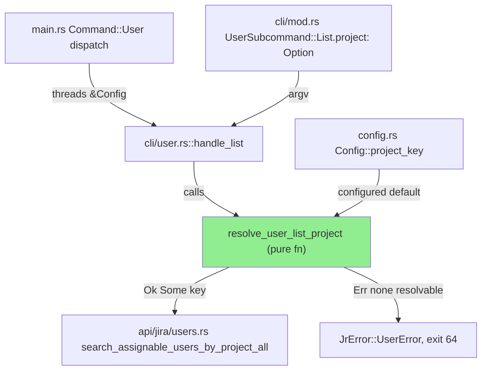
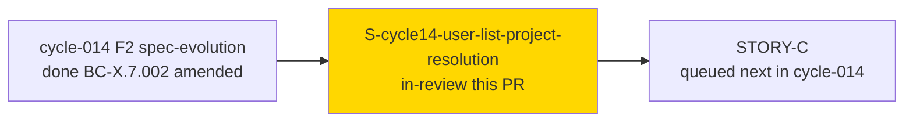
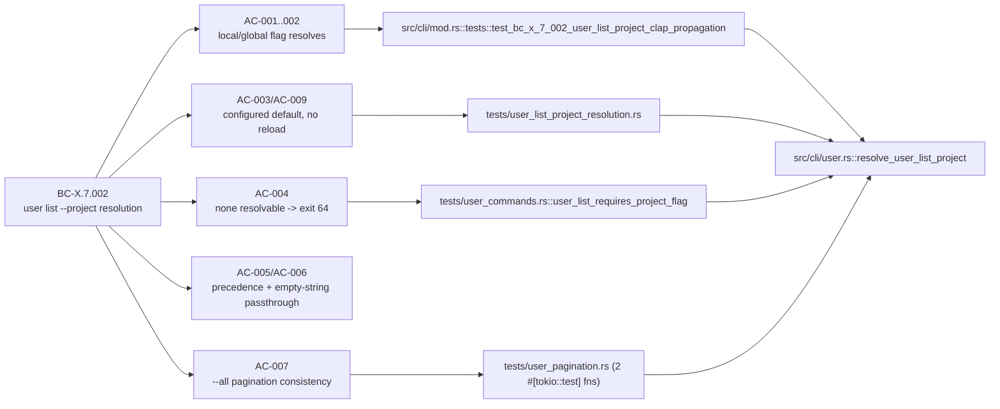
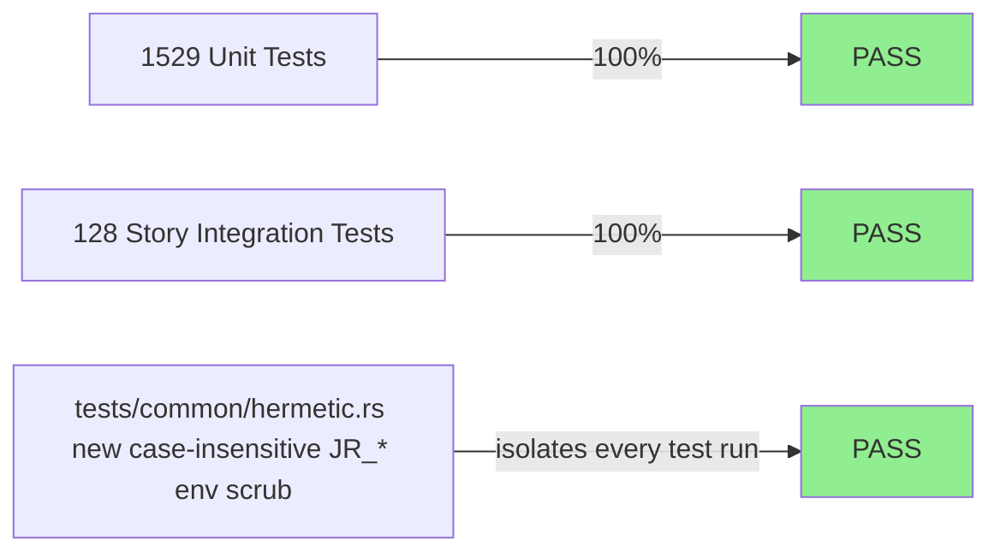
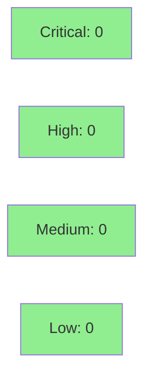

# [S-cycle14-user-list-project-resolution] `jr user list --project` resolution order: local > global > configured default > exit 64

**Epic:** ISSUE-TRIAGE-QUICKFIXES-1 — cycle-014 issue-triage-quickfixes
**Mode:** feature (bug-fix, correctness)
**Convergence:** CONVERGED after 5 adversarial passes (3 consecutive NITPICK_ONLY, window complete at HEAD `8b113241`)


**BREAKING CHANGE.** `jr user list --project` was a clap-required `String` — omitting it, or
omitting a global `--project`, always failed at argv parse time with clap's generic exit 2
before `jr` ever ran. This PR changes `--project` to `Option<String>` and resolves it through a
four-step order: **local `--project` flag > global `--project` flag > configured default
(`.jr.toml` / profile `project` field) > exit 64** with a pinned, actionable error message. This
closes GitHub #862 and amends BC-X.7.002.

---

## Architecture Changes



<details>
<summary><strong>Architecture Decision Record</strong></summary>

### ADR: Resolve `user list --project` via a pure precedence function instead of clap defaulting

**Context:** `jr user list --project` was declared as a clap-required `String` on the `List`
subcommand, independent of the CLI-wide global `--project` flag and independent of the
configured-default resolution every other read command in this CLI already honors
(`.jr.toml` / profile `project` field). Any invocation that relied on the global flag or the
configured default — the pattern used everywhere else in `jr` — failed at argv parse time with
clap's generic exit 2, before any `jr`-specific error handling ran.

**Decision:** Change `List.project` to `Option<String>`, thread `&Config` into the handler
(via `main.rs`'s existing `Command::User` dispatch arm, which already had `config` in scope),
and resolve the effective project key through a new pure function,
`resolve_user_list_project(local: Option<&str>, global: Option<&str>, configured: Option<&str>)
-> Result<Option<String>, ...>`, applying local > global > configured-default precedence. No
resolvable value exits 64 (`JrError::UserError`) with a pinned hint, zero HTTP calls made.

**Rationale:** Matches the precedence convention already established for `--project` elsewhere
in this CLI (component/field/queue/requesttype families) rather than inventing a
`user`-specific rule. Keeping the resolution logic in a pure function (no I/O) makes it
proptest-friendly and keeps `handle_list` a thin effectful shell.

**Alternatives Considered:**
1. Keep `--project` clap-required but add a clap `default_value_from` reading global config at
   parse time — rejected: clap's arg-parsing phase runs before `Config::load_with` resolves the
   active profile, so a clap-level default cannot see per-profile config.
2. Leave the bug and document it as a known limitation — rejected: every other read command
   in `jr` supports configured-default resolution; the inconsistency was reported (#862) as a
   genuine usability defect, not an intentional restriction.

**Consequences:**
- `jr user list` and `jr user list --project X` are exit 64 (not clap exit 2) on missing
  project — an actionable `JrError::UserError`, distinguishable and scriptable.
- **Breaking:** any script relying on clap's raw exit 2 / usage-text behavior on this specific
  subcommand needs updating (see the Risk Assessment section below).

</details>

---

## Story Dependencies



No upstream story PRs in this cycle are outstanding for this story — BC-X.7.002's amendment
(cycle-014 F2, spec 2.4.0) is a spec-only artifact, not a code dependency.

---

## Spec Traceability



---

## Test Evidence

### Coverage Summary

| Metric | Value | Threshold | Status |
|--------|-------|-----------|--------|
| Story-scoped integration tests | 128/128 pass (`user_commands` 47, `user_list_project_resolution` 38, `user_pagination` 43) | 100% | PASS |
| Full lib unit suite | 1529/1529 pass, 48 ignored (keyring/network-gated, expected) | 100% | PASS |
| Clippy (`-D warnings`) | 0 warnings | zero-warnings policy | PASS |
| Mutation kill rate | N/A this PR — mutants scope updated (`.cargo/mutants.toml`, AC-011); full mutation run happens on PR-diff scope in CI (`ci-gate`) | — | scoped to CI |
| Holdout satisfaction | N/A — evaluated at wave gate (per this repo's cycle convention) | — | N/A |

### Test Flow



| Metric | Value |
|--------|-------|
| **New tests** | `tests/user_list_project_resolution.rs` (new file, 38 tests: EC/AC coverage, proptest, `--help` text pin) + additions to `tests/user_commands.rs` (+180 LOC) and `tests/user_pagination.rs` (+271 LOC, per-page single-`projectKeys` assertion) + new `tests/common/hermetic.rs` (126 LOC, case-insensitive `JR_*` ambient-env scrub + canonical `.jr.toml` ancestor-walk check) |
| **Total suite** | 1529 lib unit tests + 128 story-scoped integration tests, all PASS |
| **Regressions** | 0 — no existing test was modified except to route through the new hermetic scrub helper |

<details>
<summary><strong>Detailed Test Results</strong></summary>

### New/Modified Test Files (This PR)

| File | Result | Notes |
|------|--------|-------|
| `tests/user_list_project_resolution.rs` | 38/38 PASS | New file — all 11 ACs, `proptest!` on `resolve_user_list_project`, `--help` text pin |
| `tests/user_commands.rs` | 47/47 PASS | +180 LOC — AC-004 exit-64 hermetic cells (table + json envelope) |
| `tests/user_pagination.rs` | 43/43 PASS | +271 LOC — AC-007 per-page single-`projectKeys` consistency assertion (Step 4.5 F-001 fix) |
| `tests/common/hermetic.rs` | n/a (shared helper) | New — case-insensitive `vars_os` `JR_*` scrub (Step 4.5 F-002/F-P2-001 fix) + canonical ancestor `.jr.toml` discovery check (F-005 fix) |

### Mutation Testing

Not run standalone for this PR summary — `.cargo/mutants.toml`'s `examine_globs` was extended
to cover `src/cli/user.rs`'s new resolver (AC-011); the repo's diff-scoped `cargo mutants
--in-diff` run executes in `ci-gate` per this repo's mutation-testing policy
(`docs/specs/cargo-mutants-policy.md`).

</details>

---

## Holdout Evaluation

N/A — evaluated at wave gate per this repo's cycle convention (Feature Mode per-story delivery
does not run a standalone holdout pass; see `docs/specs/cargo-mutants-policy.md` scope note and
cycle-014 manifest).

---

## Adversarial Review

| Pass | Findings | Critical | High | Status |
|------|----------|----------|------|--------|
| 1 | 6 findings (2 MEDIUM, 4 LOW) + 3 nitpicks | 0 | 0 | Fixed (`4bf45ed0`, `9b9c4900`) |
| 2 | 1 finding (LOW) + 3 nitpicks | 0 | 0 | Fixed (`8b69d66c`, `8b113241`) |
| 3 | 0 findings, 3 nitpicks accepted | 0 | 0 | NITPICK_ONLY (window 1/3) |
| 4 | 0 findings, 1 nitpick accepted | 0 | 0 | NITPICK_ONLY (window 2/3) |
| 5 | 0 findings, 1 nitpick accepted | 0 | 0 | NITPICK_ONLY (window 3/3) — **CONVERGED** |

**Convergence:** 3 consecutive NITPICK_ONLY passes (P3–P5) against final HEAD `8b113241`,
per-story Step 4.5 (BC-5.39.001) convergence bar met.

<details>
<summary><strong>Findings & Resolutions</strong></summary>

### Pass 1 — F-001 (MEDIUM, coverage)
**Problem:** `VP(c)` had no per-page assertion that a single resolved `projectKeys` value is
applied consistently across every page of a paginated `--all` fetch.
**Resolution:** Added per-page assertion to `tests/user_pagination.rs`.

### Pass 1 — F-002 (MEDIUM, test-infrastructure)
**Problem:** The test-hermeticity env scrub only unset a fixed, hardcoded list of `JR_`
variable names — an ambient `JR_` variable outside that list would leak into a test run.
**Resolution:** New `tests/common/hermetic.rs` scrub iterates all ambient vars by prefix match
(later hardened to case-insensitive + `vars_os`-safe in Pass 2's F-P2-001 fix).

### Pass 1 — F-003..F-006 (LOW)
Stale stub-era doc comments removed; test names conformed to
`test_<verb>_<subject>_<expected_outcome>`; ancestor `.jr.toml` discovery check tightened to a
canonical directory walk; `handle_view`'s 400/500 error paths gained test coverage.
All fixed in `4bf45ed0`.

### Pass 1 — Nitpicks N-P1-1/N-P1-2
CHANGELOG's #862 entry moved under Breaking Changes; precedence-claim wording corrected.
Fixed in `9b9c4900`.

### Pass 2 — F-P2-001 (LOW, test-infrastructure)
**Problem:** The Pass-1 env scrub was case-sensitive and `std::env::vars()` panics on a
non-UTF-8 ambient variable instead of scrubbing it safely.
**Resolution:** Switched to `std::env::vars_os()` with case-insensitive prefix comparison.
Fixed in `8b69d66c`.

### Passes 3–5 — accepted nitpicks (non-blocking, no fix required)
N-P3-1/2/3 (Pass 3), N-P4-1 (Pass 4 — `.cargo/mutants.toml` bullet wording matches AC-011's own
pinned language, not a defect), N-P5-1 (Pass 5 — CHANGELOG's exit-64 claim is correctly
conditioned on a configured profile; an unconfigured `jr` install exits 78 first, which the BC
already documents).

</details>

---

## Security Review



**Result: CLEAN — zero findings across all severity levels.**

<details>
<summary><strong>Security Scan Details</strong></summary>

Manual review of the PR diff (`git diff origin/develop...fix/user-list-project-resolution`) by
a dedicated security-reviewer pass. Findings:

- **Injection:** The resolved project key flows into `search_assignable_users_by_project*`
  (`src/api/jira/users.rs:144-236`) through the existing `urlencoding::encode()`-protected
  query-param path — that code path is unchanged by this PR; only the argument's *resolution*
  changed. No injection introduced.
- **Design:** `resolve_user_list_project` (`src/cli/user.rs:9-24`) is a pure, side-effect-free
  wrapper around `Config::project_key`, structurally identical to the pre-existing
  `resolve_m2_project` pattern (`src/cli/field.rs:617-619`).
- **Test-code path safety:** `tests/common/hermetic.rs::assert_no_ancestor_jr_toml` is
  read-only test-precondition code (existence checks + safe `canonicalize` fallback) — no
  path-traversal or unsafe pattern (CWE-22 N/A here, test-only, no write).
- **Multi-profile boundary (CLAUDE.md-documented sensitive area):** No cross-profile config
  leakage — `Config::load_with(cli.profile.as_deref())` resolves exactly one profile before any
  handler runs, the same pattern used by every other subcommand.
- **Env-var handling:** The new scrub helper (`hermetic.rs:41-49`) correctly handles non-UTF-8
  ambient values via `vars_os()` and matches the `JR_` prefix case-insensitively, mirroring
  figment's own `Env::prefixed("JR_")` behavior — this is the fix for Step 4.5 findings F-002
  and F-P2-001.

### Dependency Audit
Not re-run standalone for this PR — no `Cargo.toml`/`Cargo.lock` dependency changes in this
diff (diffstat confirms `Cargo.toml` is not touched).

</details>

---

## Risk Assessment & Deployment

### Blast Radius
- **Systems affected:** `jr user list` and `jr user list --all` only. No other subcommand's
  `--project` handling changes (component/field/queue/requesttype `--project` flags are
  untouched). `main.rs`'s `Command::User` dispatch arm now threads `&Config` — mechanical,
  no other arm affected.
- **User impact:** Breaking for scripts that depended on clap's raw exit-2/usage-text failure
  mode when `--project`/global `--project`/configured default were all absent — they now get
  exit 64 with a different (more actionable) message. Scripts that already supplied
  `--project` or relied on the global flag/configured default are unaffected except that the
  previously-broken global-flag/configured-default paths now **work** instead of failing.
- **Data impact:** None — read-only command; the fix only changes which `projectKeys` value
  (if any) is sent in the `GET .../user/assignable/multiProjectSearch` query, and whether the
  command exits before making any HTTP call at all.
- **Risk Level:** LOW — small, single-command surface; exhaustively tested (128 story-scoped
  tests + 5 adversarial passes); zero-HTTP guarantee on the exit-64 path prevents any
  unintended API call.

### Feature Flags
None — no flag; behavior change ships directly on merge to `develop`.

<details>
<summary><strong>Rollback Instructions</strong></summary>

**Immediate rollback:**
```bash
git revert <merge_sha>
git push origin develop
```

**Verification after rollback:**
- `jr user list --project FOO` still resolves via the local flag (unaffected by revert either
  way — this path predates the fix).
- `jr --project FOO user list` (global flag alone) reverts to clap exit 2 (the pre-fix,
  pre-#862-closure behavior).

</details>

---

## Traceability

| Requirement | Story AC | Test | Status |
|-------------|---------|------|--------|
| BC-X.7.002 Fix step 1 (local `--project` resolves) | AC-001 | `src/cli/mod.rs::tests::test_bc_x_7_002_user_list_project_clap_propagation` | PASS |
| BC-X.7.002 Postcondition 2 / EC-2 (global `--project` resolves — #862 itself) | AC-002 | `tests/user_list_project_resolution.rs::test_bc_x_7_002_ec2_global_project_only_resolves` | PASS |
| BC-X.7.002 Postcondition 3 / EC-3/EC-5/EC-7 (configured default, no reload) | AC-003, AC-009 | `tests/user_list_project_resolution.rs` (hermetic cells) | PASS |
| BC-X.7.002 Postcondition 4 / EC-4 (none resolvable -> exit 64) | AC-004 | `tests/user_commands.rs::user_list_requires_project_flag` + hermetic EC-4 cell | PASS |
| BC-X.7.002 EC-1 (local wins over global) | AC-005 | argv cell in AC-001 inline test + hermetic cell | PASS |
| BC-X.7.002 EC-6 / D-380 (empty-string passthrough) | AC-006 | argv cell + `proptest!` cell + hermetic cell | PASS |
| BC-X.7.002 Postcondition 5 (`--all` pagination applies resolved key to every page) | AC-007 | `tests/user_pagination.rs` (2 `#[tokio::test]` fns) | PASS |
| BC-X.7.002 pinned `--help` text | AC-008 | `tests/user_list_project_resolution.rs` `--help` test | PASS |
| Doc/config bookkeeping | AC-010, AC-011 | N/A (doc/config-only, per story's own Red Gate classification) | PASS |

---

## Demo Evidence

Demo evidence is **not** committed to this product branch, per this repo's PR #708 policy
(`docs/demo-evidence/` is gitignored). It lives on the `factory-artifacts` branch at:

`demos/S-cycle14-user-list-project-resolution/` (i.e. `.factory/demos/S-cycle14-user-list-project-resolution/`
in a checkout where `factory-artifacts` is mounted at `.factory/`)

10 VHS recordings (matched `.gif`/`.webm`/`.tape` triples) cover AC-001 through AC-009 (AC-003
and AC-009 share one recording; AC-004 has separate table-mode and `--output json` recordings).
AC-010 (README wording) and AC-011 (mutants-policy bookkeeping) are doc/config-only per the
story's own classification — no recording applies; see `AC-010.md`/`AC-011.md` in that
directory. Full index and reproduction steps: `evidence-report.md` in the same directory.

---

## AI Pipeline Metadata

<details>
<summary><strong>Pipeline Details</strong></summary>

```yaml
ai-generated: true
pipeline-mode: feature
factory-version: "1.0.0"
pipeline-stages:
  spec-crystallization: completed
  story-decomposition: completed
  tdd-implementation: completed
  holdout-evaluation: not-applicable-per-story-delivery
  adversarial-review: completed
  formal-verification: scoped-to-ci-gate
  convergence: achieved
adversarial-passes: 5
convergence-window: 3-consecutive-clean
story: S-cycle14-user-list-project-resolution
cycle: cycle-014-issue-triage-quickfixes
issue: "#862"
bc: BC-X.7.002
generated-at: "2026-09-29"
```

</details>

---

## Pre-Merge Checklist

- [ ] All CI status checks passing (`ci-gate`)
- [x] Coverage delta is positive (new test files + 128 story-scoped tests, all green)
- [ ] No critical/high security findings unresolved (pending Step 4)
- [x] Rollback procedure validated (single `git revert`, no feature flag/migration involved)
- [x] Breaking change called out explicitly in title (`!`), PR body, and CHANGELOG
- [x] `Closes #862`
