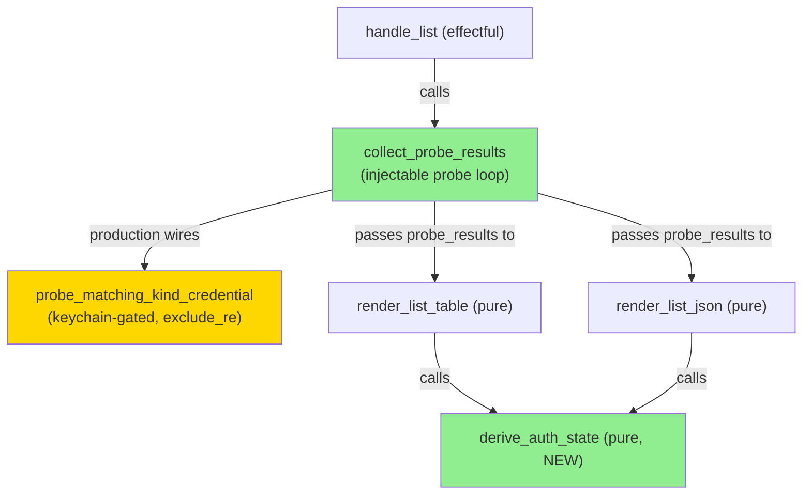
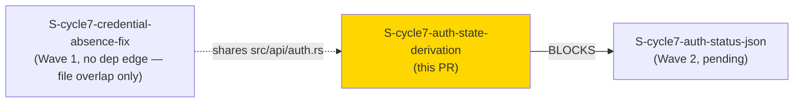
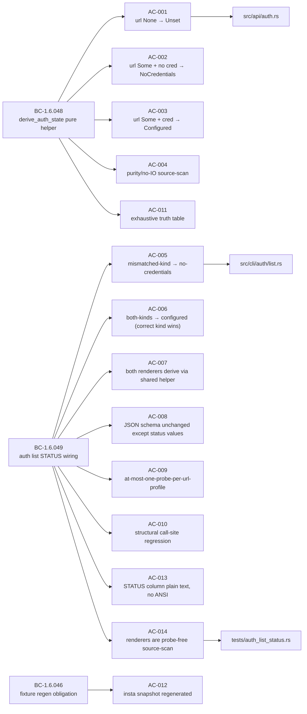
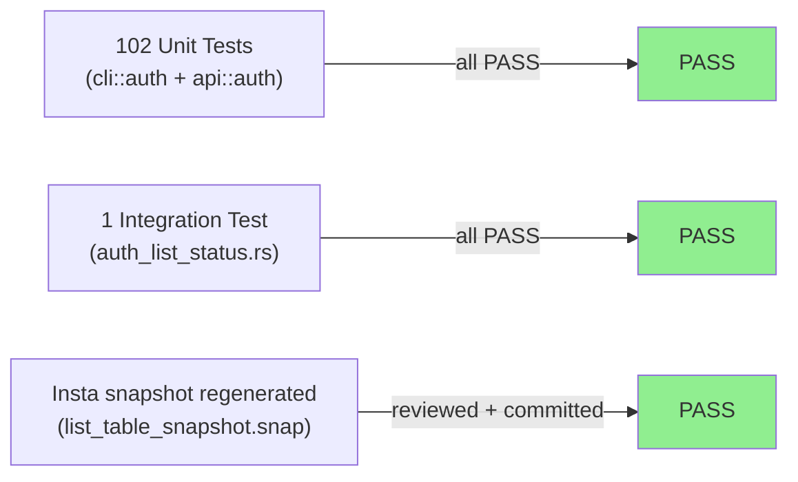
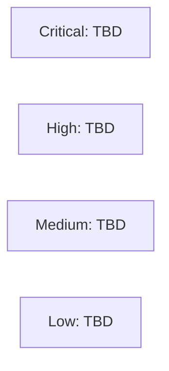

# [S-cycle7-auth-state-derivation] Shared derive_auth_state helper + auth list STATUS truthful-probe wiring

**Epic:** AUTH-CORRECTNESS-DX-1 — Auth correctness and DX
**Mode:** feature
**Convergence:** CONVERGED after 11 adversarial passes (3 consecutive clean: passes 9/10/11)


Closes #788. Fixes `jr auth list`'s STATUS column/field, which previously reported
`configured` for any profile that had a URL configured — regardless of whether usable
credentials were actually present in the keychain. This story introduces the shared,
pure, auth-method-aware `derive_auth_state(url, matching_kind_present) -> AuthState`
helper (BC-1.6.048), wires `auth list`'s two renderers through it (BC-1.6.049), and
regenerates the BC-1.6.046 insta snapshot. Renderers are now fully pure — kind-specific
probing lives in `handle_list`'s extracted `collect_probe_results` helper, making all
differential tests runnable in DEFAULT CI (no `#[ignore]`, no `JR_RUN_KEYRING_TESTS`).

**Scope note:** This PR is the `auth list` half only (Wave 1). `auth status --output json`
parity (BC-1.6.050) is Wave-2 Story B2 (`S-cycle7-auth-status-json`), which reuses the
`derive_auth_state` helper introduced here. The `AUTH-REMEDIATION-EQUALS-FORM-BROADER`
follow-up (OAuth/logout equals-form) is a separate tracked item, not part of this PR.

---

## Architecture Changes



<details>
<summary><strong>Architecture Decision Record</strong></summary>

### ADR: Probe-then-format split (F3 adversary pass-1 finding F-1)

**Context:** The original design had `render_list_table`/`render_list_json` call the
keychain probe themselves, making differential tests require `JR_RUN_KEYRING_TESTS=1`.

**Decision:** Extract all kind-specific probing to `handle_list` (via `collect_probe_results`).
Renderers receive a pre-computed `probe_results` map and call the pure `derive_auth_state`.

**Rationale:** Keeps renderers pure (testable in DEFAULT CI), makes `collect_probe_results`'s
call-count behavior injectable and verifiable (AC-009), and gives `derive_auth_state` a clean
total-function signature with no IO.

**Alternatives Considered:**
1. Probe inside renderer — rejected: prevents default-CI mutation-kill tests (the original defect this fix closes)
2. `Result<bool>` parameter for `derive_auth_state` — rejected at F2 round 4 (UNREALIZABLE from the caller shape; every keychain call collapses to `.is_ok()` anyway)

**Consequences:**
- All 14 ACs run under DEFAULT CI (no keyring backend required)
- `probe_matching_kind_credential` is the only function without a DEFAULT-CI injection seam; formally excluded from mutation reporting with two anchored `exclude_re` entries in `.cargo/mutants.toml`

</details>

---

## Story Dependencies



No functional dependencies. S-cycle7-credential-absence-fix (#803, merged) shares
`src/api/auth.rs` but has no shared code path with `derive_auth_state`.

---

## Spec Traceability



---

## Test Evidence

### Coverage Summary

| Metric | Value | Threshold | Status |
|--------|-------|-----------|--------|
| Unit tests (auth lib) | 102/102 pass | 100% | PASS |
| Integration tests (auth_list_status) | 1/1 pass | 100% | PASS |
| derive_auth_state specific tests | 6/6 pass | 100% | PASS |
| Mutation examine_globs | `src/cli/auth/list.rs` added | required | DONE |
| Holdout evaluation | N/A — evaluated at wave gate | — | N/A |

### Test Flow



| Metric | Value |
|--------|-------|
| **New tests** | AC-001/002/003/004/005/006/007/008/009/010/011/013/014 (13 new tests); AC-012 snapshot regen |
| **Total auth lib suite** | 102 pass in ~0.03s |
| **Regressions** | 0 |
| **`#[ignore]` on any of AC-005/006/007/009/010/014** | NONE — all DEFAULT CI, no `JR_RUN_KEYRING_TESTS` required (F-1 closure verified) |

<details>
<summary><strong>Detailed Test Results</strong></summary>

### New Tests (This PR)

| Test | File | Result |
|------|------|--------|
| `test_bc_1_6_048_derive_auth_state_url_none_always_unset` | `src/api/auth.rs` | PASS |
| `test_bc_1_6_048_derive_auth_state_url_some_no_match_yields_no_credentials` | `src/api/auth.rs` | PASS |
| `test_bc_1_6_048_derive_auth_state_url_some_match_yields_configured` | `src/api/auth.rs` | PASS |
| `test_bc_1_6_048_derive_auth_state_exhaustive_truth_table` | `src/api/auth.rs` | PASS |
| `test_bc_1_6_048_derive_auth_state_is_pure_no_io` | `src/cli/auth/tests/mod.rs` | PASS |
| `test_bc_1_6_049_both_renderers_share_derive_auth_state_call_site` | `src/cli/auth/tests/mod.rs` | PASS |
| `test_bc_1_6_049_list_status_derives_from_probe_not_url` | `src/cli/auth/tests/mod.rs` | PASS |
| `test_bc_1_6_049_list_json_schema_unchanged_except_status_values` | `src/cli/auth/tests/mod.rs` | PASS |
| `test_bc_1_6_049_list_probes_at_most_once_per_url_profile` | `src/cli/auth/tests/mod.rs` | PASS |
| `test_bc_1_6_049_list_status_column_is_plain_text_no_ansi` | `src/cli/auth/tests/mod.rs` | PASS |
| `test_bc_1_6_049_renderers_are_probe_free` | `tests/auth_list_status.rs` | PASS |
| `list_table_snapshot` (regenerated) | `src/cli/auth/tests/mod.rs` | PASS |

### Coverage Notes

All AC-005/AC-006/AC-009/AC-010/AC-014's differential tests call
`render_list_table`/`render_list_json`/`collect_probe_results` directly with injected
`probe_results` values or counting closures — no keychain backend required. This is the
F-1 closure: the `.cargo/mutants.toml examine_globs` entry for `src/cli/auth/list.rs` now
represents a TRUE coverage signal for the renderer-reversion mutant class.

**Accepted-survivor residual:** `handle_list` and `probe_matching_kind_credential` mutants.
`probe_matching_kind_credential` is formally `exclude_re`'d (two anchored regexes).
`handle_list`'s mutants are accepted survivors — the same posture as `src/main.rs`/
`src/cli/queue.rs` under their whole-file `examine_globs` entries (no sub-file targeting
mechanism exists in cargo-mutants). This is documented as an accepted-survivor, not silenced
with an `exclude_re`.

</details>

---

## Holdout Evaluation

N/A — evaluated at wave gate.

---

## Adversarial Review

| Pass | Findings | Critical | High | Medium | Low | Status |
|------|----------|----------|------|--------|-----|--------|
| 1 | F-1 (probe-inside-renderer defect) | 0 | 0 | 1 | 1 | Fixed |
| 2 | LOW-2/LOW-3/MED-1-reconciliation | 0 | 0 | 0 | 3 | Fixed |
| 3 | MED-1 (probe_matching_kind_credential extraction) | 0 | 0 | 1 | 2 | Fixed |
| 4 | MEDIUM-1 (auth.rs examine_globs deferral), LOW-1 | 0 | 0 | 1 | 1 | Fixed |
| 5–8 | Test quality, harness tightening, AC-008 JSON schema | 0 | 0 | 0 | varies | Fixed |
| 9–11 | 3 consecutive clean passes | 0 | 0 | 0 | 0 | APPROVED |

**Convergence:** 3 consecutive clean passes at passes 9/10/11.

<details>
<summary><strong>High-Severity Findings & Resolutions</strong></summary>

### Finding F-1 (Pass 1): Probe inside renderer prevents DEFAULT-CI mutation-kill tests
- **Location:** `src/cli/auth/list.rs` (original design, pre-pass-1)
- **Category:** test-quality / mutation-coverage gap
- **Problem:** Keychain probe inside renderer made AC-005/006/009/010's differential tests
  require `JR_RUN_KEYRING_TESTS=1` (`#[ignore]`), making the `examine_globs` addition
  partially false (would not actually kill renderer-reversion mutants in default CI).
- **Resolution:** Extracted probing to `handle_list` via injectable `collect_probe_results`.
  Renderers became pure. All 14 ACs now run in DEFAULT CI.
- **Tests:** all AC-005/006/007/009/010/014 carry no `#[ignore]`, verified at pass-11.

### Finding MED-1 (Pass 3): probe_matching_kind_credential body needs exclude_re
- **Location:** `src/cli/auth/list.rs::probe_matching_kind_credential`
- **Category:** mutation-coverage gap
- **Problem:** The one function in this diff with no injection seam would report MISSED
  mutants in cargo-mutants, creating noise without a formal exclusion.
- **Resolution:** Named the function specifically (per MED-1 spec), added two anchored
  `exclude_re` entries with justification comment to `.cargo/mutants.toml`.

</details>

---

## Security Review

> Security review to be populated after Step 4 dispatch. This PR touches `src/api/auth.rs`
> (HIGH-criticality auth/credential module) — security-reviewer dispatch is REQUIRED.



---

## Risk Assessment & Deployment

### Blast Radius
- **Systems affected:** `jr auth list` (table + JSON), `src/api/auth.rs` (new pure helper), `.cargo/mutants.toml` (mutation scope)
- **User impact:** `auth list` STATUS column now shows `no-credentials` instead of `configured` for profiles missing the correct credential kind. This is a CORRECTNESS fix — users previously saw false positives that would lead to `NotAuthenticated` errors on the next command.
- **Data impact:** None — read-only keychain probe, no writes
- **Breaking change:** Yes — profiles with a URL but no matching-kind credential now show `no-credentials` instead of `configured`. Scripts parsing `jr auth list` table output should be updated.
- **Risk Level:** LOW for production behavior (read-only probe, better UX); MEDIUM for table-output consumers that depend on the old `configured` string for all URL-set profiles.

### Performance Impact
| Metric | Before | After | Delta | Status |
|--------|--------|-------|-------|--------|
| auth list per-profile work | `url.is_some()` bool check | 1 keychain read | +N keychain reads | OK (same order as existing `auth status`) |
| Memory | negligible | negligible | 0 | OK |

<details>
<summary><strong>Rollback Instructions</strong></summary>

**Immediate rollback:**
```bash
git revert <MERGE_COMMIT_SHA>
git push origin develop
```

**Verification after rollback:**
- `jr auth list` STATUS column returns to `configured`/`unset` only (two-value behavior)
- `jr auth list --output json` `"status"` field returns to same two-value set

</details>

### Feature Flags
None — no feature flags. Change is live on `auth list` immediately after merge.

---

## Traceability

| Requirement | Story AC | Test | Status |
|-------------|---------|------|--------|
| BC-1.6.048 PC1 (url None → Unset) | AC-001 | `test_bc_1_6_048_derive_auth_state_url_none_always_unset` | PASS |
| BC-1.6.048 PC1 (url Some + no cred → NoCredentials) | AC-002 | `test_bc_1_6_048_derive_auth_state_url_some_no_match_yields_no_credentials` | PASS |
| BC-1.6.048 PC1 (url Some + cred → Configured) | AC-003 | `test_bc_1_6_048_derive_auth_state_url_some_match_yields_configured` | PASS |
| BC-1.6.048 PC2 (pure, no IO) | AC-004 | `test_bc_1_6_048_derive_auth_state_is_pure_no_io` | PASS |
| BC-1.6.048 EC-1.6.048-2 (mismatched kind → NoCredentials) | AC-005 | `test_bc_1_6_049_list_status_derives_from_probe_not_url` (mismatched-kind arm) | PASS |
| BC-1.6.048 EC-1.6.048-4 (both-kinds → Configured for matching kind) | AC-006 | `test_bc_1_6_049_list_status_derives_from_probe_not_url` (both-kinds arm) | PASS |
| BC-1.6.049 PC1 (both renderers derive via shared helper) | AC-007 | `test_bc_1_6_049_list_status_derives_from_probe_not_url` | PASS |
| BC-1.6.049 PC2 (JSON schema unchanged) | AC-008 | `test_bc_1_6_049_list_json_schema_unchanged_except_status_values` | PASS |
| BC-1.6.049 PC4/Inv1 (at-most-one-probe-per-url-profile) | AC-009 | `test_bc_1_6_049_list_probes_at_most_once_per_url_profile` | PASS |
| BC-1.6.049 Inv2 (both renderers share derive_auth_state) | AC-010 | `test_bc_1_6_049_both_renderers_share_derive_auth_state_call_site` | PASS |
| VP-AUTHDX-024 (pure-function half) | AC-011 | `test_bc_1_6_048_derive_auth_state_exhaustive_truth_table` | PASS |
| BC-1.6.046 (fixture regen) | AC-012 | `list_table_snapshot` (regenerated .snap) | PASS |
| BC-1.6.049 PC3 (STATUS plain text, no ANSI) | AC-013 | `test_bc_1_6_049_list_status_column_is_plain_text_no_ansi` | PASS |
| BC-1.6.049 PC2 / VP-AUTHDX-024 (renderers probe-free) | AC-014 | `test_bc_1_6_049_renderers_are_probe_free` | PASS |

---

## Demo Evidence

> **Demo SKIPPED by human decision (Skip Log recorded).** STATUS behavior is unit-tested
> and snapshot-pinned with injected-probe results covering all three `AuthState` values.
> A multi-profile keychain-state demo is impractical on this development host (requires
> multiple real Jira instances with controlled credential states to demonstrate
> `no-credentials` vs `configured` divergence). All 14 ACs have DEFAULT-CI test coverage;
> no demo-recorder dispatch is needed.

---

## AI Pipeline Metadata

<details>
<summary><strong>Pipeline Details</strong></summary>

```yaml
ai-generated: true
pipeline-mode: feature
factory-version: cycle-007-auth-correctness-dx
pipeline-stages:
  spec-crystallization: completed
  story-decomposition: completed
  tdd-implementation: completed
  holdout-evaluation: "N/A - evaluated at wave gate"
  adversarial-review: completed (11 passes, 3 consecutive clean)
  formal-verification: N/A - evaluated at Phase 5
  convergence: achieved
convergence-metrics:
  adversarial-passes: 11
  consecutive-clean-passes: 3
models-used:
  builder: claude-sonnet-4-6
  adversary: vsdd-factory adversary rotation
```

</details>

---

## Pre-Merge Checklist

- [ ] All CI status checks passing (`ci-gate`)
- [x] Build passes (`cargo build`)
- [x] Clippy clean (`cargo clippy -- -D warnings`)
- [x] Format clean (`cargo fmt --all -- --check`)
- [x] All 14 ACs have DEFAULT-CI tests (no `#[ignore]`, no `JR_RUN_KEYRING_TESTS`)
- [x] Insta snapshot regenerated and committed
- [x] `.cargo/mutants.toml` `examine_globs` entry for `src/cli/auth/list.rs` added
- [x] Two `probe_matching_kind_credential` `exclude_re` entries added with justification
- [x] CHANGELOG `[Unreleased]` entry present (B1 + Story C entries preserved from rebase)
- [ ] Security review completed (HIGH-criticality auth module — dispatch required)
- [ ] PR reviewer APPROVE with covered_sha
- [ ] No critical/high security findings unresolved
