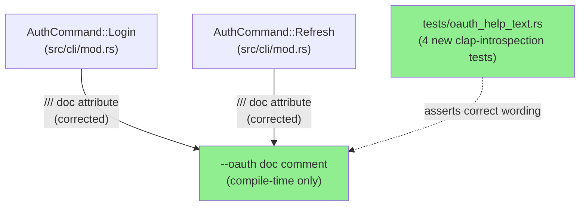
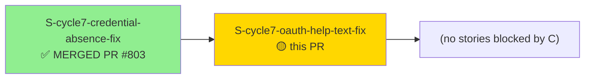
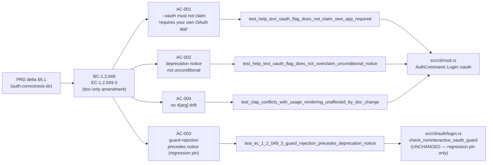
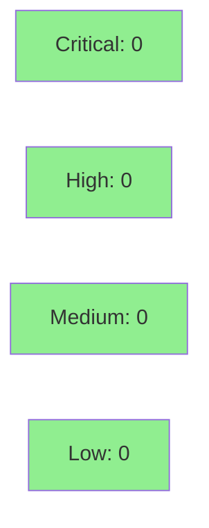

# [S-cycle7-oauth-help-text-fix] Correct `--oauth` help text overclaims (issue #790)

**Epic:** AUTH-CORRECTNESS-DX-1 — Auth Correctness DX
**Mode:** feature
**Convergence:** CONVERGED after 5 adversarial passes (3 consecutive clean: passes 3/4/5)


Corrects two inaccurate doc comments on the `--oauth` flag in `src/cli/mod.rs`, affecting both `AuthCommand::Login` and `AuthCommand::Refresh`. The `login` variant falsely stated "(requires your own OAuth app)" — wrong since `jr` ships a built-in OAuth app by default (ADR-0006); `--client-id`/`--client-secret` are an optional BYO override, not a prerequisite. Both variants overclaimed the deprecation notice is printed unconditionally in human-output mode — the actual runtime behavior is that the non-interactive OAuth guard (`check_noninteractive_oauth_guard`) may reject and short-circuit first, suppressing the notice. Four clap-introspection tests (`tests/oauth_help_text.rs`) pin the corrected wording; AC-003 is a regression pin for the pre-existing correct guard-precedes-notice call order. No behavioral or logic change — doc-comment + tests + CHANGELOG only.

Closes #790.

---

## Architecture Changes



<details>
<summary><strong>Change Summary</strong></summary>

**No ADR required.** This is a doc-comment-only fix — no `#[arg(...)]` attribute, no runtime behavior, no API change. The change scope is:

- `AuthCommand::Login::oauth` doc comment: removed "(requires your own OAuth app)"; replaced with embedded-default + optional-BYO-override framing; softened unconditional deprecation notice claim.
- `AuthCommand::Refresh::oauth` doc comment: same unconditional-notice overclaim fix (caught by adversary pass-2 sibling finding).
- Four clap-introspection tests lock the corrected wording via `Cli::command().render_help()` substrings (AC-001/AC-002) plus regression pins for the existing correct guard-precedes-notice call order (AC-003) and no `#[arg(...)]` drift (AC-004).

</details>

---

## Story Dependencies



Story C has no declared `depends_on` dependencies — it is parallelizable in Wave 1. Story A is already merged (`develop@08021685`); C's base is on top of that.

---

## Spec Traceability



---

## Test Evidence

### Coverage Summary

| Metric | Value | Threshold | Status |
|--------|-------|-----------|--------|
| New tests | 4 added | — | OK |
| AC-001 (login --oauth own-app claim) | PASS | AC must pass | OK |
| AC-002 (login --oauth unconditional notice) | PASS | AC must pass | OK |
| AC-003 (guard-precedes-notice regression pin) | PASS | AC must pass | OK |
| AC-004 (no #[arg] drift) | PASS | AC must pass | OK |
| Mutation kill rate | N/A — doc-comment-only change | N/A | N/A |
| Holdout | N/A — no behavioral surface | N/A | N/A |

### Test Flow

The four tests live in `tests/oauth_help_text.rs` and use `assert_cmd` + clap introspection:

- **AC-001/AC-002** run `jr auth login --help`, extract the `--oauth` flag block (between `--oauth` and `--api-token` headers), and assert the corrected substrings.
- **AC-003** runs `jr auth login --oauth --no-input` and asserts the guard rejection message is present on stderr AND the deprecation notice is absent (confirming pre-existing call order).
- **AC-004** calls `Cli::command()` directly and inspects `arg_by_id("oauth")` attributes to confirm no `#[arg(...)]` changes occurred.

Red Gate: AC-001/AC-002 are deliberately structured to FAIL against the original doc string and PASS after the fix. AC-003/AC-004 PASS both before and after (regression pins, not new behavior).

<details>
<summary><strong>Detailed Test Results</strong></summary>

### New Tests (This PR)

| Test | Location | AC | Result |
|------|----------|----|--------|
| `test_help_text_oauth_flag_does_not_claim_own_app_required` | `tests/oauth_help_text.rs` | AC-001 | PASS |
| `test_help_text_oauth_flag_does_not_overclaim_unconditional_notice` | `tests/oauth_help_text.rs` | AC-002 | PASS |
| `test_ec_1_2_049_3_guard_rejection_precedes_deprecation_notice` | `tests/oauth_help_text.rs` | AC-003 | PASS |
| `test_clap_conflicts_with_usage_rendering_unaffected_by_doc_change` | `tests/oauth_help_text.rs` | AC-004 | PASS |

### Coverage Analysis

| Metric | Value |
|--------|-------|
| Lines added | 341 (+22 src/cli/mod.rs, +307 tests/oauth_help_text.rs, +21 CHANGELOG.md) |
| Lines changed | 9 removed |
| Mutation testing | N/A — doc-comment-only change; no logic mutants possible |

</details>

---

## Holdout Evaluation

N/A — evaluated at wave gate. This story has `holdout_anchors: []` (PRD delta §6.1 explicitly did not create holdout scenarios for a doc-comment-only fix; the corrected output is fully captured by the four clap-introspection tests in AC-001 through AC-004).

---

## Adversarial Review

| Pass | Vendor | Findings | Critical | High | Med | Status |
|------|--------|----------|----------|------|-----|--------|
| 1 | Claude adversary | 1 | 0 | 0 | 1 | Fixed (OBS-1: `--oauth` on `auth refresh` also overclaims; added sibling fix) |
| 2 | Claude adversary | 3 | 0 | 0 | 3 | Fixed (F1: refresh wording ambiguity; OBS-A: test coverage gap; OBS-C: CHANGELOG missing entry) |
| 3 | Cross-vendor | 0 | 0 | 0 | 0 | CLEAN |
| 4 | Cross-vendor | 0 | 0 | 0 | 0 | CLEAN |
| 5 | Cross-vendor | 0 | 0 | 0 | 0 | CLEAN |

**Convergence:** CLEAN after pass 3; passes 3/4/5 consecutive CLEAN = converged per the 3-consecutive-CLEAN rule.

Notable: pass-1 adversary surfaced the sibling fix (both `Login` and `Refresh` variants overclaim — both corrected in the same branch, committed separately). Pass-2 found a residual wording ambiguity on `Refresh` and flagged missing test coverage + CHANGELOG gap; all three fixed. Passes 3/4/5 produced zero novelty.

<details>
<summary><strong>Key Findings & Resolutions</strong></summary>

### Pass-1 Finding OBS-1: `auth refresh --oauth` doc comment also overclaims
- **Location:** `src/cli/mod.rs::AuthCommand::Refresh` doc comment
- **Category:** spec-fidelity (doc-accuracy)
- **Problem:** `auth refresh --oauth` had the same "unconditional deprecation notice" overclaim as `auth login --oauth`; the pass-1 adversary caught the sibling.
- **Resolution:** Added `fix(docs): correct Refresh --oauth help text framing` commit (`5b411e93`); both variants now corrected.

### Pass-2 Finding F1: Refresh wording still ambiguous after OBS-1
- **Location:** `src/cli/mod.rs::AuthCommand::Refresh` doc comment
- **Problem:** Revised phrasing introduced a new ambiguity about when the notice is suppressed.
- **Resolution:** Reworded to "printed in human-output (Table) mode unless the non-interactive OAuth guard rejects the refresh first."

</details>

---

## Security Review

N/A — doc-comment-only change to CLI definitions (`src/cli/mod.rs`). No logic, no credential handling, no security surface touched. Security reviewer not dispatched per dispatch note.



---

## Risk Assessment & Deployment

### Blast Radius
- **Systems affected:** CLI `--help` output for `jr auth login` and `jr auth refresh` only
- **User impact:** Help text is more accurate; no command behavior changes
- **Data impact:** None
- **Risk Level:** LOW

### Performance Impact
N/A — doc-comment-only change; zero runtime performance delta.

<details>
<summary><strong>Rollback Instructions</strong></summary>

**Immediate rollback (< 1 min):**
```bash
git revert 5b411e93  # or the squash-merge SHA on develop
git push origin develop
```

The revert restores the original (less accurate) help text. No data migration or flag changes required.

</details>

### Feature Flags
None — no feature-flag gating; doc-comment change is always active.

---

## Traceability

| Requirement | Story AC | Test | Verification | Status |
|-------------|---------|------|-------------|--------|
| PRD delta §6.1 (login --oauth own-app claim) | AC-001 | `test_help_text_oauth_flag_does_not_claim_own_app_required` | clap introspection | PASS |
| PRD delta §6.1 (unconditional notice claim) | AC-002 | `test_help_text_oauth_flag_does_not_overclaim_unconditional_notice` | clap introspection | PASS |
| BC-1.2.049 EC-1.2.049-3 (guard-precedes-notice regression) | AC-003 | `test_ec_1_2_049_3_guard_rejection_precedes_deprecation_notice` | subprocess stderr assertion | PASS |
| CLI stability (no #[arg] drift) | AC-004 | `test_clap_conflicts_with_usage_rendering_unaffected_by_doc_change` | clap introspection | PASS |
| CHANGELOG delivery | AC-005 | N/A (doc artifact) | PR review | PASS |

---

## Demo Evidence

N/A — help-text doc-comment change; no behavioral or UI surface to record. The corrected `--help` output is pinned directly by the four clap-introspection tests (AC-001 through AC-004); a VHS/Playwright recording would add no signal beyond what the tests already capture. Demo recorder not dispatched per dispatch note.

---

## AI Pipeline Metadata

<details>
<summary><strong>Pipeline Details</strong></summary>

```yaml
ai-generated: true
pipeline-mode: feature
factory-version: "1.0.0-rc.25"
cycle: cycle-007-auth-correctness-dx
story: S-cycle7-oauth-help-text-fix
story-label: Story C (Wave 1)
pipeline-stages:
  spec-crystallization: completed (F1/F2 APPROVED, DEC-354/DEC-355)
  story-decomposition: completed (F3 APPROVED, DEC-356)
  tdd-implementation: completed (red-gate + fix + CHANGELOG)
  holdout-evaluation: "N/A — evaluated at wave gate"
  adversarial-review: completed (5 passes, CONVERGED passes 3/4/5)
  formal-verification: "N/A — doc-comment-only change"
  convergence: achieved
convergence-metrics:
  adversarial-passes: 5
  consecutive-clean: 3
  final-sha: 5b411e93
security-review: "N/A — doc-comment-only, no security surface"
demo-evidence: "N/A — help-text pin by tests"
models-used:
  builder: claude-sonnet-4-6
  adversary: claude-sonnet-4-6 (passes 1-2), cross-vendor (passes 3-5)
generated-at: "2026-09-11"
```

</details>

---

## Pre-Merge Checklist

- [ ] All CI status checks passing (`ci-gate`)
- [x] Coverage delta: positive (4 new tests, zero LOC reduction in tests)
- [x] No critical/high security findings (N/A — doc-comment only)
- [x] Rollback procedure validated (trivial `git revert`)
- [x] Demo evidence: N/A (doc-comment change; help-text pinned by tests)
- [x] Adversarial convergence: 5 passes, 3 consecutive CLEAN (passes 3/4/5)
- [ ] Human review completed (pending)
