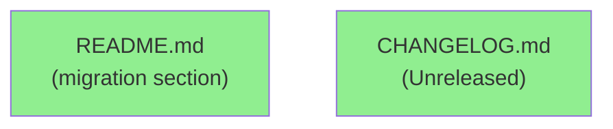
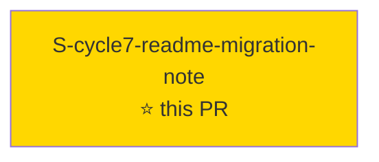
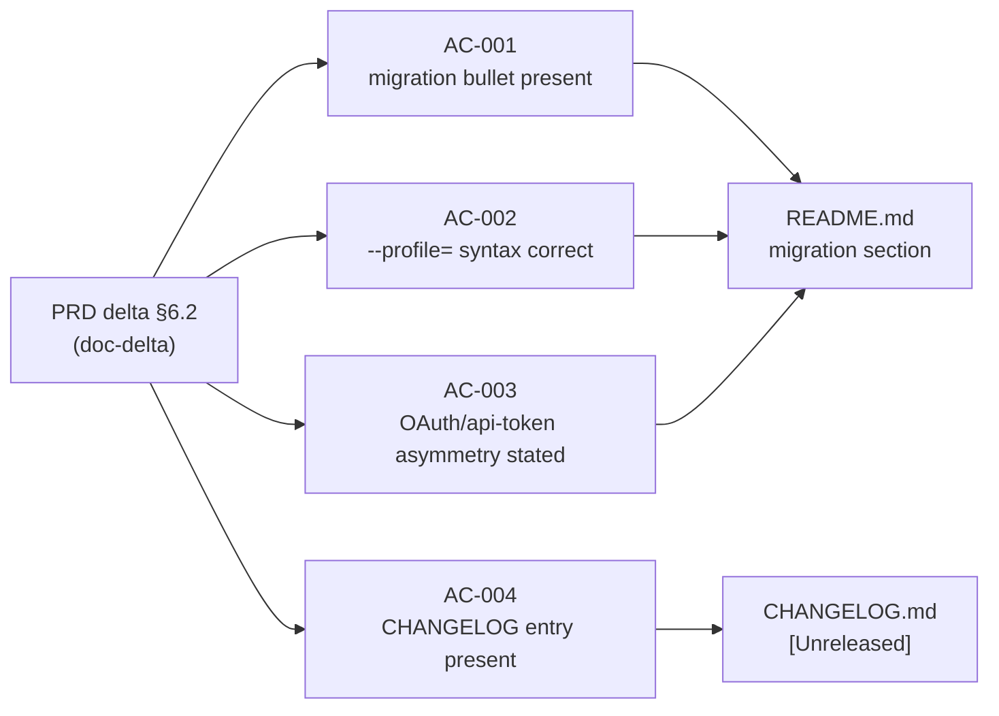

# [S-cycle7-readme-migration-note] README per-profile-credential migration note (issue #783)

**Epic:** AUTH-CORRECTNESS-DX-1 — Auth Correctness & Developer Experience
**Mode:** feature
**Convergence:** CONVERGED after 4 adversarial passes (3 consecutive clean: passes 2/3/4)


Adds a missing migration bullet to `README.md` and a `CHANGELOG.md [Unreleased] > Changed`
entry documenting the per-profile-credential breaking change from cycle-003. API-token profiles
created before cycle-003 must run `jr auth login --profile=<name>` once after upgrading; the
README migration section previously omitted this requirement. The bullet also documents the
deliberate OAuth-vs-api-token asymmetry: OAuth tokens lazy-migrate automatically, api-token
credentials do not (BC-1.4.032's no-copy detect-and-instruct design). Closes #783.

Doc-only: no `src/` code changes, no test changes, no behavior changes.

---

## Architecture Changes



**Doc-only PR — no source code architecture changes.** Two documentation files modified:
`README.md` (migration section gains a new bullet + asymmetry sentence) and `CHANGELOG.md`
(`[Unreleased] > Changed` entry added). No ADR required; no code path altered.

---

## Story Dependencies



`depends_on: []` — no upstream story dependencies. The PRD delta §6.2 editorial sequencing
recommendation (land after S-cycle7-credential-absence-fix) is NOT a graph edge; the
`--profile=<name>` syntax cited in the bullet predates this cycle and was already correct
before this PR.

---

## Spec Traceability



| Requirement | Story AC | Verification | Status |
|-------------|---------|-------------|--------|
| PRD delta §6.2 migration bullet | AC-001 | Content-presence check (grep / PR review) | PASS |
| `--profile=<name>` syntax (equals form) | AC-002 | Content-presence check | PASS |
| OAuth vs api-token asymmetry documented | AC-003 | Content-presence check | PASS |
| CHANGELOG `[Unreleased] > Changed` entry | AC-004 | PR review | PASS |

---

## Test Evidence

**Doc-only story — no executable tests added or modified.**

Story `tdd_mode: facade` per spec (mirrors S-cycle4-windows-docs precedent). Each AC is a
content-presence check verified at PR review time, not a `#[test]` function. No coverage
delta; no mutation testing scope.

| Metric | Value | Note |
|--------|-------|------|
| New tests | 0 | Doc-only; no behavioral surface |
| Coverage delta | 0% | No `src/` lines changed |
| Mutation kill rate | N/A | No production code mutated |
| Regressions | 0 | N/A |

---

## Holdout Evaluation

N/A — evaluated at wave gate. Doc-only story has no behavioral holdout scenarios.

---

## Adversarial Review

| Pass | Model | Scope | Critical | High | Status |
|------|-------|-------|----------|------|--------|
| 1 | adversary | README bullet accuracy, CHANGELOG accuracy, AC coverage | 0 | 0 | Minor precision finding fixed |
| 2 | adversary | re-review post-fix | 0 | 0 | CLEAN |
| 3 | adversary | fresh re-review | 0 | 0 | CLEAN |
| 4 | adversary | final re-review | 0 | 0 | CLEAN |

**Convergence: 3 consecutive clean passes (passes 2/3/4). All claims verified against shipped code and BCs.**

<details>
<summary><strong>Pass 1 finding (resolved)</strong></summary>

Pass 1 raised a precision concern about the migration bullet's wording. The bullet was tightened
to explicitly state the `=` form (`--profile=<name>`) and explain why (so leading-hyphen profile
names are not misread as flags). Passes 2–4 found no further issues.

</details>

---

## Security Review

**N/A — doc-only, no `src/` code touched (README + CHANGELOG only).**

This PR modifies no source files, no dependency declarations, no CI configuration, and no
authentication paths. Not a CRIT/HIGH module. Security reviewer not dispatched per
dispatch instructions.

---

## Risk Assessment & Deployment

### Blast Radius
- **Systems affected:** README.md (user-facing documentation), CHANGELOG.md (changelog)
- **User impact:** Users gain a clear migration bullet they previously lacked — positive only
- **Data impact:** None
- **Risk Level:** LOW

### Performance Impact
N/A — documentation change only. No runtime behavior altered.

### Rollback Instructions

```bash
git revert 6ac0568e
git push origin develop
```

### Feature Flags
None — doc-only change requires no feature flag.

---

## Demo Evidence

**N/A — doc-only story (README.md + CHANGELOG.md prose additions only).**

There is no UI surface, no CLI behavior change, and no testable output to record. The "evidence"
is the diff itself: the README migration section and CHANGELOG entry are visible in this PR's
diff. No VHS/Playwright recording is applicable.

---

## AI Pipeline Metadata

<details>
<summary><strong>Pipeline Details</strong></summary>

```yaml
ai-generated: true
pipeline-mode: feature
factory-version: "1.0.0"
cycle: cycle-007-auth-correctness-dx
story-id: S-cycle7-readme-migration-note
wave: 1
tdd_mode: facade
pipeline-stages:
  spec-crystallization: completed
  story-decomposition: completed
  tdd-implementation: completed (doc-only facade)
  holdout-evaluation: N/A (doc-only)
  adversarial-review: completed (4 passes, 3 consecutive clean)
  formal-verification: N/A (doc-only)
  convergence: achieved
convergence-metrics:
  adversarial-passes: 4
  consecutive-clean-passes: 3
models-used:
  builder: claude-sonnet-4-6
  adversary: diverse-model (per-story adversarial review)
generated-at: "2026-09-11T00:00:00Z"
```

</details>

---

## Pre-Merge Checklist

- [ ] All CI status checks passing (`ci-gate`)
- [x] No critical/high security findings (N/A — doc-only)
- [x] Coverage delta is positive or neutral (0% — no src/ changes)
- [x] Demo evidence N/A justification documented (doc-only prose addition)
- [x] Security review N/A justification documented (no src/ changes)
- [x] Adversarial review converged (4 passes, 3 consecutive clean)
- [x] All 4 ACs satisfied (content-presence checks verified in diff)
- [ ] PR reviewer (AI review) clean
- [ ] Human review completed (READY-TO-MERGE state awaiting approval)
