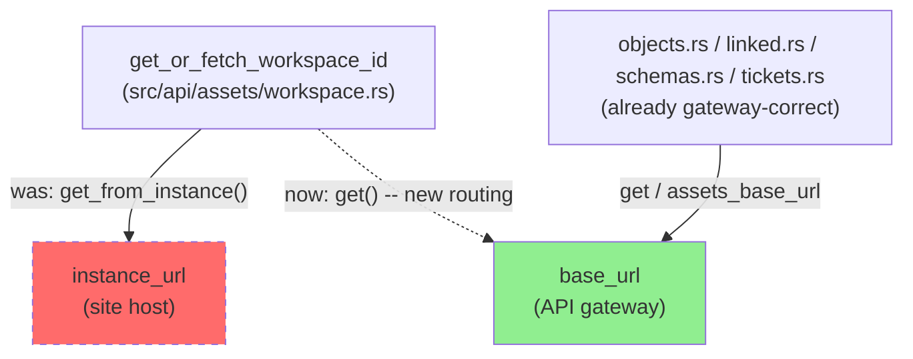
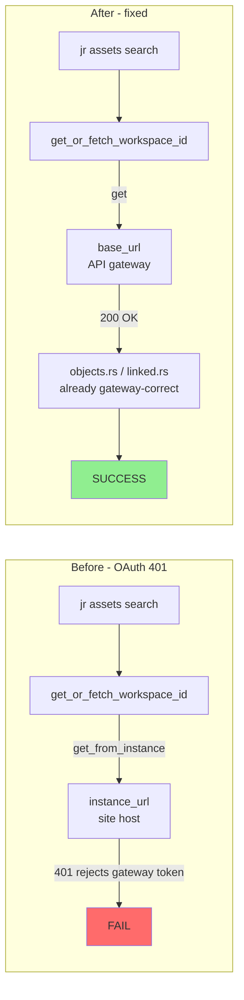
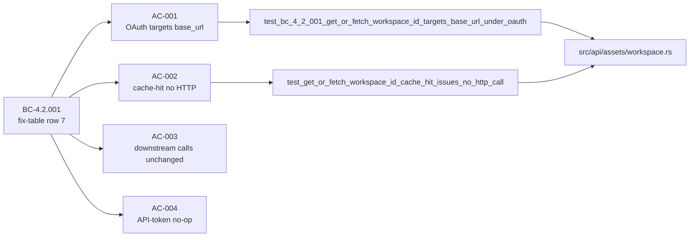
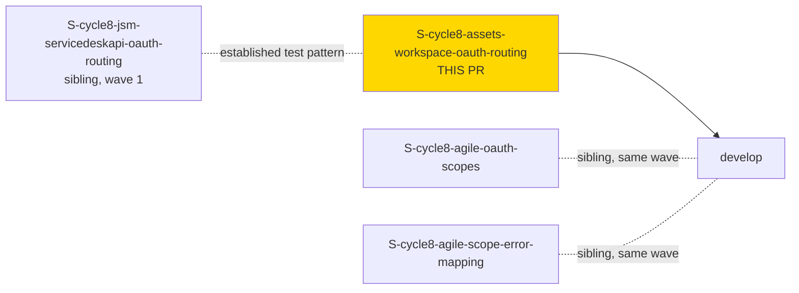

## What

Routes `get_or_fetch_workspace_id` (`src/api/assets/workspace.rs`) through the OAuth API
gateway (`client.get(...)`) instead of the real site host (`client.get_from_instance(...)`) —
a 1-line call-site swap on the sole prerequisite request for the entire Assets command family.

```diff
-    let page: ServiceDeskPage<WorkspaceEntry> = client
-        .get_from_instance("/rest/servicedeskapi/assets/workspace")
+    let page: ServiceDeskPage<WorkspaceEntry> = client
+        .get("/rest/servicedeskapi/assets/workspace")
```

No other line in the function changes: same path string, same
`{values: [{workspaceId: "..."}]}` response deserialization, same 7-day-TTL cache read/write
logic.

## Why

Under OAuth 3LO, `base_url` (the API gateway) and `instance_url` (the real
`*.atlassian.net` site host) diverge, and the site host rejects the gateway bearer token with
a 401. `get_or_fetch_workspace_id` is the sole prerequisite call for the entire Assets surface
— every downstream Assets call (`objects.rs`/`linked.rs`/`schemas.rs`/`tickets.rs`) is already
gateway-correct via `assets_base_url`, but none of them can be reached if workspace-ID
discovery 401s first. Fixing this one call site repairs `jr assets search/view/schemas/
tickets`, `issue list --asset`/`--assets`, and `issue create/edit --field :asset` resolution
(including JSM `create --request-type ... --field :asset`) end-to-end under OAuth, with
**zero behavior change for API-token profiles** (where `base_url() == instance_url()`).

**Correction (post pr-reviewer finding, commit `d7804537`):** an earlier draft of this
description and the CHANGELOG entry incorrectly credited `issue list --component` as an
affected surface. Code tracing showed `--component` resolves via plain Jira `list_components`
(unrelated to Assets/CMDB workspace-ID discovery) — it has been removed from both, and replaced
with the accurately-affected surfaces: `issue list --asset`/`--assets` and `issue create/edit
--field :asset` (including the JSM create path).

## Architecture Changes

No structural/component change — this is a single call-site routing swap inside
`get_or_fetch_workspace_id`. The affected request now travels the same host path as every
other already-gateway-routed Jira/Assets call in the codebase (`objects.rs`, `linked.rs`,
`schemas.rs`, `tickets.rs`, `client.rs`'s `get_assets`/`post_assets`), removing the sole
outlier.



### Before / After (request routing)



## Spec Traceability

| BC / ADR / VP | Role |
|---|---|
| **BC-4.2.001** (`bc-4-assets-cmdb.md`) | PRIMARY (amended) — this story implements the routing-host half of the "OAuth 3LO gateway-routing invariant" clause's fix-table row 7 (`get_or_fetch_workspace_id`); native subject-area BC for this call site (not borrowed cross-subject, unlike the sibling JSM story) |
| **ADR-0026 Decision 1** | OAuth-3LO-gateway-routing invariant — API calls under an OAuth profile MUST use `base_url` (`get`/`post`), never `instance_url` (`get_from_instance`/`post_to_instance`) |
| **VP-OAUTH-GW-001** | Verification property covering this invariant |

Story spec: `.factory/cycles/cycle-008/phase-f3-stories/S-cycle8-assets-workspace-oauth-routing.md`
(cycle-008 F4 Wave 1, epic `OAUTH-SURFACE-CORRECTNESS-1`, no `depends_on`/`blocks`).



## Story Dependencies



No `depends_on`/`blocks` edges — this story has no dependency on any other cycle-008 story.
Sibling PRs S1 (JSM routing, closes #831), S2 (agile OAuth scopes), and S4 (agile scope
error-mapping) land in the same wave; each adds its own `CHANGELOG.md [Unreleased]` entry, so
minor CHANGELOG merge conflicts across the wave are expected and will be resolved at merge
time. This PR does **not** close a GitHub issue.

## Architecture Compliance

| Rule | Source | Enforcement |
|------|--------|-------------|
| API calls under an OAuth profile MUST use `base_url`, never `instance_url` | ADR-0026 Decision 1 | AC-001's `new_for_test_with_instance_url` dual-mock + negative-control test |
| `src/api/assets/objects.rs`, `linked.rs`, `schemas.rs`, `tickets.rs`, `client.rs`'s `get_assets`/`post_assets`/`assets_base_url` are NOT touched (already gateway-correct, regression baseline) | F1 §1 item 2, §2.3; F2-architecture-delta.md §S3 | AC-003's diff-review + full-suite-green requirement |

## Test Evidence

| Metric | Value |
|--------|-------|
| New tests | 2 added (`test_bc_4_2_001_get_or_fetch_workspace_id_targets_base_url_under_oauth` — AC-001; `test_get_or_fetch_workspace_id_cache_hit_issues_no_http_call` — AC-002) |
| `tests/assets.rs` + `tests/assets_errors.rs` | 52 + 29 = 81 tests, 0 failures |
| Full `cargo test` | green |
| `cargo clippy -- -D warnings` | clean |
| `cargo fmt --all -- --check` | clean |
| Diff scope (AC-003) | `CHANGELOG.md` +14, `src/api/assets/workspace.rs` +1/-1, `tests/assets.rs` +157 — zero lines changed in `objects.rs`/`linked.rs`/`schemas.rs`/`tickets.rs`/`client.rs` |

### AC coverage

| AC | Description | Test / Verification | Result |
|----|--------------|----------------------|--------|
| AC-001 | `get_or_fetch_workspace_id` targets `base_url` under OAuth; negative control asserts zero requests to `instance_url` | `test_bc_4_2_001_get_or_fetch_workspace_id_targets_base_url_under_oauth` | PASS |
| AC-002 | Cache-hit path issues no HTTP call at all (swap only affects cache-miss shape) | `test_get_or_fetch_workspace_id_cache_hit_issues_no_http_call` | PASS |
| AC-003 | Downstream Assets calls (`objects.rs`/`linked.rs`/`schemas.rs`/`tickets.rs`/`client.rs`) byte-for-byte unchanged | diff review + full `assets`/`assets_errors` suite green | PASS |
| AC-004 | Pre-existing `base_url == instance_url` wiremock tests pass unmodified — no-op for API-token profiles | full `tests/assets.rs`/`tests/assets_errors.rs` green | PASS |
| AC-005 | `CHANGELOG.md [Unreleased] > Fixed` entry present | present on `fix/cycle8-assets-workspace-routing`, PR-review verified | PASS |

Commits on branch: `922881a3` (impl — AC-001 swap), `f69d6eff` (test — AC-002 cache-hit guard).

## Demo Evidence

Per this repo's convention, demo evidence lives on the `factory-artifacts` branch under
`.factory/demos/S-cycle8-assets-workspace-oauth-routing/` (NOT `docs/demo-evidence/` on the
feature branch — `.gitignore` and the `factory-branch-guard` hook enforce this). Contents:

- `INDEX.md` — per-AC evidence table + rationale for why this is a captured wiremock-test-output
  demo rather than a live/VHS CLI recording (the OAuth-host divergence is only observable under
  a live OAuth session, which this project does not exercise for demo purposes; no live
  mutations)
- `ac-001-oauth-gateway-routing.txt`, `ac-002-cache-hit-no-http.txt`,
  `ac-001-ac-002-combined.txt`, `full-suite.txt` — captured `cargo test -- --nocapture` output

All 5 ACs have evidence (AC-001/AC-002 via direct test capture, AC-003/AC-004 via full-suite
capture, AC-005 via `grep` verification documented in `INDEX.md`).

## Security Review

**Verdict: NO FINDINGS.** Independent security-reviewer pass confirmed:

- `client.get()` and `client.get_from_instance()` (`src/api/client.rs`) are structurally
  identical except for which host field they target — both route through the same
  `send_inner()`, which unconditionally attaches the same `Authorization` header and applies
  the same 401/429 handling regardless of destination.
- Both `base_url` (API gateway) and `instance_url` (site host) are first-party
  Atlassian-controlled endpoints derived solely from the user's own profile config — no
  attacker-influenced input, no new injection/credential-leakage vector. This fix corrects
  which of two equally-trusted hosts receives the request; it does not weaken any boundary.
- New tests use wiremock `MockServer` instances with synthetic placeholder credentials
  (`"Bearer fake-oauth-token"` / `"Bearer fake-token"`) — no real secrets.
- OWASP Top 10 / CWE: not applicable — no injection, no auth-bypass, no new deserialization
  surface, no new dependency, no error-message information disclosure (error handling
  byte-for-byte unchanged).

## Holdout Evaluation

N/A — evaluated at wave gate (cycle-008 Wave 1 gate).

## Adversarial Review

**Convergence:** 3 clean per-story adversarial passes (Step 4.5, BC-5.39.001) — no findings
requiring code changes surfaced in the story-level adversarial review prior to PR creation.

## Risk Assessment

- **Blast radius:** Narrow — one function, one call-site swap. Blast radius is nominally wide
  in *reach* (the sole prerequisite for the entire `jr assets *` surface plus
  `issue create/edit --field :asset` resolution) but narrow in *change surface* (1 functional
  line).
- **User impact if this fix is wrong:** Assets commands would continue to 401 under OAuth
  (status quo — not a regression risk) or, in the unlikely event `base_url` is itself
  misconfigured, a different failure mode on discovery; both are structurally identical to
  every other already-gateway-routed call in this codebase, so risk is bounded by that existing
  precedent.
- **Data impact:** None — read-only discovery call, cache TTL/shape unchanged.
- **Risk Level:** LOW.
- **Rollback:** `git revert` the impl commit — single-line revert, no migration, no data impact.

## AI Pipeline Metadata

- Pipeline mode: Feature (cycle-008 F4, Wave 1)
- Story: S-cycle8-assets-workspace-oauth-routing
- Epic: OAUTH-SURFACE-CORRECTNESS-1
- Effort: xsmall (2 SP)
- `tdd_mode`: strict; `module_criticality`: HIGH (narrow blast radius, high reach)

## Pre-Merge Checklist

- [x] PR description matches actual diff (`CHANGELOG.md`, `src/api/assets/workspace.rs`,
      `tests/assets.rs`)
- [x] All 5 ACs covered by test/verification evidence
- [x] Traceability chain complete: BC-4.2.001 -> ADR-0026 Decision 1 -> AC-001..005 -> tests ->
      `src/api/assets/workspace.rs`
- [x] Demo evidence present on `factory-artifacts` branch
- [x] Adversarial convergence: 3 clean passes
- [x] No files touched outside declared scope (AC-003 diff-review)
- [ ] Security review (this PR, post-creation pass)
- [ ] CI checks passing
- [ ] PR review converged (0 blocking findings)
- [ ] Dependency PRs merged (none — no `depends_on`)
- [ ] Human wave-gate merge authorization received
