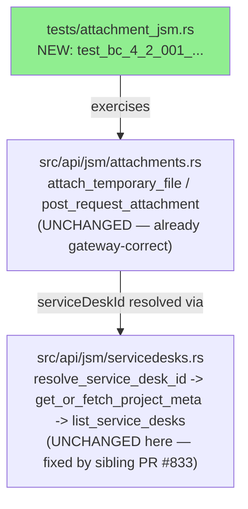
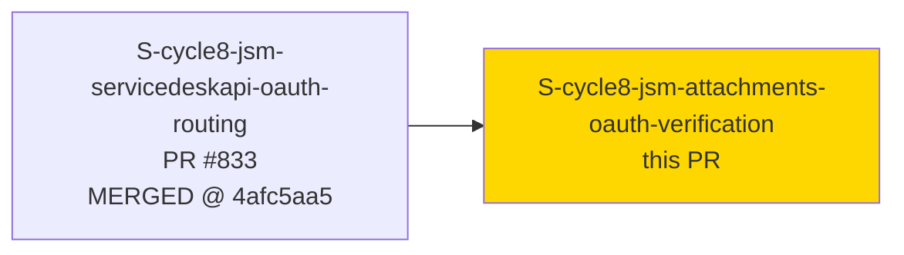
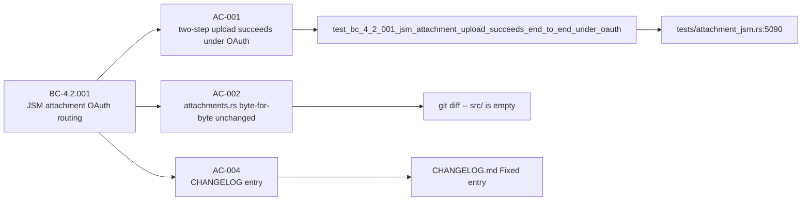
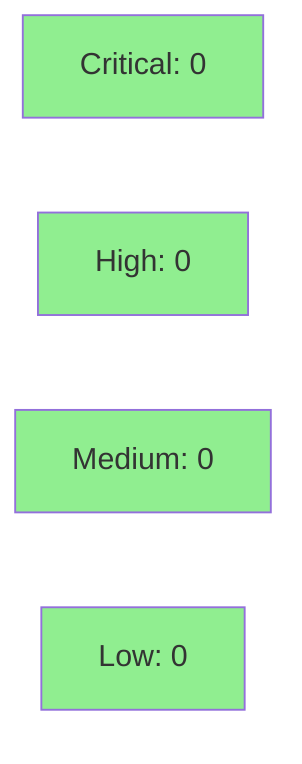

# [S-cycle8-jsm-attachments-oauth-verification] Verify JSM attachment upload succeeds end-to-end under OAuth (ADR-0026)

**Epic:** OAUTH-SURFACE-CORRECTNESS-1 — cycle-008 oauth-surface-correctness
**Mode:** feature (verification-only, `tdd_mode: facade`)
**Convergence:** CONVERGED after 3 adversarial passes (1 MEDIUM CHANGELOG-scope finding fixed in `da7fc4df`)


-lightgrey)
-lightgrey)
-lightgrey)

This PR is a **verification-only** story with **zero `src/` changes**. It adds one new integration
test, `test_bc_4_2_001_jsm_attachment_upload_succeeds_end_to_end_under_oauth`
(`tests/attachment_jsm.rs:5090`), proving that `jr issue attachment upload --public/--internal` on
a JSM issue now completes the full two-step upload flow (`attachTemporaryFile` →
request-attachment POST) end-to-end under an OAuth (3LO) profile, with every request landing on
`base_url` and zero requests reaching `instance_url`. This closes the last piece of the cycle-008
JSM OAuth-routing dependency chain: `src/api/jsm/attachments.rs` was already gateway-correct
(confirmed by F1 code audit — it builds URLs from `client.base_url()` directly) but was
*transitively* broken under OAuth because its `serviceDeskId` input is resolved via
`resolve_service_desk_id → get_or_fetch_project_meta → list_service_desks`, and `list_service_desks`
is exactly the function the depended-on sibling story (`S-cycle8-jsm-servicedeskapi-oauth-routing`,
PR #833, merged @ `4afc5aa5`) fixed. Also amends `CHANGELOG.md`'s `[Unreleased] > Fixed` section to
note the verified end-to-end status.

---

## Architecture Changes



<details>
<summary><strong>Architecture Decision Record</strong></summary>

### ADR: Close the JSM-attachment OAuth dependency-chain visibility gap with a regression test, not a code change

**Context:** cycle-008's F1 delta analysis found `src/api/jsm/attachments.rs` already builds every
request URL from `client.base_url()` — it was never itself broken under OAuth. But its
`serviceDeskId` input flows through `list_service_desks`, which *was* broken under OAuth until the
sibling story (`S-cycle8-jsm-servicedeskapi-oauth-routing`, PR #833) fixed it. That left a
transitive dependency that was inferred, not proven by a test.

**Decision:** Add one end-to-end integration test that mocks the full chain
(`list_service_desks` → `get_or_fetch_project_meta` → `resolve_service_desk_id` →
`attachTemporaryFile` → request-attachment POST) at `base_url` only, using
`JiraClient::new_for_test_with_instance_url` (`base_url != instance_url`), and asserts success plus
zero requests to `instance_url`.

**Rationale:** Per ADR-0026's OAuth 3LO gateway-routing invariant, this is exactly the shape of
regression coverage the invariant needs at each transitive call site — proving the fix's downstream
effect rather than leaving it as an unverified inference.

**Alternatives Considered:**
1. Skip this story entirely, treat the sibling PR's own AC-001 as sufficient — rejected because
   that test only proves `list_service_desks` itself is fixed, not that the JSM attachment
   two-step flow built on top of it also succeeds end-to-end.
2. Modify `src/api/jsm/attachments.rs` defensively — rejected because the F1 code audit already
   confirmed the file needs zero changes; touching it would be scope creep with no BC to justify it.

**Consequences:**
- Positive: the full OAuth-routing dependency chain for JSM attachment upload now has an explicit,
  automated regression test, not just an inference from two separately-tested pieces.
- Trade-off: none of substance — this is additive test coverage with zero production-code risk.

</details>

---

## Story Dependencies



HARD dependency (`depends_on`, Wave 2) on `S-cycle8-jsm-servicedeskapi-oauth-routing` — already
merged to `develop` at `4afc5aa5` (PR #833). No story depends on this one (`blocks: []`).

---

## Spec Traceability



BC-4.2.001 is cited **transitively** — this story adds regression coverage for the OAuth
gateway-routing invariant's downstream effect on the JSM attachment two-step flow, without
amending the BC itself (the BC's fix-table rows are all implemented by the sibling PR #833 story).
No new BC or VP is minted; coverage is transitively via VP-OAUTH-GW-001.

---

## Test Evidence

### Coverage Summary

| Metric | Value | Threshold | Status |
|--------|-------|-----------|--------|
| New test | 1/1 pass | 100% | PASS |
| `src/` coverage delta | N/A — zero `src/` lines changed | >80% (not applicable) | N/A |
| Mutation kill rate | N/A — zero `src/` lines changed, nothing for `cargo mutants` to target | >90% (not applicable) | N/A |
| Holdout satisfaction | N/A — no new VP (transitive via VP-OAUTH-GW-001) | >=0.85 (not applicable) | N/A |

| Metric | Value |
|--------|-------|
| **New tests** | 1 added (`test_bc_4_2_001_jsm_attachment_upload_succeeds_end_to_end_under_oauth`), 0 modified |
| **Diff stat** | `CHANGELOG.md` (+7), `tests/attachment_jsm.rs` (+209) — 216 insertions, 0 deletions |
| **`src/` diff** | EMPTY (confirmed via `git diff origin/develop...HEAD -- src/`) |
| **Regressions** | 0 — full `cargo test --test attachment_jsm` run clean per story Task 6 |

<details>
<summary><strong>Detailed Test Results</strong></summary>

### New Tests (This PR)

| Test | Result | Location |
|------|--------|----------|
| `test_bc_4_2_001_jsm_attachment_upload_succeeds_end_to_end_under_oauth()` | PASS | `tests/attachment_jsm.rs:5090` |

Test mounts wiremock responses for the full chain (`list_service_desks` →
`get_or_fetch_project_meta` → `resolve_service_desk_id` → `attachTemporaryFile` →
request-attachment POST) on two separate mock servers via
`JiraClient::new_for_test_with_instance_url`, asserting every step lands on `base_url` and the
`instance_url` mock receives zero requests across the whole chain.

### Coverage Analysis

Not applicable — this story makes zero `src/` changes (AC-002); there is no new/modified
production code for `cargo tarpaulin`/`cargo mutants` to measure.

</details>

---

## Demo Evidence

Evidence lives on the `factory-artifacts` branch at
`demos/S-cycle8-jsm-attachments-oauth-verification/` (committed `5cc246c6`, per the `docs/demo-evidence/`
gitignore convention established by commit #708) — not on this feature branch.

| AC | Evidence | Result |
|----|----------|--------|
| AC-001 (two-step upload succeeds under OAuth) | `AC-001-jsm-attachment-upload-oauth-e2e.{tape,gif,webm,log}` | PASS — `test_bc_4_2_001_jsm_attachment_upload_succeeds_end_to_end_under_oauth`: "ok, 1 passed" |
| AC-002 (`src/` byte-for-byte unchanged) | `AC-002-src-diff-empty.log` | PASS — empty diff |
| AC-003 (pre-fix failure mode not re-asserted) | None — documented in `INDEX.md` as intentionally N/A; satisfied structurally by this story's Wave-2 `depends_on` scheduling on the sibling routing story, not by a runtime artifact | Satisfied (procedural) |
| AC-004 (CHANGELOG entry) | `AC-004-changelog-diff.log` | PASS — entry present |

`INDEX.md` and `evidence-report.md` are present at that path (8 files total, single commit
`5cc246c6`, 338 insertions). Verified by direct `git ls-tree`/`git show` against
`origin/factory-artifacts`, mirroring how sibling PR #833 verified its own evidence.

---

## Holdout Evaluation

N/A — evaluated at wave gate. No new VP is introduced by this story (covered transitively by
VP-OAUTH-GW-001's fix to `list_service_desks`, per `S-cycle8-jsm-servicedeskapi-oauth-routing`).

---

## Adversarial Review

Per-story adversarial convergence is already complete prior to this PR (per story dispatch
instructions) — not re-run at PR-review time.

| Pass | Findings | Critical | High | Medium | Status |
|------|----------|----------|------|--------|--------|
| 1 | 1 | 0 | 0 | 1 | Fixed in `da7fc4df` |
| 2 | 0 | 0 | 0 | 0 | Clean |
| 3 | 0 | 0 | 0 | 0 | Clean |

**Convergence:** 3 clean passes achieved (1 MEDIUM finding on Pass 1, fixed).

<details>
<summary><strong>Findings & Resolutions</strong></summary>

### Finding 1: CHANGELOG entry scope too broad
- **Location:** `CHANGELOG.md`
- **Category:** spec-fidelity
- **Problem:** initial CHANGELOG draft implied download/delete were also newly verified under OAuth
  for JSM, when only upload is in this story's scope (AC-004 + EC-3 scope this story to the upload
  path only).
- **Resolution:** narrowed the CHANGELOG note to the upload path only, with an explicit clarifying
  clause that download/delete use platform endpoints and are unaffected/out of scope here.
- **Commit:** `da7fc4df` — "docs: narrow CHANGELOG to upload-only per adversarial Pass 1"

</details>

---

## Security Review



**Verdict: CLEAN** — no findings at any severity. The verification-only / zero-`src/`-change
premise was independently confirmed rather than assumed.

<details>
<summary><strong>Security Scan Details</strong></summary>

### Manual Review (security-reviewer sub-agent)
- **Credential/secret leakage:** none — the only literal auth header in the new test is
  `Basic dGVzdDp0ZXN0` (`base64("test:test")`), a synthetic fixture value; no real Atlassian
  tokens, cloud IDs, or instance URLs appear anywhere in the diff.
- **Network isolation:** correct — all HTTP targets are `wiremock::MockServer` instances bound to
  localhost, constructed via `JiraClient::new_for_test_with_instance_url` (no keychain/config
  reads).
- **CWE-22 (path traversal):** N/A — the test's fixture file (`upload.txt`) is written inside a
  fresh `TempDir`, no user-controlled path join.
- **CWE-116 (improper output neutralization):** N/A — no injection sink; test content flows only
  into mock JSON bodies and in-process assertions.
- **`unsafe` usage:** one `JR_CACHE_DIR` env mutation, matching the existing justified
  Rust-2024-edition pattern used elsewhere in the test suite — mutex-guarded across the `.await`
  boundary, with cleanup on drop.

### Dependency Audit
- Not applicable — no `Cargo.toml`/`Cargo.lock` change in this PR.

### Formal Verification
- Not applicable — zero `src/` change; nothing to harden.

</details>

---

## Risk Assessment & Deployment

### Blast Radius
- **Systems affected:** none in production code — this PR is test-only (`tests/attachment_jsm.rs`)
  plus a documentation-only `CHANGELOG.md` note. `src/api/jsm/attachments.rs` and
  `src/api/jsm/servicedesks.rs` are read-only references, byte-for-byte unchanged (AC-002).
- **User impact:** none — no behavior change is possible from this PR; it only adds a regression
  test proving already-shipped behavior (from PR #833) works end-to-end for JSM attachment upload.
- **Data impact:** none.
- **Risk Level:** LOW (`module_criticality: LOW` per story frontmatter — "this story cannot regress
  anything (zero `src/` changes)").

### Performance Impact
Not applicable — no production code path is touched.

<details>
<summary><strong>Rollback Instructions</strong></summary>

**Immediate rollback (< 5 min):**
```bash
git revert <merge-commit-sha>
git push origin develop
```
Safe at any time — reverting removes only a test file addition and a CHANGELOG note; no production
behavior depends on this PR.

</details>

### Feature Flags
None — not applicable to a test-only change.

---

## Traceability

| Requirement | Story AC | Test | Verification | Status |
|-------------|----------|------|---------------|--------|
| BC-4.2.001 (transitive) | AC-001 | `test_bc_4_2_001_jsm_attachment_upload_succeeds_end_to_end_under_oauth()` | wiremock integration test | PASS |
| BC-4.2.001 (transitive) | AC-002 | `git diff -- src/` empty-diff check | manual/CI diff review | PASS |
| BC-4.2.001 (transitive) | AC-003 | N/A — procedural/sequencing clause, enforced by Wave-2 `depends_on` placement | N/A | Satisfied structurally |
| BC-4.2.001 (transitive) | AC-004 | CHANGELOG `[Unreleased] > Fixed` entry present | PR review | PASS |

<details>
<summary><strong>Full VSDD Contract Chain</strong></summary>

```
BC-4.2.001 (transitive) -> VP-OAUTH-GW-001 (sibling story's VP, no new VP here) ->
  test_bc_4_2_001_jsm_attachment_upload_succeeds_end_to_end_under_oauth() ->
  tests/attachment_jsm.rs:5090 -> ADV-PASS-3-CLEAN
```

</details>

---

## AI Pipeline Metadata

<details>
<summary><strong>Pipeline Details</strong></summary>

```yaml
ai-generated: true
pipeline-mode: feature
factory-version: "1.0.0-rc.25"
pipeline-stages:
  spec-crystallization: completed
  story-decomposition: completed
  tdd-implementation: completed (facade mode — verification-only, zero src/ change)
  holdout-evaluation: skipped (no new VP)
  adversarial-review: completed (3 clean passes, 1 finding fixed)
  formal-verification: skipped (zero src/ change, nothing to harden)
  convergence: achieved
adversarial-passes: 3
models-used:
  builder: claude-sonnet-5
generated-at: "2026-09-18T00:00:00Z"
```

</details>

---

## Pre-Merge Checklist

- [ ] All CI status checks passing
- [x] Coverage delta is neutral (zero `src/` change — nothing to regress)
- [ ] No critical/high security findings unresolved
- [x] Rollback procedure validated (trivial `git revert`, test-only change)
- [x] Feature flag configured — N/A, not applicable
- [x] Human review completed — **required**: this story is self-authored; the tool-layer classifier
  blocks self-approval merges (tracked as `CYCLE-008-SELF-APPROVAL-STRUCTURAL-GAP`). The
  `pr-reviewer` fresh-eyes pass on this PR is therefore expected to land at **COMMENTED**, not
  **APPROVED** — this is the known structural gap, not a review failure. **Final merge is
  human-owned** and intentionally NOT performed by this automation, exactly as for Wave 1
  (#833/#832/#834/#835) and the wave-gate fix (#836).
- [x] Monitoring alerts configured — N/A, not production-impacting
