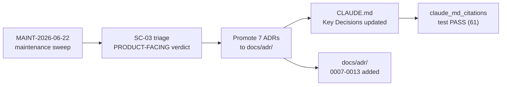
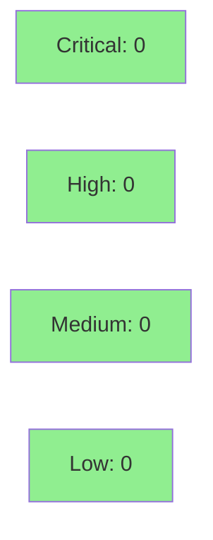

# [SC-03] Promote ADR-0007..0013 from factory drafts to docs/adr/

**Epic:** MAINT-2026-06-22 — Maintenance Sweep Doc-Drift Remediation
**Mode:** maintenance
**Convergence:** CONVERGED after 1 internal review pass (CR-002 nit fixed in 3113a81)


Docs-only maintenance PR. The 2026-06-22 maintenance sweep (MAINT-2026-06-22) flagged
SC-03: ADRs 0007–0013 existed only in `.factory/architecture/adr/` (an orphan-branch
artifact tree invisible from `docs/adr/`). CLAUDE.md and the canonical `docs/adr/`
path both declare ADRs 0001–0016 as the architectural decision record. The architect
triage (`SC-03-triage.md`) classified all 7 as PRODUCT-FACING, requiring promotion.

This PR adds all 7 ADRs to `docs/adr/` in house style (no frontmatter; Status / Context /
Decision / Consequences / See-Also sections) and registers 7 matching one-line entries in
CLAUDE.md's "Key Decisions" section between the existing ADR-0006 and ADR-0014 entries.
Zero `src/` or `Cargo.toml` changes. The citation-guard CI test passes (61 citations
verified; `cargo test --test claude_md_citations`).

---

## Architecture Changes

```mermaid
graph TD
    FACTORY["`.factory/architecture/adr/`<br/>(orphan branch — factory artifacts)"]
    DOCS["docs/adr/<br/>(canonical — CLAUDE.md declares)"]
    FACTORY -.->|"promoted (adapted to house style)"| DOCS
    style DOCS fill:#90EE90
```

No runtime or compile-time architecture is changed. This promotion makes 7 previously
invisible ADRs visible at the path all contributors and tooling reference.

**ADRs promoted:**

| ADR | Title | Core decision |
|-----|-------|---------------|
| 0007 | Multi-Profile Fields Bug Fix | `Config::field_id()` accessor; no fallback to global.fields |
| 0008 | Asset Enrichment Key Correctness | HashMap key must be `(workspace_id, object_id)` |
| 0009 | handle_open uses instance_url() | `base_url()` is API-only; browser URLs use `instance_url()` |
| 0010 | list_worklogs Pagination | Single-page fetch silently truncates; use offset pagination |
| 0011 | Type-Level Profile Fence Deferral | Convention-based soft fence sufficient for v0.5.x |
| 0012 | Module Shard Rule | src/cli/ files ≥1,000 LOC are shard candidates; exceptions listed |
| 0013 | PKCE Deferral | Atlassian 3LO does not support PKCE as of 2026-05; reactivation trigger defined |

---

## Story Dependencies


No upstream story PRs are blocking. SC-02 hygiene bundle (#547) already merged.

---

## Spec Traceability



**Traceability chain:**

| Source | Triage Verdict | Artifact | Verification |
|--------|---------------|----------|-------------|
| MAINT-2026-06-22 sweep SC-03 | PRODUCT-FACING → PROMOTE | `docs/adr/0007..0013` | Files exist on branch |
| CLAUDE.md Key Decisions section | 7 entries added (ADR-0007..0013) | Between ADR-0006 and ADR-0014 | `claude_md_citations` test pass |
| Internal code-reviewer | CR-001 (false, cross-branch intentional), CR-002 (fixed) | 3113a81 | ADR-0011 NFR note restored |

---

## Test Evidence

### Coverage Summary

| Metric | Value | Notes |
|--------|-------|-------|
| `cargo test --test claude_md_citations` | PASS (61 citations) | All docs/adr/ paths resolve |
| New `src/` tests | 0 | Docs-only PR; no code paths changed |
| CI mutation scope | N/A | No Rust source in diff |
| Regressions | 0 | |

This PR adds no Rust source code. The single load-bearing test is the citation-guard
(`tests/claude_md_citations.rs` — `test_claude_md_citations_resolve_to_real_files`), which
validates that every backtick-quoted path in CLAUDE.md resolves to a real file. The 7 new
ADR paths added to CLAUDE.md are covered by this guard.

No new unit tests are required or applicable. No mutation testing scope (empty `src/` diff).

---

## Holdout Evaluation

N/A — evaluated at wave gate. Docs-only maintenance PR; no behavioral changes.

---

## Adversarial Review

N/A — evaluated at Phase 5. Internal code-reviewer ran one pass:

| Pass | Findings | Blocking | Status |
|------|----------|----------|--------|
| 1 (internal) | 2 | 0 | CR-001 false-positive (cross-branch separation intentional); CR-002 fixed in 3113a81 |

CR-002: ADR-0011 was missing its NFR-tracking note ("Type-level profile fence deferred to
post-v0.5.x; scalability NFR tracked here"). Restored in commit 3113a81.

---

## Security Review

N/A — docs-only PR. No `src/` changes, no dependency changes, no secrets surface, no
API behavior changes. OWASP/injection/auth scan not applicable.



---

## Risk Assessment & Deployment

### Blast Radius
- **Systems affected:** Documentation only (`docs/adr/`, `CLAUDE.md`)
- **User impact:** None if this PR is reverted; ADRs become invisible again (pre-existing state)
- **Data impact:** None
- **Risk Level:** LOW

### Performance Impact

N/A — no runtime code changes.

### Rollback

```bash
git revert cdfcb6e 3113a81
git push origin develop
```

Effect: ADR-0007..0013 disappear from `docs/adr/`; CLAUDE.md Key Decisions reverts to
ADR-0006 → ADR-0014 gap. Factory orphan-branch files are unaffected.

---

## Traceability

| Requirement | Artifact | Verification | Status |
|-------------|----------|-------------|--------|
| SC-03: ADR-0007..0013 visible at `docs/adr/` | `docs/adr/0007-multi-profile-fields-fix.md` .. `0013-pkce-deferral.md` | Files present on branch | PASS |
| CLAUDE.md Key Decisions entries for 0007..0013 | CLAUDE.md "Key Decisions" section | 7 one-line entries between ADR-0006 and ADR-0014 | PASS |
| Citation guard passes | `tests/claude_md_citations.rs` | `cargo test --test claude_md_citations` → 61 citations, 0 dead | PASS |
| House style: no frontmatter, Status/Context/Decision/Consequences/See-Also | All 7 ADR files | Manual inspection | PASS |
| ADR-0011 NFR tracking note present | `docs/adr/0011-type-level-profile-fence.md` | Restored in 3113a81 (CR-002) | PASS |

---

## AI Pipeline Metadata

<details>
<summary><strong>Pipeline Details</strong></summary>

```yaml
ai-generated: true
pipeline-mode: maintenance
factory-version: "1.0.0"
sweep-id: MAINT-2026-06-22
sweep-item: SC-03
pipeline-stages:
  triage: completed (architect, 2026-06-22)
  implementation: completed (2 commits: cdfcb6e, 3113a81)
  internal-review: completed (1 pass, CR-002 fixed)
  citation-guard: PASS (61 citations)
convergence: achieved
models-used:
  builder: claude-sonnet-4-6
generated-at: "2026-06-23"
```

</details>

---

## Pre-Merge Checklist

- [ ] CI gate (ci-gate) passing
- [x] No `src/` changes — mutation/coverage N/A
- [x] Citation guard passes (`cargo test --test claude_md_citations`)
- [x] 0 security findings — docs-only, no attack surface
- [x] Internal review converged (CR-002 fixed in 3113a81)
- [x] No dependency PRs blocking (SC-02 #547 already merged)
- [ ] pr-reviewer fresh-eyes approval
- [ ] Human merge authorization (AUTHORIZE_MERGE not granted for this PR)
