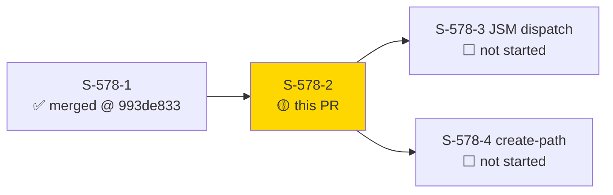
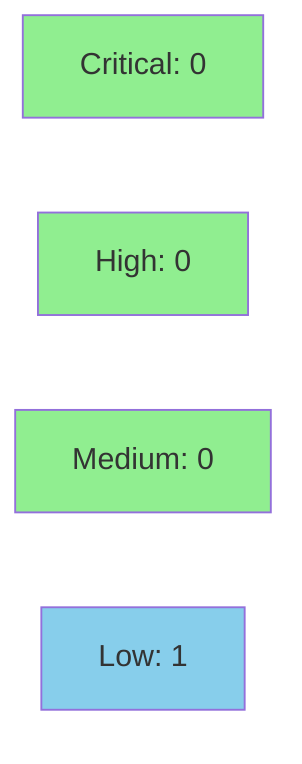

# [S-578-2] `issue edit --field` Hint-Kind Dispatch + Cascading Select + Dry-Run Preview

**Epic:** none — bundle `field-dx` (GitHub issue #578, item 1 of the bundle; part 3 of 5)
**Mode:** feature
**Convergence:** CONVERGED after 4 adversarial passes (Pass 1 BLOCKING → fixed; Passes 2/3/4 NITPICK_ONLY; 3/3 CLEAN)


Adds explicit `:option`/`:id`/`:name`/`:asset` value-kind hints to `jr issue edit --field`, letting a
user bypass `resolve_edit_fields`'s fuzzy-match heuristics and state exactly which of Jira's several
incompatible custom-field wire shapes (`{"id":...}` vs `{"name":...}` vs an Assets object-reference
array vs a cascading `{"value":...,"child":{"value":...}}` shape) applies to a given field. Also adds
cascading-select composition (`Parent>Child` via `str::split_once('>')`) and a `--dry-run` per-kind
wire-shape preview. The bare (unhinted) `--field NAME=VALUE` dispatch is byte-for-byte unchanged —
this story is strictly additive, gated on `FieldValueSpec.kind != None`.

---

## Architecture Changes

```mermaid
graph TD
    edit["cli/issue/edit.rs::handle_edit"] -->|threads FieldValueSpec| resolve["cli/issue/field_resolve.rs::resolve_edit_fields"]
    resolve -->|":option" cascading/non-cascading| editmeta["editmeta allowedValues/children"]
    resolve -->|":id" / ":name"| verbatim["verbatim id-field/name-field wrapper"]
    resolve -.->|":asset" NEW edge, L2 call site| workspace["api/assets/workspace.rs::get_or_fetch_workspace_id"]
    types["types/jira/editmeta.rs::AllowedValue"] -->|"+children: Vec<AllowedValue>"| resolve
    style resolve fill:#90EE90
    style types fill:#90EE90
```

<details>
<summary><strong>Architecture Decision Record</strong></summary>

### ADR: Where the hinted-bypass dispatch logic lives

**Context:** ADR-0019 requires `edit.rs`'s own diff to stay narrow (~100 LOC guidance) since it's
already a 3,187-LOC DOCUMENT-AS-IS file; the dense per-kind dispatch/composition logic needed a home
that wasn't `edit.rs` itself.

**Decision:** All hinted-bypass dispatch, the cascading `>` composer, the `:asset` `WORKSPACE:OBJECTID`
composer, and the D4 non-cascading-collision guard live in `field_resolve.rs` (914 LOC pre-story, well
under the ADR-0012 1,000-LOC shard threshold). `edit.rs`'s diff is limited to threading
`FieldValueSpec` through the existing `parse_field_kv` call site and the dry-run preview assembly.

**Rationale:** Keeps the narrow-touch guidance from ADR-0019 §2(b) satisfied without introducing a new
module for a single story's addition.

**Alternatives Considered:**
1. Put the composer logic directly in `edit.rs` — rejected: would have pushed the diff well past the
   ~100-LOC guidance and mixed dispatch logic into an already-oversized file.
2. New `cli/issue/field_hints.rs` module — rejected: `field_resolve.rs` is the existing, correctly-sized
   home for field-resolution logic; splitting further wasn't warranted at this size.

**Consequences:**
- `edit.rs` diff came in at 23 insertions / 24 deletions (47 lines changed total), under the ~100-LOC
  guidance (AC-018) — verified via `git diff --numstat`.
- `field_resolve.rs` grows substantially (+637/-… per `git diff --stat`). **Correction per
  pr-reviewer finding NON-BLOCKING-2:** measured on the branch this file is **1,253 LOC total**
  (974 before the `#[cfg(test)]` module) — it HAS crossed the ADR-0012 1,000-LOC shard threshold
  (was 914 on `develop`). This PR does not yet add the standard `CLAUDE.md` "Known Size
  Deviations" DOCUMENT-AS-IS entry every other file that crossed this threshold carries
  (`edit.rs`, `component.rs`, `attachments.rs`, `mod.rs`, `helpers.rs`, `list.rs`, `workflow.rs`).
  Flagged as a NON-BLOCKING follow-up rather than blocking this PR — recommend adding that entry
  in a fast-follow commit/PR.

</details>

---

## Story Dependencies



`depends_on: [S-578-1]` — this story threads `FieldValueSpec` (built by S-578-1) through
`resolve_edit_fields`'s call site; it cannot compile without S-578-1 merged first. S-578-1 merged at
`993de833` (#739). `blocks: []` — no downstream story has a compile dependency on this story's files.

---

## Spec Traceability

```mermaid
flowchart LR
    BC1[BC-3.4.027<br/>":option" + cascading] --> AC2[AC-002/003/004/019]
    BC2[BC-3.4.028<br/>":id" verbatim] --> AC6[AC-006]
    BC3[BC-3.4.029<br/>":name" verbatim] --> AC7[AC-007]
    BC4[BC-3.4.030<br/>":asset" composer] --> AC8[AC-008/009/010/013]
    BC5[BC-3.4.021<br/>dry-run preview] --> AC12[AC-012]
    AC2 --> T1[issue_field_hint_kinds.rs]
    AC6 --> T1
    AC7 --> T1
    AC8 --> T1
    AC12 --> T1
    T1 --> S1[field_resolve.rs / edit.rs / editmeta.rs]
```

---

## Test Evidence

### Coverage Summary

| Metric | Value | Threshold | Status |
|--------|-------|-----------|--------|
| New tests (`issue_field_hint_kinds`) | 64/64 pass (incl. 2 proptests) | 100% | PASS |
| Regression (`issue_edit_field`) | 90/90 pass | 100% | PASS |
| Full-suite spot check | 154/154 across both target files | 100% | PASS |
| Clippy | `-D warnings` clean | zero warnings | PASS |
| Fmt | `cargo fmt --all -- --check` clean | clean | PASS |
| `todo!()` in `src/` | 0 | 0 | PASS |

Verified directly in the feature-branch worktree (`.worktrees/S-578-2`, HEAD `4d0d54af`) at PR-creation
time — not taken on report:

```
$ cargo test --test issue_field_hint_kinds
test result: ok. 64 passed; 0 failed; 0 ignored; 0 measured; 0 filtered out; finished in 0.96s

$ cargo test --test issue_edit_field
test result: ok. 90 passed; 0 failed; 0 ignored; 0 measured; 0 filtered out; finished in 0.71s

$ cargo clippy --all-targets -- -D warnings   # clean
$ cargo fmt --all -- --check                  # clean
$ grep -rn "todo!()" src/                     # 0 hits
```

### Diff Stat

| File | Change |
|------|--------|
| `src/cli/issue/edit.rs` | 23 insertions(+), 24 deletions(-) — 47 lines changed, under ADR-0019 §2(b)'s ~100-LOC narrow-touch guidance (AC-018) |
| `src/cli/issue/field_resolve.rs` | 637 lines changed — dense dispatch/composer logic, per ADR-0019 |
| `src/types/jira/editmeta.rs` | +55 — regression pin for the pre-existing `AllowedValue.children` field (AC-011); the field itself was added by prior story S-580-1, not this PR (corrected per pr-reviewer finding NON-BLOCKING-3) |
| `tests/issue_edit_field.rs` | 93 lines changed — regression suite still 90/90 green |
| `tests/issue_field_hint_kinds.rs` | +2,832 (new file) — all 19 ACs, incl. 2 proptests |

<details>
<summary><strong>Detailed Test Results</strong></summary>

### New Tests (This PR)

64 test functions in `tests/issue_field_hint_kinds.rs`, covering AC-001 through AC-019 (19 acceptance
criteria — see story spec for the full test-name-to-AC mapping), including:
- `prop_cascading_split_no_panic` — proptest, D3 multibyte-safety MUST for the `>` split
- `prop_asset_composer_no_malformed_json_ever` — proptest, no-panic corpus for the `:asset` `:` split
- `test_bc_3_4_027_ec1_*` (3 tests) — EC-3.4.027-1 entry-point `schema.type` gate (AC-019, amended in
  story v1.1 per PO-approved BC clarification)
- `test_bc_3_4_030_edit_path_asset_cold_cache_*` (4 tests) — VP-578-022 cold-cache failure taxonomy,
  independently asserted at this call site (1 of 3 shared call sites; S-578-3/S-578-4 assert
  independently at their own sites)

### Regression (`tests/issue_edit_field.rs`)

90/90 pre-existing tests pass unmodified in behavior (93-line diff is test-infrastructure churn to
accommodate the `FieldValueSpec` signature change, not behavioral changes to existing assertions) —
satisfies AC-015's "full existing suite stays green" obligation.

</details>

---

## Holdout Evaluation

N/A — evaluated at wave gate.

---

## Adversarial Review

| Pass | Findings | Critical | High | Status |
|------|----------|----------|------|--------|
| 1 | 1 | 0 | 1 (BLOCKING) | Fixed (EC-3.4.027-1 entry-point gate + cascading-error + multi-asset coverage; AC-019 added) |
| 2 | 0 blocking | 0 | 0 | NITPICK_ONLY |
| 3 | 0 blocking | 0 | 0 | NITPICK_ONLY (CLEAN) |
| 4 | 0 blocking | 0 | 0 | NITPICK_ONLY (CLEAN) |

**Convergence:** 3/3 CLEAN passes achieved after the Pass 1 BLOCKING fix (commits `d9029c8d`..`faf2c6eb`
implement the fix; `b849cdf6`/`4d0d54af` are doc-only follow-ups closing Pass 3/4 nitpicks).

<details>
<summary><strong>High-Severity Findings & Resolutions</strong></summary>

### Finding 1: EC-3.4.027-1 entry-point `:option` type gate was unspecified/untested
- **Category:** spec-fidelity
- **Problem:** The original story draft did not require a `schema.type` membership gate to run
  *before* the `:option` composer inspects `allowedValues`/`children`, leaving ambiguous behavior for
  `--field NAME:option=VALUE` against a non-option field.
- **Resolution:** BC-3.4.027 amended (PO-approved) to add EC-3.4.027-1 with two distinct exit-64
  message sub-cases (array/any type reuses EC-3.4.015-5's message; other bare-form-supported scalar
  types get a distinct "is not an option field" message). Story bumped to v1.1, AC-019 added.
- **Test added:** `test_bc_3_4_027_ec1_array_type_reuses_ec_3_4_015_5_message`,
  `test_bc_3_4_027_ec1_scalar_type_distinct_is_not_an_option_field_message`,
  `test_bc_3_4_027_ec1_gate_runs_before_allowed_values_children_inspection`

</details>

---

## PR Review (pr-reviewer, fresh-eyes)

**Verdict: APPROVE** — 0 BLOCKING findings, 11 NON-BLOCKING findings. Converged in 1 cycle.

The reviewer independently re-ran `cargo test --test issue_field_hint_kinds` in the worktree at
HEAD `4d0d54af` and confirmed 64/64 passing (not taken on the PR's own claim). Also independently
verified: hinted dispatch is correctly placed after the editmeta-presence/`operations` guards
(AC-001); the `resolve_option_value`/`find_option_match` extraction is genuine code motion with no
behavior drift (AC-002); `compose_asset_hint`'s malformed-shape check order exactly matches the
spec's required EC-2a→EC-2c→EC-2d→EC-2b sequence; `get_or_fetch_workspace_id` is called at the L2
call site only (Architecture Compliance Rule 3); the dry-run JSON-type swap (`dr_changed` →
`dr_planned`) introduces no regression for unhinted fields; zero string-concatenation JSON
construction; zero `unsafe`/`#[allow]`/`todo!()`.

<details>
<summary><strong>All 11 findings (none blocking — "nothing here risks incorrect data being
written to Jira or a panic")</strong></summary>

| # | Finding | Category | Reviewer recommendation |
|---|---------|----------|--------------------------|
| 1 | `:option` empty-child message deviates from EC-3.4.027-6's "same shape" requirement, and the divergence is pinned by tests on both sides | spec-fidelity | Fix in this PR (message-shape change + test-assertion update) or amend the BC |
| 2 | `field_resolve.rs` measured at 1,253 LOC — crossed the ADR-0012 1,000-LOC shard threshold; missing the standard `CLAUDE.md` Known Size Deviations entry every other file that crossed it carries | ADR compliance / doc accuracy | **Corrected in this PR body above** (Architecture Decision Record section); `CLAUDE.md` entry itself deferred as a fast-follow (requires a source-tree doc commit, out of PR-manager's direct-edit scope) |
| 3 | PR body diff-stat table misattributed the `editmeta.rs` `children` field as new (it predates this PR, added by S-580-1) | description accuracy | **Corrected in this PR body above** |
| 4 | `Parent > Child` (with spaces) is unresolvable on input but the success-path echo renders with spaces — round-trip asymmetry | UX | Follow-up |
| 5 | No deterministic fixture for EC-3.4.027-5/EC-3.4.030-6's literal multibyte examples (`Pré>Bñ`, `Wé:123`); proptests only prove absence-of-panic, not correct resolution | coverage | Follow-up — add 2 small deterministic tests |
| 6 | No `:option` coverage for ambiguous-match or numeric-id-bypass interaction with the cascading parent segment | coverage | Follow-up |
| 7 | `resolve_edit_fields`'s Step 1–6 doc-block pseudocomment wasn't updated for the new hinted-dispatch step | documentation | Follow-up |
| 8 | `:id`/`:name` "bypasses allowedValues entirely" claim never tested against a *populated* (non-empty) `allowedValues` list | coverage | Follow-up — add 1 discriminating test |
| 9 | Two `proptest!` block doc comments still describe pre-merge RED-gate state; one assertion (`!stderr.contains(INTERIM_GUARD_MSG)`) is now permanently vacuous on this command since this PR removed the guard's call site | test quality / docs | Fix in this PR (comment cleanup + drop dead assertion) |
| 10 | EC-8/EC-9 regression test asserts only that *a* PUT fired, not that the matched-body mock fired — the name/comment claims more than the assertion proves | test quality | Fix in this PR (tighten to `.expect(1)` on the body-matched mock) |
| 11 | Inline `&mut BTreeMap::new()` throwaway argument at the live call site — works, but a named binding would read better | code quality (nit) | Follow-up, purely stylistic |

</details>

A pre-existing (not introduced by this PR) BC-3.4.016 edge case was also noted: `find_option_match`
with an empty bare value resolves to a field's sole `allowedValue` instead of erroring, because
`v.to_lowercase().contains("")` is always true. The `:option` cascading path already guards against
this for both segments; the non-cascading entry point does not. Out of scope for S-578-2, flagged
for a follow-up story.

**Full review:** `.factory/code-delivery/S-578-2/pr-review.md` (this repo, feature branch).

---

## Security Review

**Verdict: APPROVE.** No Critical/High/Medium findings; 1 Low finding, pre-existing (not introduced by
this diff) and not a merge blocker.



<details>
<summary><strong>Security Scan Details</strong></summary>

### Findings

**SEC-001 (LOW, CWE-674/CWE-400, pre-existing):** `AllowedValue.children: Vec<AllowedValue>`
(`src/types/jira/editmeta.rs`) has no recursion-depth cap on `serde_json` deserialization from the
`GET …/editmeta` API response — a pathologically deep server response could stack-overflow the
process. The field itself predates this PR (added in S-580-1); this PR's `:option` cascading-select
composer is the first production code path to walk into `.children` (bounded to exactly one level,
matching Jira's real 2-level cascading model — not attacker-controlled depth). Not a blocker:
exploitability requires a response from an already-TLS-authenticated, user-configured Jira host.
Recommend a follow-up story applying the existing `MAX_ADF_DEPTH`-style guard (precedent: `src/adf.rs`
SEC-001/CWE-674, PR #553) to editmeta deserialization.

### Categories checked, no findings
- **JSON construction:** all four new composers (`:option`/`:id`/`:name`/`:asset`) build outgoing wire
  values exclusively via `serde_json::json!{...}` over typed strings — no manual string concatenation
  into JSON text; `serde_json` escapes automatically, so no injection via `--field` values.
- **Panic safety:** both new `str::split_once` delimiter paths (`>` for cascading, `:` for
  `WORKSPACE:OBJECTID`) are inherently panic-free over arbitrary UTF-8 (Rust stdlib guarantee, char-
  boundary safe). Proptest coverage verified as genuine (not rubber-stamp): 2 proptest blocks, 20 cases
  each over arbitrary Unicode (incl. multibyte), each spawning a real `jr` subprocess and asserting
  exit code != 101 and no `"panicked at"` in stderr.
- **Terminal/log injection:** raw user-supplied `VALUE` is echoed unsanitized into some error messages,
  but this is pre-existing (not introduced here) and the threat model doesn't apply — no
  cross-principal boundary (the CLI operator typing `--field` is the same party viewing their own
  terminal).
- **Recursive-struct handling in new code:** the composer itself only ever indexes one level into
  `children` — does not itself introduce unbounded recursion (see SEC-001 above for the separate
  deserialization-layer concern).
- **`:asset` SSRF/credential risk:** `get_or_fetch_workspace_id` reuses the existing authenticated
  `JiraClient` (no new credential path); the resolved workspace id is used only as a JSON payload
  value, never interpolated into a URL/host — no SSRF vector.
- **Auth bypass / insecure deserialization / sensitive data exposure:** none found — `:id`/`:name`
  hints are a client-side convenience bypass only (server-side authorization on the PUT is unaffected,
  consistent with `jr`'s thin-client architecture, ADR-0001); `AllowedValue` deserializes into a fixed
  typed struct via `serde_json`, no dynamic type resolution or `unsafe`; no tokens/secrets in any new
  error message or wire payload.

### Dependency Audit
Not run as part of this review (no new third-party dependency introduced by this PR — story spec
confirms "no new crate").

</details>

Reviewed by a dispatched `vsdd-factory:security-reviewer` sub-agent against the real PR #741 diff
(`git diff origin/develop...origin/feature/S-578-2-edit-field-dispatch`), covering
`src/cli/issue/field_resolve.rs`, `src/cli/issue/edit.rs`, `src/types/jira/editmeta.rs`,
`src/api/assets/workspace.rs` (read for context, unmodified), and both test files.

---

## Risk Assessment & Deployment

### Blast Radius
- **Systems affected:** `jr issue edit --field` only (CLI + `field_resolve.rs` + `editmeta.rs` types).
  No JSM/create-path code touched (`create.rs`, `jsm_create.rs`, `api/jsm/requests.rs` explicitly out
  of scope per the story's "Files that MUST NOT change" list, and unmodified in this diff).
- **User impact if failure occurs:** Additive — a user who never uses `:option`/`:id`/`:name`/`:asset`
  hints is on the byte-for-byte unchanged bare-form path (AC-001/AC-005/AC-015 all assert this).
  Blast radius is scoped to users who opt in to the new `:kind` hint syntax.
- **Data impact:** None — no persisted schema change; `AllowedValue.children` is a new optional
  (`#[serde(default)]`) deserialization field, not a cache-format break (old cached editmeta responses
  without a `children` key deserialize to `Vec::new()`, per AC-011).
- **Risk Level:** LOW — additive dispatch branch, full regression suite green, `:asset` HTTP-call
  ordering pinned by tests (BC-3.4.030 postconditions), 3/3 clean adversarial convergence.

### Feature Flags
| Flag | Controls | Default |
|------|----------|---------|
| N/A | Feature is opt-in via explicit `:kind` syntax on `--field`; no flag needed | — |

---

## Traceability

| Requirement | Story AC | Test | Status |
|-------------|---------|------|--------|
| BC-3.4.027 (`:option` + cascading) | AC-002/003/004/019 | `test_bc_3_4_027_*` (14 tests) | PASS |
| BC-3.4.028 (`:id` verbatim) | AC-006 | `test_bc_3_4_028_id_hint_bypasses_allowed_values_lookup` | PASS |
| BC-3.4.029 (`:name` verbatim) | AC-007 | `test_bc_3_4_029_name_hint_priority_byte_identical_to_dedicated_flag` | PASS |
| BC-3.4.030 (`:asset` composer + cold-cache taxonomy) | AC-008/009/010/013 | `test_bc_3_4_030_*` (11 tests) | PASS |
| BC-3.4.021 (dry-run per-kind preview) | AC-012/013 | `test_bc_3_4_021_dry_run_*` (5 tests) | PASS |
| BC-3.4.015/016 (bare-form unchanged) | AC-001/005/015/016 | `test_bc_3_4_015_*`, full `issue_edit_field` regression | PASS |
| BC-3.4.031 (malformed-hint regression at edit call site) | AC-009/014 | `test_bc_3_4_031_*`, `test_ec6_ec7_ec8_ec9_regression_at_edit_call_site` | PASS |

Demo evidence (per-AC recordings, factory-artifacts policy #708 — NOT part of this product diff):
`.factory/demos/S-578-2/` on the `factory-artifacts` branch — 10 per-AC `.gif`/`.tape`/`.webm` sets
(AC-002, 003, 004, 006, 007, 008, 009, 010, 013, 019) + `evidence-report.md`.

---

## Demo Evidence

Recorded on the `factory-artifacts` branch at `.factory/demos/S-578-2/` (per repo demo-evidence policy
#708 — demos live outside the product diff, not in this PR's changed files).

| AC | Scenario | Files |
|----|----------|-------|
| AC-002 | `:option` hint, non-cascading | `AC-002-option-hint-non-cascading.{gif,tape,webm}` |
| AC-003 | `:option` hint, cascading (`Parent>Child`) | `AC-003-option-hint-cascading.{gif,tape,webm}` |
| AC-004 | `:option` hint, non-cascading-field `>` collision error | `AC-004-option-hint-noncascading-collision-error.{gif,tape,webm}` |
| AC-006 | `:id` hint bypasses `allowedValues` lookup | `AC-006-id-hint-bypasses-allowed-values.{gif,tape,webm}` |
| AC-007 | `:name` hint, `priority` byte-identical to dedicated flag | `AC-007-name-hint-priority.{gif,tape,webm}` |
| AC-008 | `:asset` hint, explicit workspace form | `AC-008-asset-hint-explicit-workspace.{gif,tape,webm}` |
| AC-009 | `:asset` hint, malformed shapes → exit 64 | `AC-009-asset-hint-malformed-shapes-error.{gif,tape,webm}` |
| AC-010 | `:asset` hint, cold-cache failure taxonomy | `AC-010-asset-hint-cold-cache-failure-taxonomy-error.{gif,tape,webm}` |
| AC-013 | `:asset` hint under `--dry-run`, cold-cache exits before preview | `AC-013-asset-hint-dry-run-cold-cache-exits-before-preview.{gif,tape,webm}` |
| AC-019 | `:option` hint entry-point `schema.type` gate error | `AC-019-option-hint-entry-point-type-gate-error.{gif,tape,webm}` |

10 per-AC demo sets + `evidence-report.md` + `mock_server.py` (harness), verified present via
`git ls-tree -r origin/factory-artifacts --name-only | grep S-578-2` at PR-creation time (Step 2 of the
PR lifecycle). At least 1 recording per AC that has a distinct user-visible behavior (ACs covering
pure regression/internal-only assertions — e.g. AC-001, AC-005, AC-011, AC-014, AC-015, AC-016,
AC-017, AC-018 — are covered by the automated test suite above rather than a separate recording, per
standard demo-evidence scoping).

---

## AI Pipeline Metadata

<details>
<summary><strong>Pipeline Details</strong></summary>

```yaml
ai-generated: true
pipeline-mode: feature
factory-version: "1.0.0"
pipeline-stages:
  spec-crystallization: completed
  story-decomposition: completed
  tdd-implementation: completed
  holdout-evaluation: skipped (N/A - wave gate)
  adversarial-review: completed
  formal-verification: skipped
  convergence: achieved
adversarial-passes: 4
story: S-578-2
bundle: field-dx (issues #580, #578)
depends_on: [S-578-1]
```

</details>

---

## Pre-Merge Checklist

- [ ] All CI status checks passing (`CI Gate` — pending, see Step 6)
- [x] Coverage delta is positive (new 2,832-line test file, full regression green)
- [x] No critical/high security findings unresolved (Step 4 security review: APPROVE, 0 Critical/High/Medium, 1 pre-existing Low non-blocking)
- [x] `edit.rs` diff stays under ADR-0019 ~100-LOC narrow-touch guidance (47 lines changed)
- [x] Full `tests/issue_edit_field.rs` regression suite green (90/90)
- [x] Dependency S-578-1 merged (`993de833`, #739)
- [x] pr-reviewer convergence to 0 blocking findings (Step 5: APPROVE, 0 BLOCKING / 11 NON-BLOCKING, converged in 1 cycle)
- [ ] Human merge approval (explicitly deferred — this PR stops before Step 8/merge)
