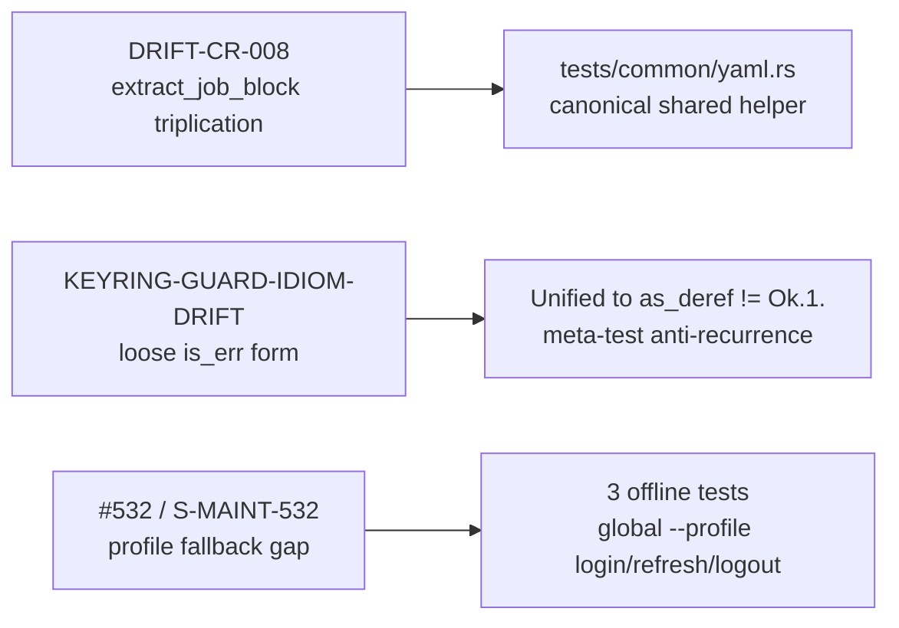

## Summary

**Bundle D — Test Hygiene (maintenance sweep 2026-06-22)**

Test-only PR. Zero production/runtime logic change. Resolves three drift items from the 2026-06-22 maintenance sweep (`.factory/maintenance/2026-06-22/bundle-d-triage.md`).

---

## Changes

### Item A — CR-008 / DRIFT-CR-008: `extract_job_block` helper deduplication

`fn extract_job_block` was byte-for-byte identical across three CI integration-test files (3 definitions, 20 call sites). Extracted to `tests/common/yaml.rs`, wired into `tests/common/mod.rs`, and local copies deleted.

**Files changed:** `tests/common/mod.rs` (+1), `tests/common/yaml.rs` (new, +52), `tests/ci_yml_windows_matrix.rs` (-40), `tests/ci_gate_completeness.rs` (-34), `tests/backfill_matrix_parity.rs` (-37)
**Net:** −141 LOC body × 3, +59 LOC canonical copy — eliminates future drift between the three test files.

### Item B — CR-009 / KEYRING-GUARD-IDIOM-DRIFT: canonical keyring-gate idiom

CLAUDE.md documents the gate as `JR_RUN_KEYRING_TESTS=1`. Four test sites used the loose `is_err()` form — which incorrectly runs the keyring test when `JR_RUN_KEYRING_TESTS=0` or `=false`. Unified to the canonical `as_deref() != Ok("1")` idiom with a `SKIP:` eprintln.

Sites fixed:
- `tests/auth_profiles.rs` ×3 (lines 210, 322, 372 pre-PR)
- `src/api/auth.rs` ×2 (`with_test_keyring` — inside `#[cfg(test)]` block, plus one from #551)

Added anti-recurrence meta-test `tests/keyring_guard_idiom.rs`: greps all test files for `JR_RUN_KEYRING_TESTS` and asserts none use the `is_err()` form. Follows the gate-test pattern from `tests/base_url_release_gate.rs`.

### Item C — #532 / S-MAINT-532: global `--profile` fallback coverage

The `main.rs` dispatch-level `.or_else(|| cli.profile.clone())` composition for `login`, `refresh`, and `logout` had no ungated CI tests. A regression that deleted the composition would pass CI (keyring-gated tests are `#[ignore]` and skipped by `ci.yml`).

Added 3 offline tests in `tests/auth_profiles.rs` using the unknown-profile (`ghost`) trick:
- `test_global_profile_flag_propagates_to_auth_login_no_url_exits_64`
- `test_global_profile_flag_propagates_to_auth_refresh_unknown_profile_exits_64`
- `test_global_profile_flag_propagates_to_auth_logout_unknown_profile_exits_64`

No keyring, no network. Mirrors the existing `test_global_profile_flag_propagates_to_auth_status_unknown_profile_exits_64`.

---

## Dependency Graph

No story dependencies. Targets `develop` directly.

---

## Spec Traceability

---

## Test Evidence

- **All changes are test-only** — no `src/` production logic touched (the two `src/api/auth.rs` edits are inside `#[cfg(test)]` test helper blocks).
- Local gate run: `cargo clippy --all --all-features --tests -- -D warnings` → zero warnings (fixes CR-001: added `#[allow(dead_code)]` on `mod common` in the three CI test files; fixes CR-002 nit).
- `cargo test` baseline: all existing tests pass.
- New tests in `tests/keyring_guard_idiom.rs` and `tests/auth_profiles.rs` pass.
- Mutation testing: out of scope for test-only changes (no production logic to mutate).

---

## Holdout Evaluation

N/A — test-only PR, no production behavior changed.

---

## Adversarial Review

N/A — evaluated at Phase 5 if applicable. Internal code-reviewer pre-PR pass found CR-001 (clippy dead_code) and CR-002 (nit); both fixed in commit 5fcf9e6 before PR creation.

---

## Security Review

No production code changed. No authentication, authorization, input validation, or API surface modified. Security review: N/A for this PR.

The related security item (JR_SERVICE_NAME debug-gate, SEC-JR-SERVICE-NAME-GATE) was already delivered in PR #551 (merged to develop before this branch was cut).

---

## Risk Assessment

- **Blast radius:** zero — test files only (plus `#[cfg(test)]` block in `src/api/auth.rs`).
- **Performance impact:** none.
- **Rollback:** trivial — reverts to three copies of the helper and four loose keyring guards.

---

## AI Pipeline Metadata

- Pipeline mode: maintenance sweep (Bundle D, PR 1 of 3)
- Triage: `.factory/maintenance/2026-06-22/bundle-d-triage.md` Items 1, 2, 5
- Commits: f740ae6 (CR-008), bf06c12 (CR-009 + meta-test), d4edf4a (#532), 5fcf9e6 (CR-001/CR-002 clippy fix)

---

## Pre-Merge Checklist

- [x] PR description matches actual diff
- [x] Test-only: no runtime/production logic changed
- [x] Clippy clean (CR-001 `#[allow(dead_code)]` on `mod common`, CR-002 nit — both fixed)
- [x] All new tests pass locally
- [x] No demo evidence required (test-only)
- [x] No BC/spec docs required (no behavior change)
- [x] Dependency PRs: none (no depends_on)
- [ ] CI green (pending)
- [x] pr-reviewer APPROVE (cycle 1 — 0 blocking findings, 1 non-blocking nit addressed in PR body)
