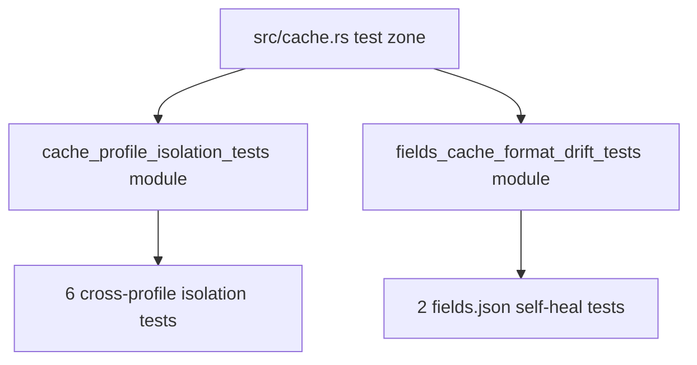
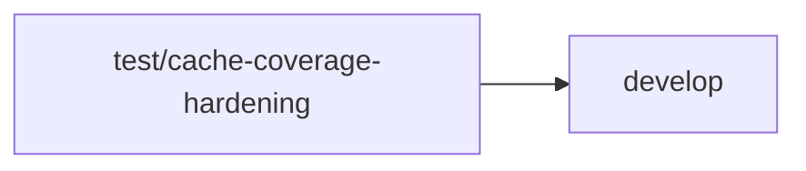
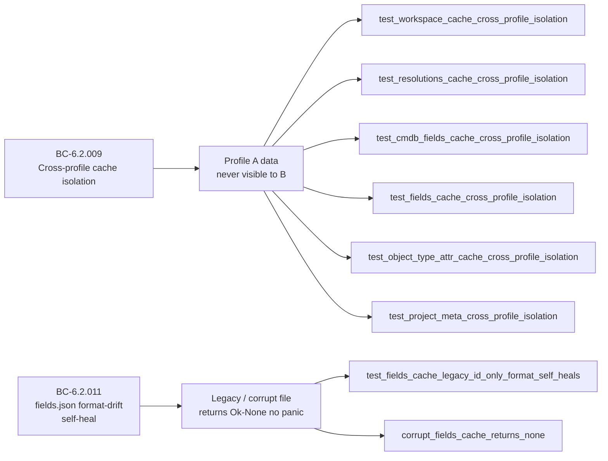

## Summary

Adds 8 TEST-ONLY unit tests to `src/cache.rs` (zero production code change).
These are regression pins drawn from the cache-coverage audit
(`.factory/research/cache-coverage-audit-2026-06-27.md`), addressing the two
HIGH-priority coverage gaps identified: D6 profile-isolation (6 families
untested) and D4 format-drift for `fields.json`.

---

## Architecture Changes

No production code changed. Test-only additions within the existing
`#[cfg(test)]` zone of `src/cache.rs`.

---

## Story Dependencies

None. Standalone test-hardening change.

---

## Spec Traceability

---

## Test Evidence

- **Tests added:** 8 unit tests (all in `src/cache.rs #[cfg(test)]`)
- **Test groups:**
  - `cache_profile_isolation_tests` (6 tests) — anchors BC-6.2.009
  - `fields_cache_format_drift_tests` (2 tests) — anchors BC-6.2.011
- **Result before PR:** 46 cache lib tests pass (`cargo test --lib cache`)
- **Coverage delta:** +8 tests; no production lines added → mutation-test scope is zero
- **Clippy:** green (zero warnings)
- **Fmt:** green

### Why these are non-tautological

**Profile-isolation tests:** each test writes *different* values under two
profiles (`"prod"` and `"sandbox"`), then asserts each profile reads back its
own value and that the two on-disk paths are distinct. A refactor that drops the
`profile` path segment from `cache_dir()` for any of these six families would
cause the prod value to overwrite the sandbox value, and the assertion
`prod_val != sandbox_val` would fail. The existing team-cache tests
(`cross_profile_isolation_team_cache`) use the same pattern and serve as the
established prior art.

**Format-drift tests:** the `cmdb_fields` family already has a self-heal
integration test proving the pattern is real (not hypothetical). `fields.json`
shares the same `Vec<(String,String)>` tuple layout but had zero self-heal
coverage. Writing a legacy ID-only JSON array (`["customfield_10001"]`) and
asserting `Ok(None)` (not `Err`, not a panic) pins that the shared `read_cache`
generic self-heal path is instantiated correctly for this type parameter.

---

## BC Anchors

| BC | Title | Test(s) |
|----|-------|---------|
| BC-6.2.009 | Cross-profile cache file isolation | All 6 `cache_profile_isolation_tests` |
| BC-6.2.011 | `fields.json` format-drift self-heal | Both `fields_cache_format_drift_tests` |

**Note on BC correction:** the audit document (§ 5, Proposal P1) originally
cited BC-6.3.001 as "the closest existing BC". After verifying the BC bodies,
BC-6.3.001 covers per-profile *config* field IDs surviving `Config::save_global()`
(a config-layer concern), not on-disk cache-file isolation. BC-6.2.009 is the
correct anchor for cache-file isolation (the team-cache example BC). The test
module docstring documents this correction.

---

## Holdout Evaluation

N/A — evaluated at wave gate.

---

## Adversarial Review

N/A — evaluated at Phase 5.

---

## Security Review

No production code changed. No new API calls, no new data paths, no new
serialization, no new secrets handling. Security review not required for
test-only changes.

---

## Risk Assessment

- **Blast radius:** Zero production impact. Test-only change within
  `#[cfg(test)]` block.
- **Performance impact:** None. Tests use `with_temp_cache` (temp dir) and
  do not affect binary size or runtime.
- **Rollback:** Trivially reverted — no schema changes, no migrations.

---

## AI Pipeline Metadata

- **Pipeline mode:** Feature Mode (test-hardening)
- **Audit source:** `.factory/research/cache-coverage-audit-2026-06-27.md`
- **Proposals implemented:** P1 (HIGH — D6 profile-isolation), P2 (HIGH — D4 fields format-drift)
- **Proposals deferred:** P3–P8 (MEDIUM/LOW; require wiremock integration tier or separate story)
- **Code review findings (pre-PR):** 1 MEDIUM + 2 LOW — all fixed before this PR

---

## Pre-Merge Checklist

- [x] `cargo test --lib cache` — 46 tests pass (including 8 new)
- [x] `cargo clippy -- -D warnings` — green
- [x] `cargo fmt --all -- --check` — green
- [x] Test-only change — no production code modified
- [x] BC anchors verified against BC body text (BC-6.2.009, BC-6.2.011)
- [x] No real Jira keys, org IDs, or instance URLs in any added content
- [x] `with_temp_cache` used in all tests — no real `~/.cache/jr` touch

---

## Traceability to Cache-Coverage Audit

Full audit: `.factory/research/cache-coverage-audit-2026-06-27.md`

| Proposal | Priority | Dimension | Families | Status |
|----------|----------|-----------|----------|--------|
| P1 | HIGH | D6 profile-isolation | workspace, resolutions, cmdb_fields, fields, object_type_attrs, project_meta | **Implemented (this PR)** |
| P2 | HIGH | D4 format-drift | fields (#6) | **Implemented (this PR)** |
| P3 | MEDIUM | D5 write-error swallow | request_types (#8), RT-fields (#9) | Deferred |
| P4 | MEDIUM | D2 warm-hit/no-HTTP | cmdb_fields (#5) — requires wiremock | Deferred |
| P5 | MEDIUM | D2 warm-hit/no-HTTP | resolutions (#4) — requires wiremock | Deferred |
| P6 | MEDIUM | D5 write-failure resilience | project_meta (#2), workspace (#3) — requires wiremock | Deferred |
| P7 | LOW | D3 TTL-expiry | resolutions, fields, RT, RT-fields | Deferred |
| P8 | LOW | D2 warm-hit | team (#1), project_meta (#2) — requires wiremock | Deferred |
