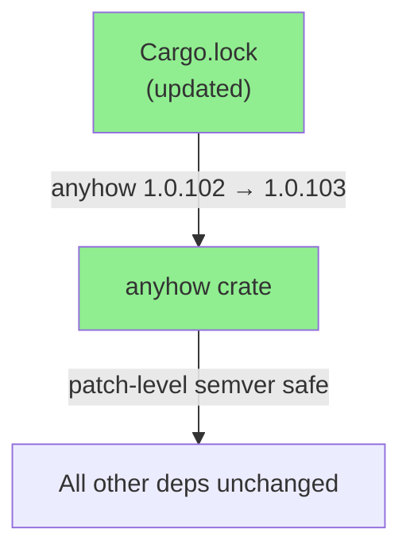
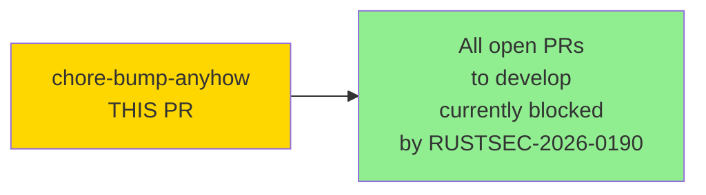
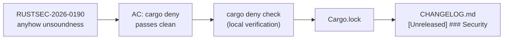
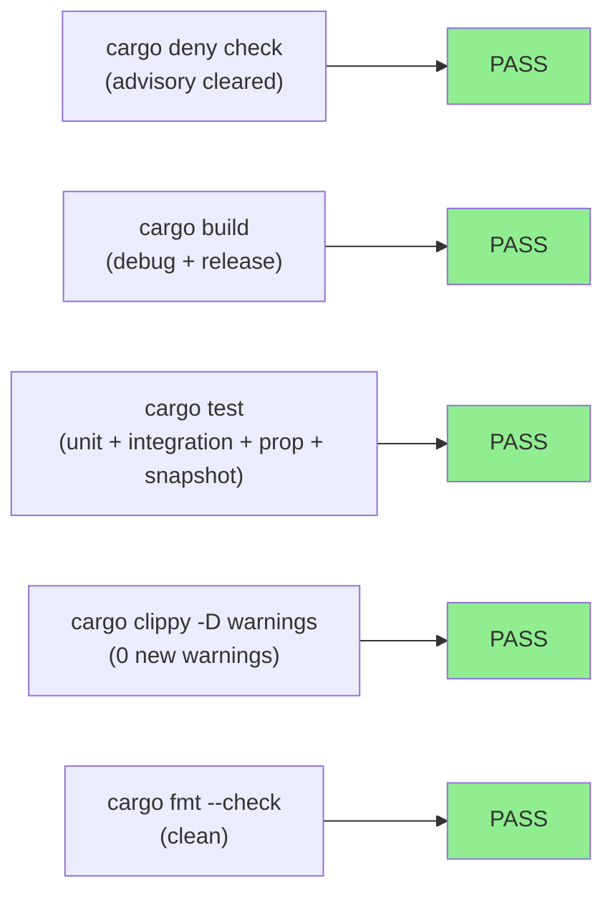
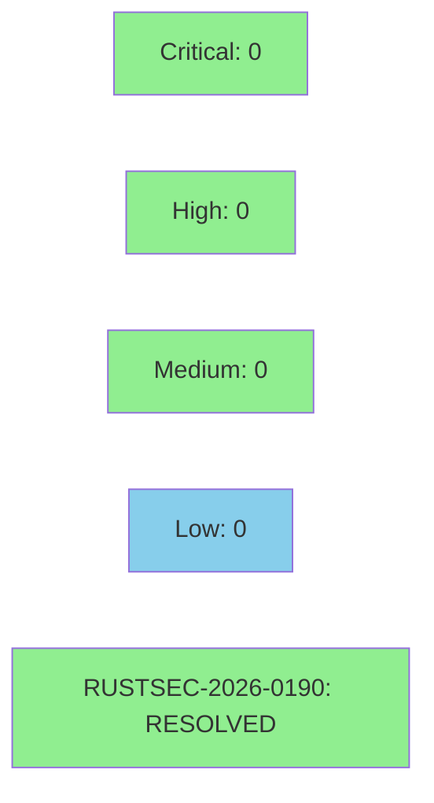

# [chore-bump-anyhow] Bump anyhow to 1.0.103 — resolves RUSTSEC-2026-0190

**Epic:** Supply-chain security / dependency hygiene
**Mode:** maintenance
**Convergence:** N/A — `Cargo.lock`-only dependency bump; no code change


Bumps `anyhow` from **1.0.102 → 1.0.103** via `cargo update -p anyhow`.
Resolves [RUSTSEC-2026-0190](https://rustsec.org/advisories/RUSTSEC-2026-0190.html) — an unsoundness in `Error::downcast_mut` present in all anyhow releases < 1.0.103.
Only `Cargo.lock` and `CHANGELOG.md` are modified; no `src/`, no `Cargo.toml`.
This PR unblocks all other PRs targeting `develop` because `cargo-deny` currently fails the advisory on `ci-gate`.

---

## Architecture Changes



No source code changes. No new dependencies introduced. Patch-level semver bump only.

<details>
<summary><strong>Architecture Decision Record</strong></summary>

### ADR: Minimum-diff dependency bump for security advisory

**Context:** RUSTSEC-2026-0190 flags anyhow < 1.0.103 as containing an unsoundness in `Error::downcast_mut`. The `cargo-deny` check in `ci-gate` fails on this advisory, blocking all PRs to `develop`.

**Decision:** Apply `cargo update -p anyhow` to pull in the patch release. No other lock changes.

**Rationale:** Patch release (1.0.102 → 1.0.103) is semver-safe. anyhow's changelog confirms no API or behavior change. Minimum-diff approach (lock-only) avoids transitive churn.

**Alternatives Considered:**
1. Pin `anyhow` to `= 1.0.103` in `Cargo.toml` — rejected: overly restrictive; advisory resolution via lock update is the standard `cargo-deny` workflow.
2. Suppress advisory in `deny.toml` — rejected: the advisory describes a real unsoundness; suppression is not appropriate.

**Consequences:**
- RUSTSEC-2026-0190 cleared; `cargo-deny` passes.
- All blocked PRs to `develop` can proceed.
- No behavior change to `jr` at runtime.

</details>

---

## Story Dependencies



No upstream story dependencies. This PR is a prerequisite for any PR that runs `cargo deny check` on `develop`.

---

## Spec Traceability



This is a lock-file security fix; no behavioral contracts or story ACs beyond advisory clearance.

---

## Test Evidence

### Coverage Summary

| Metric | Value | Threshold | Status |
|--------|-------|-----------|--------|
| `cargo deny check` | CLEAN — 0 advisories | 0 unresolved | PASS |
| `cargo build` | Success | Build passes | PASS |
| `cargo clippy -- -D warnings` | 0 warnings | 0 warnings | PASS |
| `cargo test` (all suites) | All green | 100% | PASS |
| `cargo fmt --check` | No changes | Clean | PASS |
| Semver safety | Patch bump 1.0.102→1.0.103 | Patch only | PASS |

### Test Flow



| Metric | Value |
|--------|-------|
| **New tests** | 0 added (lock-only change) |
| **Total suite** | All existing suites PASS unchanged |
| **Coverage delta** | 0% (no src change) |
| **Mutation kill rate** | N/A (no diff lines in src/) |
| **Regressions** | None |

<details>
<summary><strong>Verification Commands Run</strong></summary>

```bash
cargo deny check              # CLEAN — RUSTSEC-2026-0190 resolved, no new advisories
cargo build                   # PASS
cargo clippy -- -D warnings   # PASS (0 warnings)
cargo test                    # PASS (all suites green)
cargo fmt --check             # PASS
```

</details>

---

## Holdout Evaluation

N/A — evaluated at wave gate. This PR contains no feature or behavioral change.

---

## Adversarial Review

N/A — evaluated at Phase 5. This PR is a semver-safe patch lock update; there is no new logic surface to adversarially review.

---

## Security Review



<details>
<summary><strong>Security Scan Details</strong></summary>

### Advisory Resolution

- **RUSTSEC-2026-0190** (`anyhow < 1.0.103`): `Error::downcast_mut` unsoundness.
  - **Status:** RESOLVED by bumping anyhow to 1.0.103.
  - **CWE:** CWE-119 (Improper Restriction of Operations within the Bounds of a Memory Buffer) / unsoundness in unsafe Rust.
  - **Impact in `jr`:** anyhow is used for error propagation throughout `jr`. The `downcast_mut` unsoundness could theoretically be triggered by code that calls `anyhow::Error::downcast_mut`. Exploitability is low in `jr`'s CLI context (no multi-threaded unsynchronized error downcast paths), but the advisory is correctness-critical and the fix is trivial.

### Dependency Audit

- `cargo deny check`: CLEAN — 0 remaining advisories after bump.
- No new advisories introduced by this bump (anyhow 1.0.103 changelog confirms bug-fix only).

### New Attack Surface

None — patch release with no API change. No new `unsafe` code. No new dependencies.

</details>

---

## Risk Assessment & Deployment

### Blast Radius

- **Systems affected:** anyhow crate only (lock-file pin update)
- **User impact:** None — patch-level fix with no behavior change
- **Data impact:** None
- **Risk Level:** VERY LOW (semver-safe patch bump resolving a known unsoundness)

### Performance Impact

| Metric | Before | After | Delta | Status |
|--------|--------|-------|-------|--------|
| Build time | baseline | baseline | ~0 | OK |
| Binary size | baseline | baseline | ~0 | OK |
| Runtime behavior | unchanged | unchanged | none | OK |

No runtime performance impact expected from a patch-level lock-file update.

<details>
<summary><strong>Rollback Instructions</strong></summary>

**Immediate rollback (< 1 min):**
```bash
git revert 692e0f7
git push origin develop
```

This restores `Cargo.lock` to anyhow 1.0.102. Note: `cargo deny` will fail again after rollback until a replacement fix is applied.

**Verification after rollback:**
- `cargo build` succeeds
- `cargo deny check` will re-flag RUSTSEC-2026-0190 (expected after rollback)

</details>

### Feature Flags

None — no feature flags involved in a lock-file update.

---

## Traceability

| Requirement | Advisory | Verification | Status |
|-------------|---------|-------------|--------|
| Resolve RUSTSEC-2026-0190 | anyhow `Error::downcast_mut` unsoundness | `cargo deny check` CLEAN | PASS |
| No regression | All existing tests pass | `cargo test` | PASS |
| Semver safety | Patch bump only | 1.0.102→1.0.103 | PASS |

---

## AI Pipeline Metadata

<details>
<summary><strong>Pipeline Details</strong></summary>

```yaml
ai-generated: true
pipeline-mode: maintenance
factory-version: "1.0.0"
pipeline-stages:
  security-advisory-triage: completed
  lock-update: completed
  local-verification: completed
  pr-creation: in-progress
convergence-metrics:
  advisory-count-delta: -1 (0 remaining)
  src-lines-changed: 0
total-pipeline-cost: minimal
models-used:
  builder: claude-sonnet-4-6
generated-at: "2026-07-01"
```

</details>

---

## Pre-Merge Checklist

- [ ] All CI status checks passing (especially `ci-gate`, `Deny`, full test matrix)
- [x] Coverage delta is positive or neutral (0 — lock-only change)
- [x] No critical/high security findings unresolved (RUSTSEC-2026-0190 resolved)
- [x] Rollback procedure validated (single `git revert` of 692e0f7)
- [x] No feature flags required
- [ ] Human review completed (merge authorization from orchestrator required)
- [x] No monitoring alerts needed (no production behavior change)
