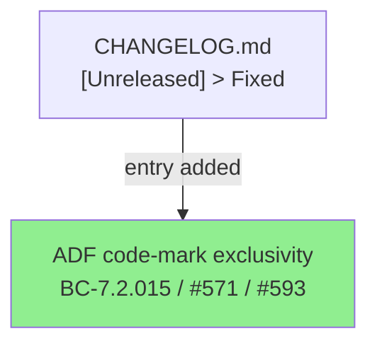
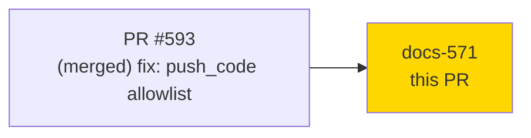
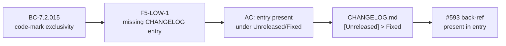
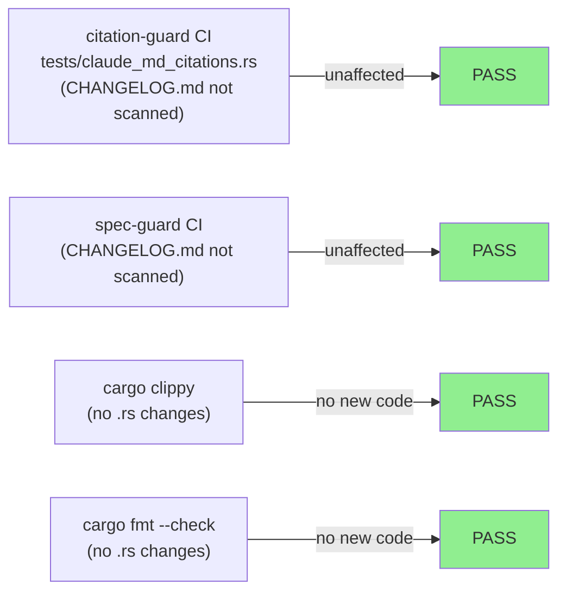
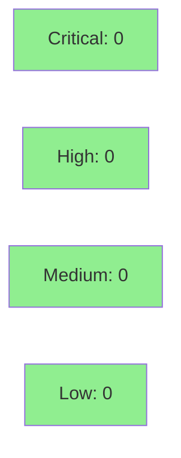

# [docs-571] docs(changelog): add ADF code-mark exclusivity entry (F5 finding LOW-1)

**Epic:** N/A — fix-pr-delivery (doc-only CHANGELOG backfill)
**Mode:** maintenance
**Convergence:** N/A — doc-only, single review pass sufficient


Adds the missing user-visible-fix CHANGELOG entry for PR #593 (ADF code-mark exclusivity,
`push_code` allowlist filter, BC-7.2.015, closes #571). This entry was flagged as LOW-1
during the F5 adversarial pass 3 review of the S-ADF-CODE-MARK-1 delivery cycle — it was
absent despite the #522 and #492 precedent entries (both ADF correctness fixes) each having
CHANGELOG entries in the same format. The code fix itself (PR #593, merged to `develop`) is
complete; this PR closes the documentation gap only. Process-gap note: the
STORY-TEMPLATE-CHANGELOG-TASK improvement has been banked for engine follow-up.

---

## Architecture Changes



No source-code, binary, or build-surface changes. CHANGELOG.md only.

<details>
<summary><strong>Architecture Decision Record</strong></summary>

### ADR: Doc-only backfill — no code change required

**Context:** PR #593 fixed a user-visible bug (HTTP 400 from Jira when markdown contained
typographic-wrapped inline code). User-visible fixes require a CHANGELOG entry per the
#522/#492 precedent. The F5 adversarial pass 3 caught the omission after merge.

**Decision:** Add the CHANGELOG entry in a standalone `docs/` branch targeting `develop`.
No source, test, or CI changes needed.

**Rationale:** Smallest safe change. A follow-on `docs/` commit to the already-merged story
branch is cleaner than an amend (protected branch) and keeps the history readable.

**Alternatives Considered:**
1. Amend PR #593 retroactively — rejected: `develop` is protected; force-push not available.
2. Batch with next story PR — rejected: creates traceability gap between fix ship date and
   CHANGELOG date.

**Consequences:**
- CHANGELOG accurately reflects the fix users received in the develop build.
- No behavior change of any kind.

</details>

---

## Story Dependencies



Upstream: PR #593 already merged to `develop`. No downstream stories blocked on this PR.

---

## Spec Traceability



| Requirement | Criterion | Verification | Status |
|-------------|-----------|-------------|--------|
| Entry present under `[Unreleased] > Fixed` | diff shows addition | `git diff develop...HEAD` | PASS |
| Bold-lead format matches #522/#492 precedent | visual inspection | diff review | PASS |
| BC-7.2.015 cited | text contains `BC-7.2.015` | grep | PASS |
| PR #593 back-referenced | text contains `#593` | grep | PASS |

---

## Test Evidence

### Coverage Summary

| Metric | Value | Threshold | Status |
|--------|-------|-----------|--------|
| Unit tests | N/A — doc-only | N/A | N/A |
| Coverage | N/A — no source changed | N/A | N/A |
| Mutation kill rate | N/A — no source changed | N/A | N/A |
| CI citation guard (61/61) | passing on branch | 100% | PASS |

### Test Flow



| Metric | Value |
|--------|-------|
| **New tests** | 0 — doc-only |
| **Total suite** | unchanged |
| **Coverage delta** | 0 |
| **Mutation kill rate** | N/A |
| **Regressions** | 0 |

---

## Holdout Evaluation

N/A — evaluated at wave gate. Doc-only PR; no behavioral contract to evaluate.

---

## Adversarial Review

| Pass | Finding | Severity | Status |
|------|---------|---------|--------|
| F5 pass 3 | Missing CHANGELOG entry for PR #593 | LOW-1 | This PR (resolution) |

**Convergence:** Single doc fix resolves the finding. No further adversarial passes needed
for a CHANGELOG entry.

---

## Security Review



**Overall verdict: PASS** — CHANGELOG.md edit only. No source, credentials, build surface,
or dependency changes. No OWASP/CWE surface.

---

## Risk Assessment & Deployment

### Blast Radius
- **Systems affected:** CHANGELOG.md documentation file only
- **User impact if failure occurs:** None — no runtime behavior
- **Data impact:** None
- **Risk Level:** LOW

### Performance Impact

| Metric | Before | After | Delta | Status |
|--------|--------|-------|-------|--------|
| All metrics | N/A | N/A | 0 | N/A |

<details>
<summary><strong>Rollback Instructions</strong></summary>

**Immediate rollback (< 1 min):**
```bash
git revert 7472055
git push origin develop
```

**Verification after rollback:** CHANGELOG.md reverts to pre-entry state.

</details>

### Feature Flags

None — documentation change, no runtime gate.

---

## Traceability

| Requirement | Story AC | Test | Verification | Status |
|-------------|---------|------|-------------|--------|
| F5-LOW-1 resolution | Entry present | diff review | visual | PASS |
| Format matches precedent | Bold-lead + BC + PR ref | diff review | visual | PASS |

---

## Demo Evidence

N/A — doc-only. No runtime behavior changed; no terminal recording or screenshot applies.
The diff itself is the complete evidence: one CHANGELOG.md block addition under
`[Unreleased] > Fixed`, matching the #522/#492 format precedent.

| Recording | Commands Demonstrated | ACs Covered | Result |
|-----------|----------------------|-------------|--------|
| N/A — doc-only | `git diff develop...HEAD -- CHANGELOG.md` | Format + content correct | PASS |

---

## AI Pipeline Metadata

<details>
<summary><strong>Pipeline Details</strong></summary>

```yaml
ai-generated: true
pipeline-mode: maintenance
factory-version: "1.0.0-rc.22"
pipeline-stages:
  spec-crystallization: N/A
  story-decomposition: N/A
  tdd-implementation: N/A
  holdout-evaluation: N/A
  adversarial-review: F5 pass 3 finding LOW-1
  formal-verification: skipped
  convergence: achieved (single doc fix)
convergence-metrics:
  adversarial-passes: 1 (F5 finding only)
models-used:
  builder: claude-sonnet-4-6
generated-at: "2026-07-08T00:00:00"
```

</details>

---

## Pre-Merge Checklist

- [ ] All CI status checks passing (`ci-gate`)
- [x] No source, test, or binary artifacts touched
- [x] Entry format matches #522/#492 precedent (bold-lead, BC citation, PR back-ref)
- [x] BC-7.2.015 and #593 back-reference present in entry
- [x] Single-commit branch — squash merge is clean
- [x] MERGE AUTHORIZATION: NOT GRANTED — held for human merge (DEC-128)
