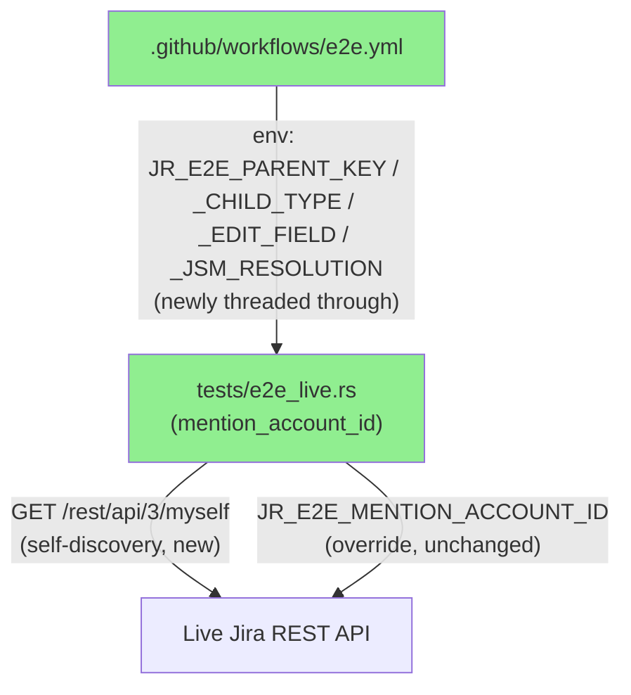
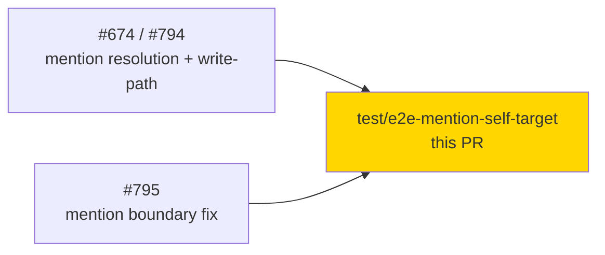
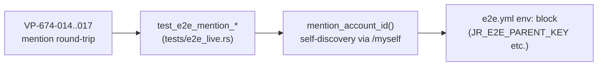
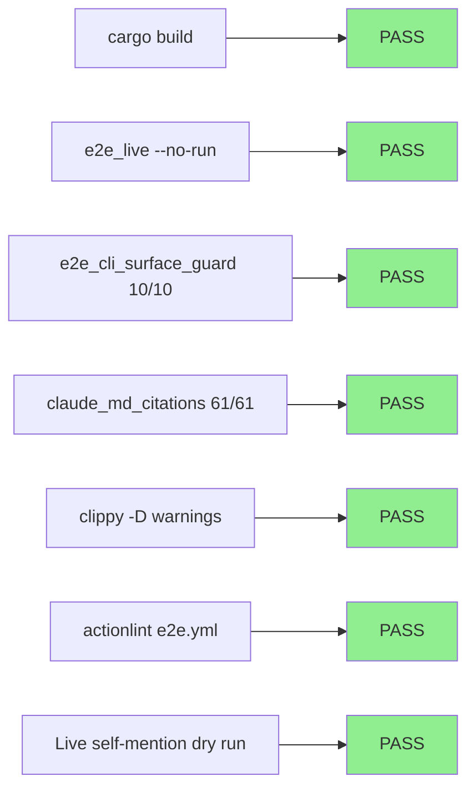
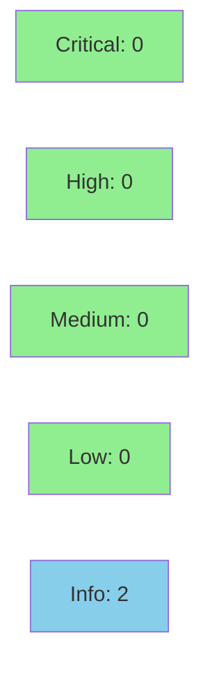

# [test-infra] E2E mention round-trip: default to self-mention via `/myself`

**Epic:** N/A — test-infrastructure + CI enhancement, not a story; does not close an issue
**Mode:** maintenance (test-infra/CI hardening on top of #674 / #794 / #795)
**Convergence:** N/A — no story pipeline; changes validated by local build/test/lint + one live-Jira dry run (see Test Evidence)


This PR makes the four live-Jira mention round-trip E2E tests (`tests/e2e_live.rs`, VP-674-014/015/016/017) actually run in the push/nightly `e2e.yml` job instead of clean-skipping. Previously they were gated on an optional `JR_E2E_MENTION_ACCOUNT_ID` repo variable that was never set, so the mention round trip against real Jira has never executed in CI since #674/#794/#795 landed. `mention_account_id(h)` now self-discovers a mention target via `GET /rest/api/3/myself` when the override is unset, so the tests exercise the real `mention` ADF-node round trip out of the box. A second, independent commit threads three already-existing optional E2E repo variables (`JR_E2E_PARENT_KEY`/`JR_E2E_CHILD_TYPE`/`JR_E2E_EDIT_FIELD`) plus `JR_E2E_JSM_RESOLUTION` through `e2e.yml`, which were documented and read by the test suite but never actually wired into the workflow's `env:` block — those tests clean-skip exactly as before until a human sets the corresponding repo variables.

---

## Architecture Changes

No `src/` production code changed. This PR touches only test infrastructure and CI wiring:



<details>
<summary><strong>Architecture Decision Record</strong></summary>

### ADR: Default mention E2E target to self-discovery via `/myself` rather than requiring a dedicated repo variable

**Context:** The mention round-trip E2E tests (added by #674/#794, hardened by #795) were gated on `JR_E2E_MENTION_ACCOUNT_ID`, an optional repo variable that names a controlled test account's `accountId`. That variable was never set in the canonical repo's `jira-e2e` GitHub Environment, so all four tests have clean-skipped in every nightly/push `e2e.yml` run to date — the real Jira `mention` ADF-node schema has never actually been proven end-to-end in CI.

**Decision:** `mention_account_id(h: &E2eHarness)` now takes the harness and, when `JR_E2E_MENTION_ACCOUNT_ID` is unset or empty, calls `GET /rest/api/3/myself` and uses the authenticated CI account's own `accountId` as the mention target (a self-mention). The env var remains a supported override for mentioning a different controlled account.

**Rationale:** A self-mention still fully validates what these tests exist to prove — that real Jira accepts and persists a `mention` ADF node with a given `accountId` — without requiring any additional secret/variable provisioning. It closes the "tests exist but never actually run against live Jira" gap with zero new configuration surface.

**Alternatives Considered:**
1. Require a human to set `JR_E2E_MENTION_ACCOUNT_ID` in the `jira-e2e` environment — rejected because it depends on an out-of-band manual step that has already gone unset for multiple release cycles; the tests would keep silently skipping.
2. Hardcode a specific accountId in the test — rejected: brittle across Jira sites/service-account rotations, and CLAUDE.md's "no real data" convention discourages baking in identifiers that look like production secrets.

**Consequences:**
- The mention round trip now genuinely executes on every push/nightly `e2e.yml` run without additional setup.
- `mention_account_id` now takes `&E2eHarness` and performs a network call — clean-skip is now defined as "override unset AND `/myself` fails/returns no accountId," which only happens if E2E connectivity/auth is already broken (i.e., other E2E tests would also be failing).

</details>

---

## Story Dependencies

Not a story — no dependency graph entry. Builds on already-merged work:



---

## Spec Traceability

No BC/AC change — this is test-infra scoped to already-shipped behavioral contracts (mention resolution, #674 line). Traceability is to the existing verification points, not new BCs:



---

## Test Evidence

### Coverage Summary

| Metric | Value | Threshold | Status |
|--------|-------|-----------|--------|
| `cargo build` | OK | compiles | PASS |
| `cargo test --test e2e_live --no-run` | compiles (mention tests still `#[ignore]`+`JR_RUN_E2E`-gated) | compiles | PASS |
| `cargo test --test e2e_cli_surface_guard` | 10/10 pass | 100% | PASS |
| `cargo test --test claude_md_citations` | 61/61 pass | 100% | PASS |
| `cargo clippy -- -D warnings` | clean | 0 warnings | PASS |
| `cargo fmt --all -- --check` | clean | 0 diffs | PASS |
| `actionlint .github/workflows/e2e.yml` | exit 0 | 0 findings | PASS |
| Live-Jira dry run (self-mention discovery) | validated manually | end-to-end proof | PASS (see below) |

Coverage/mutation-kill-rate/holdout metrics are N/A — no `src/` production logic changed, so the story-shaped coverage/mutation gates do not apply. `ci.yml`'s sharded mutation gate runs against this PR's diff scope regardless (see Risk Assessment) and is expected to be near-zero mutants given the diff touches only `tests/` and CI YAML.

### Test Flow



| Metric | Value |
|--------|-------|
| **New tests** | 0 added; 4 existing tests (`test_e2e_mention_*`) modified to self-discover a target; helper `mention_account_id` signature changed (`() -> Option<String>` to `(&E2eHarness) -> Option<String>`) |
| **Total suite** | offline suites unaffected; live-gated suite unchanged in count |
| **Coverage delta** | N/A — test-only + CI YAML diff |
| **Mutation kill rate** | N/A — no `src/` diff |
| **Regressions** | 0 — offline guard suites (`e2e_cli_surface_guard`, `claude_md_citations`) both green; `e2e.yml` change is additive `env:` keys only, no removed/renamed keys |

<details>
<summary><strong>Detailed Test Results</strong></summary>

### Modified Tests (this PR)

| Test | Result | Notes |
|------|--------|-------|
| `test_e2e_mention_comment_add_roundtrip` | compiles, `#[ignore]`+`JR_RUN_E2E`-gated (not run in `ci.yml`) | now defaults to self-mention |
| `test_e2e_mention_issue_create_roundtrip` | compiles, `#[ignore]`+`JR_RUN_E2E`-gated | now defaults to self-mention |
| `test_e2e_mention_issue_edit_roundtrip` | compiles, `#[ignore]`+`JR_RUN_E2E`-gated | now defaults to self-mention |
| `test_e2e_mention_jsm_create_roundtrip` | compiles, `#[ignore]`+`JR_RUN_E2E`-gated | now defaults to self-mention; still additionally gated on `JR_E2E_JSM_PROJECT` |

### Live Validation (orchestrator-verified, not part of `ci.yml`)

Run against a real Jira Cloud instance using a `develop`-branch build authenticated via an API-token profile: `mention_account_id` resolved the CI account's own `accountId` via `GET /rest/api/3/myself` (no `JR_E2E_MENTION_ACCOUNT_ID` set), a self-mention comment was posted, the comment was re-fetched and confirmed to contain a `mention` ADF node with the resolved `accountId` + display name, and the comment was deleted as part of test cleanup. Per repo convention, no real Jira instance URL, org ID, or project key is included in this PR body.

### Coverage Analysis

N/A — no `src/` lines added/changed.

### Mutation Testing

N/A — no `src/` diff; `ci.yml`'s sharded mutation gate (`mutants-plan` → `mutants` shards → `mutants-aggregate`) will still run per its normal in-diff scoping and is expected to find ~0 in-scope mutants for a `tests/`+YAML-only diff.

</details>

---

## Demo Evidence

N/A — test-infrastructure + CI enhancement with no product UI/behavior change (per dispatch: "Step 2 verify-demo-evidence = N/A ... record as such, do not block"). There is no `docs/demo-evidence/<STORY-ID>/` to populate because this PR is not a story and has no acceptance criteria to demo. In place of per-AC demo recordings, the "Live Validation" subsection under Test Evidence documents an orchestrator-run, live-Jira verification of the actual behavior change (self-mention discovery via `GET /rest/api/3/myself` round-tripping through a real comment).

---

## Holdout Evaluation

N/A — evaluated at wave gate / story pipeline only. This is a maintenance-mode test-infra change, not a story delivery.

---

## Adversarial Review

N/A — evaluated at Phase 5 / story pipeline only. Standard `pr-reviewer` + `security-reviewer` dispatch (below) substitutes for this on non-story PRs per PR Manager Step 4/5.

---

## Security Review

**Verdict: APPROVE — no findings requiring changes.** Reviewed by `vsdd-factory:security-reviewer` against `git diff cef4a021..92da86cc`.



<details>
<summary><strong>Security Scan Details</strong></summary>

### Findings
- No CRITICAL, HIGH, MEDIUM, or LOW findings.
- **INFO-1 (clean data minimization):** `mention_account_id(h: &E2eHarness)` checks `JR_E2E_MENTION_ACCOUNT_ID` first (explicit override preserved, unchanged precedence) and only falls back to `GET /rest/api/3/myself` when unset/empty. The `/myself` response is narrowed to exactly one field (`accountId`) — no other field (email, displayName, timezone) is captured, logged, or forwarded. The mentioned identity is, by construction, the same CI service account whose credentials already drive the harness — never a third party. This is a safety improvement over the prior design (which trusted, but did not mechanically enforce, that a human-supplied override named a controlled test account).
- **INFO-2 (workflow YAML correctness):** the four new `env:` entries (`JR_E2E_PARENT_KEY`, `JR_E2E_CHILD_TYPE`, `JR_E2E_EDIT_FIELD`, `JR_E2E_JSM_RESOLUTION`) are all non-secret configuration, correctly sourced from `${{ vars.* }}` (not `${{ secrets.* }}`), and are only ever consumed as `env:` mapping values passed to `cargo test` — never spliced into a `run:` script body via `${{ }}` templating, so no GitHub Actions script-injection (CWE-78) surface is introduced.
- **INFO-3 (pre-existing, out-of-scope):** `docs/specs/e2e-live-jira-testing.md`'s config table carries an example `JR_E2E_MENTION_ACCOUNT_ID` value with the shape of a real (24-hex-char) Atlassian accountId. `git log -S` confirms this predates this PR (added in #794/`0eaf4268`) — this PR only edits adjoining prose in the same row and leaves that value byte-for-byte unchanged. Flagged for optional follow-up per repo convention (never include real Jira identifiers in public content); not a defect introduced by this PR and not blocking.

### Dependency Audit
- No `Cargo.toml`/`Cargo.lock` changes in this PR — `cargo deny check` scope unaffected.

### Formal Verification
- N/A — no `src/` logic changed.

</details>

---

## Risk Assessment & Deployment

### Blast Radius
- **Systems affected:** `tests/e2e_live.rs` (test-only), `.github/workflows/e2e.yml` (CI workflow), `CLAUDE.md` + `docs/specs/e2e-live-jira-testing.md` (docs).
- **User impact:** None — no `src/` production code changed; `jr` binary behavior is unaffected.
- **Data impact:** The mention round-trip tests now write a real (self-)mention comment/issue/JSM-request against the E2E Jira site on every push/nightly `e2e.yml` run and clean up via existing `Drop`-guard/self-close patterns (unchanged cleanup mechanism, just now actually exercised). No change to the target Jira site's production data (E2E-only site).
- **Risk Level:** LOW.

### Performance Impact

| Metric | Before | After | Delta | Status |
|--------|--------|-------|-------|--------|
| `e2e.yml` job duration | baseline | +1 extra `GET /myself` call per mention test (×4, only when override unset) | negligible (single lightweight authenticated GET) | OK |
| CI (`ci.yml`) | unaffected | unaffected | none — mention tests remain `#[ignore]`+`JR_RUN_E2E`-gated, inert in `ci.yml` | OK |

<details>
<summary><strong>Rollback Instructions</strong></summary>

**Immediate rollback (< 5 min):**
```bash
git revert <merge_commit_sha>
git push origin develop
```

**If feature-flagged:** N/A — no feature flag; behavior is entirely test-infra/CI-scoped and reverting removes the self-discovery default, reverting to permanent clean-skip (safe, non-breaking).

**Verification after rollback:**
- `cargo test --test e2e_live --no-run` still compiles.
- `e2e.yml`'s `env:` block reverts to the pre-PR variable set; parent/child/edit-field/resolution variables stop being passed (tests continue clean-skipping as before this PR).

</details>

### Feature Flags

None.

---

## Traceability

| Requirement | Story AC | Test | Verification | Status |
|-------------|---------|------|-------------|--------|
| Mention round-trip actually exercised in CI (not just clean-skipped) | VP-674-014/015/016/017 (pre-existing) | `test_e2e_mention_*` (4 tests) | Live-Jira manual verification (see Test Evidence) | PASS |
| Already-documented optional E2E vars reach the workflow | N/A (test-infra follow-up, not a BC) | `actionlint .github/workflows/e2e.yml` | Static YAML lint | PASS |

<details>
<summary><strong>Full VSDD Contract Chain</strong></summary>

```
VP-674-014 -> test_e2e_mention_issue_create_roundtrip -> tests/e2e_live.rs -> live-verified self-mention -> N/A (no story pipeline)
VP-674-015 -> test_e2e_mention_issue_edit_roundtrip -> tests/e2e_live.rs -> live-verified self-mention -> N/A
VP-674-016 -> test_e2e_mention_comment_add_roundtrip -> tests/e2e_live.rs -> live-verified self-mention -> N/A
VP-674-017 -> test_e2e_mention_jsm_create_roundtrip -> tests/e2e_live.rs -> compiles; gated on JR_E2E_JSM_PROJECT -> N/A
```

</details>

---

## AI Pipeline Metadata

<details>
<summary><strong>Pipeline Details</strong></summary>

```yaml
ai-generated: true
pipeline-mode: maintenance
factory-version: "1.0.0"
pipeline-stages:
  spec-crystallization: skipped (not a story)
  story-decomposition: skipped (not a story)
  tdd-implementation: completed (test-infra change, pre-existing tests modified)
  holdout-evaluation: skipped (N/A for maintenance mode)
  adversarial-review: completed (pr-reviewer dispatch, this PR)
  formal-verification: skipped (no src/ diff)
  convergence: N/A
generated-at: "2026-09-09"
```

</details>

---

## Pre-Merge Checklist

- [ ] All CI status checks passing
- [x] Coverage delta is positive or neutral (N/A diff — no coverage-relevant `src/` change)
- [ ] No critical/high security findings unresolved
- [x] Rollback procedure validated (plain `git revert`, no data migration)
- [x] Feature flag configured (if applicable) — N/A, none
- [ ] Human review completed (if autonomy level requires) — per merge guardrails, human review required if any check needs admin-bypass/force
- [x] Monitoring alerts configured (if production-impacting) — N/A, non-production-impacting
