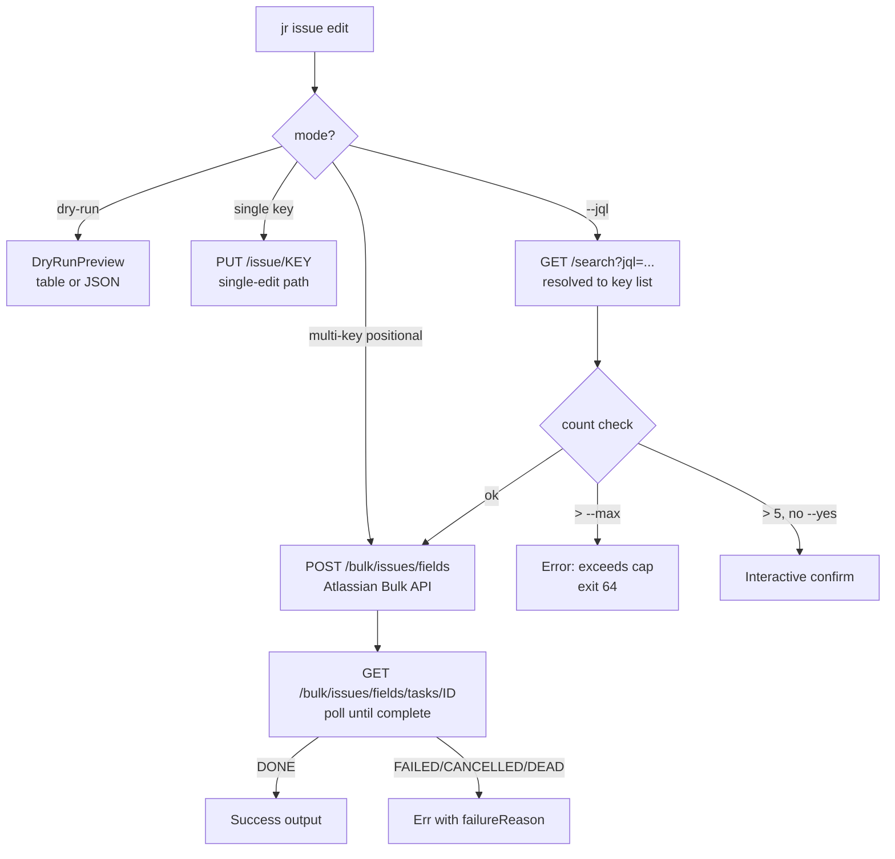

## Summary

Completes issue #110 (`Feature: bulk operations via JQL or multiple keys`). Part 1 (PR #325,
merged 2026-05-09) shipped multi-key positional bulk edit/move via the Atlassian Bulk API. This
PR adds the remaining acceptance criteria: JQL-driven selection, dry-run preview, a per-call
safety cap, large-set confirmation guard, multi-field bulk routing, and a full audit pass.

**Branch:** `feat/issue-110-pr2-jql-dryrun-multifield`
**PR:** #348 (open as of 2026-05-10, all 8 CI checks green, 27/27 Copilot review threads resolved)
**Base:** `develop`
**Closes:** #110

---

## Convergence Summary

| Phase | Result |
|-------|--------|
| F4: Delta implementation | Complete — commit range bf911f1..4f84b91 |
| F5: Adversarial (5 passes) | CONVERGED — 12 → 5 → 0 → 0 → 0 |
| F6: Security hardening | PASS (1 suggestion, folded into #334) |
| F7: Delta convergence | 5/5 axes PASS-WITH-OBS, 1 follow-up (#347) |
| Demo recording | 7 demos, 1+ per AC |
| Copilot review | 10 rounds, 27/27 threads resolved, 18 fix commits |

---

## What Changed

- **`--jql` flag**: Select issues for bulk edit via a JQL query (search-then-bulk pattern).
  Empty queries are rejected early with exit 64 before any network call.
- **`--dry-run` flag**: Preview planned changes in table form or as structured JSON
  (`{"dryRun":true,"issues":[...],"plannedChanges":{...}}`). Zero HTTP mutations issued in
  dry-run mode.
- **`--max <N>` flag**: Safety cap on JQL match count (default 50, hard ceiling 1000 = Atlassian
  per-call limit). Errors without mutation if the result set exceeds the cap.
- **`--yes` flag**: Skips interactive confirmation for large match sets.
  `JQL_CONFIRM_THRESHOLD = 5` triggers confirmation for sets larger than 5 issues.
- **Multi-field bulk routing**: `--summary`, `--priority`, `--type` now route through the
  Atlassian Bulk API when 2+ keys are provided.
- **Audit fixes**: empty JQL guard (F1), `editedFieldsInput`/`selectedActions` casing
  alignment (F2), dry-run requires field changes (F3), `--max` overrun message (F4),
  `selectedActions` required field added per Atlassian spec (F5), `await_bulk_task` returns
  `Err` for FAILED/CANCELLED/DEAD tasks with `failureReason` (C-2), dry-run branches on
  `--output json` vs table (C-3), unsupported flags rejected for multi-key edit (C-1).

---

## Architecture Changes

---

## Test Evidence

| Suite | Passed | Failed | Ignored | Notes |
|-------|--------|--------|---------|-------|
| `tests/issue_bulk_pr2.rs` | 38 | 0 | 0 | All PR2 ACs (expanded from 24 to 38 across Copilot rounds) |
| `tests/issue_bulk.rs` (PR1 regression-pin) | 9 | 0 | 0 | `selectedActions` matcher added |
| `cargo test --lib` (unit) | 612 | 0 | 0 | Full unit suite |
| `cargo test` (full suite) | 1169+ | 0 | 17 | 17 ignored = gated keyring/OAuth tests |

Pre-existing failure note: `test_auth_login_emits_json_when_output_json_set` — keychain
collision unrelated to PR2, tracked in #339.

---

## Demo Evidence

All demos recorded in `docs/demo-evidence/issue-110-pr2/`. Full report:
`docs/demo-evidence/issue-110-pr2/evidence-report.md`.

| Demo | Criterion |
|------|-----------|
| D-001: `edit-help-new-flags` | `jr issue edit --help` shows `--jql`, `--max`, `--yes`, `--dry-run` |
| D-002: `dry-run-table` | `--dry-run` table: lists affected keys + planned changes, no HTTP |
| D-003: `dry-run-json` | `--dry-run --output json`: structured `{"dryRun":true,...}` |
| D-004: `no-parent-multi-key-rejected` | C-1 audit: `--no-parent` with multi-key → exit 64 |
| D-005: `empty-jql-rejected` | F1 guard: `--jql ""` → "cannot be empty" + exit 64 |
| D-006: `pr2-tests-all-green` | 24 PR2 tests: `test result: ok. 24 passed` (pre-Copilot baseline) |
| D-007: `no-regression` | 612 lib unit tests: `test result: ok. 612 passed; 0 failed` |

---

## Adversarial Review (F5)

CONVERGED. Finding decay across 5 passes: **12 → 5 → 0 → 0 → 0**. Three consecutive clean
passes achieved per VSDD convergence requirement. Full per-pass records in
`cycles/cycle-001/adversarial-reviews/issue-110-pr2/`.

---

## Security Review (F6)

**PASS.** One Suggestion finding (CWE-117 log injection on `failureReason` in
`await_bulk_task`) folded into existing issue #334. `cargo deny check` clean. Zero `unsafe`
blocks in PR2 delta. Full record in `cycles/cycle-001/security-reviews/issue-110-pr2.md`.

---

## Consistency Review (F7)

**PASS-WITH-FOLLOWUPS.** 5/5 axes PASS-WITH-OBS. 1 follow-up filed (#347 — yes-flag test
rename). Full record in `cycles/cycle-001/consistency-reviews/issue-110-pr2.md`.

---

## Audit-Followup Issues Filed (non-blocking)

#331 schema verification, #332 taskId validation, #333 deadline propagation,
#334 errorMessages CWE-117, #335 JR_BASE_URL release-gate, #336 unknown task status,
#337 idempotency doc, #338 BULK_MAX_KEYS consolidation, #339 keyring test gating,
#340 timeout scaling, #341 pagination doc, #342 plannedChanges shape,
#343 Edit field accounting test, #344 is_terminal unit table, #345 label-coalesce extraction,
#346 cargo-mutants CI, #347 yes-flag test rename. #349 closed-as-superseded (folded into
round-5 fix at cda9a67). #350 (additional follow-up from round 10).

---

## Copilot Review

10 rounds of iteration. 27 inline comments total across 10 rounds (4/4/2/2/2/3/5/1/2/2).
All 27 threads resolved. Full record in `cycles/cycle-001/copilot-rounds/issue-110-pr2.md`.

---

## AI Pipeline Metadata

| Field | Value |
|-------|-------|
| Pipeline mode | Feature Mode F1-F7 + 10 Copilot rounds |
| Branch | `feat/issue-110-pr2-jql-dryrun-multifield` |
| HEAD | `a60c4ce` |
| Commits ahead of develop | 45 |
| Models used | claude-sonnet-4-6 (implementer, state-manager); claude-opus-4 / claude-sonnet-4-6 (adversary alternating per pass) |
| Convergence | F5: 12→5→0→0→0; F7: 5/5 axes PASS |

---

## Pre-Merge Checklist

- [x] Demo evidence verified (7 demos, 1+ per AC)
- [x] Security review complete (PASS, no blocking findings)
- [x] F5 adversarial converged (3 consecutive clean passes)
- [x] F6 hardening complete (cargo-deny clean, zero unsafe)
- [x] F7 delta convergence: 5/5 axes PASS
- [x] Dependency PR #325 merged (2026-05-09)
- [x] CI checks passing (8/8 green)
- [x] Copilot review: 27/27 threads resolved (10 rounds)
- [ ] Human approval + merge
