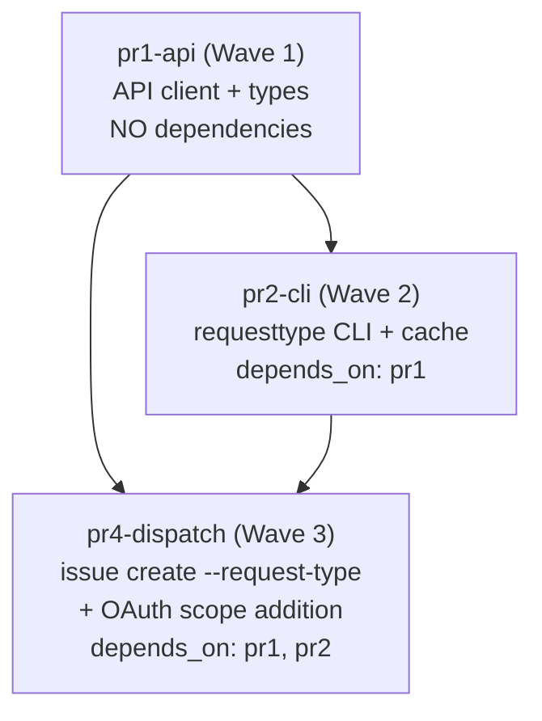

# Dependency Graph — Issue #288 (JSM Request Type Support)

## Inter-PR Dependency Map

> **Note:** pr3-scope was dropped 2026-05-18. Research at
> `.factory/research/issue-288-oauth-scope-coordination.md` validated the PR-template
> release-gate mechanism as disproportionate for a two-line change. OAuth scope addition
> absorbed into pr4-dispatch (Wave 3). Updated post-F1d-CONVERGENCE.

```
┌─────────────────────────┐
│  pr1-api (Wave 1)       │
│  API client + types     │
│  depends_on: []         │
└────────────┬────────────┘
             │
             ▼
┌─────────────────────────┐
│  pr2-cli (Wave 2)       │
│  requesttype commands   │
│  + cache functions      │
│  depends_on: [pr1]      │
└────────────┬────────────┘
             │
             ▼
┌──────────────────────────────┐
│  pr4-dispatch (Wave 3)        │
│  issue create --request-type  │
│  + OAuth scope addition       │
│  depends_on: [pr1, pr2]       │
└──────────────────────────────┘
```

## Mermaid Diagram



## Wave Schedule

| Wave | Stories | Can run in parallel? | Gate before next wave |
|------|---------|---------------------|----------------------|
| Wave 1 | pr1-api | N/A — single story | pr1 must be merged |
| Wave 2 | pr2-cli | NO — depends on pr1 | pr2 merged + all tests green |
| Wave 3 | pr4-dispatch | NO — depends on pr1, pr2 | Both predecessors merged; Developer Console update confirmed in PR description |

**Critical path:** pr1 → pr2 → pr4 (3 sequential steps, minimum 3 PR cycles)

**pr3-scope dropped:** OAuth scope addition (`write:servicedesk-request`) absorbed into pr4-dispatch.
Developer Console update is a manual release-gate step confirmed in the pr4 PR description before merge.

## Topological Sort (validated acyclic)

Linearized order: `pr1-api` → `pr2-cli` → `pr4-dispatch`

**Cycle check: PASS.** There are no back-edges. The graph is a DAG. Verified manually:
- pr1 depends on nothing ✓
- pr2 depends on pr1 (forward edge only) ✓
- pr4 depends on pr1, pr2 (all forward edges) ✓
- pr3-scope removed (2026-05-18): was a leaf node; removal does not introduce cycles ✓

## BC Traceability Matrix

> pr3-scope column removed 2026-05-18. BC-1.3.023 scope-addition coverage moved to pr4-dispatch.

| BC ID | pr1-api | pr2-cli | pr4-dispatch |
|-------|---------|---------|--------------|
| BC-3.8.001 | partial (API client) | — | full (dispatch + tests) |
| BC-3.8.002 | — | — | full |
| BC-3.8.003 | — | — | full |
| BC-3.8.004 | — | — | full |
| BC-3.8.005 | — | — | full |
| BC-3.8.006 | — | — | full |
| BC-3.8.007 | — | — | full |
| BC-3.8.008 | — | — | full |
| BC-3.8.009 | — | — | full |
| BC-3.8.010 | — | — | full |
| BC-3.3.001 | — | — | regression guard |
| BC-1.3.023 | — | — | full (scope addition + 401 hint integration test) |
| BC-X.12.001 | partial (API) | full (CLI) | — |
| BC-X.12.002 | partial (API param) | full (flag + forwarding) | — |
| BC-X.12.003 | — | full | — |
| BC-X.12.004 | — | full | — |
| BC-X.12.005 | partial (API) | full (CLI + cache) | — |
| BC-X.12.006 | — | full | — |
| BC-X.12.007 | — | full | — |
| BC-X.12.008 | partial (types) | full (cache functions) | — |
| BC-X.8.004 | — | full (signature change) | — |
| BC-X.3.005 | — | — | 401 path |

## Holdout Traceability Matrix

> pr3-scope column removed 2026-05-18. H-NEW-JSM-RT-003 prerequisite role moved to pr4-dispatch.

| Holdout | pr1-api | pr2-cli | pr4-dispatch |
|---------|---------|---------|--------------|
| H-NEW-JSM-RT-001 | — | — | full (happy path) |
| H-NEW-JSM-RT-002 | — | partial (non-JSM gate test) | full (zero-HTTP confirmation) |
| H-NEW-JSM-RT-003 | — | — | full (scope addition + 401 integration test) |
| H-NEW-JSM-RT-004 | — | — | full (--type warning) |
| H-NEW-JSM-RT-005 | — | full (cache hit pin) | — |

## Regression Baseline Files (must not be modified by any PR in this cycle)

| File | Owned by | Protected by |
|------|----------|-------------|
| `tests/issue_create_json.rs` | pre-existing | platform path; all PRs must keep green |
| `tests/issue_commands.rs` | pre-existing | platform path; all PRs must keep green |
| `tests/issue_write_holdouts.rs` | pre-existing | platform path; all PRs must keep green |
| `tests/queue.rs` | pre-existing | BC-X.8.004 queue path; pr2 must keep green |
| `tests/auth_profiles.rs` | pre-existing | multi-profile isolation; pr4 must keep green (scope addition touches auth.rs) |
| `tests/api_client.rs` | pre-existing | BC-1.6.042/045 scope-mismatch; all PRs must keep green |
| `src/api/jira/issues.rs` | pre-existing | platform create path; pr4 must not touch |
| `src/api/jsm/servicedesks.rs` | modified in pr2 | pr2 changes signature but not behavior for queue callers |

## Gap Register

No gaps identified. All 10 new BCs (BC-3.8.001..010) and all 8 cross-cutting BCs
(BC-X.12.001..008) are covered by at least one story. All 5 holdout scenarios
(H-NEW-JSM-RT-001..005) are covered. BC-1.3.023 and BC-3.3.001 modifications are
covered by pr4. pr3-scope dropped; BC-1.3.023 scope-addition work absorbed into pr4.

| Gap ID | Level | Source | Justification |
|--------|-------|--------|---------------|
| (none) | — | — | Full coverage confirmed |

## Story Manifest

> pr3-scope removed 2026-05-18 (3 stories remain).

| story_id | wave | file_path |
|----------|------|-----------|
| issue-288-pr1-api | 1 | /Users/zious/Documents/GITHUB/jira-cli/.factory/code-delivery/issue-288-pr1-api/story.md |
| issue-288-pr2-cli | 2 | /Users/zious/Documents/GITHUB/jira-cli/.factory/code-delivery/issue-288-pr2-cli/story.md |
| issue-288-pr4-dispatch | 3 | /Users/zious/Documents/GITHUB/jira-cli/.factory/code-delivery/issue-288-pr4-dispatch/story.md |
