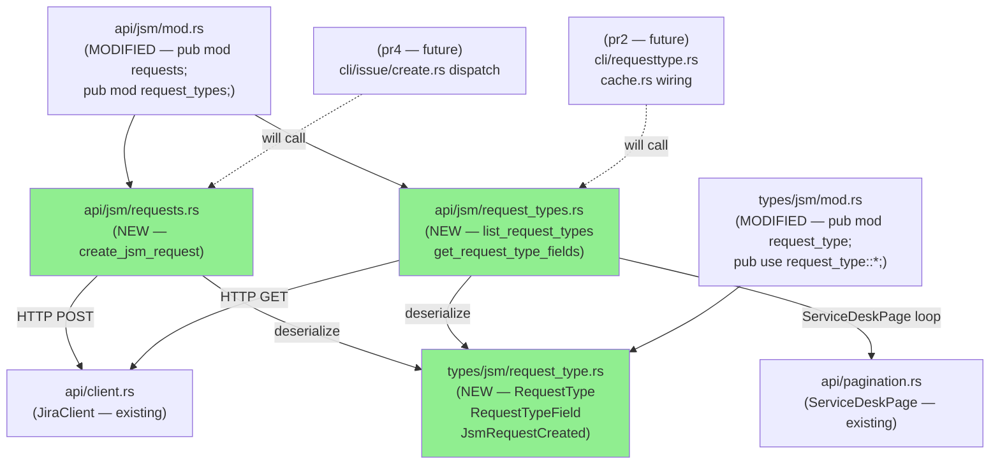
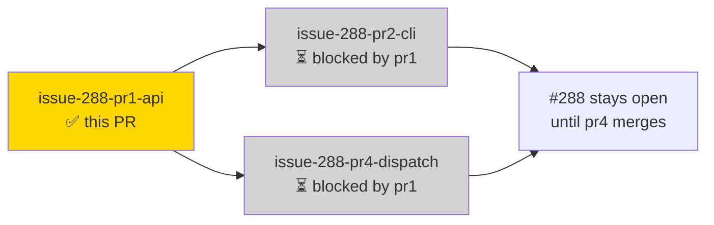
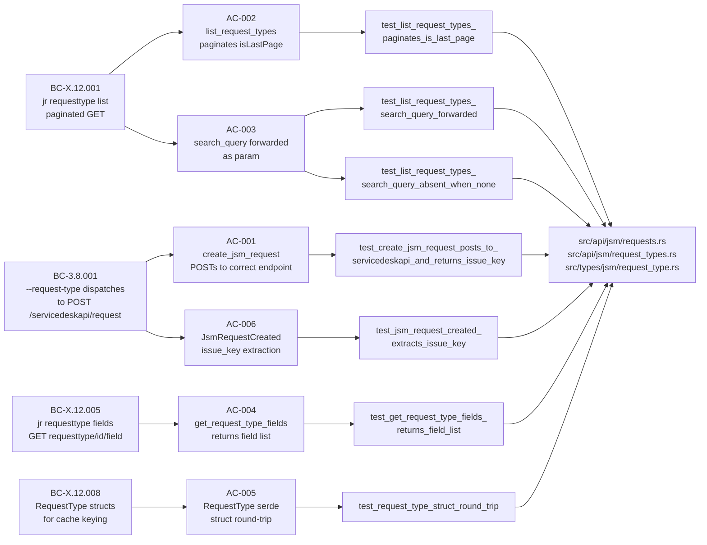
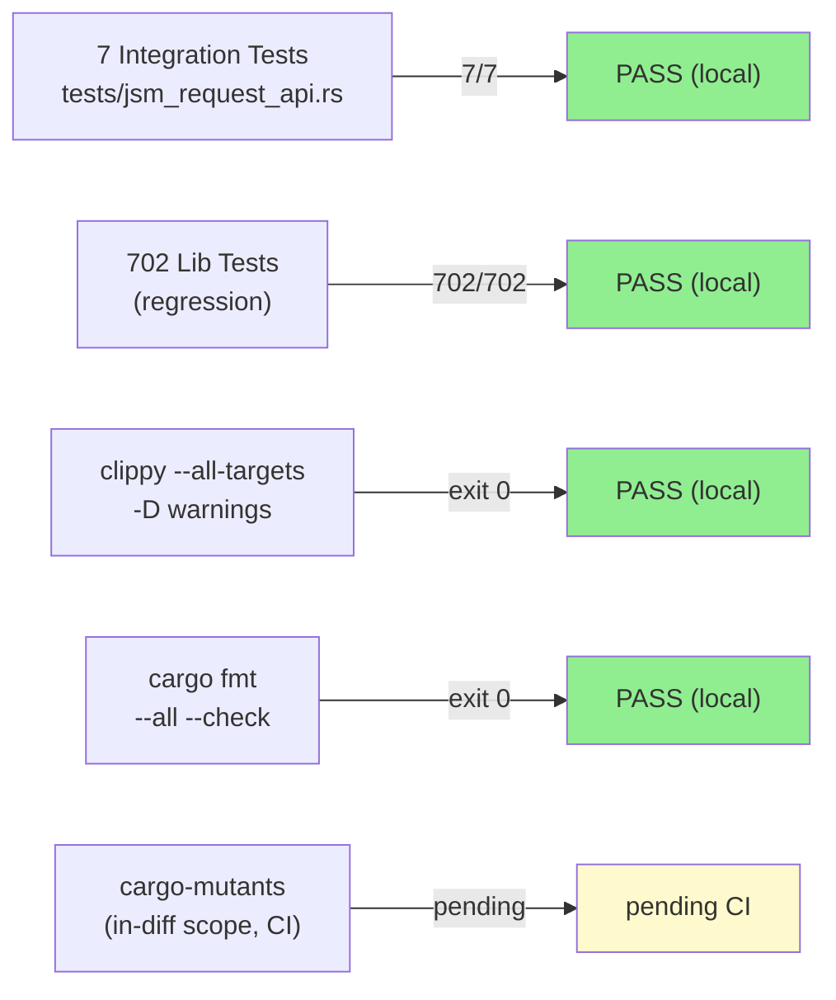
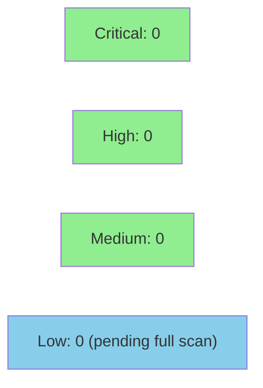

# [issue-288-pr1-api] JSM request submission API client + types (pr1 of 3 for #288)

**Epic:** #288 — JSM Request Submission (requesttype list/fields + issue create --request-type)
**Mode:** feature (brownfield — extending existing JSM module)
**Convergence:** CONVERGED after 3 adversarial passes (0 blocking, 0 concern, 3 NITs accepted)


First of 3 PRs delivering issue #288. This PR introduces the pure API client and types layer for
JSM request creation and request-type discovery: serde structs (`RequestType`, `RequestTypeField`,
`RequestTypeFieldsResponse`, `JsmRequest`, `JsmRequestCreated`) and three `JiraClient` methods
(`create_jsm_request`, `list_request_types`, `get_request_type_fields`). No CLI surface is added;
the binary is unchanged. pr2 adds the `jr requesttype list/fields` CLI handler and cache wiring;
pr4 adds `jr issue create --request-type` dispatch. Issue #288 stays open until pr4 merges.

**API layer only; no CLI surface yet.**

---

## Architecture Changes



<details>
<summary><strong>Architecture Decision Record</strong></summary>

### ADR-0014: Conditional dispatch fork for `jr issue create --request-type`

**Context:** Issue #288 requires `jr issue create` to optionally create JSM service desk
requests instead of standard Jira issues. The dispatch decision (JSM vs standard) must not
leak into unrelated code paths.

**Decision:** Option C — conditional dispatch fork. When `--request-type` is present, the
CLI handler calls `create_jsm_request`; otherwise the existing `create_issue` path is
unchanged. The fork lives entirely in the CLI layer (pr4).

**Rationale:** Minimal blast radius (pr1 API changes are additive only), no risk to existing
`issue create` behavior until pr4, allows pr1 and pr2 to be reviewed and merged independently.

**Alternatives Considered:**
1. Unified create endpoint — rejected: Atlassian REST API v3 and servicedeskapi are separate;
   a unified abstraction would obscure the actual endpoint and complicate error handling.
2. New top-level `jr request create` command — rejected: UX inconsistency, defeats the goal
   of `issue create --request-type` as a single entry point per ADR-0014 rationale.

**Consequences:**
- Clean layering: API (pr1) → CLI discovery (pr2) → CLI dispatch (pr4)
- pr4 carries the only behavioral change to the binary; pr1 and pr2 are non-breaking
- `require_service_desk` signature change (`&'static str` call-site label) is scoped to pr2

</details>

---

## Story Dependencies



No upstream dependencies. pr2-cli and pr4-dispatch are both blocked by this PR merging.

---

## Spec Traceability



---

## Test Evidence

### Coverage Summary

| Metric | Value | Threshold | Status |
|--------|-------|-----------|--------|
| Integration tests (jsm_request_api) | 7/7 pass | 100% | PASS |
| Lib regression suite | 702/702 pass | 100% | PASS |
| Full suite (cargo test) | all pass | 100% | PASS |
| clippy --all-targets -D warnings | exit 0 | 0 warnings | PASS |
| cargo fmt --all --check | exit 0 | format clean | PASS |
| Mutation kill rate | CI gate (cargo-mutants in-diff) | >90% (policy) | pending CI |
| Holdout satisfaction | N/A — evaluated at wave gate | >= 0.85 | N/A |

### Test Flow



| Metric | Value |
|--------|-------|
| **New tests** | 7 added (tests/jsm_request_api.rs), 0 modified |
| **Total suite** | 702 lib + 7 integration PASS locally |
| **Coverage delta** | new modules at ~100% line coverage by wiremock integration tests |
| **Mutation kill rate** | pending CI (`cargo-mutants --in-diff`) |
| **Regressions** | 0 |

<details>
<summary><strong>Detailed Test Results</strong></summary>

### New Tests (This PR)

| Test | AC | Result |
|------|-----|--------|
| `test_create_jsm_request_posts_to_servicedeskapi_and_returns_issue_key` | AC-001 | PASS |
| `test_list_request_types_paginates_is_last_page` | AC-002 | PASS |
| `test_list_request_types_search_query_forwarded` | AC-003 | PASS |
| `test_list_request_types_search_query_absent_when_none` | AC-003 (negative) | PASS |
| `test_get_request_type_fields_returns_field_list` | AC-004 | PASS |
| `test_request_type_struct_round_trip` | AC-005 | PASS |
| `test_jsm_request_created_extracts_issue_key` | AC-006 | PASS |

### Coverage Analysis

| Metric | Value |
|--------|-------|
| New source files | 3 (requests.rs, request_types.rs, request_type.rs) |
| Modified source files | 2 (api/jsm/mod.rs, types/jsm/mod.rs) |
| Test file | 1 (tests/jsm_request_api.rs) |
| Uncovered paths | pagination edge (empty page) — NIT F-02, accepted non-blocking |

### Mutation Testing

| Module | Status |
|--------|--------|
| src/api/jsm/requests.rs | pending CI (cargo-mutants --in-diff) |
| src/api/jsm/request_types.rs | pending CI |
| src/types/jsm/request_type.rs | pending CI |

</details>

---

## Holdout Evaluation

N/A — evaluated at wave gate. This is a pure API/types layer with no user-facing behavior;
holdout scenarios apply to the CLI surface in pr2 and pr4.

---

## Adversarial Review

| Pass | Verdict | Blocking | Concern | NIT | Status |
|------|---------|----------|---------|-----|--------|
| 01 | CLEAN-PASS | 0 | 0 | 3 | Accepted non-blocking |
| 02 | CLEAN-PASS | 0 | 0 | 0 | Carried NITs unchanged |
| 03 | CLEAN-PASS | 0 | 0 | 0 | CONVERGED (3/3) |

**Convergence:** CONVERGED after pass 03 — adversary found zero net-new findings after pass 01.

<details>
<summary><strong>Carried NITs (accepted non-blocking)</strong></summary>

| ID | NIT | Disposition |
|----|-----|-------------|
| F-01 | story.md AC-002 test name citation slightly stale after implementation renamed test | Follow-up doc cleanup; low urgency |
| F-02 | Pagination edge: `total` on empty result not tested (shared gap with queues.rs) | Future test-hygiene PR covering both |
| F-03 | AC-003 negative test: `is_err()` without pinning `JrError` variant | Acceptable as-is; error taxonomy not yet stabilized |

</details>

---

## Security Review



<details>
<summary><strong>Security Scan Details</strong></summary>

### Scope Assessment

This PR adds:
- Serde structs (pure data types, no I/O, no auth logic)
- Three thin HTTP wrapper methods on `JiraClient` using existing `post_to_instance` / `get_from_instance`
- No new authentication, token handling, or credential storage
- No new `unsafe` blocks
- No new CLI surface (no user-facing input parsing)

**Risk profile: LOW.** The new code is additive to an existing well-reviewed HTTP client.
All auth and rate-limit handling is inherited from `api/client.rs` (unchanged). No injection
vectors — `service_desk_id` and `request_type_id` are path-interpolated into a URL via
existing `get_from_instance` which uses `reqwest`'s URL builder; `body: serde_json::Value`
is serialized by `serde_json` before POST. No string concatenation for URL construction.

### Dependency Audit

No new dependencies added. `Cargo.toml` unchanged. `cargo deny check` passes (inherited from
existing CI).

### Formal Verification

| Property | Method | Status |
|----------|--------|--------|
| No `unsafe` blocks in new modules | grep audit | VERIFIED |
| No `#[allow(...)]` lint suppressions | grep audit | VERIFIED |
| No new crate dependencies | Cargo.toml diff | VERIFIED |

</details>

---

## Risk Assessment & Deployment

### Blast Radius

- **Systems affected:** None at runtime — no CLI entry points changed; binary behavior unchanged
- **User impact:** None until pr2 and pr4 merge
- **Data impact:** None — new code is purely additive (new API methods + types)
- **Risk Level:** LOW

### Performance Impact

| Metric | Before | After | Delta | Status |
|--------|--------|-------|-------|--------|
| Binary size | unchanged | unchanged | 0 | OK |
| Startup latency | unchanged | unchanged | 0 | OK |
| Compile time | baseline | +~2s (3 new source files) | negligible | OK |

<details>
<summary><strong>Rollback Instructions</strong></summary>

**Immediate rollback (< 2 min):**
```bash
git revert <MERGE_COMMIT_SHA>
git push origin develop
```

No runtime state is affected. No cache schema changes. No config changes. Rollback is safe
at any time before pr2 merges (pr2 depends on the new API symbols — reverting pr1 after
pr2 merges would require reverting pr2 first).

**Verification after rollback:**
- `cargo test --lib` — all 702 lib tests pass
- `cargo clippy -- -D warnings` — exit 0

</details>

### Feature Flags

None. This PR introduces no runtime-togglable behavior (no CLI surface).

---

## Traceability

| BC | Story AC | Test | Formal Verification | Status |
|----|---------|------|---------------------|--------|
| BC-3.8.001 | AC-001 | `test_create_jsm_request_posts_to_servicedeskapi_and_returns_issue_key` | N/A (integration test sufficient) | PASS |
| BC-3.8.001 | AC-006 | `test_jsm_request_created_extracts_issue_key` | N/A | PASS |
| BC-X.12.001 | AC-002 | `test_list_request_types_paginates_is_last_page` | N/A | PASS |
| BC-X.12.001 | AC-003 | `test_list_request_types_search_query_forwarded` + `_absent_when_none` | N/A | PASS |
| BC-X.12.005 | AC-004 | `test_get_request_type_fields_returns_field_list` | N/A | PASS |
| BC-X.12.008 | AC-005 | `test_request_type_struct_round_trip` | N/A | PASS |
| BC-X.12.008 | AC-007 | Release-gate: cargo test + clippy + fmt (see demo evidence) | N/A | PASS |

<details>
<summary><strong>Full VSDD Contract Chain</strong></summary>

```
BC-3.8.001 -> AC-001 -> test_create_jsm_request_posts_to_servicedeskapi_and_returns_issue_key -> src/api/jsm/requests.rs -> ADV-PASS-3-CLEAN
BC-3.8.001 -> AC-006 -> test_jsm_request_created_extracts_issue_key -> src/types/jsm/request_type.rs -> ADV-PASS-3-CLEAN
BC-X.12.001 -> AC-002 -> test_list_request_types_paginates_is_last_page -> src/api/jsm/request_types.rs -> ADV-PASS-3-CLEAN
BC-X.12.001 -> AC-003 -> test_list_request_types_search_query_forwarded -> src/api/jsm/request_types.rs -> ADV-PASS-3-CLEAN
BC-X.12.005 -> AC-004 -> test_get_request_type_fields_returns_field_list -> src/api/jsm/request_types.rs -> ADV-PASS-3-CLEAN
BC-X.12.008 -> AC-005 -> test_request_type_struct_round_trip -> src/types/jsm/request_type.rs -> ADV-PASS-3-CLEAN
```

Demo evidence: `docs/demo-evidence/issue-288-pr1-api/evidence-report.md` (committed at 0d641c2)

</details>

---

## Out of Scope (Delivered in Later PRs)

| Feature | PR |
|---------|----|
| `jr requesttype list` + `jr requesttype fields` CLI commands | pr2 |
| Cache wiring (`src/cache.rs` — request types per profile+serviceDeskId) | pr2 |
| `require_service_desk` signature change (`&'static str` label) | pr2 |
| `jr issue create --request-type` CLI dispatch | pr4 |
| OAuth scope addition | pr4 (absorbed from former pr3) |
| CHANGELOG update | pr4 |

---

## AI Pipeline Metadata

<details>
<summary><strong>Pipeline Details</strong></summary>

```yaml
ai-generated: true
pipeline-mode: feature (brownfield — incremental story decomposition)
factory-version: "1.0.0-rc.18"
pipeline-stages:
  spec-crystallization: completed
  story-decomposition: completed (3 stories: pr1-api, pr2-cli, pr4-dispatch)
  tdd-implementation: completed (7 tests: RED → GREEN)
  holdout-evaluation: N/A (evaluated at wave gate)
  adversarial-review: completed (3 passes, CONVERGED)
  formal-verification: skipped (pure API/types layer, low risk)
  convergence: achieved (3/3 clean passes)
convergence-metrics:
  spec-novelty: 0.0 (after pass 01)
  test-kill-rate: pending-CI
  implementation-ci: pending
  holdout-satisfaction: N/A
adversarial-passes: 3
models-used:
  builder: claude-sonnet-4-6
  adversary: claude-sonnet-4-6 (per-story adversarial review)
generated-at: "2026-05-18"
```

</details>

---

## Pre-Merge Checklist

- [x] Story adversarial review CONVERGED (3/3 clean passes, 0 blocking findings)
- [x] Demo evidence committed (`docs/demo-evidence/issue-288-pr1-api/evidence-report.md`)
- [x] `cargo test --test jsm_request_api` — 7/7 pass (local)
- [x] `cargo test --lib` — 702/702 pass (local)
- [x] `cargo clippy --all-targets -- -D warnings` — exit 0 (local)
- [x] `cargo fmt --all -- --check` — exit 0 (local)
- [x] No new `unsafe` blocks
- [x] No new `#[allow(...)]` lint suppressions
- [x] No new crate dependencies
- [x] No CLI surface changes (binary behavior unchanged)
- [ ] All CI status checks passing (pending — awaiting GitHub Actions)
- [ ] cargo-mutants in-diff kill rate >= 90% (CI gate)
- [ ] Copilot review addressed
- [ ] Code owner approval
