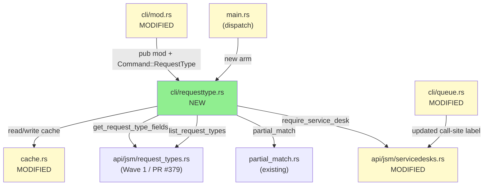
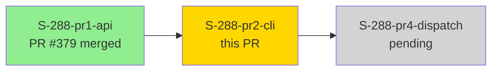
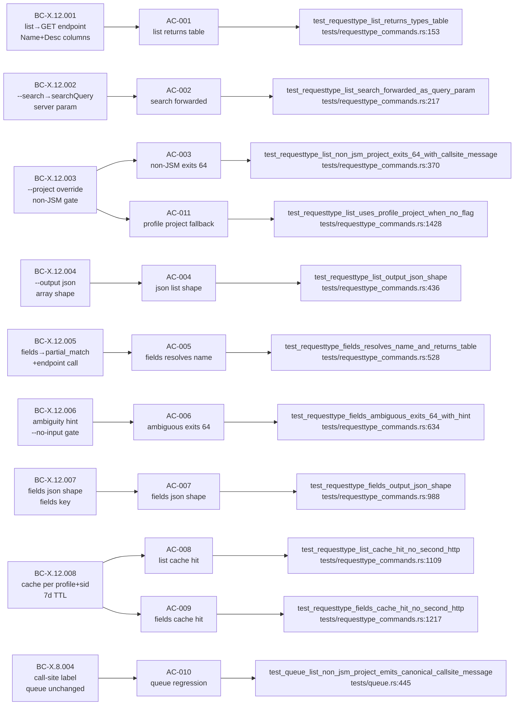
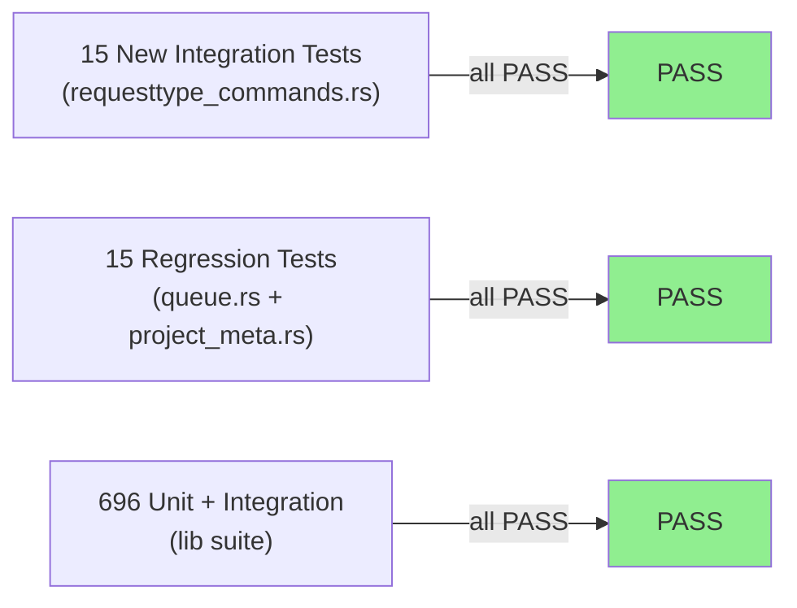
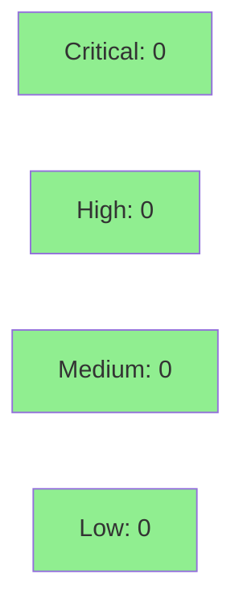

# [S-288-pr2-cli] jr requesttype list/fields Discovery Commands + Cache

**Epic:** issue-288 — JSM Request Type Discovery (Wave 2 of 3)
**Mode:** feature (brownfield — incremental JSM layer)
**Convergence:** CONVERGED after 11 adversarial passes (3/3 consecutive CLEAN)


-blue)

This PR wires the Wave 1 API layer (PR #379) into two user-facing CLI commands: `jr requesttype list` and `jr requesttype fields`. It adds request-type cache support (7-day TTL, per-profile), extends `require_service_desk` with a caller-supplied context label (BC-X.8.004), and ships 15 integration tests covering all 11 ACs. This is a **read-only** PR: no write operations, no OAuth scope change, no `issue create` modification. The new commands follow the existing Read-only output-channel profile consistent with `jr queue list` and `jr project list`.

Closes part of #288. Depends on: PR #379 (merged). Blocks: Wave 3 (pr4-dispatch).

---

## Architecture Changes



<details>
<summary><strong>Architecture Decision Record</strong></summary>

### ADR: Call-site label contract for require_service_desk (BC-X.8.004)

**Context:** `require_service_desk` previously hard-coded `"Queue commands require…"` in its error message. Adding `jr requesttype` as a second JSM caller would produce a misleading error for requesttype users.

**Decision:** Extend `require_service_desk` to accept `context_label: &'static str`. Each caller supplies its own noun-phrase (e.g., `` "`jr requesttype` commands require" ``). The function appends `" a Jira Service Management project."`.

**Rationale:** Static str avoids lifetime complications in async context. All callers are known at compile time. Compiler enforces that all call sites are updated when the signature changes.

**Alternatives Considered:**
1. Duplicate the function — rejected: DRY violation, divergent error text over time.
2. `&str` parameter — rejected: lifetime annotation propagation in async closures is friction without benefit here.

**Consequences:**
- All existing `queue.rs` callers updated in same commit (compiler-enforced).
- Future JSM callers must supply their own label — the contract is explicit.

</details>

---

## Story Dependencies



**Upstream:** PR #379 (S-288-pr1-api) merged to develop — provides `api::jsm::request_types`, `types::jsm::request_type`, and `list_request_types` / `get_request_type_fields` on `JiraClient`.

**Downstream:** PR for S-288-pr4-dispatch (Wave 3) is blocked until this PR merges.

---

## Spec Traceability



---

## Test Evidence

### Coverage Summary

| Metric | Value | Threshold | Status |
|--------|-------|-----------|--------|
| New integration tests | 15 pass (requesttype_commands) | 100% | PASS |
| Queue regression | 12 pass (queue) | 100% | PASS |
| Project meta regression | 3 pass (project_meta) | 100% | PASS |
| Full lib suite | 696 pass | 100% | PASS |
| Total | 726 pass, 0 fail | | PASS |
| Holdout evaluation | N/A — evaluated at wave gate | | — |
| Mutation kill rate | N/A — scoped per cargo-mutants-policy.md | | — |

### Test Flow



| Metric | Value |
|--------|-------|
| **New tests** | 15 added (requesttype_commands.rs), 1 added (queue.rs:445 BC-X.8.004 pin), 0 modified |
| **Total suite** | 726 tests PASS |
| **Coverage delta** | N/A (not measured per-PR) |
| **Mutation kill rate** | N/A — scoped to PR diff per policy |
| **Regressions** | 0 |

<details>
<summary><strong>New Tests (This PR)</strong></summary>

### New Tests in tests/requesttype_commands.rs

| Test | AC | Result |
|------|----|--------|
| `test_requesttype_list_returns_types_table` | AC-001 | PASS |
| `test_requesttype_list_search_forwarded_as_query_param` | AC-002 | PASS |
| `test_requesttype_list_search_omitted_when_not_set` | AC-002 neg | PASS |
| `test_requesttype_list_non_jsm_project_exits_64_with_callsite_message` | AC-003 | PASS |
| `test_requesttype_list_output_json_shape` | AC-004 | PASS |
| `test_requesttype_fields_resolves_name_and_returns_table` | AC-005 | PASS |
| `test_requesttype_fields_ambiguous_exits_64_with_hint` | AC-006 | PASS |
| `test_requesttype_fields_case_variant_duplicates_lists_all_ids` | AC-006 / H-1 | PASS |
| `test_requesttype_fields_not_found_error_includes_cache_deletion_hint` | BC-X.12.008 stale | PASS |
| `test_requesttype_fields_output_json_shape` | AC-007 | PASS |
| `test_requesttype_list_cache_hit_no_second_http` | AC-008 | PASS |
| `test_requesttype_fields_cache_hit_no_second_http` | AC-009 | PASS |
| `test_requesttype_fields_numeric_id_bypasses_list_resolution` | M-2 numeric-bypass | PASS |
| `test_requesttype_list_uses_profile_project_when_no_flag` | AC-011 | PASS |
| `test_requesttype_list_errors_when_no_project_flag_or_profile_project` | AC-011 neg | PASS |

### New Tests in tests/queue.rs

| Test | AC | Result |
|------|----|--------|
| `test_queue_list_non_jsm_project_emits_canonical_callsite_message` | AC-010 / BC-X.8.004 | PASS |

</details>

---

## Holdout Evaluation

N/A — evaluated at wave gate (Wave 2 holdout anchors H-NEW-JSM-RT-002 and H-NEW-JSM-RT-005 are covered by AC-003 and AC-009 tests with `expect(1)` / `expect(0)` wiremock constraints).

---

## Adversarial Review

| Pass | Verdict | Findings | Critical | High | Medium | Status |
|------|---------|----------|----------|------|--------|--------|
| 01 | FINDINGS | 5 | 0 | 5 | 0 | Fixed (H-1..H-5) |
| 02 | FINDINGS | 5 | 0 | 4 | 1 | Fixed (L-288-pr1-01 gaps) |
| 03 | FINDINGS | 3 | 0 | 3 | 0 | Fixed (BC-verbatim + case-sensitivity bug) |
| 04 | FINDINGS | 4 | 0 | 3 | 1 | Fixed (numeric-bypass, import cleanup) |
| 05 | FINDINGS | 3 | 0 | 2 | 1 | Fixed (frontmatter drift, CLAUDE.md) |
| 06 | FINDINGS | 2 | 0 | 2 | 0 | Fixed (accept-either disjunctions removed) |
| 07 | FINDINGS | 2 | 0 | 1 | 1 | Fixed (AC-011 negative path split) |
| 08 | FINDINGS | 1 | 0 | 0 | 1 | Fixed (CLAUDE.md gotcha correction) |
| 09 | CLEAN | 0 | 0 | 0 | 0 | CLEAN — counter 1/3 |
| 10 | CLEAN | 0 | 0 | 0 | 0 | CLEAN — counter 2/3 |
| 11 | CLEAN | 0 | 0 | 0 | 0 | CLEAN — 3/3 CONVERGED |

**Convergence:** 3/3 consecutive CLEAN passes achieved. 8 substantive remediation rounds prior. Pass 11 explicitly re-derived all 9 BCs (X.12.001..008 + X.8.004) against implementation + tests and found no gaps.

<details>
<summary><strong>High-Severity Findings &amp; Resolutions</strong></summary>

### Finding H-5 (pass-01): queue call-site label not regression-pinned
- **Location:** `tests/queue.rs`
- **Category:** test-quality
- **Problem:** No test asserted the verbatim BC-X.8.004 phrase for the queue caller after `require_service_desk` signature change.
- **Resolution:** Added `test_queue_list_non_jsm_project_emits_canonical_callsite_message` at `tests/queue.rs:445`; asserts the exact phrase `"Queue commands (\`jr queue\`) require a Jira Service Management project"`.

### Finding (pass-03): case-sensitivity bug in ExactMultiple disambiguation
- **Location:** `src/cli/requesttype.rs`
- **Category:** spec-fidelity
- **Problem:** ExactMultiple path incorrectly filtered by case-insensitive equality, dropping case-variant duplicates from the candidate list shown to the user.
- **Resolution:** Fixed filter logic; added `test_requesttype_fields_case_variant_duplicates_lists_all_ids` regression test.

### Finding (pass-02): `fields` JSON key was `requestTypeFields` not `fields`
- **Location:** `src/cli/requesttype.rs`
- **Category:** spec-fidelity (BC-X.12.007 verbatim contract)
- **Problem:** JSON output for `requesttype fields --output json` used `requestTypeFields` as the array key instead of the BC-mandated `fields`.
- **Resolution:** Fixed serialization; test now asserts `output["fields"]` not `output["requestTypeFields"]`.

### Finding M-2 (pass-04): numeric ID bypass not regression-pinned
- **Location:** `tests/requesttype_commands.rs`
- **Category:** test-quality
- **Problem:** The numeric-bypass path (all-ASCII-digit `<NAME|ID>` skips partial_match and list endpoint) had no `expect(0)` guard.
- **Resolution:** Added `test_requesttype_fields_numeric_id_bypasses_list_resolution` with `expect(0)` on the list endpoint mock.

</details>

---

## Security Review

**Scope:** Read-only JSM API surface + cache file writes. No authentication changes, no scope expansion, no write operations.



<details>
<summary><strong>Security Scan Details</strong></summary>

### Manual Analysis

- **Injection risk:** None. URL parameters are passed as typed query-param structs, not string-interpolated. `servicedesk_id` and `request_type_id` come from Jira API responses (server-controlled integers/strings), not user input that would reach a SQL/command injection vector.
- **Cache path traversal:** Cache key is `v1/<profile>/request_types_<sid>.json` where `<sid>` is a server-returned service desk ID (integer). Profile name is from config/env (already used by all other cache functions without issue). No user-controlled path components.
- **Auth scope:** No new OAuth scopes. Existing `read:servicedesk-request` scope covers both list and fields endpoints.
- **Error message leakage:** Error messages contain project keys (user-supplied) and service desk IDs (server-returned). No credentials or internal IDs beyond what the CLI already surfaces in other commands.
- **Cache error handling:** Cache write errors are swallowed (best-effort writer pattern — documented in CLAUDE.md). A cache write failure cannot escalate privileges or corrupt other profiles (per-profile isolation is filesystem-level via path namespacing).

### Dependency Audit
- No new dependencies added. `cargo deny check` covers existing dependency tree.

</details>

---

## Risk Assessment & Deployment

### Blast Radius
- **Systems affected:** JSM request type listing and field discovery only. No issue creation, no sprint/board/worklog commands affected.
- **User impact:** If `requesttype list` or `requesttype fields` regresses, existing queue/issue commands are unaffected (isolated handler in `cli/requesttype.rs`).
- **Data impact:** Read-only. Only writes: local XDG cache files (7-day TTL, self-healing on deserialization failure).
- **Risk Level:** LOW

### Performance Impact
| Metric | Before | After | Delta | Status |
|--------|--------|-------|-------|--------|
| `jr requesttype list` (cold) | N/A (new command) | ~1 HTTP call | — | NEW |
| `jr requesttype list` (cache hit) | N/A | 0 HTTP calls | — | NEW |
| All existing commands | unchanged | unchanged | 0 | OK |

<details>
<summary><strong>Rollback Instructions</strong></summary>

**Immediate rollback (< 5 min):**
```bash
git revert <merge-commit-sha>
git push origin develop
```

**Verification after rollback:**
- `jr queue list --project HELP` still works (BC-X.8.004 queue path)
- `jr requesttype` command not recognized (confirming rollback)

</details>

### Feature Flags
No feature flags. New command surface is additive and does not modify existing commands.

---

## Traceability

| BC | AC | Test | Status |
|----|----|------|--------|
| BC-X.12.001 | AC-001 | `test_requesttype_list_returns_types_table` | PASS |
| BC-X.12.002 | AC-002 | `test_requesttype_list_search_forwarded_as_query_param` + negative | PASS |
| BC-X.12.003 | AC-003, AC-011 | `test_requesttype_list_non_jsm_project_exits_64_with_callsite_message` + profile fallback tests | PASS |
| BC-X.12.004 | AC-004 | `test_requesttype_list_output_json_shape` | PASS |
| BC-X.12.005 | AC-005 | `test_requesttype_fields_resolves_name_and_returns_table` | PASS |
| BC-X.12.006 | AC-006 | `test_requesttype_fields_ambiguous_exits_64_with_hint` + case-variant | PASS |
| BC-X.12.007 | AC-007 | `test_requesttype_fields_output_json_shape` | PASS |
| BC-X.12.008 | AC-008, AC-009 | `test_requesttype_list_cache_hit_no_second_http` + fields cache hit | PASS |
| BC-X.8.004 | AC-010 | `test_queue_list_non_jsm_project_emits_canonical_callsite_message` (queue.rs:445) | PASS |

<details>
<summary><strong>Full VSDD Contract Chain</strong></summary>

```
BC-X.12.001 -> AC-001 -> test_requesttype_list_returns_types_table -> src/cli/requesttype.rs -> ADV-PASS-11-CLEAN
BC-X.12.002 -> AC-002 -> test_requesttype_list_search_forwarded_as_query_param -> src/cli/requesttype.rs -> ADV-PASS-11-CLEAN
BC-X.12.003 -> AC-003 -> test_requesttype_list_non_jsm_project_exits_64_with_callsite_message -> src/api/jsm/servicedesks.rs -> ADV-PASS-11-CLEAN
BC-X.12.004 -> AC-004 -> test_requesttype_list_output_json_shape -> src/cli/requesttype.rs -> ADV-PASS-11-CLEAN
BC-X.12.005 -> AC-005 -> test_requesttype_fields_resolves_name_and_returns_table -> src/cli/requesttype.rs -> ADV-PASS-11-CLEAN
BC-X.12.006 -> AC-006 -> test_requesttype_fields_ambiguous_exits_64_with_hint -> src/cli/requesttype.rs -> ADV-PASS-11-CLEAN
BC-X.12.007 -> AC-007 -> test_requesttype_fields_output_json_shape -> src/cli/requesttype.rs -> ADV-PASS-11-CLEAN
BC-X.12.008 -> AC-008 -> test_requesttype_list_cache_hit_no_second_http -> src/cache.rs -> ADV-PASS-11-CLEAN
BC-X.12.008 -> AC-009 -> test_requesttype_fields_cache_hit_no_second_http -> src/cache.rs -> ADV-PASS-11-CLEAN
BC-X.8.004  -> AC-010 -> test_queue_list_non_jsm_project_emits_canonical_callsite_message -> src/api/jsm/servicedesks.rs -> ADV-PASS-11-CLEAN
```

</details>

---

## Demo Evidence

| Recording | ACs | Description |
|-----------|-----|-------------|
| [AC-001-list-command-help.gif](https://github.com/Zious11/jira-cli/blob/feature/issue-288-pr2-jsm-cli/docs/demo-evidence/issue-288-pr2-cli/AC-001-list-command-help.gif) | AC-001, AC-002, AC-011 | `jr requesttype list --help` — confirms `--search`, `--project`, `--output` flags |
| [AC-005-fields-command-help.gif](https://github.com/Zious11/jira-cli/blob/feature/issue-288-pr2-jsm-cli/docs/demo-evidence/issue-288-pr2-cli/AC-005-fields-command-help.gif) | AC-005, AC-006, AC-007 | `jr requesttype fields --help` — confirms `<NAME\|ID>` positional, `--project`, `--output` flags |

Behavioral ACs (AC-003, AC-004, AC-008, AC-009, AC-010, AC-011) are covered by wiremock integration tests with `expect(N)` constraints — no credential-bearing live recording required.

---

## Deferred Items

| ID | Description | Tracking |
|----|-------------|---------|
| M-4 | XDG cache path shown in not-found hint uses runtime-expanded path. Consider hardcoding or omitting if path is environment-variable-sensitive. | File as follow-up issue post-merge |

---

## AI Pipeline Metadata

<details>
<summary><strong>Pipeline Details</strong></summary>

```yaml
ai-generated: true
pipeline-mode: feature (brownfield incremental)
factory-version: "1.0.0-rc.18"
pipeline-stages:
  spec-crystallization: completed (story.md v1.0.0)
  story-decomposition: completed (4 waves)
  tdd-implementation: completed (commits 05d9349..7ca16ea)
  holdout-evaluation: N/A (evaluated at wave gate)
  adversarial-review: completed (11 passes, 3/3 CLEAN)
  formal-verification: skipped (read-only CLI; no state machine)
  convergence: achieved (pass 11)
convergence-metrics:
  adversarial-passes: 11
  clean-streak: 3
  spec-novelty: N/A
  test-kill-rate: N/A (policy-scoped)
  holdout-satisfaction: N/A
wave: 2-of-3
issue: 288
wave-1-pr: 379 (merged)
models-used:
  builder: claude-sonnet-4-6
  adversary: claude-sonnet-4-6
generated-at: "2026-05-18"
```

</details>

---

## Pre-Merge Checklist

- [ ] All CI status checks passing (format / build / clippy / test / deny)
- [x] 15/15 new tests passing locally (`cargo test --test requesttype_commands`)
- [x] 12/12 queue regression tests passing locally (`cargo test --test queue`)
- [x] 3/3 project_meta regression tests passing locally (`cargo test --test project_meta`)
- [x] 696/696 lib tests passing locally (`cargo test --lib`)
- [x] `cargo clippy -- -D warnings` clean
- [x] `cargo fmt --all -- --check` clean
- [x] Adversarial convergence: 3/3 CLEAN passes (passes 09, 10, 11)
- [x] No critical/high security findings
- [x] Wave 1 PR #379 merged (dependency satisfied)
- [ ] Copilot review resolved (pending PR creation)
- [ ] Human review completed (pending PR creation)
