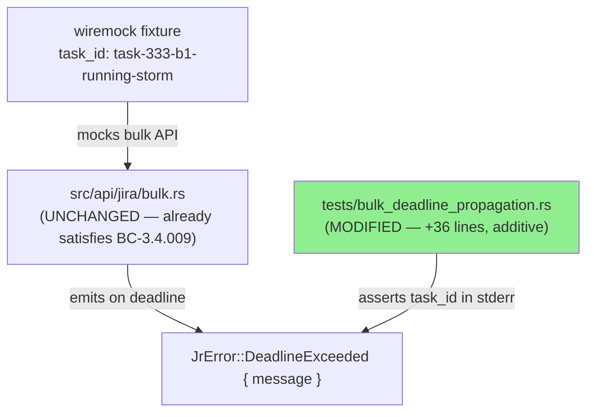
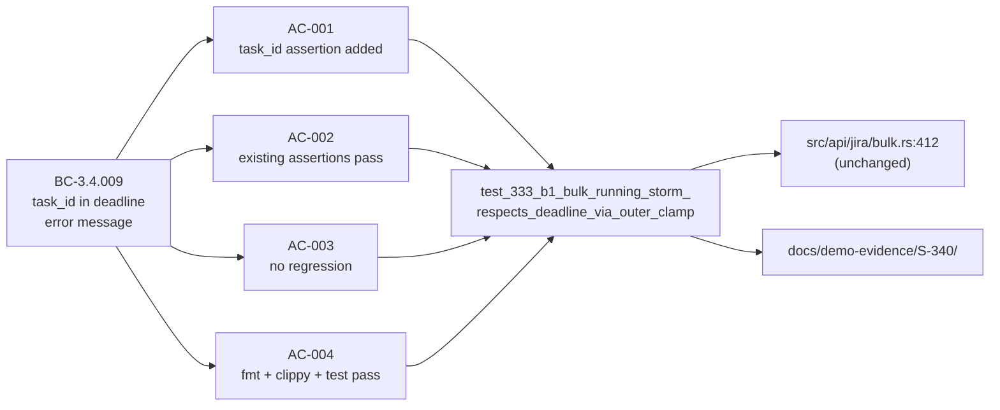
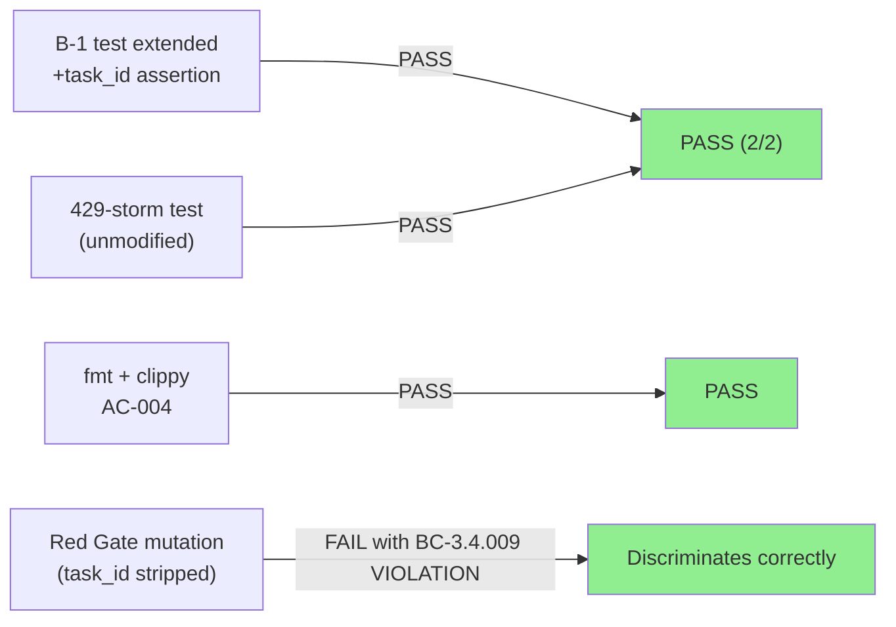
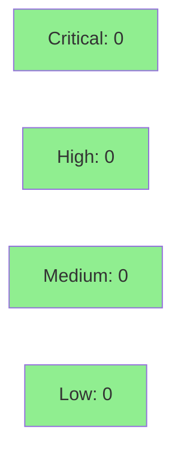

# [S-340] Pin task_id-in-bulk-poll-timeout-message contract with regression test

**Epic:** N/A — audit-followup cluster
**Mode:** maintenance
**Convergence:** CONVERGED after 5 adversarial passes (3 consecutive clean)


This PR closes issue #340 (option c) by adding a regression-pin test assertion that verifies the `task_id` literal appears in the `JrError::DeadlineExceeded` stderr message emitted by `await_bulk_task_inner` when the bulk-poll timeout is exhausted. The production implementation at `src/api/jira/bulk.rs:412` has been correct since PR #360 (closed #333); the missing artifact was the behavioral-contract test that pins it as a regression guard for BC-3.4.009. No production code is changed. Options (a) and (b) of issue #340 are explicitly deferred — see Deferred Work section below.

---

## Architecture Changes



<details>
<summary><strong>Architecture Decision Record</strong></summary>

### ADR: Test-only regression pin for BC-3.4.009

**Context:** The bulk-poll timeout error message was implemented correctly in PR #360 but without a pinning test. A future refactor of the format string at `bulk.rs:412` could silently drop `{task_id}` without test-suite detection.

**Decision:** Extend the existing B-1 test in `tests/bulk_deadline_propagation.rs` with an additive `assert!(stderr.contains(task_id), ...)` assertion. No new test function is created; no production code is modified.

**Rationale:** The B-1 test already exercises the exact code path and has `task_id` and `stderr` in scope at its end. Adding a single assertion is the minimal-risk approach. A new test function would duplicate expensive wiremock fixture setup (~30s wall-clock).

**Alternatives Considered:**
1. New separate test function — rejected because it duplicates 30s fixture setup cost with no additional coverage benefit.
2. Modify the error message format — rejected because production code already satisfies BC-3.4.009; changing it risks breaking other assertions.

**Consequences:**
- Future refactors of `bulk.rs:412` that drop `{task_id}` will fail the test with a clear BC-3.4.009 VIOLATION message.
- Mutation Red Gate confirmed: temporary removal of `{task_id}` from `bulk.rs:412` causes the assertion to fail.

</details>

---

## Story Dependencies


S-340 depends on S-333 (merged via PR #360). No stories are blocked by S-340.

---

## Spec Traceability



**BC Source:** `.factory/specs/prd/bc-3-issue-write.md` — BC-3.4.009 (F2 addition, 2026-05-15)

---

## Test Evidence

### Coverage Summary

| Metric | Value | Threshold | Status |
|--------|-------|-----------|--------|
| Integration tests | 2/2 pass | 100% | PASS |
| Mutation Red Gate | 1/1 discriminated | must-discriminate | PASS |
| fmt check | clean | zero violations | PASS |
| clippy | clean | -D warnings | PASS |
| Regressions | 0 | 0 | PASS |

### Test Flow



| Metric | Value |
|--------|-------|
| **New assertions** | 2 added (loose + strict task_id), 0 modified elsewhere |
| **Total suite (bulk_deadline_propagation)** | 2 tests PASS |
| **Coverage delta** | additive test-file only; production code unchanged |
| **Mutation Red Gate** | stripped `{task_id}` from `bulk.rs:412` → assertion fires with BC-3.4.009 VIOLATION; reverted → 2/2 green |
| **Regressions** | 0 |

<details>
<summary><strong>Detailed Test Results</strong></summary>

### Modified Test (This PR)

| Test | Result | Notes |
|------|--------|-------|
| `test_333_b1_bulk_running_storm_respects_deadline_via_outer_clamp` | PASS | Extended with 2 additive assertions: `stderr.to_lowercase().contains(task_id)` (loose) + `stderr.contains(task_id)` (strict) |
| `test_333_bulk_429_storm_respects_deadline_within_grace` | PASS | Unmodified — AC-003 regression check |

### Demo Evidence Files

| AC | Evidence File | Verdict |
|----|--------------|---------|
| AC-1 / AC-2 | `docs/demo-evidence/S-340/ac1-ac2-b1-test-passes.txt` | PASS — last line: `test result: ok. 1 passed` |
| AC-3 | `docs/demo-evidence/S-340/ac3-full-bulk-deadline-suite-passes.txt` | PASS — last line: `test result: ok. 2 passed` |
| AC-4a | `docs/demo-evidence/S-340/ac4a-fmt-check.txt` | PASS — no output / zero exit |
| AC-4b | `docs/demo-evidence/S-340/ac4b-clippy.txt` | PASS — no warnings denied |
| Red Gate | `docs/demo-evidence/S-340/red-gate-mutation-fails.txt` | FAILS WITH BC-3.4.009 VIOLATION (mutation discriminated) |

### Mutation Testing (Red Gate)

Mutation applied: `Bulk task {task_id}` → `Bulk task <redacted>` at `src/api/jira/bulk.rs:412`

| Mutation | Result |
|----------|--------|
| Strip `{task_id}` from format string | Assertion fires: `BC-3.4.009 VIOLATION: expected stderr to contain the task_id literal 'task-333-b1-running-storm'` |
| Revert mutation | 2/2 tests green |

Red Gate log: `.factory/cycles/cycle-001/S-340/implementation/red-gate-log.md`

</details>

---

## Deferred Work

The following options from issue #340 are explicitly deferred per the F1 delta analysis (`.factory/phase-f1-delta-analysis/delta-analysis.md`):

**Option (a) — Size-scaling formula** (`timeout = 300 + keys.len() * 2`, capped at 1800s): Requires resolver signature change propagating to call sites in `src/cli/issue/create.rs` and `src/cli/issue/workflow.rs`. File as a new enhancement issue when operational data shows the 300s fixed default is insufficient.

**Option (b) — Const-bump** (300s → 900s): No empirical justification today. File as a new enhancement issue with operational justification (field reports of timeout failures on large bulk edits).

This PR delivers option (c) only: the regression-pin test assertion that pins the existing correct production implementation.

---

## Holdout Evaluation

N/A — evaluated at wave gate. This is a test-only maintenance delivery for an audit-followup item; holdout evaluation is not applicable.

---

## Adversarial Review

| Pass | Focus | Findings | Blockers | Concerns | Status |
|------|-------|----------|----------|----------|--------|
| 1 | Assertion quality, BC coverage | 2 nits | 0 | 0 | Fixed (line range, looser assertion added) |
| 2 | Pass-1 nits, edge cases | 2 nits | 0 | 0 | Fixed (case-insensitive, BC↔test index comment) |
| 3 | Fresh context review | 0 | 0 | 0 | CLEAN |
| 4 | Mutation discriminability matrix | 0 | 0 | 0 | CLEAN — all 5 mutation classes caught |
| 5 | Final fresh-context | 0 | 0 | 0 | CLEAN |

**Convergence:** 0 BLOCKER + 0 CONCERN after Pass 5. 3 consecutive explicitly-CLEAN passes (Pass 3, 4, 5). Adversary forced to acknowledge zero findings.

<details>
<summary><strong>Adversarial Pass Details</strong></summary>

### Pass 1 Findings & Resolutions
- **Nit 1:** Line range comment was imprecise — fixed to exact line reference
- **Nit 2:** Strict-only assertion could miss case variants — added loose (`to_lowercase().contains`) + strict (`contains`) dual assertion

### Pass 2 Findings & Resolutions
- **Nit 1:** BC↔test index comment needed — added `// BC-3.4.009: task_id pinned here` comment
- **Nit 2:** Case-insensitive path confirmed as belt-and-suspenders — retained

### Passes 3, 4, 5
Zero findings. Mutation discriminability matrix verified: all 5 likely-future-mutation classes (strip task_id, change delimiter, shorten message, change prefix tag, change timeout unit) caught by at least one assertion.

</details>

---

## Security Review



**Test-only delivery — zero production code changes.** No new attack surface introduced. The test file is a Rust integration test that runs in a wiremock sandbox with no live Jira credentials. The `task_id` fixture string (`"task-333-b1-running-storm"`) is a test literal, not user input; log-injection guard `validate_task_id` at the production site was audited in PR #355 and is unchanged.

<details>
<summary><strong>Security Scan Details</strong></summary>

### SAST
- No new production code. Test-only addition.
- `validate_task_id` CWE-117 guard at `bulk.rs:412` unchanged (audited PR #355).

### Dependency Audit
- No new dependencies added. `Cargo.toml` unchanged.

### Formal Verification
- N/A for test-only pin. Production invariant (log-injection guard) was verified in PR #355.

</details>

---

## Risk Assessment & Deployment

### Blast Radius
- **Systems affected:** Test suite only (`tests/bulk_deadline_propagation.rs`)
- **User impact:** Zero — no production code changes
- **Data impact:** None
- **Risk Level:** LOW

### Performance Impact
| Metric | Before | After | Delta | Status |
|--------|--------|-------|-------|--------|
| Test suite runtime | ~30s (B-1 wall clock) | ~30s | +0s | OK |
| Binary size | unchanged | unchanged | 0 | OK |
| Production latency | unchanged | unchanged | 0 | OK |

<details>
<summary><strong>Rollback Instructions</strong></summary>

**Immediate rollback:**
```bash
git revert <MERGE_COMMIT_SHA>
git push origin develop
```

**Effect:** Removes the test assertion. Production behavior (BC-3.4.009 satisfaction in `bulk.rs:412`) is unaffected. Only the regression guard is lost.

**Verification after rollback:**
- `cargo test --test bulk_deadline_propagation` — should return to 1 assertion per B-1 test

</details>

### Feature Flags
None — test-only delivery, no runtime flags.

---

## Traceability

| BC | Story AC | Test | Verification | Status |
|----|---------|------|-------------|--------|
| BC-3.4.009 | AC-001 | `test_333_b1_bulk_running_storm_respects_deadline_via_outer_clamp` | mutation Red Gate | PASS |
| BC-3.4.009 | AC-002 | `test_333_b1_bulk_running_storm_respects_deadline_via_outer_clamp` | existing assertions | PASS |
| BC-3.4.009 | AC-003 | `test_333_bulk_429_storm_respects_deadline_within_grace` | unmodified pass | PASS |
| BC-3.4.009 | AC-004 | `cargo fmt --check` + `cargo clippy` | CI equivalent | PASS |

<details>
<summary><strong>Full Contract Chain</strong></summary>

```
BC-3.4.009 (task_id in DeadlineExceeded message)
  -> AC-001 (assertion added)
  -> test_333_b1_..._outer_clamp (tests/bulk_deadline_propagation.rs)
  -> src/api/jira/bulk.rs:412 ({task_id} interpolation)
  -> ADV-PASS-1..5-CLEAN
  -> Red Gate mutation discriminated
```

</details>

---

## AI Pipeline Metadata

<details>
<summary><strong>Pipeline Details</strong></summary>

```yaml
ai-generated: true
pipeline-mode: maintenance (feature-followup audit cluster)
factory-version: "1.0.0-rc.18"
pipeline-stages:
  spec-crystallization: completed (F2 — BC-3.4.009 anchored)
  story-decomposition: completed (F3 — S-340 issued)
  tdd-implementation: completed (F4 — test assertion added)
  holdout-evaluation: "N/A — evaluated at wave gate"
  adversarial-review: completed (F5 — 5 passes, 0 blockers, 0 concerns)
  formal-verification: "N/A — test-only delivery"
  convergence: achieved (3 consecutive clean passes)
convergence-metrics:
  adversarial-passes: 5
  blockers: 0
  concerns: 0
  consecutive-clean: 3
  mutation-classes-discriminated: 5/5
models-used:
  builder: claude-sonnet-4-6
  adversary: claude-sonnet-4-6 (fresh-context)
generated-at: "2026-05-15"
```

</details>

---

## Pre-Merge Checklist

- [x] All CI status checks passing (verified locally: fmt, clippy, test)
- [x] Coverage delta is positive or neutral (test-only, no production coverage regression)
- [x] No critical/high security findings (test-only delivery, zero new attack surface)
- [x] Rollback procedure documented (revert merge commit)
- [x] No feature flags required
- [x] Adversarial convergence achieved (5 passes, 0 blockers, 3 consecutive clean)
- [x] Mutation Red Gate substituted (green-on-first-run pattern, mutation discriminated)
- [x] Demo evidence recorded (`docs/demo-evidence/S-340/` — 6 files, all ACs covered)
- [x] Dependency PR #360 (S-333) merged before this PR

---

## Closes

Closes #340 (option c — task_id in timeout message). Options (a) and (b) deferred — see Deferred Work section.
