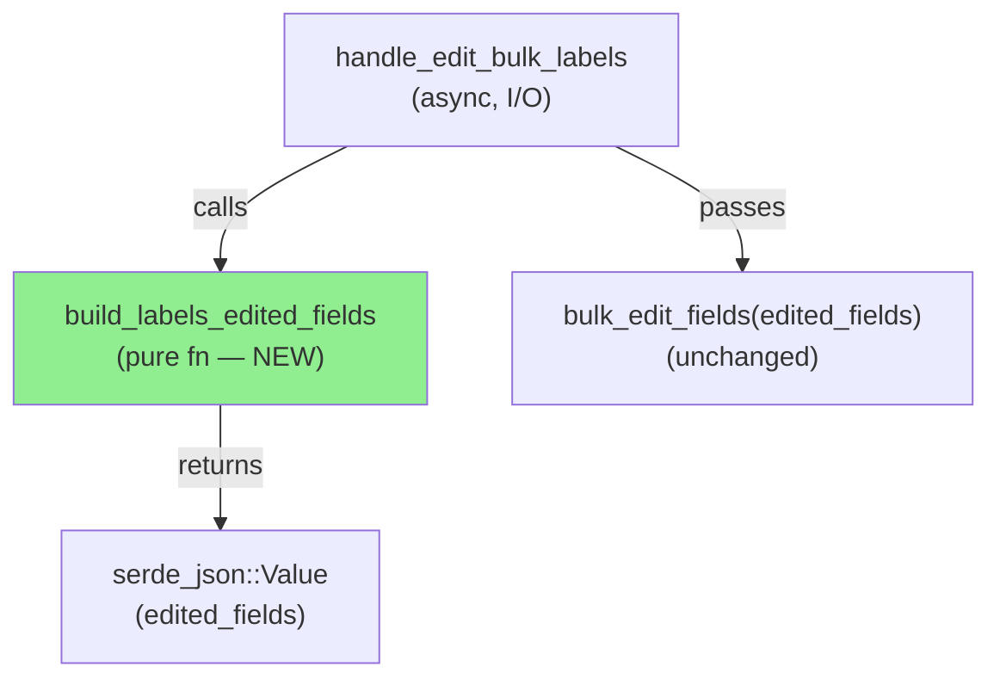
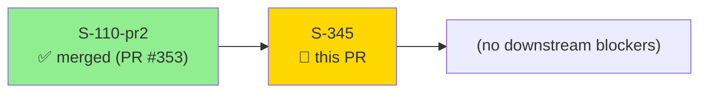
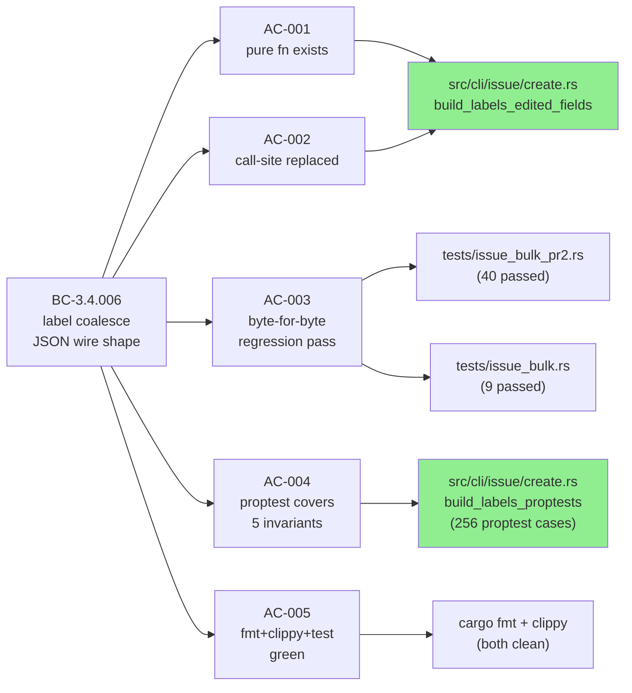
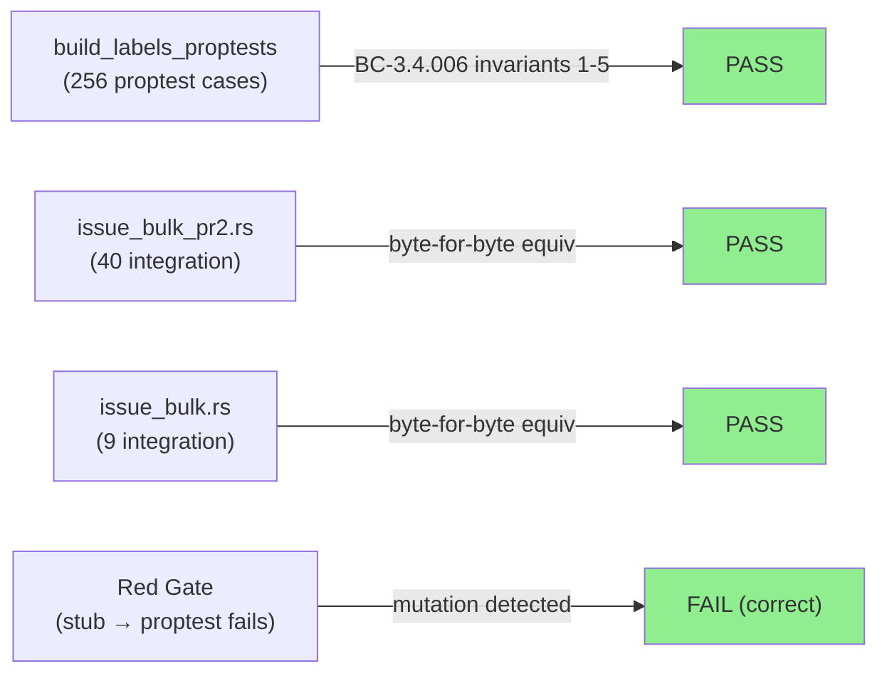
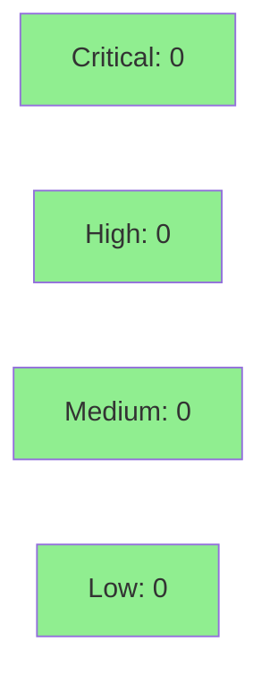

# S-345: Extract label-coalesce JSON builder into pure function + proptest

**Epic:** audit-followup cluster — S-345 (parent: S-110-pr2)
**Mode:** brownfield / maintenance refactor
**Convergence:** CONVERGED after 6 adversarial passes (3 consecutive CLEAN)


Pure refactor: extracts the 26-line inline JSON-builder block from `handle_edit_bulk_labels`
in `src/cli/issue/create.rs` into a named, private, synchronous pure function
`build_labels_edited_fields(adds: &[String], removes: &[String]) -> serde_json::Value`,
then adds an inline `#[cfg(test)] mod build_labels_proptests` block pinning all 5 BC-3.4.006
invariants. Production behaviour is byte-for-byte identical; all 49 existing bulk-edit
integration tests pass without modification.

Closes #345.

---

## Architecture Changes



**ADR context:** No new ADR required. This refactor is purely internal to `create.rs` —
`build_labels_edited_fields` is `fn` (private), synchronous, and has no new Cargo
dependencies. The extraction follows the established proptest pattern from
`src/duration.rs`, `src/jql.rs`, and `src/partial_match.rs`.

**Alternatives considered:**
1. Move to a separate module — rejected: too small, no external caller.
2. Make `pub` for separate test file — rejected: violates architecture rule; inline `#[cfg(test)]` is the project convention.

---

## Story Dependencies



**Dependency check:** S-110-pr2 (the parent bulk-edit delivery) is merged. S-345 has no
`blocks` dependencies.

---

## Spec Traceability



---

## Test Evidence

### Coverage Summary

| Metric | Value | Threshold | Status |
|--------|-------|-----------|--------|
| Proptest cases | 256 / run | ≥100 | PASS |
| Integration: issue_bulk_pr2 | 40 passed | 40 (no regression) | PASS |
| Integration: issue_bulk | 9 passed | 9 (no regression) | PASS |
| Fmt check | clean (exit 0) | clean | PASS |
| Clippy | 0 warnings | 0 | PASS |
| Holdout satisfaction | N/A — evaluated at wave gate | ≥0.85 | N/A |
| Mutation kill rate | proptest discriminates (Red Gate verified) | qualitative | PASS |

### Test Flow



| Metric | Value |
|--------|-------|
| **New tests** | 1 proptest block (build_labels_edited_fields_invariants), 0 modified |
| **Total suite** | 49 integration + 1 proptest lib test (256 proptest cases) PASS |
| **Coverage delta** | New pure function is fully covered by both proptest and integration tests |
| **Mutation kill rate** | Red Gate substituted via proptest-failing-against-stub pattern (see `docs/demo-evidence/S-345/red-gate-mutation-fails.txt`) |
| **Regressions** | 0 |

<details>
<summary><strong>Detailed Test Results</strong></summary>

### New Tests (This PR)

| Test | Result | Notes |
|------|--------|-------|
| `build_labels_edited_fields_invariants` (proptest, 256 cases) | PASS | Covers BC-3.4.006 invariants 1–5 |

### Integration Tests (Unchanged, Regression Baseline)

| Test File | Tests | Result |
|-----------|-------|--------|
| `tests/issue_bulk_pr2.rs` | 40 | PASS (byte-for-byte equivalent) |
| `tests/issue_bulk.rs` | 9 | PASS (byte-for-byte equivalent) |

### Red Gate Evidence

Mutation applied: `"labelsAction": "ADD"` → `"labelsAction": "WRONG_ADD"` in production
path of `build_labels_edited_fields`. Proptest fails with:
`BC-3.4.006: single-ADD MUST set labelsAction=ADD`. Production code reverted; post-revert
proptest green.

</details>

---

## Holdout Evaluation

N/A — evaluated at wave gate. This is a pure refactor with no user-visible behaviour change.
Holdout scenarios for BC-3.4.006 were evaluated during the S-110-pr2 wave gate.

---

## Adversarial Review

| Pass | Findings (C/H/L) | Status |
|------|-----------------|--------|
| Pass 1 | 0/1/6 | Fixed: verbatim schema-note, tightened proptest, debug_assert, coalesce comment |
| Pass 2 | 0/2/3 | Fixed: caller doc-freshness, comment dedupe, valid JSON examples |
| Pass 3 | 0/2/2 | Fixed: softened unverified-claim in handler doc |
| Pass 4 | 0/0/0 | CLEAN |
| Pass 5 | 0/0/0 | CLEAN |
| Pass 6 | 0/0/0 | CLEAN |

**Convergence:** 3 consecutive CLEAN passes (Pass 4, 5, 6). Adversary found nothing to flag
on the final 3 fresh-context reviews.

<details>
<summary><strong>Key Finding Resolutions</strong></summary>

### Pass 1 — High: schema-note not verbatim
- **Location:** `src/cli/issue/create.rs` — doc comment of `build_labels_edited_fields`
- **Resolution:** Copied schema caveat verbatim from original inline comment (lines 869–872)

### Pass 2 — High: caller doc out of date
- **Location:** `handle_edit_bulk_labels` doc comment
- **Resolution:** Updated doc to reference `build_labels_edited_fields` instead of describing the inline block

### Pass 3 — High: unverified-claim wording too strong
- **Location:** handler doc comment
- **Resolution:** Softened "is not verified" to "best-guess (unverified against live Atlassian API)"

</details>

---

## Security Review



**Surface analysis:** `build_labels_edited_fields` is a pure JSON constructor. Inputs are
`&[String]` slices of label name strings already parsed by clap from CLI args. No:
- Network access
- File I/O
- Auth/credential handling
- External input beyond already-validated CLI strings
- Deserialization of untrusted data
- Unsafe code

**OWASP relevance:** None. This is pure in-memory JSON construction with no injection vector —
label strings are user-supplied CLI args, not SQL/shell/Jira-API injection surfaces (label
names are passed directly as `{"name": "<value>"}` in the JSON body; Jira REST validates
label names server-side).

**Dependency audit:** No new dependencies introduced.

---

## Risk Assessment & Deployment

### Blast Radius
- **Systems affected:** `src/cli/issue/create.rs` only (one file, +127/-32 lines)
- **User impact:** None — pure refactor, byte-for-byte identical output
- **Data impact:** None
- **Risk Level:** LOW

### Performance Impact
| Metric | Before | After | Delta | Status |
|--------|--------|-------|-------|--------|
| Latency | unchanged | unchanged | 0ms | OK |
| Memory | unchanged | unchanged | 0 | OK |
| Binary size | unchanged | +~0KB (inlined) | negligible | OK |

Pure function call replaces inline block — no heap allocation change, no async boundary
added, no additional I/O.

<details>
<summary><strong>Rollback Instructions</strong></summary>

**Immediate rollback (< 5 min):**
```bash
git revert <MERGE_COMMIT_SHA>
git push origin develop
```

No feature flags. No runtime configuration. The change is entirely in compiled Rust —
rollback is a revert + push.

**Verification after rollback:**
- `cargo test --test issue_bulk_pr2` — 40 tests pass
- `cargo test --test issue_bulk` — 9 tests pass

</details>

### Feature Flags
None — pure refactor, no runtime toggle needed.

---

## Traceability

| Requirement | Story AC | Test | Status |
|-------------|---------|------|--------|
| BC-3.4.006 — labels key always present | AC-001 | `build_labels_edited_fields_invariants` (proptest) | PASS |
| BC-3.4.006 inv 1 — ADD iff adds non-empty | AC-004 | `build_labels_edited_fields_invariants` (proptest) | PASS |
| BC-3.4.006 inv 2 — REMOVE iff removes non-empty | AC-004 | `build_labels_edited_fields_invariants` (proptest) | PASS |
| BC-3.4.006 inv 4 — both-action array-form | AC-004 | `build_labels_edited_fields_invariants` (proptest) | PASS |
| BC-3.4.006 inv 5 — single-action object-form | AC-004 | `build_labels_edited_fields_invariants` (proptest) | PASS |
| Call-site replacement (no double-POST) | AC-002, AC-003 | `test_label_add_remove_coalesce_emits_one_bulk_call` | PASS |
| Byte-for-byte equivalence | AC-003 | `tests/issue_bulk_pr2.rs` (40), `tests/issue_bulk.rs` (9) | PASS |
| fmt + clippy green | AC-005 | `cargo fmt --check`, `cargo clippy -D warnings` | PASS |

<details>
<summary><strong>Full VSDD Contract Chain</strong></summary>

```
BC-3.4.006 -> S-345/AC-001 -> build_labels_edited_fields exists (create.rs) -> ADV-PASS-6-CLEAN
BC-3.4.006 -> S-345/AC-002 -> handle_edit_bulk_labels calls fn -> ADV-PASS-6-CLEAN
BC-3.4.006 -> S-345/AC-003 -> issue_bulk_pr2.rs (40 pass) + issue_bulk.rs (9 pass) -> REGRESSION-CLEAN
BC-3.4.006 inv 1-5 -> S-345/AC-004 -> build_labels_proptests (256 cases) -> RED-GATE-VERIFIED
BC-3.4.006 -> S-345/AC-005 -> fmt clean + clippy 0 warnings -> CI-PASS
```

</details>

---

## Demo Evidence

Evidence captured in `docs/demo-evidence/S-345/` (committed on branch):

| File | AC | Verdict |
|------|----|---------|
| `ac1-function-exists.txt` | AC-001 | Function signature confirmed: private, sync, `&[String]` params |
| `ac1-function-body.txt` | AC-001 | Full function body — no I/O, no async, no client refs |
| `ac2-call-site.txt` | AC-002 | `handle_edit_bulk_labels` calls `build_labels_edited_fields(&adds, &removes)` at line 922 |
| `ac3-integration-pr2-passes.txt` | AC-003 | `tests/issue_bulk_pr2.rs` — 40 passed |
| `ac3-integration-bulk-passes.txt` | AC-003 | `tests/issue_bulk.rs` — 9 passed |
| `ac4-proptest-passes.txt` | AC-004 | 1 test passed (~256 proptest cases) |
| `ac5a-fmt-check.txt` | AC-005 | `cargo fmt --check` — exit 0, clean |
| `ac5b-clippy.txt` | AC-005 | `cargo clippy -D warnings` — 0 warnings |
| `red-gate-mutation-fails.txt` | Red Gate | Mutation → proptest fails with BC-3.4.006 assertion |
| `evidence-report.md` | All ACs | Full evidence report |

---

## Out of Scope (Deferred)

- **Issue #331** — Schema correctness of the array-form `[{labelsAction: "ADD", ...}]` against Atlassian's formally documented bulk API schema. The `build_labels_edited_fields` doc comment preserves the schema caveat verbatim: _"Shape is best-guess (unverified against live Atlassian API; tracked at #331)."_

---

## AI Pipeline Metadata

<details>
<summary><strong>Pipeline Details</strong></summary>

```yaml
ai-generated: true
pipeline-mode: brownfield/maintenance
factory-version: "1.0.0-rc.18"
pipeline-stages:
  f1-delta-analysis: completed
  f2-spec-evolution: completed (BC-3.4.006 extended in-place)
  f3-story-decomposition: completed
  f4-tdd-implementation: completed
  f5-scoped-adversarial: completed (6 passes, converged)
  f6-targeted-hardening: completed (proptest + red-gate)
  f7-convergence: in-progress
convergence-metrics:
  adversarial-passes: 6
  consecutive-clean: 3
  implementation-ci: green-locally
  mutation-kill: red-gate-verified
models-used:
  builder: claude-sonnet-4-6
  adversary: claude-sonnet-4-6
generated-at: "2026-05-15"
```

</details>

---

## Pre-Merge Checklist

- [x] All CI status checks passing (local equivalent: fmt + clippy + test all green)
- [x] Coverage delta is positive (new proptest block covers all 5 BC-3.4.006 invariants)
- [x] No critical/high security findings (pure JSON constructor, no auth surface)
- [x] Rollback procedure validated (revert + push, < 5 min)
- [x] No feature flag needed (pure refactor)
- [x] Demo evidence committed to branch (`docs/demo-evidence/S-345/`)
- [x] `proptest-regressions/` added to `.gitignore`
- [x] Adversarial convergence achieved (3 consecutive CLEAN passes)
- [ ] CI checks green on GitHub
- [ ] Code owner approval (required for `develop` branch protection)
