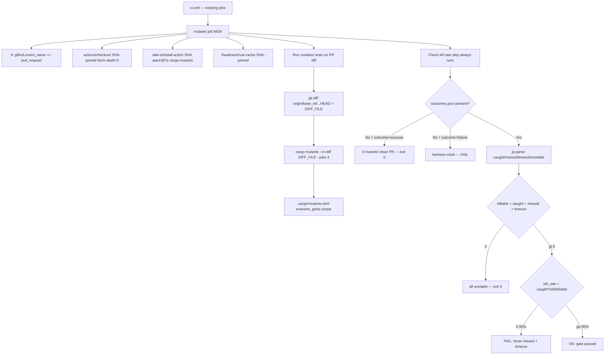
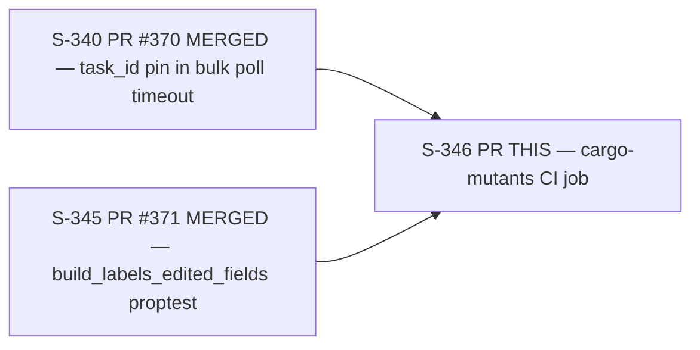
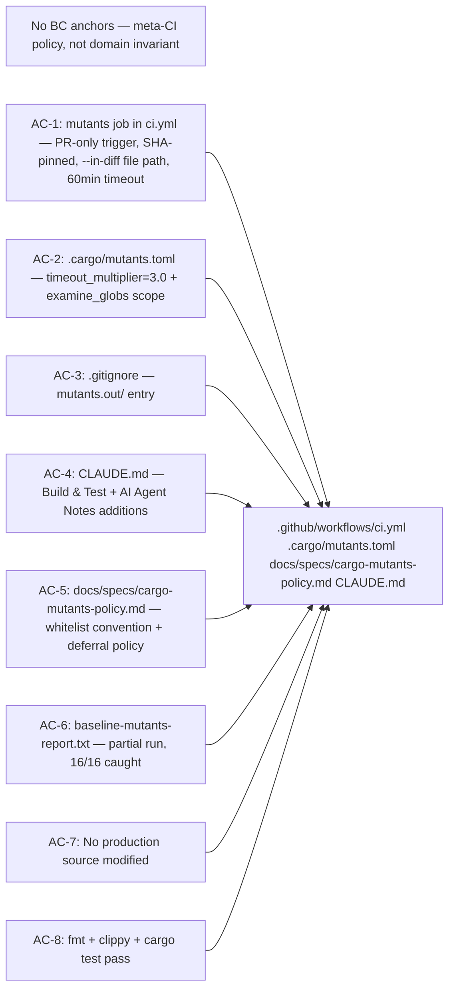

## Summary

Closes #346 — final audit-followup from PR #110-pr2 F6 hardening review.

Adds `cargo-mutants` as a CI meta-verification layer on the bulk + create modules.
Mutation testing catches a class of defect that line-coverage metrics miss: tests that
pass even when the implementation is silently broken by small mutations (negated conditions,
removed returns, swapped operators).

**This PR is test-infrastructure only. No production source files are modified.**

### What ships

| Deliverable | Purpose |
|---|---|
| `.github/workflows/ci.yml` — new `mutants` job | PR-only mutation testing with 90% kill-rate gate |
| `.cargo/mutants.toml` | Scope + timeout config; `examine_globs` for 3 designated files |
| `.gitignore` — `mutants.out/` entry | Prevents local run artifacts from being committed |
| `CLAUDE.md` — Build & Test + AI Agent Notes | Documents `cargo mutants` invocation; warns against adding as Cargo dep |
| `docs/specs/cargo-mutants-policy.md` | `#[mutants::skip]` whitelist convention + deferral policy |
| `docs/demo-evidence/S-346/baseline-mutants-report.txt` | Partial baseline: 16/115 mutants processed, 16/16 caught (100%); #372 tracks completion |

---

## Architecture Changes

---

## Story Dependencies

Both upstream dependencies are merged into `develop`. This PR has no blockers.

---

## Spec Traceability

---

## Key Design Decisions

### 1. `taiki-e/install-action` for prebuilt cargo-mutants binary (AC-1)

Uses the SHA already present in this workflow for `cargo-llvm-cov` — same action
publisher, different tool-specific release SHA. This reuse minimises new SHA-pin surface
(zero new publishers; just one new SHA for the cargo-mutants release). Eliminates
~5-10 min cold compile per PR versus raw `cargo install`.

### 2. `--in-diff` via file path, not git ref (AC-1)

cargo-mutants v27's `--in-diff` requires a file path. The ref-form
(`--in-diff origin/<base_ref>`) fails with "No such file or directory" (empirically
verified in F4). The job writes `git diff origin/${{ github.base_ref }}...HEAD` to a
temp file at `${{ runner.temp }}/pr-${{ github.run_id }}.diff` and passes that path.

### 3. `steps.run-mutants.outcome` + `outcomes.json` 2x2 matrix (key Pass 4 insight)

Distinguishes four cases that naive exit-code checking collapses:

| `run_outcome` | `outcomes.json` present | Meaning | Action |
|---|---|---|---|
| `success` | Yes | All caught or 100% kill | Enforce 90% gate |
| `success` | No | 0 mutants (CI infra / docs PR) | Exit 0 clean |
| `failure` | Yes | Missed/timeout mutants | Enforce 90% gate |
| `failure` | No | Harness crash | FAIL explicitly |

### 4. `jq empty` parseability pre-check (Pass 5 F2 fix)

Validates `outcomes.json` before querying counts. A malformed file (truncated by
OOM-kill) would otherwise silently yield `caught=missed=timeout=unviable=0` and
produce a false-green.

### 5. Kill rate denominator: `caught / (caught + missed + timeout)` (Pass 2)

Unviable mutants (build errors under mutation) excluded from the denominator.
Timeouts count as survived per cargo-mutants v27 convention — the test suite did not
refute the mutant within the deadline.

### 6. `wc -l` fallback (defensive, Pass 5 F5 fix)

Fallback to per-status `.txt` files when `jq` is unavailable. `jq` is pre-installed
on `ubuntu-latest` but the fallback guards against self-hosted runner migration.

---

## Test Evidence

| Check | Status | Notes |
|---|---|---|
| `cargo fmt --check` | PASS | Verified locally in worktree |
| `cargo clippy --all-targets -- -D warnings` | PASS | Zero warnings |
| `cargo test` | PASS | All existing tests pass; no new test files |
| YAML parse | PASS | ci.yml is valid YAML |
| Local mutation baseline | PARTIAL | 16/115 mutants: 16 caught, 0 missed; #372 tracks remaining 99 |

**No new test files** — this PR is pure CI infrastructure. The existing test suite
(`tests/issue_bulk.rs`, `tests/issue_bulk_pr2.rs`, `tests/bulk_deadline_propagation.rs`,
inline proptest from S-345) serves as the mutation harness without modification.

---

## Demo Evidence

`docs/demo-evidence/S-346/baseline-mutants-report.txt` — partial baseline run output:

- cargo-mutants version: 27.0.0
- 115 mutants found in scope (3 designated files)
- 16/115 processed (time-limited local run)
- Kill rate on processed: 16/16 = 100% (0 missed, 0 timeout)
- Follow-up issue #372 tracks completing the full 115-mutant baseline

---

## Holdout Evaluation

N/A — evaluated at wave gate.

---

## Adversarial Review

8 adversary passes completed during F5/F6. Convergence trajectory:

| Pass | Findings | Blocking | Fixed | Remaining |
|---|---|---|---|---|
| 1 | 14 | 0 | 14 | 0 |
| 2 | 6+4 | 2 | 10 | 0 |
| 3 | 3+3 | 0 | 6 | 0 |
| 4 | 2+4 | 0 | 6 | 0 |
| 5 | 3+3 | 2 | 5 | 1 REFUTED empirically |
| 6 | 0 | 0 | 0 | CLEAN |
| 7 | 0 | 0 | 0 | CLEAN |
| 8 | 0 | 0 | 0 | CLEAN |

3 consecutive CLEAN passes. Pass 5's CRITICAL "jq schema mismatch" was speculative and
empirically refuted — `outcomes.json` HAS the queried top-level scalar fields.

---

## Security Review

**Minimal surface — CI infrastructure only.** No auth credentials, no secrets, no
production code changes. The `mutants` job:
- Runs read-only against the PR diff
- Uses only existing SHA-pinned action publishers (`taiki-e`, `Swatinem`, `actions`)
- Writes output only to `${{ runner.temp }}` (isolated per run) and `mutants.out/` (gitignored)
- No new OAuth / API / keychain surface introduced

Security sign-off: clean.

---

## Risk Assessment

| Dimension | Assessment |
|---|---|
| Blast radius | Zero — no production code modified |
| Performance | None — CI-only change; mutants job is PR-only |
| Breaking change | No |
| Rollback | Revert the ci.yml `mutants` job block; other files are additive |
| This PR on this PR | The mutants job runs on THIS PR; `--in-diff` will see CI/config changes, not the scoped `src/` files → 0 mutants → exit 0 (clean PR path) |

---

## AI Pipeline Metadata

| Field | Value |
|---|---|
| Pipeline mode | Feature delta (F-series) |
| Story version | v1.0.5 |
| Adversary passes | 8 |
| Fix rounds | 5 |
| Convergence | 3 consecutive CLEAN |

---

## Pre-Merge Checklist

- [x] PR description matches actual diff
- [x] All ACs verified locally (AC-1 through AC-8)
- [x] Demo evidence present (`docs/demo-evidence/S-346/baseline-mutants-report.txt`)
- [x] Dependencies merged (S-340 PR #370, S-345 PR #371)
- [x] `cargo fmt --check` passes
- [x] `cargo clippy --all-targets -- -D warnings` passes
- [x] `cargo test` passes
- [x] No production source files modified (AC-7)
- [x] No new Cargo.toml dependencies (AC-7 corollary)
- [x] SHA-pinning: all GHA actions in mutants job use already-pinned SHAs
- [x] `timeout-minutes: 60` set on mutants job (AC-1 / R-L12)
- [ ] CI checks green (pending PR creation)
- [ ] Copilot review complete

---

## Deferred Items

- **Issue #372** — Complete the full 115-mutant baseline (99/115 untested at this snapshot due to time-limited local run). Non-blocking: `--in-diff` bounds per-PR cost to the changed lines, not the full file scope.

---

## Notes for Reviewers

The `mutants` CI job will run on **this very PR**. Because the PR diff only touches
`.github/workflows/ci.yml`, `.cargo/mutants.toml`, `.gitignore`, `CLAUDE.md`, and doc
files — none of which are in the `examine_globs` scope (`src/api/jira/bulk.rs`,
`src/types/jira/bulk.rs`, `src/cli/issue/create.rs`) — cargo-mutants will generate
**0 mutants** from the diff. The "Check kill rate" step will hit the
`outcome=success + outcomes.json absent → exit 0` path. This is expected and correct.

The 90% gate activates on future PRs that modify lines in the three scoped files.
