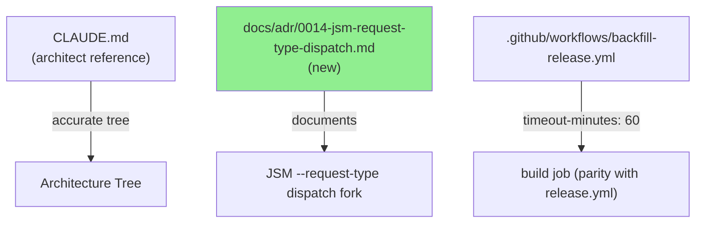
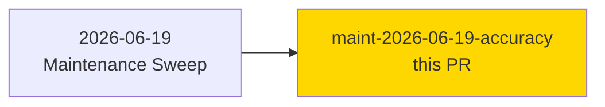
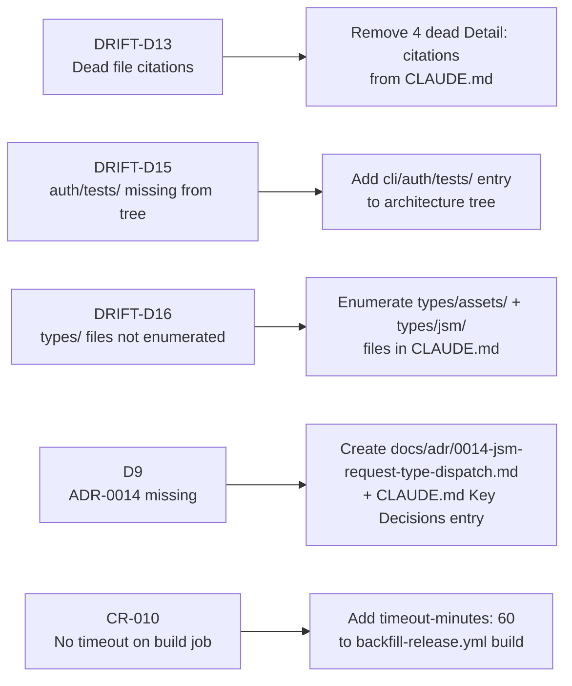
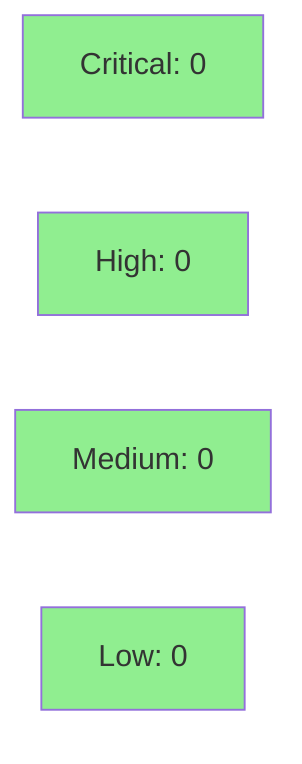

## 2026-06-19 Maintenance Sweep: Doc + CI Accuracy Fixes

**Mode:** maintenance
**Convergence:** CONVERGED — clean local code-review, 0 findings, no src/ changes

This PR delivers 5 accuracy fixes surfaced by the 2026-06-19 maintenance sweep
(`.factory/maintenance/2026-06-19/maintenance-report.md`). There are no behavioral
changes to `src/` code. All changes are to developer-facing documentation (`CLAUDE.md`,
`docs/adr/`) and CI configuration (`.github/workflows/backfill-release.yml`).

---

## Architecture Changes



No production code changed. Three file surfaces modified: CLAUDE.md, docs/adr/0014, .github/workflows/backfill-release.yml.

---

## Story Dependencies



No upstream PR dependencies. No downstream PRs blocked by this fix.

---

## Spec Traceability



---

## Fixes Delivered

| ID | Severity | Description | File(s) |
|----|----------|-------------|---------|
| DRIFT-D13 | HIGH | Removed 4 dead `.factory/research/issue-361-*.md` `Detail:` citations from CLAUDE.md; behavioral prose preserved | `CLAUDE.md` |
| DRIFT-D15 | LOW | Added `cli/auth/tests/` to architecture tree in CLAUDE.md | `CLAUDE.md` |
| DRIFT-D16 | LOW | Enumerated `types/assets/` and `types/jsm/` file listings in CLAUDE.md (previously single-line stubs) | `CLAUDE.md` |
| D9 | LOW | Created `docs/adr/0014-jsm-request-type-dispatch.md` (reconstructed missing ADR for JSM `--request-type` dispatch fork) + added ADR-0014 entry to CLAUDE.md Key Decisions | `docs/adr/0014-jsm-request-type-dispatch.md`, `CLAUDE.md` |
| CR-010 | LOW | Added `timeout-minutes: 60` to `backfill-release.yml` build job for parity with `release.yml` | `.github/workflows/backfill-release.yml` |

---

## Test Evidence

No `src/` code changes — no new tests required. Existing test suite is unaffected.

- **New tests:** 0 added, 0 modified
- **Regressions:** none (no behavioral changes)
- **CI gate:** `ci-gate` (full lint + test suite) must pass

### Coverage Summary

| Metric | Value | Notes |
|--------|-------|-------|
| Unit tests | unchanged | No src/ changes |
| Coverage | unchanged | No src/ changes |
| Mutation kill rate | N/A | No src/ changes |
| Holdout satisfaction | N/A — evaluated at wave gate | |

---

## Holdout Evaluation

N/A — evaluated at wave gate. No behavioral changes; docs-only + CI timeout fix.

---

## Adversarial Review

N/A — evaluated at Phase 5. Local code-review completed pre-PR with 0 findings (CONVERGENCE_REACHED).

---

## Security Review



No `src/` code changes. No secrets, credentials, or executable logic modified.
CI workflow change adds only a `timeout-minutes: 60` guard — no new permissions, no new secrets.
ADR document is prose only.

---

## Risk Assessment & Deployment

### Blast Radius
- **Systems affected:** developer tooling only (CLAUDE.md context window, CI job timeout)
- **User impact:** none — no behavior change in the `jr` binary
- **Data impact:** none
- **Risk Level:** LOW

### Performance Impact

No runtime performance impact. CI build job gains a 60-minute timeout (previously unbounded).

<details>
<summary><strong>Rollback Instructions</strong></summary>

**Immediate rollback (< 2 min):**
```bash
git revert d3312b6
git push origin develop
```

No feature flags. No data migrations. Rollback is purely a git revert.

</details>

### Feature Flags

None — documentation and CI only.

---

## Traceability

| Finding | Fix | Verification | Status |
|---------|-----|-------------|--------|
| DRIFT-D13: dead file citations | Removed 4 `Detail:` lines from CLAUDE.md | Local review — files confirmed absent | PASS |
| DRIFT-D15: auth/tests/ missing | Added tree entry | Local review — `src/cli/auth/tests/` confirmed present in codebase | PASS |
| DRIFT-D16: types/ files not listed | Added file listings | Local review — `types/assets/*.rs` and `types/jsm/*.rs` confirmed present | PASS |
| D9: ADR-0014 missing | Created `docs/adr/0014-jsm-request-type-dispatch.md` | Local review — content derived from CLAUDE.md gotcha + existing code | PASS |
| CR-010: no build timeout | Added `timeout-minutes: 60` | Local review — matches `release.yml` pattern | PASS |

**Sweep report:** `.factory/maintenance/2026-06-19/maintenance-report.md`

---

## AI Pipeline Metadata

<details>
<summary><strong>Pipeline Details</strong></summary>

```yaml
ai-generated: true
pipeline-mode: maintenance
factory-version: "1.0.0"
pipeline-stages:
  maintenance-sweep: completed
  doc-drift-triage: completed
  doc-fixes: completed
  local-review: CONVERGENCE_REACHED (0 findings)
  ci-gate: pending
convergence-metrics:
  local-review-findings: 0
  src-changes: 0
adversarial-passes: 0 (docs-only, no behavioral changes)
total-pipeline-cost: minimal
models-used:
  builder: claude-sonnet-4-6
generated-at: "2026-06-19T00:00:00Z"
```

</details>

---

## Pre-Merge Checklist

- [ ] All CI status checks passing (ci-gate)
- [x] Coverage delta is positive or neutral (no src/ changes)
- [x] No critical/high security findings unresolved
- [x] Rollback procedure validated (git revert d3312b6)
- [x] No feature flags (documentation + CI only)
- [ ] Human review completed
