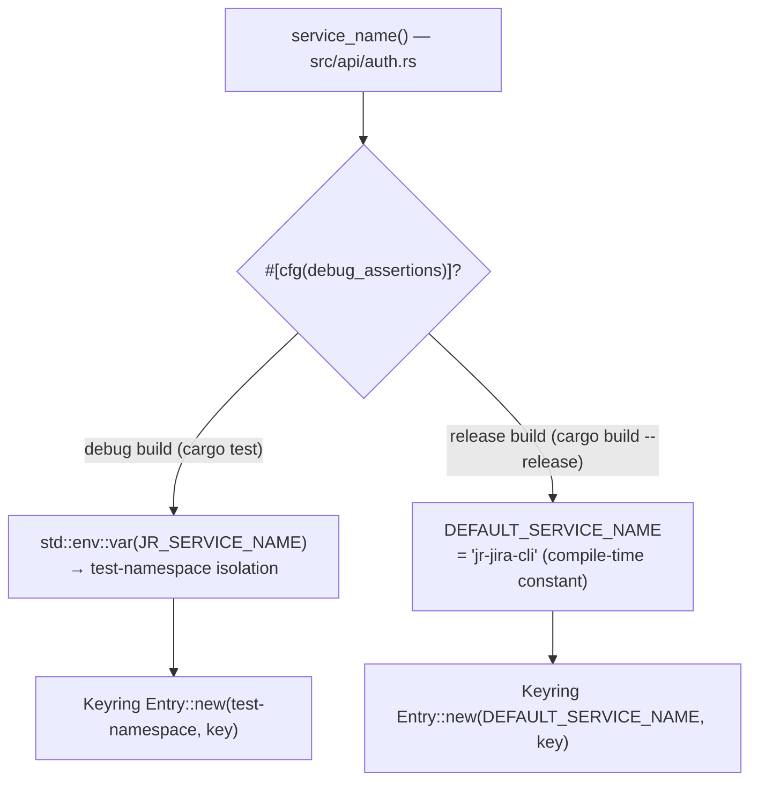
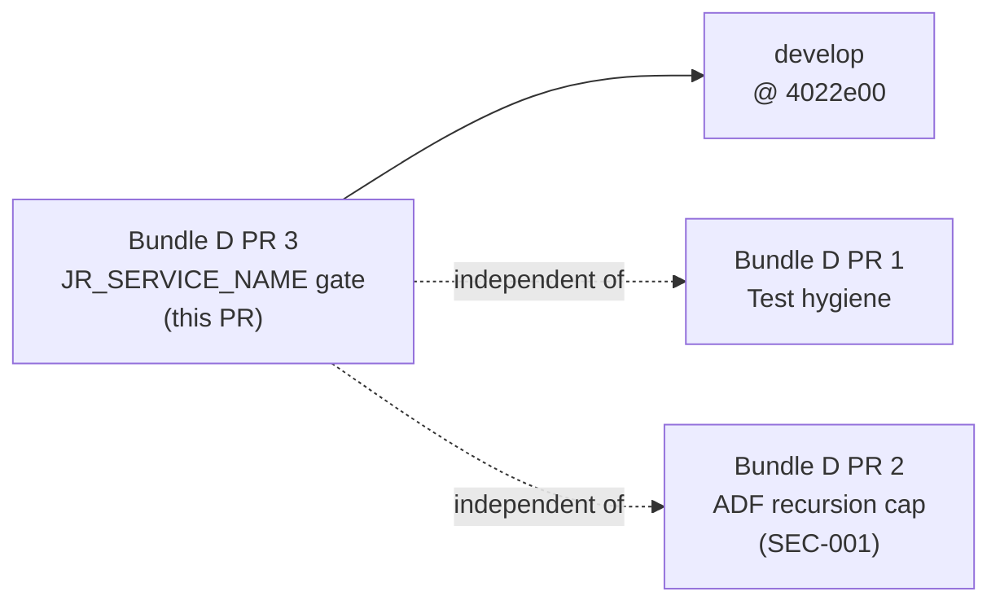
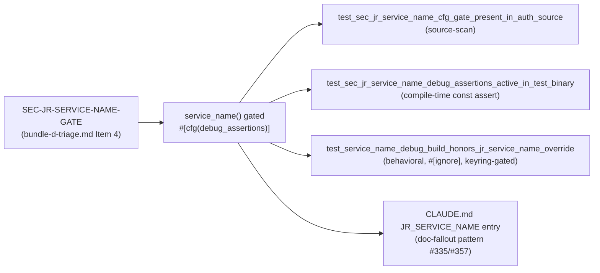

## Summary

Security fix: `JR_SERVICE_NAME` (keyring service-name override) was honored in **release binaries**. An attacker who could set this environment variable could redirect all keychain lookups to a different service namespace — potentially reading credentials from another application's entries, or writing `jr` credentials where they would not be found by a legitimate invocation. This fix gates the env-var read behind `#[cfg(debug_assertions)]`, matching the established pattern for `JR_BASE_URL` (SD-002) and `JR_AUTH_HEADER`.

**Origin:** Maintenance sweep 2026-06-22, Bundle D, drift SEC-JR-SERVICE-NAME-GATE. Triage: `.factory/maintenance/2026-06-22/bundle-d-triage.md` Item 4.

---

## Architecture Changes

**Changed files (3):**
- `src/api/auth.rs` — `service_name()` function: env-var read wrapped in `#[cfg(debug_assertions)]` block; rustdoc updated to explain the gate and its threat model.
- `tests/jr_service_name_release_gate.rs` — new regression-guard test file (2 tests).
- `CLAUDE.md` — `JR_SERVICE_NAME` added to the `JR_*` test-seam env-var list (codified doc-fallout pattern, #335/#357).

---

## Story Dependencies

No blocking dependencies. All Bundle D PRs are independent.

---

## Security Review

### Threat Model

| Attribute | Detail |
|-----------|--------|
| **CWE** | CWE-526 (Cleartext Storage of Sensitive Information in an Environment Variable) + CWE-284 (Improper Access Control) |
| **Attack vector** | Local — requires attacker control of environment variables (compromised shell init, malicious wrapper script, PaaS dashboard env override) |
| **Severity** | LOW–MEDIUM — credential-namespace redirect, not a direct token-leak to an attacker-controlled network endpoint |
| **Affected versions** | All pre-fix release binaries |
| **Threat** | `JR_SERVICE_NAME=some-other-app jr issue list` causes `jr` to read/write keychain entries under `some-other-app` namespace. Could cause (1) `jr` to use attacker-planted credentials, (2) user's freshly-minted OAuth tokens written to an unexpected namespace |

### Fix

The single read site in `src/api/auth.rs::service_name()` is now wrapped in `#[cfg(debug_assertions)]`. Release builds (compiled with `RUSTFLAGS` and `[profile.release]` — which disables `debug_assertions` by default) will emit `DEFAULT_SERVICE_NAME` unconditionally as a compile-time constant. The env-var read literally does not exist in the release binary (dead-code elimination).

### Why `#[cfg(debug_assertions)]` and not `#[cfg(test)]`

`#[cfg(test)]` would gate the override out of keyring integration tests that run as `cargo test` (which compiles with `debug_assertions` ON by default). The keyring integration tests (`oauth_refresh_integration.rs`, `multi_cloudid_disambiguation.rs`, `src/api/auth.rs::with_test_keyring`) use `JR_SERVICE_NAME` for namespace isolation — setting them to `jr-s303-test` or similar so they don't touch the developer's real keychain. `#[cfg(debug_assertions)]` preserves the seam for test builds while excluding it from release builds. This is the same reasoning as `JR_BASE_URL` and `JR_AUTH_HEADER`.

### Completeness

All 3 `Entry::new` call sites in `src/api/auth.rs` call through `service_name()`. There is no secondary or direct `JR_SERVICE_NAME` read anywhere in the codebase. The fix is complete at the single resolver.

### Residual scope (out of this PR)

Keyring entries already written under an overridden service name are not migrated by this fix. The fix prevents **future** release binaries from honoring the redirect; it does not retroactively rename existing entries. Any user who ran `JR_SERVICE_NAME=other jr auth login` with a pre-fix release binary has credentials stored under `other` — they will need to re-authenticate. This is accepted scope.

---

## Spec Traceability

---

## Test Evidence

### Regression-guard tests (`tests/jr_service_name_release_gate.rs`)

| Test | Strategy | CI-gated? |
|------|----------|-----------|
| `test_sec_jr_service_name_cfg_gate_present_in_auth_source` | Source-scan: asserts `#[cfg(debug_assertions)]` within 5 lines of `JR_SERVICE_NAME` read in `src/api/auth.rs` | YES — always runs |
| `test_sec_jr_service_name_debug_assertions_active_in_test_binary` | Compile-time `const { assert!(cfg!(debug_assertions)) }` — proves gate is wired for test builds | YES — always runs (compile-time) |

### Behavioral test (`src/api/auth.rs` inline test mod)

| Test | Strategy | CI-gated? |
|------|----------|-----------|
| `test_service_name_debug_build_honors_jr_service_name_override` | Sets `JR_SERVICE_NAME=jr-test-sec-service-name-gate-sentinel`, calls `service_name()`, asserts returned value matches sentinel | `#[ignore]` — requires `JR_RUN_KEYRING_TESTS=1` |

**Parity:** mirrors the behavioral gate test pattern from `auth_header_release_gate.rs` / `base_url_release_gate.rs`.

### Coverage summary

- Gate present at compile time: pinned by source-scan test (always-run CI)
- Gate active in test builds: pinned by compile-time `const assert` (always-run CI)
- Gate honors override in debug at runtime: pinned by `#[ignore]` behavioral test (opt-in keyring CI)

---

## Risk Assessment

| Dimension | Assessment |
|-----------|-----------|
| **Blast radius** | Single function (`service_name()`) in one file. No public API change. |
| **Performance impact** | None — compile-time dead-code elimination; the release binary executes fewer instructions |
| **Behavior change (release)** | Release binaries no longer honor `JR_SERVICE_NAME`. This is the **intended** fix. No documented production use of this env var. |
| **Behavior change (debug/test)** | None — `#[cfg(debug_assertions)]` is active in `cargo test`, so all keyring integration tests continue to use `JR_SERVICE_NAME` for namespace isolation |
| **Rollback** | Remove the `#[cfg(debug_assertions)]` wrapper; restore original 2-line `service_name()` body |

---

## Holdout Evaluation

N/A — evaluated at wave gate (maintenance bundle; no holdout scenarios for mechanical security gate)

---

## Adversarial Review

N/A — evaluated at Phase 5 (pre-code-review verdict: APPROVE-WITH-NITS → all 3 findings fixed in commit 5f11339)

**Code-reviewer findings (resolved):**

| ID | Finding | Resolution |
|----|---------|-----------|
| CR-001 | Behavioral test missing (gated release-gate tests only prove source structure, not runtime behavior) | Added `test_service_name_debug_build_honors_jr_service_name_override` (behavioral, keyring-gated, parity with auth_header) |
| CR-002 | Behavioral test lacked explicit note about Windows keyring backend requirement | Added inline comment noting Windows Credential Manager requirement (mirrors auth_header_release_gate.rs pattern) |
| CR-003 | CLAUDE.md `JR_SERVICE_NAME` note needed the Windows Credential Manager cross-reference | CLAUDE.md entry updated to include Windows note per the codified doc-fallout pattern |

---

## AI Pipeline Metadata

| Field | Value |
|-------|-------|
| **Pipeline mode** | Maintenance sweep — Bundle D PR 3 |
| **Sweep date** | 2026-06-22 |
| **Triage item** | SEC-JR-SERVICE-NAME-GATE (Item 4 of 5) |
| **Implementation branch** | `fix/jr-service-name-debug-gate` |
| **Base commit** | `4022e00` (develop) |
| **Commits** | `9e61cec` (gate + test + CLAUDE.md), `5f11339` (review nits: behavioral test, window doc, CLAUDE.md note) |
| **Models used** | claude-sonnet-4-6 (coordination), vsdd-factory agents (review) |

---

## Pre-Merge Checklist

- [x] `src/api/auth.rs::service_name()` gated with `#[cfg(debug_assertions)]`
- [x] `tests/jr_service_name_release_gate.rs` added (source-scan + compile-time const assert)
- [x] Behavioral test added in `src/api/auth.rs` inline test mod (keyring-gated, `#[ignore]`)
- [x] `CLAUDE.md` updated — `JR_SERVICE_NAME` entry with gate rationale and Windows note
- [x] All 3 CR review findings resolved (5f11339)
- [x] `cargo build` — GREEN
- [x] `cargo test` — GREEN
- [x] `cargo clippy -- -D warnings` — GREEN
- [x] `cargo fmt --all -- --check` — GREEN
- [ ] CI gate passing (pending)
- [ ] Security reviewer verdict (pending)
- [ ] PR reviewer final verdict (pending)
- [ ] Dependency PRs merged (none — independent)
