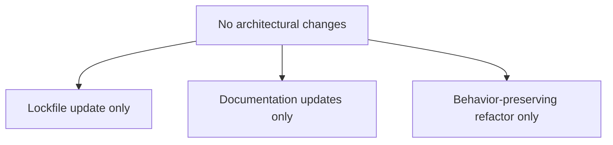
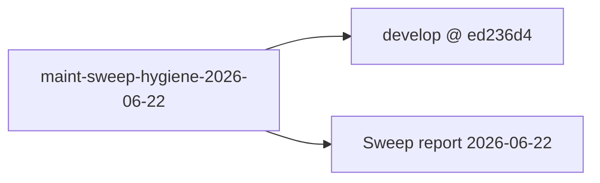
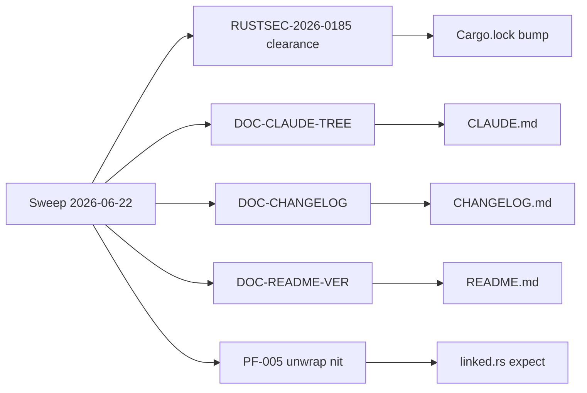

## Summary

Routine maintenance-hygiene bundle from the 2026-06-22 sweep. Zero reachable
critical/HIGH bugs were found; both HIGH-tagged sweep findings were validated
NON-REACHABLE. This PR bundles the **five cheap LOW-hygiene fixes** that were
approved for immediate handling without a full VSDD story cycle:

- Lockfile-only quinn-proto bump (RUSTSEC advisory clearance)
- CHANGELOG [Unreleased] section populated
- README install example pinned to current stable version
- CLAUDE.md architecture tree completed (6 missing mod.rs entries)
- `unwrap()` → `expect()` self-documenting nit in asset enrichment

No public API surface changes. No behavior changes. No new dependencies.

---

## Changes

### 1. `Cargo.lock` — quinn-proto 0.11.14 → 0.11.15 (RUSTSEC-2026-0185)

`cargo audit` flagged **RUSTSEC-2026-0185** (CWE-400, CVSS 7.5 HIGH):
unbounded memory growth in quinn-proto's QUIC stream handling. Security-reviewer
confirmed this is **NON-REACHABLE** in `jr`: the `http3` Cargo feature is not
enabled, quinn is never compiled into the `jr` binary (`cargo tree` returns zero
quinn entries). The bump is a **lockfile-only change** — no `Cargo.toml` edit —
to clear audit noise and keep CI green. Normal routine remediation per sweep
triage.

### 2. `CHANGELOG.md` — populate [Unreleased]

The `[Unreleased]` section was empty despite three merged commits since
v0.6.0-dev.6. Added entries for:
- `verify-signatures` CI fix (merged on develop @ ed236d4)
- `codecov/codecov-action` 6.0.1 → 7.0.0 (#519)
- `insta` 1.47.2 → 1.48.0 (#541)
- `quinn-proto` 0.11.14 → 0.11.15 (this PR)

Commit 958779d added the quinn-proto entry after the internal code-reviewer
raised CR-001 (changelog completeness nit) in their initial pass.

### 3. `README.md` — install.sh pinned-version example v0.3.0 → v0.5.0

The quick-install shell example in the README was pinned to v0.3.0. The
current stable release is v0.5.0. Updated the example URL so new users copy a
version that actually exists and is current.

### 4. `CLAUDE.md` — architecture tree: 6 missing mod.rs entries

The source-tree diagram in CLAUDE.md omitted the `mod.rs` dispatch files for
six module directories:
- `src/cli/assets/mod.rs`
- `src/cli/auth/mod.rs`
- `src/api/assets/` (workspace.rs through tickets.rs listed but mod.rs absent)
- `src/types/assets/mod.rs`
- `src/types/jira/` (and `src/types/jsm/mod.rs`)

Added the missing entries so the tree matches the actual filesystem layout.

### 5. `src/api/assets/linked.rs` — `unwrap()` → `expect()` (behavior-preserving)

Line ~225 in `enrich_assets` called `.unwrap()` on `assets[idx].id`. The
`needs_enrichment` filter at line ~192 (`a.id.is_some()`) guarantees `id` is
`Some` for every element in the enrichment loop. Changed to
`.expect("id present — needs_enrichment filter guarantees id.is_some()")` so
the invariant is documented at the call site, matching the style of the adjacent
`workspace_id` expect on line ~224. **Zero behavior change** — this path cannot
panic today; the expect message makes a future refactor that breaks the guarantee
immediately obvious.

---

## Architecture Changes

---

## Story Dependencies

No upstream PRs to wait for. Base is `develop`.

---

## Spec Traceability

---

## Test Evidence

**Local gate result: ALL GREEN** (run in worktree before branch push)

| Check | Result |
|-------|--------|
| `cargo build` | PASS |
| `cargo test` | PASS (all unit + integration) |
| `cargo clippy -- -D warnings` | PASS (zero warnings) |
| `cargo fmt --all -- --check` | PASS |
| `cargo audit` | PASS (RUSTSEC-2026-0185 cleared) |

No new tests required: the `unwrap()` → `expect()` change is behavior-preserving
(panics only when the invariant is already violated, which is impossible given the
filter). Lockfile and documentation changes carry no testable runtime behavior.

---

## Demo Evidence

N/A — no observable CLI behavior changed. This PR contains lockfile, documentation,
and behavior-preserving refactor changes only.

---

## Holdout Evaluation

N/A — evaluated at wave gate (no behavior change).

---

## Adversarial Review

N/A — evaluated at Phase 5 (no behavior change).

---

## Security Review

**RUSTSEC-2026-0185** (quinn-proto ≤0.11.14, CWE-400, CVSS 7.5 HIGH):
Unbounded memory growth via QUIC stream handling. Triaged NON-REACHABLE:
- `jr` does not enable the `http3` Cargo feature
- `cargo tree` confirms zero quinn crate entries in the dependency graph
- The advisory affects QUIC server/client code paths; `jr` uses plain HTTP/1.1
  via reqwest with rustls-tls (ADR-0003)

Remediation: routine lockfile bump to quinn-proto 0.11.15. No source code
security changes needed.

No other security findings in this bundle.

---

## Risk Assessment

| Dimension | Assessment |
|-----------|-----------|
| Blast radius | Minimal — lockfile + docs + behavior-preserving nit |
| Performance impact | None |
| Breaking changes | None |
| Rollback | Trivial — revert Cargo.lock to prior state; all other changes are docs |
| Data migration | N/A |

---

## AI Pipeline Metadata

| Field | Value |
|-------|-------|
| Pipeline mode | Maintenance sweep (Path 10) |
| Sweep date | 2026-06-22 |
| Models used | claude-sonnet-4-6 |
| Sweep report | `.factory/maintenance/2026-06-22/sweep-report-2026-06-22.md` |

---

## Pre-Merge Checklist

- [x] PR description matches actual diff
- [x] All local gates pass (build, test, clippy, fmt, audit)
- [x] RUSTSEC-2026-0185 cleared in `cargo audit`
- [x] CHANGELOG [Unreleased] populated
- [x] No behavior changes — docs/lockfile/behavior-preserving refactor only
- [x] No new unsafe code
- [x] No lint suppression added
- [ ] CI (ci-gate) passing
- [ ] PR reviewer approval
