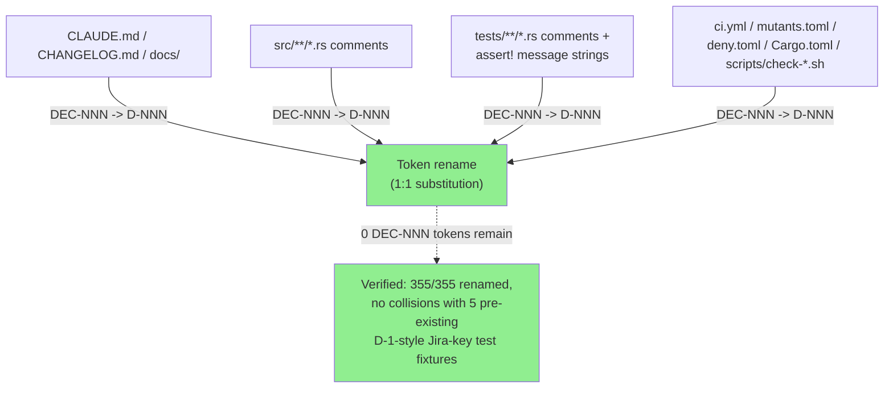
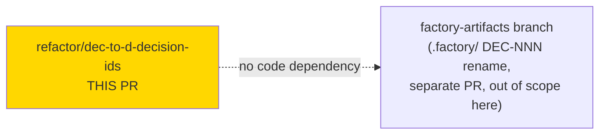
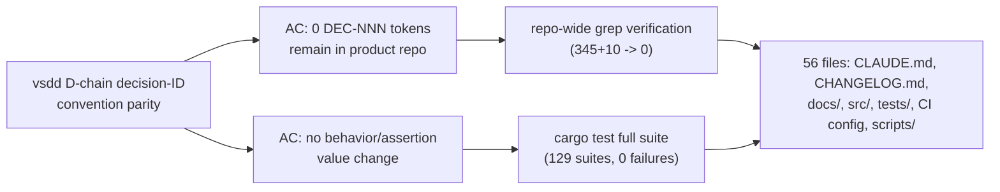
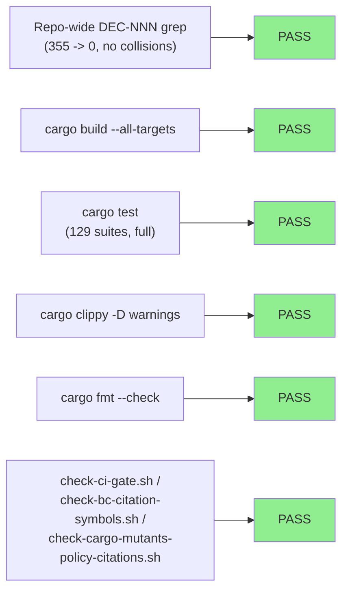
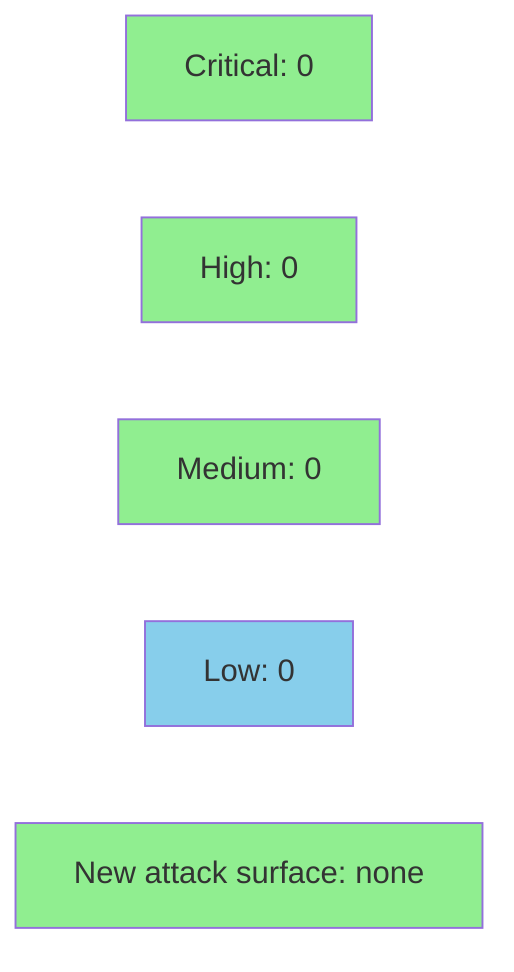

# [refactor/dec-to-d-decision-ids] Rename DEC-NNN decision IDs to D-NNN for vsdd D-chain parity

**Epic:** Documentation / decision-ID governance parity
**Mode:** maintenance
**Convergence:** N/A — mechanical, non-behavioral token rename; no code logic change


Renames every `DEC-NNN` decision-ID token to `D-NNN` (e.g. `DEC-371` → `D-371`) across the product repo, for parity with the vsdd-factory canonical D-chain decision-ID convention. 345 source occurrences + 10 additional occurrences (355 total) renamed to 0 remaining `DEC-NNN` tokens, across 56 files: `CLAUDE.md`, `CHANGELOG.md`, `docs/`, `src/` comments, `tests/*.rs` comments and `assert!` failure-message string arguments, `Cargo.toml`, `deny.toml`, `.cargo/mutants.toml`, `.github/workflows/ci.yml`, and 3 `scripts/check-*.sh` files. The `.factory/` tree is renamed separately on the `factory-artifacts` branch — **out of scope for this PR**.

---

## Architecture Changes



No source logic, function signatures, or asserted runtime values changed. Every renamed occurrence was either a comment or an `assert!`/`panic!` failure-**message** string argument — never an asserted/compared value — so no test assertions or control flow are affected.

<details>
<summary><strong>Architecture Decision Record</strong></summary>

### ADR: Mechanical rename to align with vsdd-factory's D-chain decision-ID convention

**Context:** The product repo used a locally-grown `DEC-NNN` decision-ID convention in comments, docs, and check-script messages. The vsdd-factory engine (the pipeline that drives this repo's delivery) uses a canonical `D-NNN` decision-ID chain. The divergent naming created friction when cross-referencing decisions between the factory's `.factory/` artifacts and the product repo's own docs/comments.

**Decision:** Rename every `DEC-NNN` token to `D-NNN` in the product repo (this PR). The `.factory/` tree's own `DEC-NNN` references are renamed separately on the `factory-artifacts` branch, since that tree is governed by a different merge/ownership path.

**Rationale:** Pure find-and-replace on a stable `DEC-(\d+)` → `D-\1` pattern is unambiguous, mechanical, and safe to verify exhaustively (grep for zero remaining `DEC-NNN` occurrences). Splitting the `.factory/` rename onto its own branch avoids mixing product-repo review with factory-artifact review.

**Alternatives Considered:**
1. Rename in the same PR as the `.factory/` D-chain rename — rejected: mixes two different review/ownership surfaces (product repo vs. factory artifacts) into one diff.
2. Keep `DEC-NNN` in the product repo and only rename in `.factory/` — rejected: leaves the two trees permanently out of sync on decision-ID vocabulary, the friction this rename is meant to resolve.

**Consequences:**
- Product repo and vsdd-factory D-chain now share one decision-ID vocabulary.
- Zero behavior change; zero runtime risk.
- Anyone grepping for an old `DEC-NNN` citation externally (e.g., in an old PR description or issue) will need to translate to `D-NNN` mentally — a one-time, low-cost transition.

</details>

---

## Story Dependencies



No upstream story dependencies in this repo. Companion `.factory/`-tree rename tracked separately on `factory-artifacts` and is independent of this PR (different files, no merge-order requirement).

---

## Spec Traceability



This is a docs/comment rename with no behavioral contract or acceptance criteria beyond the rename itself and a zero-regression bar.

---

## Test Evidence

### Coverage Summary

| Metric | Value | Threshold | Status |
|--------|-------|-----------|--------|
| `DEC-NNN` occurrences remaining | 0 (345 + 10 renamed) | 0 | PASS |
| `cargo build --all-targets` | Success | Build passes | PASS |
| `cargo test` (full suite) | 0 failures, 129 suites | 100% | PASS |
| `cargo clippy --all-targets -- -D warnings` | 0 warnings | 0 warnings | PASS |
| `cargo fmt --all -- --check` | No diff | Clean | PASS |
| `check-ci-gate.sh` self-test | PASS | PASS | PASS |
| `check-bc-citation-symbols.sh` self-test | PASS | PASS | PASS |
| `check-cargo-mutants-policy-citations.sh` self-test | PASS | PASS | PASS |
| `ci_gate_completeness` | 101/101 | 101/101 | PASS |
| `ci.yml` YAML validity | Valid | Valid | PASS |

### Test Flow



| Metric | Value |
|--------|-------|
| **New tests** | 0 added (mechanical rename, no new logic) |
| **Total suite** | 129 suites PASS, 0 failures |
| **Coverage delta** | 0% (no logic changed — only comments and message strings) |
| **Mutation kill rate** | N/A — no `src/` logic diff lines to mutate; all diff hunks are comments or string literals |
| **Regressions** | None |

<details>
<summary><strong>Verification Commands Run (per implementer, pre-PR)</strong></summary>

```bash
# Repo-wide rename verification: 345 + 10 DEC-NNN occurrences -> 0 remaining, clean 1:1 substitution,
# no collisions with 5 pre-existing unrelated D-1-style Jira-key fixtures in tests/
grep -r "DEC-[0-9]" --include="*.rs" --include="*.md" --include="*.toml" --include="*.yml" --include="*.sh" .  # 0 matches
cargo build --all-targets              # PASS
cargo test                             # PASS (0 failures, 129 suites)
cargo clippy --all-targets -- -D warnings  # PASS
cargo fmt --all -- --check             # PASS
scripts/check-ci-gate.sh --self-test           # PASS
scripts/check-bc-citation-symbols.sh --self-test  # PASS
scripts/check-cargo-mutants-policy-citations.sh --self-test  # PASS
cargo test ci_gate_completeness        # 101/101 PASS
```

Every occurrence was independently verified to be a comment or an `assert!`/`panic!` failure-message string argument — never an asserted/compared value — so the rename cannot change test outcomes.

</details>

---

## Holdout Evaluation

N/A — evaluated at wave gate. This PR contains no feature or behavioral change; it is a token rename in comments, docs, and message strings.

---

## Demo Evidence

N/A — skipped, same pattern as a dependency-bump PR. There is no user-facing behavior, CLI output, or UI surface to demonstrate: this PR renames `DEC-NNN` decision-ID tokens to `D-NNN` in comments, docs, and `assert!`/`panic!` failure-message strings only. No `jr` command, flag, output shape, or exit code changes, so there is nothing to record per-AC and no `docs/demo-evidence/<STORY-ID>/` directory applies.

---

## Adversarial Review

N/A — evaluated at Phase 5. This is a mechanical, verifiable-by-grep rename with no new logic surface to adversarially review.

---

## Security Review



N/A — no security surface. This PR touches only comments, documentation prose, CI YAML *comments/labels* (not job logic), `assert!`/`panic!` message strings, and script *messages* — never parsed values, control flow, credentials, network calls, or user-facing command behavior. Skipped with this justification, consistent with the dependency-bump-PR pattern for changes with no code-logic delta.

---

## Risk Assessment & Deployment

### Blast Radius

- **Systems affected:** None at runtime — comments, docs, and message/log strings only
- **User impact:** None — `jr` CLI behavior, output, and exit codes are byte-for-byte unchanged
- **Data impact:** None
- **Risk Level:** VERY LOW (verified zero-behavior-change mechanical rename, full test suite green)

### Performance Impact

| Metric | Before | After | Delta | Status |
|--------|--------|-------|-------|--------|
| Build time | baseline | baseline | ~0 | OK |
| Binary size | baseline | baseline | ~0 | OK |
| Runtime behavior | unchanged | unchanged | none | OK |

No performance impact expected from a comment/string-literal rename.

<details>
<summary><strong>Rollback Instructions</strong></summary>

**Immediate rollback (< 1 min):**
```bash
git revert fe35162b 82758d25
git push origin develop
```

**Verification after rollback:**
- `cargo build && cargo test` succeed
- `DEC-NNN` tokens reappear (expected, this is the pre-rename state)

</details>

### Feature Flags

None — no feature flags involved in a documentation/comment rename.

---

## Traceability

| Requirement | Verification | Status |
|-------------|-------------|--------|
| All `DEC-NNN` tokens renamed to `D-NNN` (product repo scope) | Repo-wide grep: 355 -> 0 remaining | PASS |
| No collision with existing `D-1`-style Jira-key fixtures | Manual review of 5 pre-existing fixtures — no overlap | PASS |
| No asserted/compared test values changed | Manual review: every occurrence is a comment or failure-message string | PASS |
| No behavior regression | `cargo build`, `cargo test` (129 suites), `cargo clippy -D warnings`, `cargo fmt --check` | PASS |
| CI-gate machinery self-tests still pass | `check-ci-gate.sh`, `check-bc-citation-symbols.sh`, `check-cargo-mutants-policy-citations.sh`, `ci_gate_completeness` (101/101) | PASS |
| `.factory/` tree D-chain rename | Tracked separately on `factory-artifacts` branch — **out of scope for this PR** | N/A here |

---

## AI Pipeline Metadata

<details>
<summary><strong>Pipeline Details</strong></summary>

```yaml
ai-generated: true
pipeline-mode: maintenance
factory-version: "1.0.0"
pipeline-stages:
  mechanical-rename: completed
  local-verification: completed
  pr-creation: in-progress
convergence-metrics:
  dec-nnn-occurrences-remaining: 0
  occurrences-renamed: 355
  src-logic-lines-changed: 0
total-pipeline-cost: minimal
models-used:
  builder: claude-sonnet-5
generated-at: "2026-09-19"
```

</details>

---

## Pre-Merge Checklist

- [ ] All CI status checks passing (especially `ci-gate`, full test matrix)
- [x] Coverage delta is positive or neutral (0 — comment/string-only change)
- [x] No critical/high security findings unresolved (N/A — no security surface)
- [x] Rollback procedure validated (`git revert fe35162b 82758d25`)
- [x] No feature flags required
- [ ] Human review completed (repo policy: `quality_gate.auto_merge=false` — human admin-merges; this PR is NOT to be auto-merged)
- [x] No monitoring alerts needed (no production behavior change)
