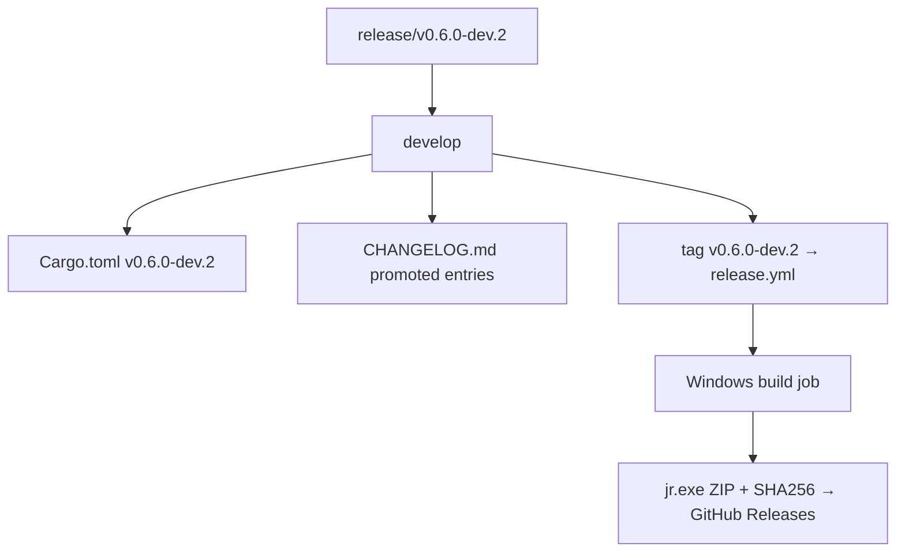
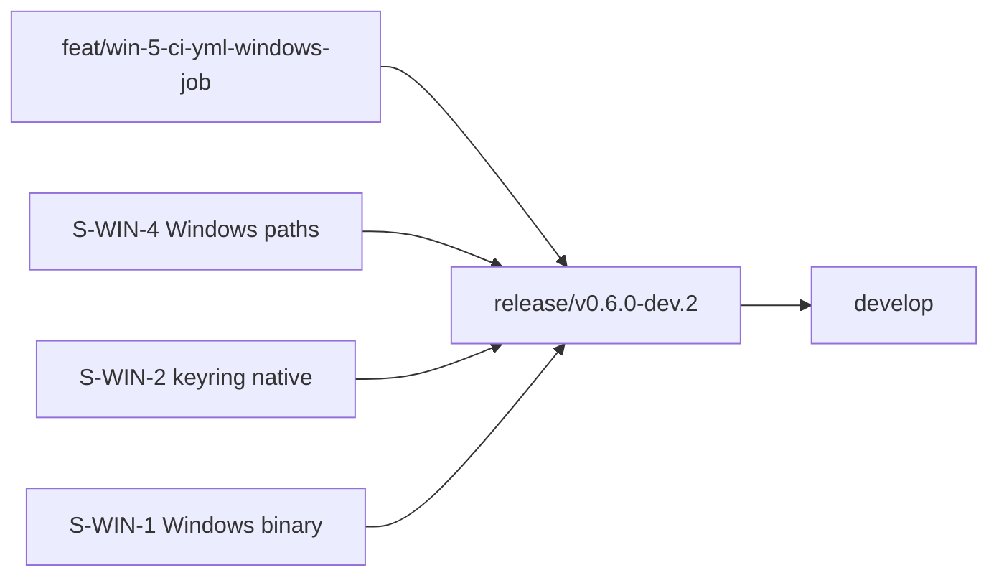
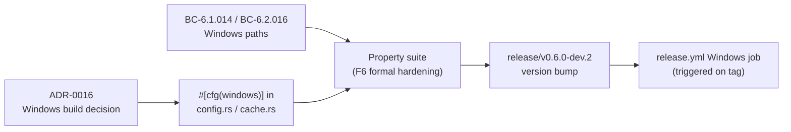

## chore(release): v0.6.0-dev.2

This PR bumps the version from `0.6.0-dev.1` to `0.6.0-dev.2` and promotes the four
Windows-build CHANGELOG entries from `[Unreleased]` into the new `## [0.6.0-dev.2] - 2026-06-14`
section. No source-logic changes are included — this is a release-prep commit only.

---

### What's in this release

Merging this PR and tagging `v0.6.0-dev.2` will trigger `release.yml`'s **first real
Windows build**: the `windows-latest` release job will compile `jr.exe`, package it as
`jr-0.6.0-dev.2-x86_64-pc-windows-msvc.zip` via PowerShell `Compress-Archive`, generate
a SHA-256 checksum file, and upload both to GitHub Releases alongside the existing Unix
`.tar.gz` artifacts.

Branch protection on `develop` requires all matrixed CI contexts (ubuntu + windows for
both clippy and test) to pass before merge.

---

### CHANGELOG entries promoted (from [Unreleased] → [0.6.0-dev.2])

- **Windows pre-built binary:** `jr-<version>-x86_64-pc-windows-msvc.zip` (containing
  `jr.exe`) is now published to GitHub Releases alongside the existing Unix `.tar.gz`
  artifacts. Packaged via PowerShell `Compress-Archive`; SHA-256 checksum file included.
  (ADR-0016)

- **Windows credential storage:** The `keyring` crate's `windows-native` feature is
  enabled, storing OAuth tokens and API tokens in Windows Credential Manager
  (`CRED_TYPE_GENERIC`). Prior to this change the keyring crate silently used a null
  backend on Windows, losing credentials across invocations. (ADR-0016, Decision 5b)

- **Idiomatic Windows config/cache paths:** On Windows, `jr` now resolves config to
  `%APPDATA%\jr` (`dirs::config_dir()`) and cache to `%LOCALAPPDATA%\jr`
  (`dirs::cache_dir()`). Unix paths (`~/.config/jr`, `~/.cache/jr/v1/<profile>/`)
  are unchanged. (BC-6.1.014, BC-6.2.016, ADR-0016 Decision 4)

- **Windows CI coverage:** `windows-latest` is added to both the `clippy` and `test`
  job matrices in `ci.yml`, providing per-PR regression protection for the
  `#[cfg(windows)]` code paths in `src/config.rs` and `src/cache.rs`. (ADR-0016,
  Decision 3)

---

### Diff scope

| File | Change |
|---|---|
| `Cargo.toml` | version `0.6.0-dev.1` → `0.6.0-dev.2` |
| `Cargo.lock` | version field updated to match |
| `CHANGELOG.md` | Moved 4 entries from `[Unreleased]` to new `[0.6.0-dev.2]` section; fresh empty `[Unreleased]` at top |

---

### Architecture Changes

---

### Story Dependencies

All upstream feature branches are already merged into `develop` (at commit `fac555f`).
This PR carries only the release-version bump.

---

### Spec Traceability

---

### Test Evidence

- `cargo build` clean on commit `2d74964`
- `cargo fmt --check` clean on commit `2d74964`
- All Windows-feature tests shipped in prior feature commits (F3-F6 cycle)
- CI matrix includes `windows-latest` clippy + test contexts (required for develop merge)

---

### Security Review

N/A — version-bump + CHANGELOG promotion only; no source logic changes, no new
dependencies, no API surface changes.

---

### Risk Assessment

- **Blast radius:** Minimal — version string and CHANGELOG only
- **Performance impact:** None
- **Rollback:** Revert the bump commit; no schema or API changes to unwind
- **Tag risk:** Once tagged `v0.6.0-dev.2`, release.yml fires the Windows job; if
  that job fails, a patch release (`v0.6.0-dev.3`) would be needed

---

### AI Pipeline Metadata

- Pipeline mode: Release prep (version bump + CHANGELOG)
- Feature cycle: Windows-build, F1-F7 VSDD converged, human-authorized
- Branch: `release/v0.6.0-dev.2` @ `2d74964`
- Base: `develop` @ `fac555f`

---

### Pre-Merge Checklist

- [x] Version bump verified (`Cargo.toml` + `Cargo.lock`)
- [x] CHANGELOG section created with correct date `2026-06-14`
- [x] `[Unreleased]` section reset to empty
- [x] `cargo build` clean
- [x] `cargo fmt --check` clean
- [ ] CI green (all matrix contexts)
- [ ] PR review approved
- [ ] All upstream feature PRs merged into `develop`
