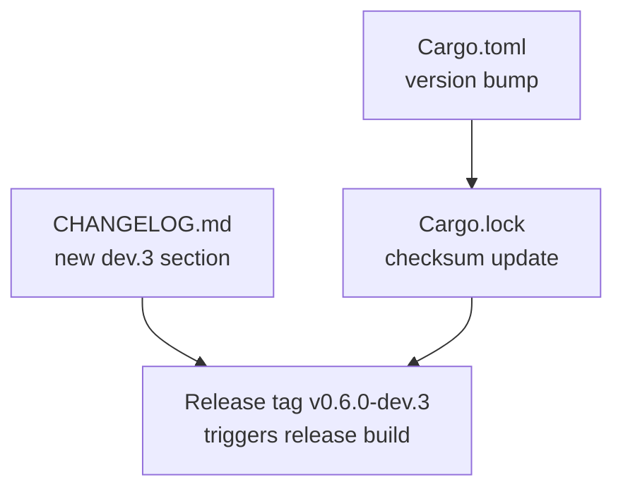
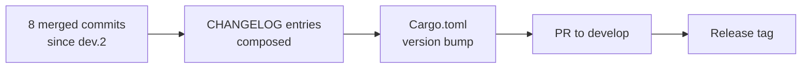

## Summary

Release-prep for `v0.6.0-dev.3`. Diff is exactly 3 files:

- `Cargo.toml` — version `0.6.0-dev.2` → `0.6.0-dev.3`
- `Cargo.lock` — jr package version line updated
- `CHANGELOG.md` — new `## [0.6.0-dev.3] - 2026-06-18` section composed from the 8 commits merged since the last dev tag

No product source code changes in this PR. The tag `v0.6.0-dev.3` will be pushed after this merges to trigger the release build.

## What's in this release

### Fixed

- **`jr issue comments` anti-stall pagination guard (S-525, BC-2.4.043, #531):** `list_comments` now carries the same non-advancing-offset guard that `get_changelog` uses — infinite-loop on repeated `nextPageToken` (JRACLOUD-95368 pattern) is detected and aborted with an error.
- **ADF CR/LF normalization across `push_text`/`push_code`/`text_to_adf` (#522, #523):** Multi-line inline HTML in `--description` or comments no longer causes HTTP 400. The ADF text-node invariant (no raw `\r`/`\n`) is now enforced at the chokepoint level — in non-codeBlock context both sequences are mapped to a single space.
- **ADF block-HTML interior newlines as `hardBreak` nodes (#492):** `markdown_to_adf` now applies Algorithm B to `Tag::HtmlBlock` — multi-line block HTML is split on line boundaries and emitted as alternating `text`/`hardBreak` nodes instead of raw `\n` characters that Jira rejected with HTTP 400.

### Changed (user-visible)

- **`jr issue create --request-type` and `jr project fields` now emit pretty-printed JSON (#526, #527):** All `--output json` paths are routed through `output::render_json`. Scripts that did byte-exact comparison against compact output will need updating; `jq` and whitespace-insensitive parsers are unaffected.

### Internal / CI

- **CI Gate aggregator job (S-CIGATE-1, #533):** `ci-gate` is now the single required branch-protection status check on `develop`/`main`. New required CI jobs must be added to `ci-gate.needs`.
- **Opt-in release operations workflows (inert by default):** Four new GitHub Actions workflows for Apple binary signing, release backfill, gap-fill, and fork sync — all no-ops unless repository variables are set.
- **`write_cmdb_fields_cache` / `write_object_type_attr_cache` model-b error handling (S-525/CR-007):** Cache disk-write errors are now swallowed with a warning rather than propagated, so a failed cache write never breaks a successful API call.

## Architecture Changes

## Story Dependencies

No story dependencies. This is a standalone release-prep commit.

## Spec Traceability

## Test Evidence

All tests pass on the underlying commits. This PR contains no source changes — CI validates the repo compiles and tests pass with the new version string.

## Demo Evidence

N/A — release-prep only, no product behavior changes.

## Security Review

N/A — no source code changes. The 3 changed files are a version string, a lock file checksum, and a changelog entry.

## Risk Assessment

- **Blast radius:** Minimal — version string + lock file + changelog only.
- **Performance impact:** None.
- **Rollback:** Revert the squash commit on develop; the tag (pushed post-merge) would need manual deletion.

## AI Pipeline Metadata

- Pipeline mode: release-prep (manual)
- Models used: claude-sonnet-4-6
- Cost: negligible

## Pre-Merge Checklist

- [x] PR description matches actual diff (3 files: Cargo.toml, Cargo.lock, CHANGELOG.md)
- [x] Version bump is correct (0.6.0-dev.2 → 0.6.0-dev.3)
- [x] CHANGELOG date is correct (2026-06-18)
- [x] No product source changes in diff
- [x] Security review: N/A (no source changes)
- [x] Demo evidence: N/A (no behavior changes)
- [x] CI Gate must pass before merge
