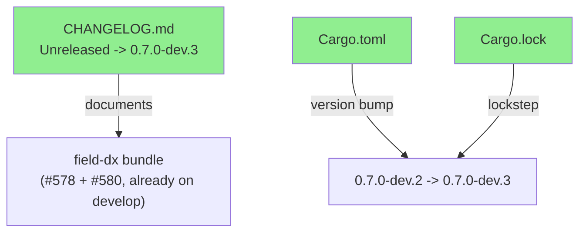
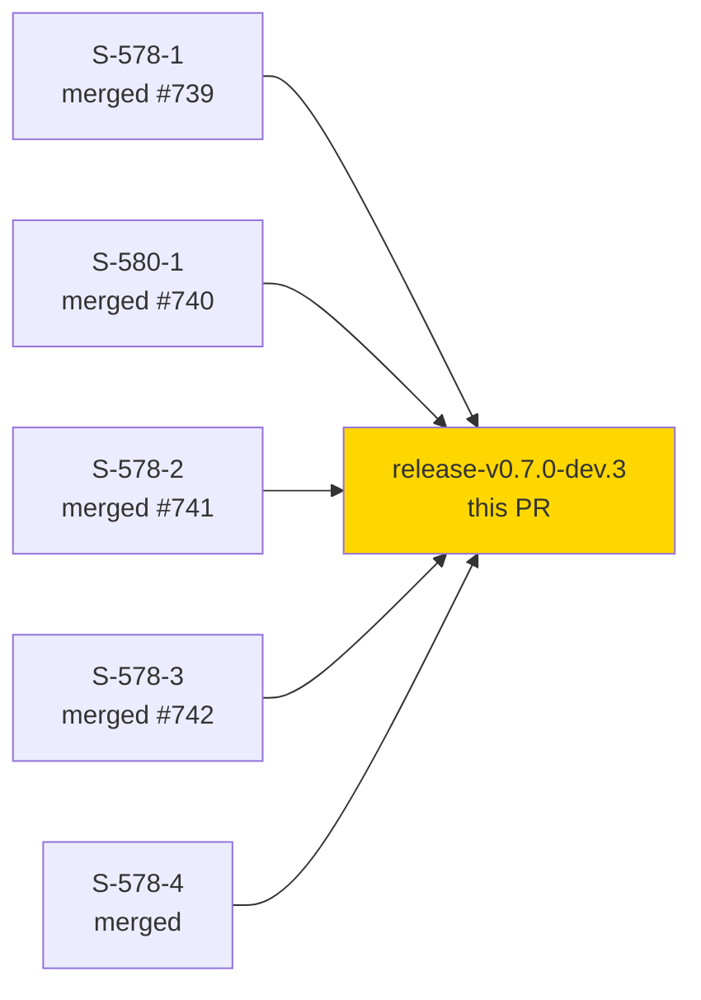
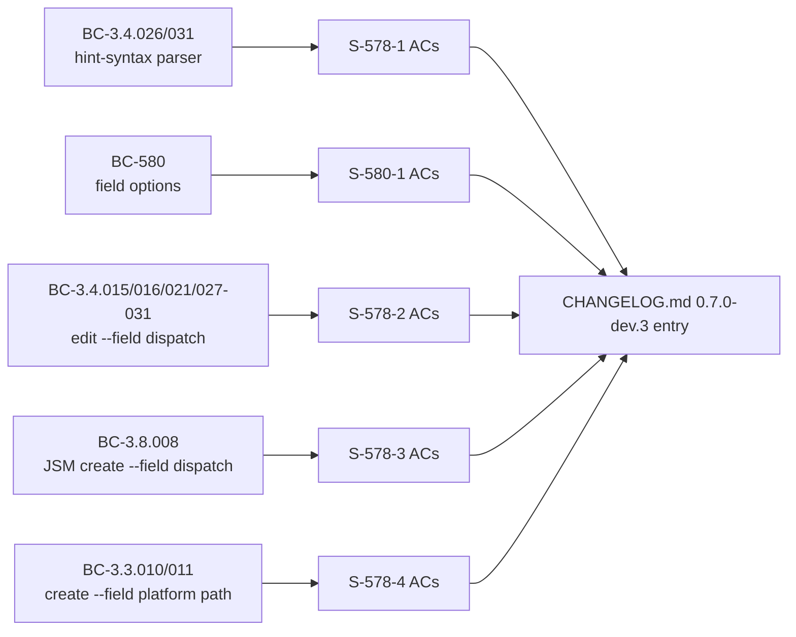

## Summary

Next dev pre-release in the 0.7.0 series. Bumps `Cargo.toml`/`Cargo.lock` from `0.7.0-dev.2` → `0.7.0-dev.3` and promotes the `CHANGELOG.md` `[Unreleased]` section into a dated `[0.7.0-dev.3]` entry documenting the field-dx bundle (issue #578 + #580) landed since `v0.7.0-dev.2`.

### User-facing changes

- **Breaking:** `--field` now parses opt-in `NAME:kind=VALUE` hint syntax (S-578-1, BC-3.4.026/031, #578 part 1, #739) — `parse_field_kv` recognizes a trailing `:option`/`:id`/`:name`/`:asset` kind tag before the `=`.
- **Added:** `jr field options <field>` (S-580-1, BC-580, #578, #740) — lists a field's allowed options via M1/M2/M3 context-mechanism resolution (createmeta/editmeta/JSM requesttype-fields), with `--value` filtering and table/JSON output.
- **Changed:** `issue edit --field NAME:kind=VALUE` now dispatches real resolution for `:option`/`:id`/`:name`/`:asset` (S-578-2, BC-3.4.015/016/021/027-031, #578, #741) — replaces S-578-1's interim exit-64 guard.
- **Changed:** JSM `issue create --field` now dispatches the same kind-hint resolution as `issue edit --field` (S-578-3, BC-3.8.008, #578, #742), including `:asset`'s workspace-scoped CMDB L2 resolution.
- **Changed:** `jr issue create --field NAME=VALUE` (platform, non-JSM path) no longer exits 64 pre-flight — it now resolves via the project's Create screen (`createmeta`) (S-578-4, BC-3.3.010/011, DEC-310 — reverses DEC-188 from S-639-1). `--on-behalf-of` is unchanged (still requires `--request-type`, BC-3.8.013). A new dedicated-flag × `--field` collision guard (D2) rejects a pair that targets the same wire key as a dedicated flag before any HTTP call.

### Internal / CI

- **Fixed:** mutation-test scope gap closed for `src/cli/field.rs` and `src/cli/issue/field_resolve.rs` (FIX-F6-MUTANTS-SCOPE) — both files were omitted from `examine_globs` since creation, so the required `mutants` CI gate generated zero mutants for either file across every field-dx PR to date.
- Hardening fixes from Phase F4→F7 adversarial/formal review rounds (FIX-F5-001, FIX-F6-001, FIX-F7-001) rolled into the shipped stories above (not separately changelogged — behavior already reflected in the bullets above).

This PR itself changes only `CHANGELOG.md`, `Cargo.toml`, and `Cargo.lock` — no source changes. All behavior above already merged to `develop` in prior story/fix PRs (#739–#742 and follow-on hardening PRs); this PR is the release-metadata promotion only.

---

## Architecture Changes

N/A — no architecture change. This PR touches only `CHANGELOG.md`, `Cargo.toml`, and `Cargo.lock`; no component, module, or dependency graph change.



---

## Story Dependencies

All five stories this release documents are already merged to `develop`; this PR has no unmerged story dependencies of its own.



---

## Spec Traceability



This PR's own traceability is release-metadata only: it maps the five already-verified BC chains above into a dated CHANGELOG entry. Full BC->AC->Test->Code chains for each story are documented in their respective merged PRs (#739, #740, #741, #742) and story files under `.factory/stories/`.

---

## Demo Evidence

N/A for this PR — no source changes. The shipped features' demo evidence lives at `.factory/demos/S-578-4/` and in the prior story PRs (#739, #740, #741, #742) that introduced each behavior.

---

## Test Evidence

| Metric | Value |
|--------|-------|
| Diff scope | `CHANGELOG.md`, `Cargo.toml`, `Cargo.lock` (metadata only) |
| Regression suite (pre-existing, at merge of the field-dx stories) | 4660 passed / 0 failed |
| New tests in this PR | 0 (no source change) |

Full field-dx test evidence (per-story unit/integration/mutation results) lives in the individual story PRs (#739–#742) and their respective `.factory/code-delivery/STORY-*/review-findings.md`.

---

## Security Review

N/A — version/CHANGELOG-only diff, no source or dependency changes beyond the `jr` package version string in `Cargo.lock`. No new attack surface introduced by this PR.

---

## Risk Assessment & Deployment

### Blast Radius
- **Systems affected:** none (metadata-only diff: `CHANGELOG.md`, `Cargo.toml`, `Cargo.lock` version bump).
- **User impact:** none from this PR directly; the field-dx behavioral changes it documents already shipped to `develop` in prior PRs.
- **Data impact:** none.
- **Risk Level:** LOW.

<details>
<summary><strong>Rollback Instructions</strong></summary>

**Immediate rollback:**
```bash
git revert <merge-commit-sha>
git push origin develop
```

No feature flags involved; rollback simply un-promotes the CHANGELOG entry and reverts the version string.

</details>

---

## Pre-Merge Checklist

- [x] Diff scoped to `CHANGELOG.md` + `Cargo.toml` + `Cargo.lock` only
- [ ] CI Gate passing (remote)
- [x] No security-relevant changes (version/changelog only)
- [x] Demo evidence N/A — cited prior story demo locations
- [ ] Human/pr-reviewer convergence complete

## Test plan

- [ ] CI Gate passes on this PR (remote, host-contention avoidance — no local cargo run for this PR)
- [ ] pr-reviewer convergence on the 3-file diff
- [ ] After merge, tag `v0.7.0-dev.3` is applied to the merge commit (not done by this PR)

**Not merged. Not tagged.** Awaiting CI + review.

https://claude.ai/code/session_01HfehmaNyT3BaUbsYpAmWEV
