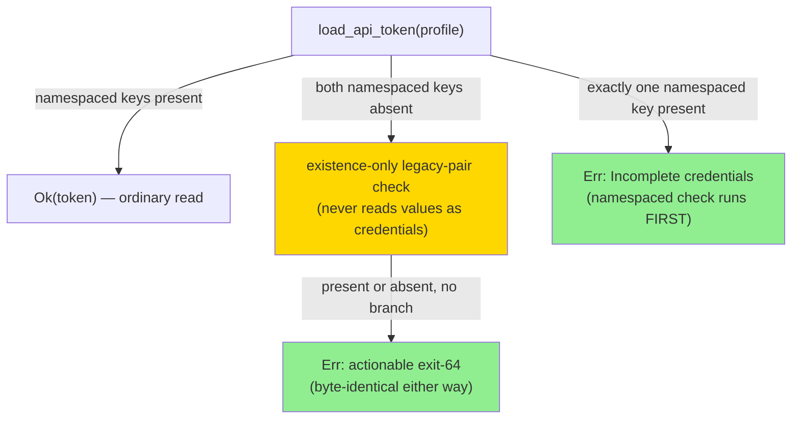
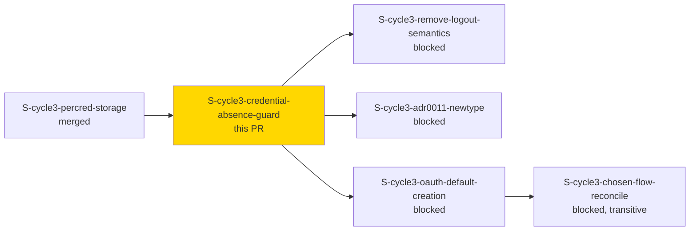
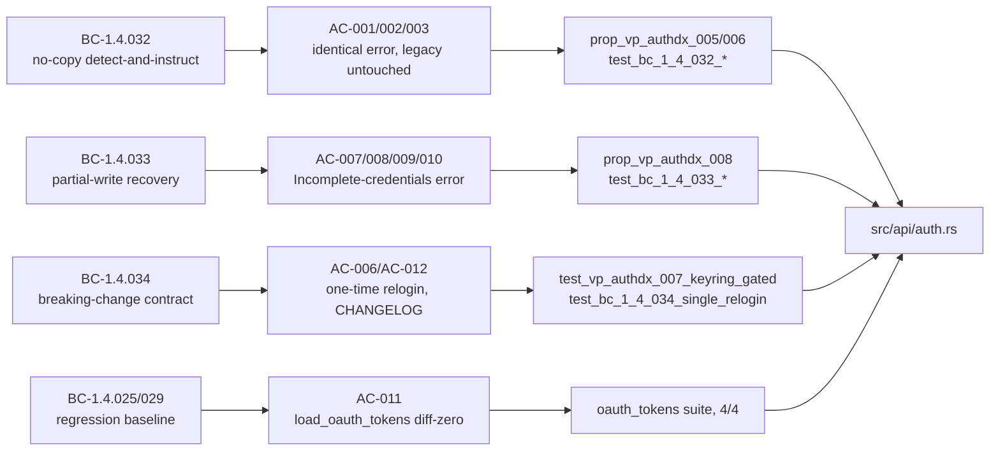

# [S-cycle3-credential-absence-guard] No-copy detect-and-instruct guard for absent per-profile API-token credentials (DEC-326)

**Epic:** AUTH-PROFILE-DX-1 — cycle-003 `auth-profile-dx`
**Mode:** feature
**Wave:** Wave 2 (feature-followup), depends on `S-cycle3-percred-storage`
**Risk:** **HIGH** — the single highest-scrutiny story in cycle-003 (F1 delta analysis §3); a genuinely new code path on the auth-header hot path, and the source of a one-time breaking change every pre-cycle-003 API-token profile will hit.

This PR implements the F2-gate-**redesigned** (DEC-326, human decision) no-copy
detect-and-instruct contract for `load_api_token`'s absent-credential branch in
`src/api/auth.rs`. The legacy shared flat `email`/`api-token` pair is **never**
read as a credential, **never** copied into any profile's namespaced slot, and
**never** deleted — for any profile, including `"default"`. This fully
replaces the original copy-then-delete migration design (which was rejected
at the F2 gate — see ADR-0020 § Decision 2).

---

## Why no-copy, not copy-then-delete

A Basic-auth email/token pair carries no environment binding. Silently
copying it into a freshly `sandbox`/`uat`-tagged profile could hand that
profile the same credential as whatever environment the legacy pair actually
belongs to (in practice, usually production) — a cross-environment credential
leak. DEC-326 rejected copy-then-delete for this reason and mandated a
**detect-and-instruct** guard instead: on absent per-profile credentials, `jr`
exits 64 with an actionable message telling the user to run
`jr auth login <profile>` once. The legacy pair is left completely untouched,
forever — this is a permanent contract, not a transitional one (BC-1.4.032
Invariant 1).



---

## Story Dependencies



---

## Spec Traceability



---

## Behavioral Contracts Delivered

| BC | Status | What this PR delivers |
|----|--------|---------------------------|
| BC-1.4.032 | NEW, REDESIGNED | `load_api_token`'s no-copy detect-and-instruct branch — legacy pair NEVER read/copied/deleted, for ANY profile including `"default"`; identical actionable exit-64 error regardless of legacy-pair presence |
| BC-1.4.033 | NEW, REDESIGNED | Partial-write recovery for the NAMESPACED pair only; corrected remediation message (drops `jr auth logout`, SR-009) |
| BC-1.4.034 | NEW | Formalizes the one-time, per-profile, breaking-change re-login contract |
| BC-1.4.025 | AMENDED | Regression-confirmation clause: `load_oauth_tokens` and its test suite verified byte-for-byte unchanged and green |
| BC-1.4.029 | AMENDED | Cross-reference confirming `load_api_token("sandbox")` never inherits legacy flat keys |

## Verification Properties

- **VP-AUTHDX-005** — detect-and-instruct correctness: `Err` with actionable message regardless of legacy-pair state; legacy bytes unchanged; repeated calls return the same `Err` (no first-call-migrates shape)
- **VP-AUTHDX-006** — no profile is special-cased (proptest generator explicitly includes `"default"`)
- **VP-AUTHDX-007** — MANDATORY `#[ignore]`+`JR_RUN_KEYRING_TESTS=1` end-to-end scenario against the real OS keychain backend
- **VP-AUTHDX-008** — namespaced partial-state property test (2-member set: email-only / token-only)

---

## Test Evidence

### Coverage Summary

| Metric | Value | Status |
|--------|-------|--------|
| `cargo test --lib` (default, keyring-gated tests skipped) | 1242/0/33 | PASS |
| `cargo test --lib -- --include-ignored` with `JR_RUN_KEYRING_TESTS=1` | 1275/0/0 | PASS |
| New/modified tests this PR | 31 new test/proptest functions in `src/api/auth.rs` | — |
| `cargo clippy -- -D warnings` | clean | PASS |
| `cargo fmt --all -- --check` | clean | PASS |
| `cargo build` | clean | PASS |

### AC-011 — Regression baseline (BC-1.4.025, mandatory CI-gate, not incidental)

`load_oauth_tokens`'s existing test suite run in isolation, byte-for-byte
unchanged from before this story:

```
JR_RUN_KEYRING_TESTS=1 cargo test --lib -- --include-ignored --test-threads=1 oauth_tokens
→ 4 passed; 0 failed; finished in 5.01s
```

Full transcript: `.factory/cycles/cycle-003/code-delivery/S-cycle3-credential-absence-guard/demos/AC-011-load-oauth-tokens-regression-baseline.txt`

### Gated keyring integration suite (authoritative evidence for the no-copy invariant)

```
JR_RUN_KEYRING_TESTS=1 cargo test --lib -- --include-ignored --test-threads=1 \
  bc_1_4_032 bc_1_4_033 bc_1_4_034 vp_authdx absence_guard_proptests
→ 14 passed; 0 failed; finished in 46.76s
```

Full transcript: `.factory/cycles/cycle-003/code-delivery/S-cycle3-credential-absence-guard/demos/AC-004-011-gated-keyring-test-suite.txt`

**Note on CI scope:** the keyring-gated tests above are `#[ignore]`+
`JR_RUN_KEYRING_TESTS=1`-gated by repo convention (see CLAUDE.md "Keyring
round-trip tests are gated behind `JR_RUN_KEYRING_TESTS=1` + `#[ignore]`" —
Linux CI may lack secret-service; macOS prompts on novel service names). This
means CI's `ci-gate` does **not** execute them — this is expected, standard
repo behavior for every keyring-touching test, not a coverage gap specific to
this PR. They were run green locally as shown above, with transcripts
preserved as evidence.

---

## Demo Evidence

All 12 acceptance criteria are covered (AC-012, the CHANGELOG entry, is
verified via diff review rather than a runtime demo — noted explicitly as
such in the evidence map, not silently skipped):

`.factory/cycles/cycle-003/code-delivery/S-cycle3-credential-absence-guard/demos/`
- `README.md` — full AC-to-evidence traceability map + safety notes (throwaway keychain/config directories only, real dev keychain never touched, all throwaway items cleaned up and verified removed)
- `AC-001-002-003-cli-detect-and-instruct.txt` — real `jr` binary CLI transcript, both-absent and legacy-present scenarios, showing the actual exit-64 message a user sees
- `AC-004-011-gated-keyring-test-suite.txt` — 14/14 gated keyring tests
- `AC-011-load-oauth-tokens-regression-baseline.txt` — 4/4 regression baseline

(Demo evidence lives on the `.factory/` artifacts path, gitignored in the
feature branch per repo convention — not committed into this PR's diff.)

---

## Security Review

**Status: PASS** (performed locally prior to this PR; not re-run per
dispatch instructions — this section reports that completed review, it does
not re-invoke the security-reviewer agent).

- DEC-326 no-copy guarantee upheld at the code level: no code path in
  `load_api_token` reads the legacy flat pair's values as a credential,
  writes them into a namespaced slot, or deletes them.
- No credential leakage: the legacy-pair check is existence-only — the
  `Some(value)` returned by the presence probe is never used as a credential
  or logged.
- Backend faults propagate correctly: a keychain backend error while
  checking legacy-pair existence is never coerced into the "no stored
  credential" message (BC-1.4.032 Invariant 4).
- No message oracle: the detect-and-instruct error is byte-identical whether
  or not the legacy pair exists — an attacker/observer cannot distinguish
  legacy-pair presence from the error text alone.

---

## Risk Assessment & Deployment

### Blast Radius
- **Systems affected:** `src/api/auth.rs::load_api_token` — the credential-resolution hot path for every command hitting an API-token-authenticated profile.
- **User impact:** **Breaking change (BC-1.4.034).** Every pre-cycle-003 API-token profile loses working auth on first post-upgrade use until the user runs `jr auth login <profile>` exactly once. After that single re-login, the profile is on the new per-profile storage model permanently — no repeat failures.
- **Data impact:** None. No credential is copied, moved, or deleted. The legacy flat `email`/`api-token` pair is left inert in the keychain (cleanup of orphaned legacy keys is explicitly out of this story's scope — recommended as a future follow-up per ADR-0020 § Decision 2).
- **Risk Level:** **HIGH** (per story classification) — new code path on the auth hot path, one-time breaking change affecting every pre-cycle-003 API-token profile, and the cycle's only story carrying a MANDATORY keyring-gated end-to-end VP proven against a real OS backend.

### Rollback
Standard `git revert` of the merge commit on `develop`. No feature flag, no data migration to reverse (nothing was written or deleted by the new code path), no external state to reconcile.

---

## Tracked Follow-up (flagged per story disposition — not silently dropped)

**Wave 1 integration-gate finding (MED), adversary-recommended:** during the
migration window this cycle introduces, `jr auth list` and `jr auth status`
**disagree** about a pre-cycle-003 API-token profile's credential state:
`auth list`'s STATUS column is config-only (`url.is_some()` → `configured`),
while `auth status`'s Credentials line actually probes the keychain via
`load_api_token`. Concretely, a pre-cycle-003 API-token profile shows
`STATUS=configured` in `auth list` but `Credentials: not found` in
`auth status` — the exact detect-and-instruct condition this story surfaces
(BC-1.4.032) is invisible on the `auth list` surface.

This story's file list does not include `src/cli/auth/list.rs`, so making
`auth list`'s STATUS column credential-aware (probing presence the same
existence-only way `auth status` does) does not fit cleanly within this
story's scope per its explicit disposition instructions. **This is flagged
here as an explicit tracked follow-up** — candidate: fold into a later
cycle-003 story, or a new standalone follow-up story, to make `auth list`
and `auth status` agree during the migration window. It is out of scope for
this PR and must not be silently dropped.

(Separately, and unrelated: a Wave 1 LOW finding noted `auth status` can
transitively trigger the pre-existing OAuth `"default"`-profile lazy
migration write via `load_oauth_tokens` — that is pre-existing OAuth
behavior, out of scope for cycle-003, and unrelated to the MED finding
above.)

---

## Files Changed

| File | Change |
|------|--------|
| `src/api/auth.rs` | `load_api_token`'s no-copy detect-and-instruct branch + namespaced-partial-write branch + 31 new tests/proptests |
| `CHANGELOG.md` | `[Unreleased] > Changed` (Breaking) entry per BC-1.4.034 F4 doc-fallout obligation (AC-012) |
| `docs/specs/multi-profile-auth.md` | Migration-notes note describing the one-time re-login requirement |

---

## Pre-Merge Checklist

- [x] `cargo test --lib` full suite green (1242/0/33)
- [x] Gated keyring suite green (1275/0/0 with `--include-ignored`)
- [x] `cargo clippy -- -D warnings` clean
- [x] `cargo fmt --all -- --check` clean
- [x] Regression baseline: `load_oauth_tokens` suite byte-for-byte unchanged, 4/4 green (AC-011, BC-1.4.025)
- [x] CHANGELOG breaking-change entry present (AC-012)
- [x] Doc-fallout note added to `docs/specs/multi-profile-auth.md`
- [x] Security review: PASS (DEC-326 no-copy upheld, no leakage, backend faults propagate, no message oracle)
- [x] Demo evidence: all 12 ACs covered
- [x] Tracked follow-up (Wave 1 MED finding on `auth list`/`auth status` disagreement) explicitly flagged above, not dropped
- [ ] AI review (pr-reviewer) convergence
- [ ] CI `ci-gate` green

https://claude.ai/code/session_01Uh9YGt693bei72go974dA6
