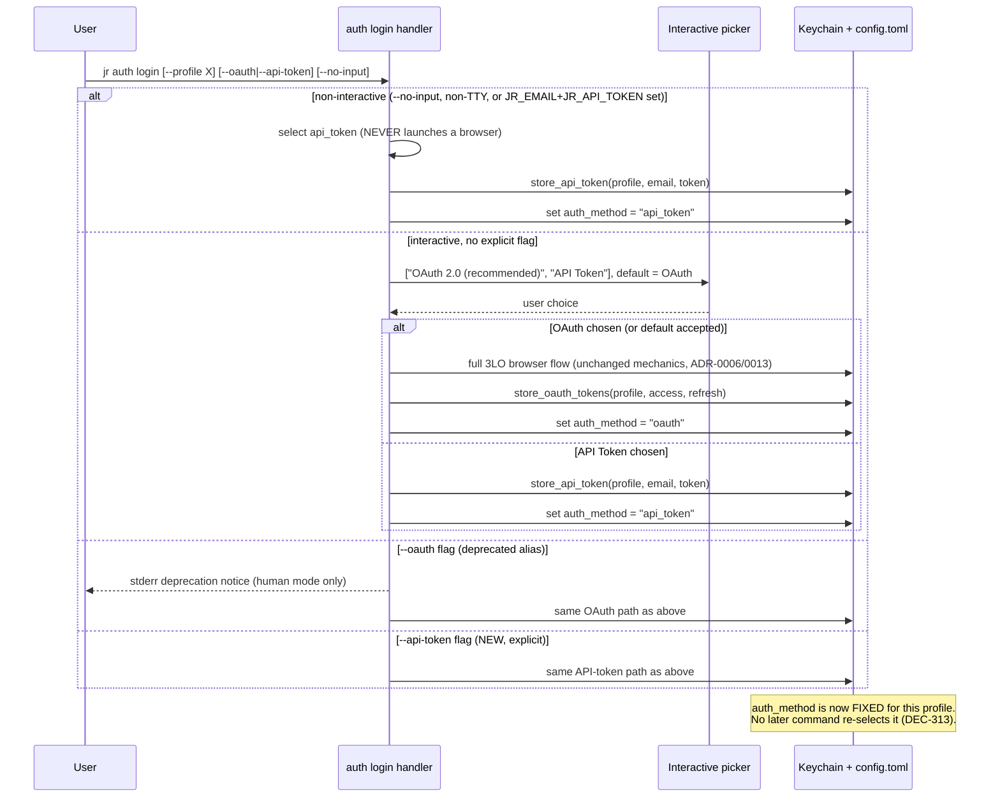
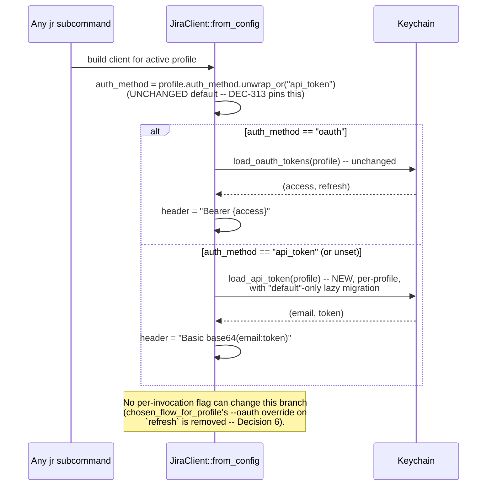
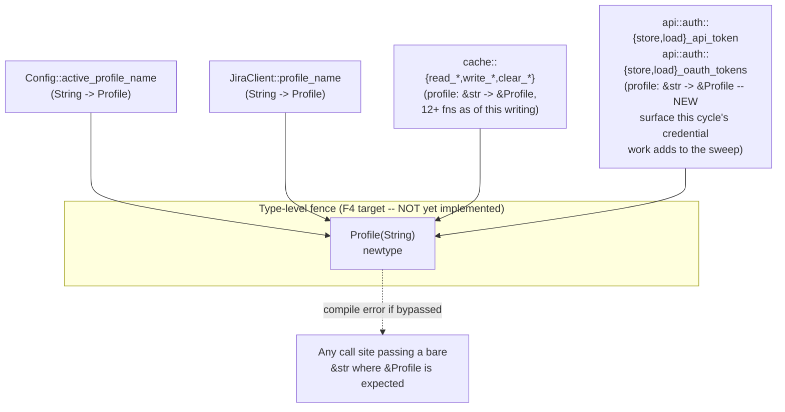

# Architecture Delta — Per-Profile Auth & Credential Ownership (`auth-profile-dx`)

This document covers the concrete architectural shape for cycle-003's `auth-profile-dx`
bundle (DEC-312..DEC-317; DEC-318/DEC-319 rejected/deferred and out of scope here). It is
structured as a delta: only what changes from today's architecture is described. The
decisions themselves — and their rationale, alternatives, and breaking-change
acknowledgments — live in `ADR-0020-per-profile-credential-ownership-env-tagging-and-oauth-default-at-creation.md`
and the amended `docs/adr/0011-type-level-profile-fence.md`; this document provides the
"how," concrete enough for the product-owner's parallel F2 BC-authoring pass and for F4
implementers to proceed without re-deriving the design.

No `src/` file has been touched by this document. All code shapes below are TARGET design,
not current state, unless explicitly marked "Current."

---

## 1. Component / Data-Flow Overview

### 1.1 Current State (baseline)

```mermaid
flowchart LR
    subgraph Keychain["System Keychain (service: jr-jira-cli)"]
        SharedCred["email / api-token\n(SHARED, flat — one pair\nfor the whole keychain)"]
        OAuthPair["&lt;profile&gt;:oauth-access-token\n&lt;profile&gt;:oauth-refresh-token\n(PER-PROFILE, namespaced)"]
        LegacyOAuth["oauth-access-token\noauth-refresh-token\n(legacy flat, default-only\nlazy-migrated into OAuthPair)"]
    end

    subgraph Config["config.toml"]
        Profile["[profiles.&lt;name&gt;]\nauth_method, url, cloud_id, ..."]
    end

    LoginCmd["jr auth login\n(bare -> api_token;\n--oauth -> OAuth)"] -->|writes| SharedCred
    LoginCmd -->|writes| OAuthPair
    LoginCmd -->|sets auth_method| Profile

    InitCmd["jr init\n(interactive picker,\nOAuth default)"] -.->|same login fns| LoginCmd

    Profile -->|auth_method read| FromConfig["JiraClient::from_config\nunwrap_or(\"api_token\")"]
    FromConfig -->|api_token| SharedCred
    FromConfig -->|oauth| OAuthPair
    LegacyOAuth -.->|lazy migrate, default only| OAuthPair
```

**Current problem this cycle fixes:** `SharedCred` has no per-profile scoping at all — every
profile's `api_token` auth_method reads the SAME email/token pair, so a `sandbox` profile and
a `prod` profile silently authenticate as the same Jira account if both use API-token auth.
`OAuthPair` already got this right when multi-profile support landed; `SharedCred` never did.

### 1.2 Target State (this cycle)

```mermaid
flowchart LR
    subgraph Keychain["System Keychain (service: jr-jira-cli)"]
        PerProfileToken["&lt;profile&gt;:email\n&lt;profile&gt;:api-token\n(PER-PROFILE, namespaced — NEW)"]
        OAuthPair["&lt;profile&gt;:oauth-access-token\n&lt;profile&gt;:oauth-refresh-token\n(PER-PROFILE, unchanged)"]
        LegacyFlat["email / api-token\n(legacy flat — default-only\nlazy-migrated, then deleted)"]
        LegacyOAuth["oauth-access-token\noauth-refresh-token\n(legacy flat, unchanged\nmigration, untouched)"]
        SharedApp["oauth_client_id\noauth_client_secret\n(SHARED — BYO OAuth APP\ncreds, unchanged, different axis)"]
    end

    subgraph Config["config.toml"]
        Profile["[profiles.&lt;name&gt;]\nauth_method (intrinsic, set once)\nenv: Option&lt;String&gt; (NEW, additive)\nurl, cloud_id, ..."]
    end

    LoginCmd["jr auth login\nbare/interactive -> OAuth default (NEW)\n--no-input / JR_EMAIL+JR_API_TOKEN -> api_token\n--api-token (NEW flag) / --oauth (deprecated alias)"]
    LoginCmd -->|writes per-profile| PerProfileToken
    LoginCmd -->|writes per-profile| OAuthPair
    LoginCmd -->|sets auth_method once| Profile

    InitCmd["jr init\n(unchanged, still the\nreference OAuth-default model)"] -.->|same login fns| LoginCmd

    Profile -->|auth_method read, UNCHANGED default| FromConfig["JiraClient::from_config\nunwrap_or(\"api_token\") -- NOT flipped"]
    FromConfig -->|api_token| PerProfileToken
    FromConfig -->|oauth| OAuthPair

    LegacyFlat -.->|lazy migrate, default only,\nmirrors OAuth pattern -- NEW| PerProfileToken
    LegacyOAuth -.->|lazy migrate, default only,\nunchanged| OAuthPair

    RefreshCmd["jr auth refresh\n--oauth/--api-token now INERT\naliases (NEW) -- always follows\nProfile's own auth_method"] -->|clear + relogin| LoginCmd

    RemoveCmd["jr auth remove\n(4th delete step -- NEW)"] -->|deletes| PerProfileToken
    RemoveCmd -->|deletes| OAuthPair
    LogoutCmd["jr auth logout\n(OAuth-only, UNCHANGED --\nno api_token behavior by design)"] -->|deletes only| OAuthPair
```

Legend: solid arrows are unconditional data flow; dashed arrows are conditional/one-time
(migration) or reference (same underlying function) relationships.

---

## 2. Auth-Mechanism-Selection Flow: Creation-Time vs. Runtime

Two genuinely different decision points exist, and DEC-313's "intrinsic property" framing
depends on keeping them cleanly separated:

### 2.1 Creation-time selection (`jr auth login`, `jr init`)



### 2.2 Runtime header selection (every HTTP call)



**Why these stay separate diagrams, not one:** creation-time selection is a one-time,
interactive-or-flag-driven WRITE to `auth_method`; runtime selection is a READ of whatever
`auth_method` already says, on every single HTTP-issuing command. Conflating them is exactly
the bug class DEC-313 closes (`auth refresh --oauth` today writing a transient override
into the runtime decision instead of only ever reading the stored value).

---

## 3. Migration Sequence

```mermaid
sequenceDiagram
    participant Client as JiraClient::from_config
    participant New as load_api_token(profile)
    participant KC as Keychain

    Client->>New: load_api_token("default")
    New->>KC: get &lt;default&gt;:email, &lt;default&gt;:api-token
    alt both present (already migrated, or fresh per-profile login)
        KC-->>New: (email, token)
        New-->>Client: Ok((email, token))
    else both absent AND profile == "default"
        New->>KC: get legacy flat email, api-token
        alt both present (pre-cycle-003 install)
            KC-->>New: (legacy_email, legacy_token)
            New->>KC: store_api_token("default", legacy_email, legacy_token)
            New->>KC: best-effort delete legacy email, api-token
            New-->>Client: Ok((legacy_email, legacy_token))
            Note over New,KC: One-time. Idempotent: next call sees the<br/>namespaced pair and short-circuits at step 1.
        else legacy pair absent or partial
            New-->>Client: Err("no stored credential -- run jr auth login")
        end
    else absent, profile != "default"
        New-->>Client: Err("no stored credential for profile {profile}")
    end
```

This is a direct structural port of `load_oauth_tokens`'s existing migration shape (see
ADR-0020 §Decision 2) — the sequence diagram is intentionally near-identical to what
`load_oauth_tokens` already does for OAuth tokens, because the whole point of DEC-315's
migration design is "don't invent a new discipline, reuse the proven one."

**Scope boundary drawn on this diagram:** this migration is entered ONLY when
`auth_method == "api_token"` (or unset, since that's the runtime default). It never runs
for, and never touches, the separate `load_oauth_tokens` legacy-migration path — the two
migrations are independent code operating on disjoint key sets, sharing only a design
pattern.

---

## 4. `Profile` Newtype Boundary (ADR-0011, amended)

This cycle's credential restructuring (§1-3 above) is the stated trigger for un-deferring
ADR-0011, but the newtype threading itself is sequenced AFTER §1-3 lands (ADR-0011's amended
§Sequencing, ADR-0020's §Sequencing). The boundary the newtype will enforce, once
implemented:



**Why the credential restructuring must land first, architecturally:** if the newtype
threading landed BEFORE §1-3, the new `store_api_token(profile, …)` / `load_api_token(profile)`
functions this cycle adds would need their OWN, second call-site sweep once written — the
newtype boundary would need to be re-extended to cover functions that didn't exist yet when
the sweep ran. Landing credential storage first means the newtype sweep (whenever F4 executes
it) covers the final, settled function surface in one pass.

---

## 5. Flagged Follow-Ups for Existing Architecture Shards

The following pre-existing architecture documents under `.factory/architecture/` (the
brownfield-era shard set, distinct from the newer `.factory/specs/architecture/` ADR-only
directory) describe auth/profile mechanics this cycle changes and will go stale once F4
implementation lands. None are edited by this F2 pass — flagged here for the
product-owner/spec-steward to schedule as part of F4's doc-fallout (per CLAUDE.md's own
"doc-fallout" convention, same-commit-as-code-change discipline):

| Shard | What's stale after F4 | Why |
|---|---|---|
| `.factory/architecture/state-machines.md` §SM-1 (OAuth Login State Machine) | Unaffected in mechanics, but its `ResolveCredentials`/`ChooseStrategy` framing describes the OAuth-app-credential resolver only — should gain a note distinguishing that resolver (unaffected) from the new creation-time mechanism-selection flow (§2.1 above, new) so a reader doesn't conflate the two. | This cycle adds a NEW decision point (mechanism selection) upstream of SM-1's existing OAuth-app-credential resolution; SM-1 itself is unaffected but sits right next to the new flow in the same command handler. |
| `.factory/architecture/state-machines.md` §SM-2 (OAuth Refresh State Machine, Dual-Path) | `ChooseFlow --> RelLoginToken: auth_method = api_token` / `ChooseFlow --> ReLoginOAuth: auth_method = oauth` transitions currently allow a `chosen_flow_for_profile` override; per ADR-0020 Decision 6 this override is removed — SM-2's diagram needs a note (or a redrawn transition) confirming `ChooseFlow` is driven SOLELY by the profile's stored `auth_method`, no override input. | ADR-0020 Decision 6 directly changes this state machine's input set. |
| `.factory/architecture/risk-register.md` R-L1 | Currently reads "DEFER: ADR-0011 documents the `Profile(String)` newtype option (DEFERRED)." Stale the moment ADR-0011's amendment (Accepted) lands — needs updating to reflect the accepted-but-not-yet-implemented status, and eventually RESOLVED once F4's newtype story merges. | Direct, factual staleness — this row cites ADR-0011's status by name. |
| `.factory/architecture/system-overview.md` (keychain layout table, "email, api-token, oauth_client_id, oauth_client_secret" listed as shared; "`<profile>:oauth-access-token`" listed as the only per-profile credential family) | The shared-vs-per-profile split this table documents is exactly what ADR-0020 reverses for `email`/`api-token`. Needs a row split: `oauth_client_id`/`oauth_client_secret` remain shared (BYO app creds, unaffected); `email`/`api-token` move to the per-profile section alongside the OAuth token pair. | Direct, factual staleness — this is the system-overview's own keychain-layout documentation of the exact invariant this cycle reverses. |
| `.factory/architecture/security-decisions/SD-002-jr-auth-header-prod-gating.md` | Not expected to need a content change (this cycle introduces no new production env-var seam — ADR-0020 §3 explicitly rejects a keychain version-marker env seam), but should be re-read at F4 to confirm no new debug-only seam was accidentally introduced during implementation without a matching entry here and in CLAUDE.md's "AI Agent Notes" table (the codified `JR_*` doc-fallout pattern). | Precautionary flag, not a known staleness — call out explicitly per CLAUDE.md's own citation-discipline convention for new env vars. |

**Not flagged (confirmed unaffected, verified this pass):** `.factory/architecture/
component-graph.md` and `.factory/architecture/cross-cutting.md` do not reference
`auth_method`, `ProfileConfig`, or any keychain key name — grepped clean. `.factory/
architecture/security-decisions/SD-001-pkce.md` and `SD-003-verbose-pii-redaction.md` are
both orthogonal (PKCE deferral and `--verbose-bodies` PII redaction, respectively — neither
touches credential storage or mechanism selection).

---

## 6. Summary of What Changes vs. What's Explicitly Preserved

| Preserved, byte-for-byte | Changed |
|---|---|
| `JiraClient::from_config`'s `.unwrap_or("api_token")` runtime default | `load_auth_from_keychain`'s `api_token` branch now reads per-profile, not flat |
| ADR-0006 embedded app, port 53682, BYO escape hatch | `email`/`api-token` keychain scoping (shared -> per-profile) |
| ADR-0013 PKCE deferral / no-PKCE threat model | `ProfileConfig` gains `env: Option<String>` |
| Single-use refresh tokens + `refresh_coordinator` single-flight | `auth login` interactive default (token -> OAuth, mirroring `init.rs`) |
| `oauth_client_id`/`oauth_client_secret` shared scoping (different axis) | `--oauth` demoted to deprecated alias; `--api-token` added |
| `load_oauth_tokens`'s own migration code and behavior | `auth refresh --oauth` loses override power (pure alias) |
| `auth switch --profile` rejection (BC-1.2.047/S-663-1) | `auth remove` gains a 4th delete step (per-profile api-token pair) |
| `auth logout`'s OAuth-only scope (by design, now explicit) | ADR-0011: soft-fence -> hard-fence (design accepted; implementation sequenced after the above) |
