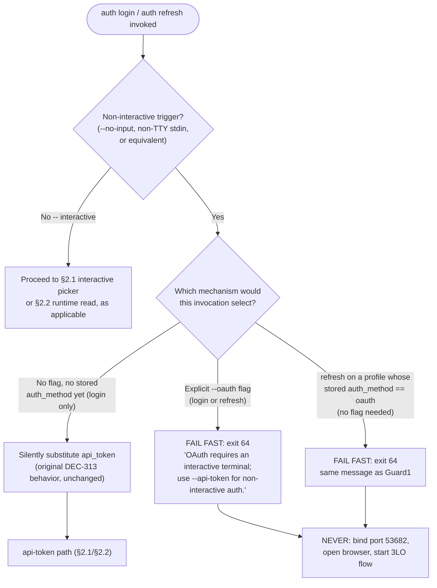
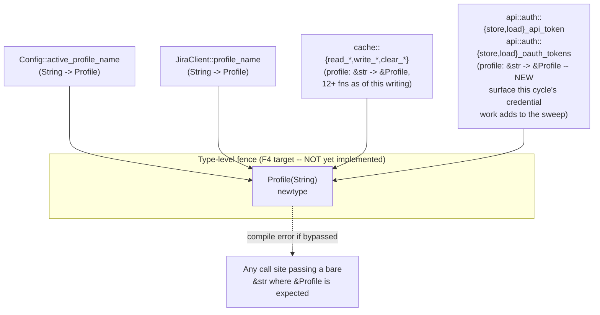

# Architecture Delta — Per-Profile Auth & Credential Ownership (`auth-profile-dx`)

This document covers the concrete architectural shape for cycle-003's `auth-profile-dx`
bundle (DEC-312..DEC-317; DEC-318/DEC-319 rejected/deferred and out of scope here). It is
structured as a delta: only what changes from today's architecture is described. The
decisions themselves — and their rationale, alternatives, and breaking-change
acknowledgments — live in `ADR-0020-per-profile-credential-ownership-env-tagging-and-oauth-default-at-creation.md`
and the amended `docs/adr/0011-type-level-profile-fence.md`; this document provides the
"how," concrete enough for the product-owner's parallel F2 BC-authoring pass and for F4
implementers to proceed without re-deriving the design.

No `src/` file has been touched by this document. All code shapes below are TARGET design,
not current state, unless explicitly marked "Current."

> **F2-gate amendment (same day, 2026-09-01):** this document was revised in place to resolve
> F2-gate adversarial/spec-review findings and one HUMAN DECISION, in lockstep with ADR-0020
> and the staged ADR-0011 amendment. The single most consequential change is §3 (formerly
> "Migration Sequence," now "Credential-Absence Handling" — no copy step, HUMAN-DECIDED). §2.3
> (non-interactive OAuth guard) is new. §4 gained a scope-reconciliation paragraph. There is no
> separate "v2" file — this document is the current, single source of truth.

---

## 1. Component / Data-Flow Overview

### 1.1 Current State (baseline)

```mermaid
flowchart LR
    subgraph Keychain["System Keychain (service: jr-jira-cli)"]
        SharedCred["email / api-token\n(SHARED, flat — one pair\nfor the whole keychain)"]
        OAuthPair["&lt;profile&gt;:oauth-access-token\n&lt;profile&gt;:oauth-refresh-token\n(PER-PROFILE, namespaced)"]
        LegacyOAuth["oauth-access-token\noauth-refresh-token\n(legacy flat, default-only\nlazy-migrated into OAuthPair)"]
    end

    subgraph Config["config.toml"]
        Profile["[profiles.&lt;name&gt;]\nauth_method, url, cloud_id, ..."]
    end

    LoginCmd["jr auth login\n(bare -> api_token;\n--oauth -> OAuth)"] -->|writes| SharedCred
    LoginCmd -->|writes| OAuthPair
    LoginCmd -->|sets auth_method| Profile

    InitCmd["jr init\n(interactive picker,\nOAuth default)"] -.->|same login fns| LoginCmd

    Profile -->|auth_method read| FromConfig["JiraClient::from_config\nunwrap_or(\"api_token\")"]
    FromConfig -->|api_token| SharedCred
    FromConfig -->|oauth| OAuthPair
    LegacyOAuth -.->|lazy migrate, default only| OAuthPair
```

**Current problem this cycle fixes:** `SharedCred` has no per-profile scoping at all — every
profile's `api_token` auth_method reads the SAME email/token pair, so a `sandbox` profile and
a `prod` profile silently authenticate as the same Jira account if both use API-token auth.
`OAuthPair` already got this right when multi-profile support landed; `SharedCred` never did.

### 1.2 Target State (this cycle)

```mermaid
flowchart LR
    subgraph Keychain["System Keychain (service: jr-jira-cli)"]
        PerProfileToken["&lt;profile&gt;:email\n&lt;profile&gt;:api-token\n(PER-PROFILE, namespaced — NEW)"]
        OAuthPair["&lt;profile&gt;:oauth-access-token\n&lt;profile&gt;:oauth-refresh-token\n(PER-PROFILE, unchanged)"]
        LegacyFlat["email / api-token\n(legacy flat — UNTOUCHED:\nnever copied, never deleted —\nF2-gate no-copy redesign)"]
        LegacyOAuth["oauth-access-token\noauth-refresh-token\n(legacy flat, unchanged\nmigration, untouched)"]
        SharedApp["oauth_client_id\noauth_client_secret\n(SHARED — BYO OAuth APP\ncreds, unchanged, different axis)"]
    end

    subgraph Config["config.toml"]
        Profile["[profiles.&lt;name&gt;]\nauth_method (intrinsic, set once)\nenv: Option&lt;String&gt; (NEW, additive)\nurl, cloud_id, ..."]
    end

    LoginCmd["jr auth login\nbare/interactive -> OAuth default (NEW)\n--no-input / non-TTY -> api_token\n(JR_EMAIL/JR_API_TOKEN are a credential SOURCE\nunder this trigger, never a trigger themselves -- DEC-327)\n--api-token (NEW flag) / --oauth (deprecated alias)"]
    LoginCmd -->|writes per-profile| PerProfileToken
    LoginCmd -->|writes per-profile| OAuthPair
    LoginCmd -->|sets auth_method once| Profile

    InitCmd["jr init\n(unchanged, still the\nreference OAuth-default model)"] -.->|same login fns| LoginCmd

    Profile -->|auth_method read, UNCHANGED default| FromConfig["JiraClient::from_config\nunwrap_or(\"api_token\") -- NOT flipped"]
    FromConfig -->|api_token| PerProfileToken
    FromConfig -->|oauth| OAuthPair

    LegacyFlat -.->|existence-check ONLY -- detect-and-instruct,\nNO copy, NO delete (F2-gate redesign)| ErrorMsg["Actionable exit-64 error:\nrun `jr auth login &lt;profile&gt;`"]
    LegacyOAuth -.->|lazy migrate, default only,\nunchanged| OAuthPair

    RefreshCmd["jr auth refresh\n--oauth/--api-token now INERT\naliases (NEW) -- always follows\nProfile's own auth_method"] -->|relogin-then-replace| LoginCmd

    RemoveCmd["jr auth remove\n(4th delete step -- NEW)"] -->|deletes| PerProfileToken
    RemoveCmd -->|deletes| OAuthPair
    LogoutCmd["jr auth logout\n(OAuth-only, UNCHANGED --\nno api_token behavior by design)"] -->|deletes only| OAuthPair
```

Legend: solid arrows are unconditional data flow; dashed arrows are conditional/one-time
(migration) or reference (same underlying function) relationships.

---

## 2. Auth-Mechanism-Selection Flow: Creation-Time vs. Runtime

Two genuinely different decision points exist, and DEC-313's "intrinsic property" framing
depends on keeping them cleanly separated:

### 2.1 Creation-time selection (`jr auth login`, `jr init`)

```mermaid
sequenceDiagram
    participant User
    participant CLI as auth login handler
    participant Picker as Interactive picker
    participant Store as Keychain + config.toml

    User->>CLI: jr auth login [--profile X] [--oauth|--api-token] [--no-input]
    alt non-interactive (--no-input or non-TTY only; JR_EMAIL/JR_API_TOKEN are a credential source here, never a trigger -- DEC-327)
        CLI->>CLI: select api_token (NEVER launches a browser)
        CLI->>Store: store_api_token(profile, email, token)
        CLI->>Store: set auth_method = "api_token"
    else interactive, no explicit flag
        CLI->>Picker: ["OAuth 2.0 (recommended)", "API Token"], default = OAuth
        Picker-->>CLI: user choice
        alt OAuth chosen (or default accepted)
            CLI->>Store: full 3LO browser flow (unchanged mechanics, ADR-0006/0013)
            CLI->>Store: store_oauth_tokens(profile, access, refresh)
            CLI->>Store: set auth_method = "oauth"
        else API Token chosen
            CLI->>Store: store_api_token(profile, email, token)
            CLI->>Store: set auth_method = "api_token"
        end
    else --oauth flag (deprecated alias)
        CLI-->>User: stderr deprecation notice (human mode only)
        CLI->>Store: same OAuth path as above
    else --api-token flag (NEW, explicit)
        CLI->>Store: same API-token path as above
    end
    Note over Store: auth_method is now FIXED for this profile.<br/>No later command re-selects it (DEC-313).
```

### 2.2 Runtime header selection (every HTTP call)

```mermaid
sequenceDiagram
    participant Cmd as Any jr subcommand
    participant Client as JiraClient::from_config
    participant Store as Keychain

    Cmd->>Client: build client for active profile
    Client->>Client: auth_method = profile.auth_method.unwrap_or("api_token")<br/>(UNCHANGED default -- DEC-313 pins this)
    alt auth_method == "oauth"
        Client->>Store: load_oauth_tokens(profile) -- unchanged
        Store-->>Client: (access, refresh)
        Client->>Client: header = "Bearer {access}"
    else auth_method == "api_token" (or unset)
        Client->>Store: load_api_token(profile) -- NEW, per-profile;<br/>on absence -&gt; no-copy detect-and-instruct<br/>exit-64 (ADR-0020 Decision 2), legacy keys<br/>never read/copied/deleted
        Store-->>Client: (email, token)
        Client->>Client: header = "Basic base64(email:token)"
    end
    Note over Client: No per-invocation flag can change this branch<br/>(chosen_flow_for_profile's --oauth override on<br/>`refresh` is removed -- Decision 6).
```

**Why these stay separate diagrams, not one:** creation-time selection is a one-time,
interactive-or-flag-driven WRITE to `auth_method`; runtime selection is a READ of whatever
`auth_method` already says, on every single HTTP-issuing command. Conflating them is exactly
the bug class DEC-313 closes (`auth refresh --oauth` today writing a transient override
into the runtime decision instead of only ever reading the stored value).

### 2.3 Non-interactive OAuth guard (hardened, closes adversarial finding I-1)

The original F1/F2 design for §2.1 only substituted `api_token` for the DEFAULT
(no-explicit-flag) case in non-interactive mode — it left a gap for an explicit `--oauth`
flag or an implicit oauth-method profile on `refresh`. The hardened guard (ADR-0020 §
Decision 8) closes that gap by checking the trigger BEFORE either creation-time selection or
runtime header selection ever reaches network/listener code:



**Ordering invariant:** the `Check`/`WhichFlow` decision above is a precondition evaluated
BEFORE any network call, callback-listener bind, or browser-open attempt in both `auth
login`'s and `auth refresh`'s handlers — not a timeout on an already-started flow, not a
best-effort cancellation. This is what makes it airtight for CI: a CI runner passing
`--oauth` (or invoking `refresh` on an oauth-method profile) non-interactively gets an
immediate, actionable exit-64 failure instead of a hang waiting on a redirect that can never
arrive.

**BC/EC obligation for the product-owner (see the "BC changes required" list at the end of
this document's companion ADR):** VP-AUTHDX-001's matrix, as staged, only exercises the
`DefaultSub` cell above. Two new EC rows are required: (1) explicit `--oauth` ×
non-interactive on `auth login`, asserting exit 64 and NO listener bind; (2) implicit
oauth-method profile × non-interactive on `auth refresh`, asserting the identical exit-64
message and NO browser-open call.

---

## 3. Credential-Absence Handling — No-Copy Detect-and-Instruct (F2-gate redesign, supersedes original "Migration Sequence")

**HUMAN DECISION at the F2 gate:** the design below REPLACES the original F1/F2
copy-then-delete migration. There is no copy step anywhere in this diagram — that is the
point, not an omission.

```mermaid
sequenceDiagram
    participant Client as JiraClient::from_config
    participant New as load_api_token(profile)
    participant KC as Keychain

    Client->>New: load_api_token(profile)
    New->>KC: get &lt;profile&gt;:email, &lt;profile&gt;:api-token
    alt both present
        KC-->>New: (email, token)
        New-->>Client: Ok((email, token))
    else exactly one present (partial write -- ADR-0020 Decision 2a)
        KC-->>New: partial pair
        New-->>Client: Err("Incomplete credentials for '{profile}' --<br/>run `jr auth login {profile}`")
        Note over New,KC: Not a lockout: `jr auth login {profile}`<br/>unconditionally overwrites both keys.
    else both absent
        New->>KC: check legacy flat email/api-token (EXISTENCE ONLY --<br/>values never read as a credential)
        alt keychain backend error (ADR-0020 Decision 1, resolves I-5)
            KC-->>New: backend error (e.g. Secret Service unavailable)
            New-->>Client: Err("keychain unavailable: {e}")
            Note over New,Client: NEVER coerced into the "no credential" message below --<br/>a headless-CI user needs a different fix.
        else legacy pair present OR absent (same outcome either way)
            New-->>Client: Err("No credentials stored for profile '{profile}'.<br/>Run `jr auth login {profile}`.")
            Note over New,KC: NO COPY. NO DELETE. The legacy pair,<br/>if present, is left completely untouched.
        end
    end
```

**No profile is special-cased.** `"default"` and every other profile name go through the
identical branches above — the original design's `"default"`-only asymmetry is gone along
with the copy step it existed to gate. This function has no config-load-time or eager step;
every call is independent and idempotent by construction (no mutating side effect of its
own), so concurrent first-reads for the same profile are trivially benign (ADR-0020 §
Decision 2b — no single-flight coordinator needed).

**Deliberate partial divergence from `load_oauth_tokens`'s migration shape** (see ADR-0020 §
Decision 2's Rationale): only the FIRST step — "try namespaced keys first" — is shared. The
copy-then-delete steps `load_oauth_tokens` still uses for OAuth tokens are replaced entirely
by a no-copy detect-and-instruct error here, because unlike an OAuth token (cloudId-scoped,
cannot authenticate against the wrong environment), a Basic-auth email/token pair carries no
environment binding — copying it is the one migration action capable of silently defeating
DEC-312's environment-locking goal. This is a HUMAN-DECIDED redesign, not merely an
adversarial-review fix: the original "mirror `load_oauth_tokens` exactly" plan is REJECTED
for this credential kind specifically (see ADR-0020 § Alternatives Considered).

**Scope boundary drawn on this diagram:** this code path is entered ONLY when
`auth_method == "api_token"` (or unset, since that's the runtime default). It never runs
for, and never touches, the separate `load_oauth_tokens` legacy-migration path — the two
mechanisms are independent code operating on disjoint key sets, now sharing only the
first-step "try namespaced keys first" shape, not the copy-then-delete steps.

---

## 4. `Profile` Newtype Boundary (ADR-0011, amended)

This cycle's credential restructuring (§1-3 above) is the stated trigger for un-deferring
ADR-0011, but the newtype threading itself is sequenced AFTER §1-3 lands (ADR-0011's amended
§Sequencing, ADR-0020's §Sequencing). The boundary the newtype will enforce, once
implemented:



**Why the credential restructuring must land first, architecturally:** if the newtype
threading landed BEFORE §1-3, the new `store_api_token(profile, …)` / `load_api_token(profile)`
functions this cycle adds would need their OWN, second call-site sweep once written — the
newtype boundary would need to be re-extended to cover functions that didn't exist yet when
the sweep ran. Landing credential storage first means the newtype sweep (whenever F4 executes
it) covers the final, settled function surface in one pass.

**Scope reconciliation (F2 gate, closes adversarial finding SR-006):** the diagram above
already showed `api::auth::{store,load}_api_token`/`{store,load}_oauth_tokens` inside the
`Boundary` fence (the `AuthFns` node) — but the staged ADR-0011 amendment's own § Decision
enumeration, as originally drafted, listed only `cache.rs`, `Config::active_profile_name`,
and `JiraClient::profile_name` as in-scope call sites, omitting `auth.rs` entirely. That was
a genuine textual contradiction between two F2-gate documents, not merely an omission in one
that the other happened to get right first. **RESOLVED, this pass:** `src/api/auth.rs`'s four
per-profile credential functions belong inside the fence — they take a `profile` parameter
and are exactly the credential-isolation seam the hard fence is built to protect; a
wrong-profile `&str` reaching `store_api_token`/`load_oauth_tokens` is a cross-environment
credential leak, the single worst-case failure mode ADR-0011's whole newtype exists to make
uncompilable. The staged ADR-0011 amendment's § Decision (item 2's new sub-bullet) now states
this explicitly, matching this diagram.

**Corrected call-site estimate:** ADR-0011's original "~50-70 changes" assumed a
`cache.rs`-only sweep at pre-cycle-003 file size. Adding `src/api/auth.rs`'s four functions
plus their call sites (`JiraClient::load_auth_from_keychain`'s two branches, `login_token`,
`clear_profile_creds`/`clear_all_credentials`'s aggregation loops, `auth remove`'s fourth
delete step from ADR-0020 § Decision 7, and the `auth refresh`/`auth login` call sites
reading these functions — roughly 8-12 additional call sites) revises the estimate to
**~60-80 changes**. This figure, the staged ADR-0011 amendment's § Decision 5 and §
Consequences, and ADR-0020 § Sequencing item 5 are now mutually consistent as of this pass.
**Flagged for the product-owner:** `bc-6-config-cache.md`'s BC-6.2.015 target-contract note
must be checked against this same scope (`cache.rs` + `auth.rs`, not `cache.rs` alone) — see
the "BC changes required for the product-owner" list at the end of this cycle's F2 pass.

---

## 5. Flagged Follow-Ups for Existing Architecture Shards

The following pre-existing architecture documents under `.factory/architecture/` (the
brownfield-era shard set, distinct from the newer `.factory/specs/architecture/` ADR-only
directory) describe auth/profile mechanics this cycle changes and will go stale once F4
implementation lands. None are edited by this F2 pass — flagged here for the
product-owner/spec-steward to schedule as part of F4's doc-fallout (per CLAUDE.md's own
"doc-fallout" convention, same-commit-as-code-change discipline):

| Shard | What's stale after F4 | Why |
|---|---|---|
| `.factory/architecture/state-machines.md` §SM-1 (OAuth Login State Machine) | Unaffected in mechanics, but its `ResolveCredentials`/`ChooseStrategy` framing describes the OAuth-app-credential resolver only — should gain a note distinguishing that resolver (unaffected) from the new creation-time mechanism-selection flow (§2.1 above, new) so a reader doesn't conflate the two. | This cycle adds a NEW decision point (mechanism selection) upstream of SM-1's existing OAuth-app-credential resolution; SM-1 itself is unaffected but sits right next to the new flow in the same command handler. |
| `.factory/architecture/state-machines.md` §SM-2 (OAuth Refresh State Machine, Dual-Path) | `ChooseFlow --> RelLoginToken: auth_method = api_token` / `ChooseFlow --> ReLoginOAuth: auth_method = oauth` transitions currently allow a `chosen_flow_for_profile` override; per ADR-0020 Decision 6 this override is removed — SM-2's diagram needs a note (or a redrawn transition) confirming `ChooseFlow` is driven SOLELY by the profile's stored `auth_method`, no override input. | ADR-0020 Decision 6 directly changes this state machine's input set. |
| `.factory/architecture/risk-register.md` R-L1 | Currently reads "DEFER: ADR-0011 documents the `Profile(String)` newtype option (DEFERRED)." Stale the moment ADR-0011's amendment (Accepted) lands — needs updating to reflect the accepted-but-not-yet-implemented status, and eventually RESOLVED once F4's newtype story merges. | Direct, factual staleness — this row cites ADR-0011's status by name. |
| `.factory/architecture/system-overview.md` (keychain layout table, "email, api-token, oauth_client_id, oauth_client_secret" listed as shared; "`<profile>:oauth-access-token`" listed as the only per-profile credential family) | The shared-vs-per-profile split this table documents is exactly what ADR-0020 reverses for `email`/`api-token`. Needs a row split: `oauth_client_id`/`oauth_client_secret` remain shared (BYO app creds, unaffected); `email`/`api-token` move to the per-profile section alongside the OAuth token pair. | Direct, factual staleness — this is the system-overview's own keychain-layout documentation of the exact invariant this cycle reverses. |
| `.factory/architecture/security-decisions/SD-002-jr-auth-header-prod-gating.md` | Not expected to need a content change (this cycle introduces no new production env-var seam — ADR-0020 §3 explicitly rejects a keychain version-marker env seam), but should be re-read at F4 to confirm no new debug-only seam was accidentally introduced during implementation without a matching entry here and in CLAUDE.md's "AI Agent Notes" table (the codified `JR_*` doc-fallout pattern). | Precautionary flag, not a known staleness — call out explicitly per CLAUDE.md's own citation-discipline convention for new env vars. |

**Not flagged (confirmed unaffected, verified this pass):** `.factory/architecture/
component-graph.md` and `.factory/architecture/cross-cutting.md` do not reference
`auth_method`, `ProfileConfig`, or any keychain key name — grepped clean. `.factory/
architecture/security-decisions/SD-001-pkce.md` and `SD-003-verbose-pii-redaction.md` are
both orthogonal (PKCE deferral and `--verbose-bodies` PII redaction, respectively — neither
touches credential storage or mechanism selection).

---

## 6. Summary of What Changes vs. What's Explicitly Preserved

| Preserved, byte-for-byte | Changed |
|---|---|
| `JiraClient::from_config`'s `.unwrap_or("api_token")` runtime default | `load_auth_from_keychain`'s `api_token` branch now reads per-profile, not flat |
| ADR-0006 embedded app, port 53682, BYO escape hatch | `email`/`api-token` keychain scoping (shared -> per-profile) |
| ADR-0013 PKCE deferral / no-PKCE threat model | `ProfileConfig` gains `env: Option<String>` |
| Single-use refresh tokens + `refresh_coordinator` single-flight | `auth login` interactive default (token -> OAuth, mirroring `init.rs`) |
| `oauth_client_id`/`oauth_client_secret` shared scoping (different axis) | `--oauth` demoted to deprecated alias; `--api-token` added |
| `load_oauth_tokens`'s own migration code and behavior | `auth refresh --oauth` loses override power (pure alias) |
| `auth switch --profile` rejection (BC-1.2.047/S-663-1) | `auth remove` gains a 4th delete step (per-profile api-token pair) |
| `auth logout`'s OAuth-only scope (by design, now explicit) | ADR-0011: soft-fence -> hard-fence (design accepted; implementation sequenced after the above) |
| Legacy flat `email`/`api-token` keys' on-disk VALUES (never read as a credential, never copied, never deleted -- F2-gate no-copy redesign) | Credential-absence handling is no-copy detect-and-instruct, not copy-then-delete (§3); every pre-cycle-003 api-token profile requires one `jr auth login <profile>` after upgrade (breaking, see ADR-0020 § Breaking-Change Acknowledgment) |
| `load_oauth_tokens`'s `"default"`-only copy-then-delete pattern itself (unchanged, still used for OAuth) | Non-interactive OAuth guard now also covers explicit `--oauth` and implicit oauth-method `refresh`, not just the no-flag default (§2.3) |
