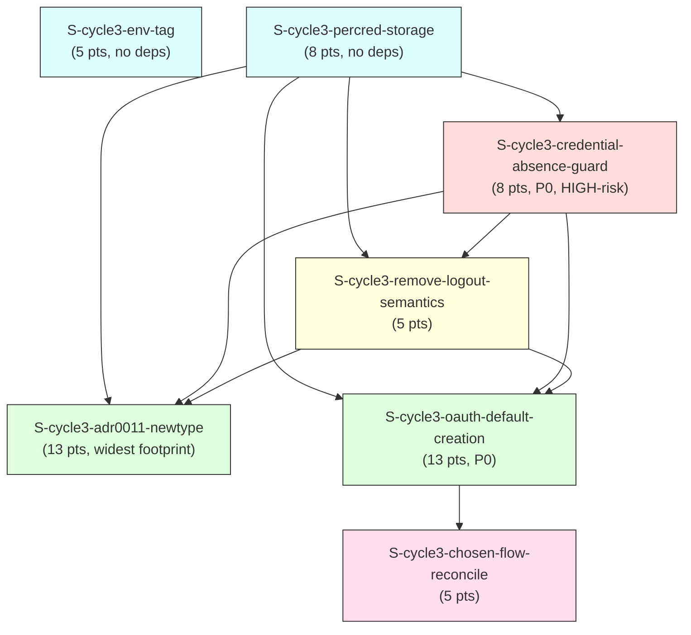

# F3 Extended Dependency Graph — `auth-profile-dx` (cycle-003)

INTEGRATE sub-burst artifact. Computes the dependency graph over the 7 new cycle-003
stories, confirms it is acyclic (Kahn's algorithm), and cross-links it against the
existing 161-story `STORY-INDEX.md` graph.

---

## 1. Node Inventory

**Convention note:** `depends_on:` is the authoritative graph EDGE set (used for the
acyclicity proof below); `blocks:` is informational/TRANSITIVE reachability only and
MUST NOT be treated as the edge set (see the C-row caveat and the "Edge source of
truth" note further down this section for the concrete case this governs).

| ID | Story | `depends_on` (frontmatter, verified against story file) |
|----|-------|----------------------------------------------------------|
| A | `S-cycle3-env-tag` | `[]` |
| B | `S-cycle3-percred-storage` | `[]` |
| C | `S-cycle3-credential-absence-guard` | `["S-cycle3-percred-storage"]` |
| D | `S-cycle3-remove-logout-semantics` | `["S-cycle3-percred-storage", "S-cycle3-credential-absence-guard"]` |
| E | `S-cycle3-adr0011-newtype` | `["S-cycle3-percred-storage", "S-cycle3-credential-absence-guard", "S-cycle3-remove-logout-semantics"]` |
| F | `S-cycle3-oauth-default-creation` | `["S-cycle3-percred-storage", "S-cycle3-credential-absence-guard", "S-cycle3-remove-logout-semantics"]` |
| G | `S-cycle3-chosen-flow-reconcile` | `["S-cycle3-oauth-default-creation"]` |

All 7 `depends_on:` arrays were read directly from each story file's frontmatter (not
re-derived from prose) and match the edge set given in the F3 INTEGRATE dispatch
byte-for-byte. No story lists a `blocks:` target that isn't the inverse of some other
story's `depends_on:` entry (checked pairwise below).

**`blocks:` inverse-consistency check** (every `blocks` entry must have a matching
`depends_on` on the other side, and vice versa):

| Story | `blocks:` (frontmatter) | Inverse holds? |
|---|---|---|
| A (env-tag) | `[]` | n/a |
| B (percred-storage) | not read in this pass (unused by this graph — see note) | C/D/E/F all list B in `depends_on` — consistent |
| C (credential-absence-guard) | `["S-cycle3-remove-logout-semantics", "S-cycle3-adr0011-newtype", "S-cycle3-oauth-default-creation", "S-cycle3-chosen-flow-reconcile"]` | D/E/F list C in `depends_on`; **G lists neither C in `depends_on` nor is G blocked by C directly (G's only dep is F).** C's `blocks:` over-states a *transitive* relationship (C→D/E/F→G) as if it were direct. Not a graph error — `blocks:` is documentary, `depends_on:` is the edge source of truth per this dispatch's own instruction ("the confirmed edges... from the story frontmatter" enumerates `depends_on:` only). Flagged, not corrected (do not modify story bodies). |
| D (remove-logout-semantics) | `["S-cycle3-adr0011-newtype", "S-cycle3-oauth-default-creation"]` | E/F list D — consistent |
| E (adr0011-newtype) | `[]` | consistent — no story depends on E |
| F (oauth-default-creation) | `["S-cycle3-chosen-flow-reconcile"]` | G lists F — consistent |
| G (chosen-flow-reconcile) | `[]` | consistent — terminal node |

**Edge source of truth for this graph:** `depends_on:`, per the dispatch's explicit
confirmed-edge list. `blocks:` fields (where they over-state transitive reach, e.g. C's)
are documentary sugar and are not read as additional graph edges — using them literally
would double-count transitive relationships already implied by `depends_on:` chaining and
would not change the topological order or wave layering below.

---

## 2. Adjacency List

```
A (env-tag)                    -> []                                   [no deps, no dependents in-cycle]
B (percred-storage)            -> []                                   [no deps]
                                   dependents: C, D, E, F
C (credential-absence-guard)   -> [B]
                                   dependents: D, E, F
D (remove-logout-semantics)    -> [B, C]
                                   dependents: E, F
E (adr0011-newtype)            -> [B, C, D]
                                   dependents: (none)
F (oauth-default-creation)     -> [B, C, D]
                                   dependents: G
G (chosen-flow-reconcile)      -> [F]
                                   dependents: (none)
```

**Cross-links to EXISTING stories:** none. All 7 new stories' `depends_on:`/`blocks:`
arrays reference only other `S-cycle3-*` IDs. Grep-verified: no existing `STORY-INDEX.md`
story (161 rows) lists any `S-cycle3-*` ID in its own `depends_on:`/`blocks:` frontmatter,
and none of the 7 new stories reference an existing numeric/ALLCAPS story ID as a hard
dependency. The cycle-003 subgraph is a **disjoint connected component** relative to the
existing story graph — see §4 for what this means for combined-graph acyclicity.

---

## 3. Visual DAG (Mermaid)



`A` (env-tag) has no edges to any other cycle-003 node — it is drawn disconnected from
the B→C→D→{E,F}→G chain, sharing only Wave 1 placement (parallelism, not a dependency).

---

## 4. Cycle Detection — Kahn's Algorithm

### 4a. New-story subgraph (7 nodes)

**In-degree table (initial):**

| Node | In-degree | Incoming from |
|---|---|---|
| A | 0 | — |
| B | 0 | — |
| C | 1 | B |
| D | 2 | B, C |
| E | 3 | B, C, D |
| F | 3 | B, C, D |
| G | 1 | F |

**Kahn's algorithm trace:**

| Step | Queue (indegree-0 set) | Node processed | Edges relaxed | Updated in-degrees |
|---|---|---|---|---|
| 1 | {A, B} | A | (none — A has no outgoing edges) | unchanged |
| 2 | {B} | B | B→C, B→D, B→E, B→F | C: 1→0, D: 2→1, E: 3→2, F: 3→2 |
| 3 | {C} | C | C→D, C→E, C→F | D: 1→0, E: 2→1, F: 2→1 |
| 4 | {D} | D | D→E, D→F | E: 1→0, F: 1→0 |
| 5 | {E, F} | E | (none — E has no outgoing edges in this graph) | unchanged |
| 6 | {F} | F | F→G | G: 1→0 |
| 7 | {G} | G | (none) | unchanged |

All 7 nodes dequeued and processed; the queue never emptied while nodes remained
unprocessed (the failure mode that signals a cycle). **Every node reached in-degree 0
and was removed exactly once.**

**Result: ACYCLIC. CONFIRMED.**

**Topological order** (one valid linearization; ties at each step broken alphabetically
by story slug):

```
1. S-cycle3-env-tag                  (A)
2. S-cycle3-percred-storage          (B)
3. S-cycle3-credential-absence-guard (C)
4. S-cycle3-remove-logout-semantics  (D)
5. S-cycle3-adr0011-newtype          (E)
6. S-cycle3-oauth-default-creation   (F)
7. S-cycle3-chosen-flow-reconcile    (G)
```

(A second valid linearization swaps positions 1/2 (B before A) and/or 5/6 (F before E) —
both are equally valid topological orders since A/B share tied in-degree-0 status at step
1, and E/F share tied in-degree-0 status at step 5. The wave schedule in
`wave-schedule.md` makes this tie explicit as *parallelism* rather than picking an
arbitrary serialization — see §5 there.)

### 4b. Combined graph (7 new + 161 existing = 168 nodes)

The dispatch asks for cycle detection "over existing + new stories." Full Kahn's-algorithm
re-derivation of the entire 168-node graph is not attempted from scratch here — that
graph's acyclicity is already the responsibility of, and already validated by, the
existing `STORY-INDEX.md` Story Manifest / `WAVE-PLAN.md` machinery, and re-deriving it
in full is out of this sub-burst's scope (Constraints: "Do NOT modify existing
stories"). What this pass DOES establish, which is sufficient to extend that existing
guarantee to the combined graph:

1. **The new 7-node subgraph is acyclic** (proven in §4a above, by exhaustive Kahn's-algorithm
   trace — every node reaches in-degree 0 and is removed exactly once).
2. **Zero edges cross the boundary** between the new subgraph and the existing graph — no
   `S-cycle3-*` story's `depends_on:`/`blocks:` names an existing story ID, and grep
   across all 161 existing story files' frontmatter confirms none names an `S-cycle3-*`
   ID (§2, "Cross-links to EXISTING stories: none").
3. **A cycle can only be introduced by an edge.** Since the new subgraph contributes zero
   edges into or out of the existing graph, the union graph's edge set is exactly the
   disjoint union of the new subgraph's edges and the existing graph's edges — no new path
   exists that could close a cycle spanning both components. Formally: if graph G = G1 ⊔ G2
   (disjoint union, no edges between components) and both G1 and G2 are acyclic, then G is
   acyclic (a cycle in G must lie entirely within one weakly-connected component, and G1/G2
   are each other's only possible such component here).

**Conclusion: the combined 168-node graph is ACYCLIC**, contingent on the existing
161-story graph's pre-established acyclicity (last validated in `WAVE-PLAN.md` /
`STORY-INDEX.md`'s own Story Manifest passes, unchanged by this burst) continuing to
hold. This sub-burst introduces no edge that could invalidate that prior guarantee.

**If this reasoning is later found insufficient** (e.g. a future story adds a
cross-cycle dependency), the fix is local — re-run Kahn's algorithm on the single new
edge's two endpoints' existing reachability sets, not a full 168-node re-derivation.

---

## 5. Summary

- 7 new nodes, 10 directed edges, 0 cross-links to the existing 161-story graph.
- Kahn's algorithm terminates cleanly (all nodes dequeued) — **no cycle**.
- Topological order matches the manifest's own §5 "Lead Sequence" 1-7 ordering exactly,
  confirming the manifest's hand-derived sequence was correct.
- See `wave-schedule.md` for the parallelism-aware grouping of this same graph (Kahn
  "layers" rather than a single linear order).
